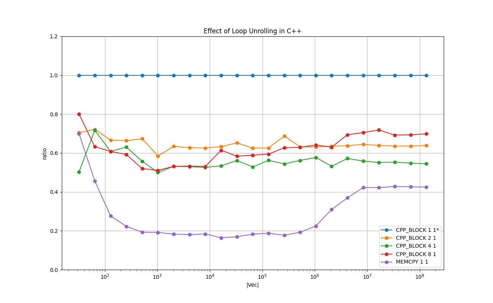

# MEMCPY

Copying the contents of a memory buffer to another.

# 1. Key Points

* **memcpy()** is 5x-10x faster than the compiler-optimized simple loop in C++.
This is achieved by the unrolled and interleaved **ldp** & **stp** machine instructions to maximally fill the pipeline.

* Multithreading on the calls to **memcpy()** will not make it faster:
The overhead of synchronizing multiple threads is amortized around the problem size of **2 megabytes**.
However around that size, the problem will be bound by memory I/O,
and it will apparently lose the benefit of multithreading.

* The **memcpy()** utilizes two particular instructions **ldp** & **stp** as stated above.
Clang++ compiler emits two **ldp**s and then two **stp** with '-O3' by default. This is equivalent to the loop unrolling factor of 4.
If an explicit loop unrolling is specified, Clang emits interleaved **ld[u]r** & **st[u]r**.

* For Metal, **MTLBlitCommandEncoder** is in general faster than 
a shader with the simple parallel assignment as in `out[ tid ] = in[ tid ];`, but the difference is not significant.

* There is no noticeable difference in speed between the use of the **shared-** and **managed-MTL buffers**.

* The cost of launching the kernel on  Metal is amortized at around **256 megabytes**.
Around that size the use Metal will be justified.

# 2. Background and Context

Copying contents of a memory buffer to another can be considered a minimal I/O-bound problem that can be parallelized.
The standard library function **memcpy()** is known to be highly optimized for the given system,
and it seems this is the dominant way to copy data efficiently.

# 3. Purpose

The purpose of this section is as follows:

- To measure the running time of **memcpy()** against other possible implementations.

- To measure the impact of several techniques on copying bulk in memory,
notably, selection of instructions, loop unrolling, and cache prefetch.

- To measure the running time of **MTLBlitCommandEncoder**, (The Metal version of memcpy())
in comparison to a plain Metal shader implementation as well as **memcpy()** in CPU.

- Study how **memcpy()** achieves its running time.

# 4. Results on Running Time
The following experiments are done with [test_memcpy.cpp](test_memcpy.cpp) in this directory.

* **Compiler:** Apple clang version 13.0.0 (clang-1300.0.29.3) Target: arm64-apple-darwin20.6.0 Thread model: posix

* **Device:** Mac mini (M1, 2020) Chip Apple M1, Memory 8GB, macOS Big Sur Version 11.6

Please type `make all` in this directory to reproduce the results.

## 4.1. Overview

The following chart shows the mean running times taken to copy the given number of **ints** (4 bytes) 
for each implementation in log-log scale.
X-axis is the number of *ints* copied, and Y-axis is the time taken in milliseconds.

### Legend

* **CPP BLOCK 1 1** : Plain C++ (with '-O3' with which Clang++ emits **ldp** & **stp** )

* **CPP BLOCK 4 1** : Plain C++ with the loop unrolling of factor 4 (with '-O3', with which Clang emits **ldur** & **stur** )

* **CPP BLOCK 4 2** : Plain C++ with the loop unrolling of factor 4 with 2 threads (threads synchronization done mainly with condition variables)

* **MEMCPY 1 1** : **memcpy()** (with highly optimizezd loop-unrolled **ldp** & **stp**)

* **MEMCPY 1 2** : **memcpy()** with two threads

* **METAL_BLIT 0 0** : Metal BLIT Command with shared MTL buffers.

<a href="doc/INT_VECTOR_Overview.png"> </a>

### Remarks

The **memcpy()** performs best for all the problem sizes.
Compared with the plain C++ implementation, memcpy() is 5x - 10x faster.
The manual loop unrolling in C++ improves the speed but not as good as memcpy().
The minimum overhead of launching 2 CPU threads is around 5 [μs], and apparently there is no benefit in using multithreads.
The minimum overhead of launching a Metal kernel is somewhere below 100 [μs].

## 4.2. Effect of the Loop Unrolling in the C++ Implementations

The following chart shows the relative running times taken to copy the given number of **int**s (4 bytes)
for each implementation in log-lin scale.
The X-axis is the number of *ints* copied, 
and the Y-axis is the relative running time of each implementation relative to 'CPP BLOCK 1 1', which is fixed at 1.0.

### Legend

* **CPP BLOCK 1 1** : Plain C++ with '-O3' - baseline

* **CPP BLOCK 2 1** : Plain C++ with loop unrolling of factor 2

* **CPP BLOCK 4 1** : Plain C++ with loop unrolling of factor 4

* **CPP BLOCK 8 1** : Plain C++ with loop unrolling of factor 8

* **MEMCPY 1 1** : memcpy()

<a href="doc/INT_VECTOR_Effect_of_Loop_Unrolling_in_C++_relative.png">
    </a>


### Remarks

**CPP BLOCK 1 1** uses non-interleaved  **ldp** & **stp** with loop unrolling factor of 2.

**MEMCPY 1 1** uses interleaved **ldp** & **stp** with loop unrolling factor of 8

**CPP BLOCK X 1** uses interleaved  **ld[u]r** & **st[u]r** with loop unrolling factor of X.

There is a clear advantage in the explicit loop unrolling either by a pragma or the manual expansion.
The Clang++ generates the same code for both.
The difference between the **memcpy()** and the unrolled code can be explained by the difference 
in the machine instructions and the order of the loads and the stores in the loop body.

The **ld[u]r** & **lt[u]r** are the single-word load and store instructions, and  **ldp** & **stp**  are the pair-wise 
load & store instructions.


Please see the [ARM-software/optimized-routines/memcpy.S](https://github.com/ARM-software/optimized-routines/blob/master/string/aarch64/memcpy.S) 
on Github provided by ARM for the assembler code of memcpy().


## 4.3. Effect of Multithreading in C++

The following chart shows the effect of multithreading in comparison to the single-thread version fixed at 1.0, 
as well as the memcpy() version as a reference.
Except for memcpy(), all the other implementations use the loop unrolling of factor 4.

### Legend

* **CPP BLOCK 4 1** : Plain C++ with the loop unrolling of factor 4 with single thread- baseline

* **CPP BLOCK 4 2** : Plain C++ with the loop unrolling of factor 4 with 2 threads

* **CPP BLOCK 4 4** : Plain C++ with the loop unrolling of factor 4 with 4 threads

* **CPP BLOCK 4 8** : Plain C++ with the loop unrolling of factor 4 with 8 threads

* **MEMCPY 1 1** : memcpy()

<a href="doc/INT_VECTOR_Effect_of_Multithreaddng_in_C++_relative.png">
    </a>

### Remarks
The overhead of synchronizing multiple threads is amortized at around the problem size of 1 megabytes (256K ints).
For the problems larger than 1 megabytes the multithreaded versions are 60-40 % faster than the single thread version.
In most cases memcpy() achieves the best running time.


## 4.4. Effect of Multithreading with memcpy() Split in Blocks
The following chart shows the effect of splitting the memcpy() into consecutive blocks, each of which is handled by a separate thread.


### Legend

* **MEMCPY 1 1** : Single thread - baseline

* **MEMCPY 1 2** : Memory split into 2 blocks, each handled by a separate thread

* **MEMCPY 1 4** : Memory split into 4 blocks, each handled by a separate thread

* **MEMCPY 1 8** : Memory split into 8 blocks, each handled by a separate thread

<a href="doc/INT_VECTOR_Effect_of_Multithreading_with_memcpy()_relative.png">
    </a>

### Remarks
The overhead of synchronizing two threads is amortized at around 2 to 4 megabytes.
There seems to be no clear benefit in multithreading, as this problem is purely I/O bound.


## 4.5. Metal Implementations

The following chart shows the difference among 4 Metal versions to copy data from one MTLBuffer to another.

### Legend

* **METAL DEFAULT_SHARED** : The Metal shader with the simple assignments with two shared MTL buffers. - baseline

* **METAL DEFAULT_MANAGED** : The Metal shader with the simple assignments with two managed MTL buffers.

* **METAL BLIT_SHARED** : MTLBlitCommandEncoder with two shared MTL buffers.

* **METAL BLIT_MANAGED** : MTLBlitCommandEncoder with two managed MTL buffers.

<a href="doc/INT_VECTOR_Comparison_Among_Metal_Implementations_relative.png"></a>

### Remarks
The running times fluctuate significantly for the sizes less than 256 megabytes.

For the shared MTL buffers it is assumed that the views into those buffers from both CPUs and GPUs
are consistent before the commit to the command encoder and after the completion.

For the managed MTL buffers the following explicit synchronizations are required.

*   `[ _buf didModifyRange:NSMakeRange(_low_byte,_high_byte) ];`

*   `[ _encoder synchronizeResource:_buf ];`

The chart shows that MTLBlitCommandEncoder runs roughly 25% faster depending on the problem size, and there is no noticeable difference
in speed between the shared MTL buffers and the managed MTL buffers.


# 5. Remarks on the Machine Instructions

This section reports three particular findings I have observed during the experiments.
They could be probably applicable only to my particular environment (Mac Mini M1 2020 & Clang++ 13.0.0).

## 5.1. The Speed of memcpy() is Achieved by the Interleaved **ldp** & **stp** with the Loop Unrolling of Factor 8.

The reference code is found in [ARM-software/optimized-routines/memcpy.S](https://github.com/ARM-software/optimized-routines/blob/master/string/aarch64/memcpy.S) on Github provided by ARM for the assembler code of memcpy().

Please see the following excerpt. This is the main part of the copy routine.
It has 4 interleaved calls to **ldp** & **stp**, each of which loads and stores 16 consecutive bytes (2 64-bit words).
In total 64 consecutive bytes are processed in one iteration.
```
L(loop64):
	stp	A_l, A_h, [dst, 16]
	ldp	A_l, A_h, [src, 16]
	stp	B_l, B_h, [dst, 32]
	ldp	B_l, B_h, [src, 32]
	stp	C_l, C_h, [dst, 48]
	ldp	C_l, C_h, [src, 48]
	stp	D_l, D_h, [dst, 64]!
	ldp	D_l, D_h, [src, 64]!
	subs	count, count, 64
	b.hi	L(loop64)
```

## 5.2. Clang++ Does Not Emit **ldp** & **stp** If Loop-Unrolled.
Clang++ emits **ldp** & **stp** for the following plain C++ code as follows.

Command: `clang++ -O3 -Wall -pthread -march=armv8-a+fp+simd -std=c++17 -S -c -o test_copyS test_copy.cpp`

**test_copy.cpp**

```
void copy_baseline(const int* const x, int* const y, const size_t num ) {
    for ( size_t i = 0; i < num; i++ ) {
        y[i] = x[i];
    }
}
```

**test_copy.S** (snippet)

```
	.globl	__Z13copy_baselinePKiPii        ; -- Begin function _Z13copy_baselinePKiPii
...
LBB0_4:                                 ; =>This Inner Loop Header: Depth=1
	ldp	q0, q1, [x11, #-32]
	ldp	q2, q3, [x11], #64
	stp	q0, q1, [x10, #-32]
	stp	q2, q3, [x10], #64
	subs	x12, x12, #16                   ; =16
```
Please note the order of those instructions: **ldp**s first, and then **stp**s.

However, if a pragma is added to the code, or the loop is explicitly  loop-unrolled, Clang++ no longer emits **ldp** & **stp**.
Please see the following code snipped. Note that Clang++ emits the instructions interleaved.
The explicit unrolling improves the time compared with the default '-O3' above,
but it is not close to 'memcpy()'s time.
The difference in the instructions used seems to explain the difference in the running time between the 'CPP BLOCK X 1' and 'MEMCPY 1 1'.

Ex.)

**test_copy.cpp**

```
void copy_baseline2(
    const int* const __attribute__((aligned(64))) x,
    int* const       __attribute__((aligned(64))) y,
    const int num )
{
   # pragma unroll 8
    for ( int i = 0; i < num; i++ ) {

        y[i] = x[i];
    }
}
```
**test_copy.S** (snippet)

```
	.globl	__Z14copy_baseline2PKiPii       ; -- Begin function _Z14copy_baseline2PKiPii
...
LBB1_4:                                 ; =>This Inner Loop Header: Depth=1
	ldur	w13, [x12, #-16]
	stur	w13, [x11, #-16]
	ldur	w13, [x12, #-12]
	stur	w13, [x11, #-12]
	ldur	w13, [x12, #-8]
	stur	w13, [x11, #-8]
	ldur	w13, [x12, #-4]
	stur	w13, [x11, #-4]
	ldr	w13, [x12]
	str	w13, [x11]
	ldr	w13, [x12, #4]
	str	w13, [x11, #4]
	ldr	w13, [x12, #8]
	str	w13, [x11, #8]
	ldr	w13, [x12, #12]
	str	w13, [x11, #12]
	add	x9, x9, #8                      ; =8
	add	x11, x11, #32                   ; =32
	add	x12, x12, #32                   ; =32
	cmp	w10, w9
	b.ne	LBB1_4
```


Plase see Appendix below for further arguments.

## 5.3. Cache Prefetch Has No Effect?
The cache prefetch with '__builtin_prefetch()' does not seem to have significant effect.
The cache prefetch is described in [Arm C/C++ Compiler reference guide](https://developer.arm.com/documentation/101458/2010/Coding-best-practice/Prefetching-with---builtin-prefetch).
It seems to emit **prfm** machine instruction for the cache-line prefetch.

I have tried it in the body of the for-loop in various timings with various parameters, but no improvement has been observed.
As far as the code in [test_memcpy.cpp](test_memcpy.cpp) is concerned, there is no **prfm** instruction emitted,
and the optimized **memcpy.S** above do not have them either.
I would appreciate any help on how to appropriately use the cache prefetch.

# 6. Implementations
This section briefly describes each of the implementations tested with some key points in the code.
Those are executed as part of the test program in [test_memcpy.cpp](test_memcpy.cpp).

The top-level object in the 'main()' function is **TestExecutorMemcpy**,
which is a subclass of **TestExecutor** found in [../common/test_case_with_time_measurements.h](../common/test_case_with_time_measurements.h).
It manages one single test suite, which consists of test cases.
It arranges the input data, allocates memory, executes each test case multiple times, measures the running times,
cleans up, and reports the results.

Each implementation type is implemented as a **TestCaseMemcpy**,
which is a subclass of **TestCaseWithTimeMeasurements** in [../common/test_case_with_time_measurements.h](../common/test_case_with_time_measurements.h).
The main part is implemented in **TestCaseMemcpy::run()**, and it is the subject for the running time measurements.


## 6.1. **CPP BLOCK 1 1** - baseline
[**class TestCaseMemcpy_baseline** in test_memcpy.cpp](test_memcpy.cpp)

This is a plain 'for-loop' and generates a code with **ldp** & **stp** with the loop unrolling factor of 4.

```
for ( size_t i = 0; i < NUM ; i++ ) {
    out[i] = in[i];
}
```

## 6.2. CPP BLOCK X 1 - loop unrolling
[**class TestCaseMemcpy_loop_unrolled** in test_memcpy.cpp](test_memcpy.cpp)

This is an attempt to increase the factor of loop unrolling.
The main part of the implementation is the following function.
```
inline void process_block(const int elem_begin, const int elem_end_past_one ) {

    switch ( m_factor_loop_unrolling ) {

      case 1:
        // #pragma unroll 1
        for ( size_t i = elem_begin; i < elem_end_past_one; i++ ) {

            const T* const __attribute__((aligned(4))) in  = &(this->m_in_aligned [i]);
            T* const       __attribute__((aligned(4))) out = &(this->m_out_aligned[i]);

            out[0] = in[0];
        }
        break;

      case 2:
        // #pragma unroll 2
        for ( size_t i = elem_begin; i < elem_end_past_one; i+=2 ) {

            const T* const __attribute__((aligned(8))) in  = &(this->m_in_aligned [i]);
            T* const       __attribute__((aligned(8))) out = &(this->m_out_aligned[i]);

            out[0] = in[0];
            out[1] = in[1];
        }
        break;

      case 4:
        // #pragma unroll 4
        for ( size_t i = elem_begin; i < elem_end_past_one; i+=4 ) {

            const T* const __attribute__((aligned(16))) in  = &(this->m_in_aligned [i]);
            T* const       __attribute__((aligned(16))) out = &(this->m_out_aligned[i]);

            out[0] = in[0];
            out[1] = in[1];
            out[2] = in[2];
            out[3] = in[3];
        }
        break;

      case 8:
      default:
        // #pragma unroll 8
        for ( size_t i = elem_begin; i < elem_end_past_one; i+=8 ) {

            const T* const __attribute__((aligned(32))) in  = &(this->m_in_aligned [i]);
            T* const       __attribute__((aligned(32))) out = &(this->m_out_aligned[i]);

            out[0] = in[0];
            out[1] = in[1];
            out[2] = in[2];
            out[3] = in[3];
            out[4] = in[4];
            out[5] = in[5];
            out[6] = in[6];
            out[7] = in[7];
        }
    }
}
```

## 6.3. CPP BLOCK X Y - loop unrolling & multithreads
[**class TestCaseMemcpy_multithread** in test_memcpy.cpp](test_memcpy.cpp)

This is a multithreaded version of 'CPP BLOCK X 1'.
The worker threads are managed by [ThreadSynchrnizer](https://github.com/ShoYamanishi/ThreadSynchronizer).
The overhead of synchronization is around 5.2 [μs] for 4 worker threads per iteration.


## 6.4. MEMCPY 1 1 - memcpy()
[**class TestCaseMemcpy_memcpy** in test_memcpy.cpp](test_memcpy.cpp)

This is just a call to the standard library function **memcpy()** as follows.

```
   memcpy( this->m_out, this->m_in, sizeof(T) * this->m_num_elements );
```

## 6.5. MEMCPY 1 Y - memcpy() with multithreads
[**class TestCaseMemcpy_memcpy_multithread** in test_memcpy.cpp](test_memcpy.cpp)

This is a multithreaded version of 'MEMCPY 1 1'.
The worker threads are managed by [ThreadSynchrnizer](https://github.com/ShoYamanishi/ThreadSynchronizer).
The overhead of synchronization is around 5.2 [μs] for 4 worker threads per iteration.
As the chart above shows, there does not seem to be any significant benefit in using multithreads.

## 6.6. METAL DEFAULT_SHARED & METAL DEFAULT_MANAGED
[**class TestCaseMemcpy_metal_kernel** in test_memcpy.cpp](test_memcpy.cpp)

This is a Metal Compute kernel found in [metal/memcpy.metal](metal/memcpy.metal).
```
kernel void my_memcpy(
    device const int*            in                             [[ buffer(0) ]],
    device       int*            out                            [[ buffer(1) ]],
    device const memcpy_constants& c                            [[ buffer(2) ]],
    const        uint            thread_position_in_grid        [[ thread_position_in_grid ]]
) {
    if ( thread_position_in_grid < c.num_elements ) {
        out[ thread_position_in_grid ] = in[ thread_position_in_grid ];
    }
}
```
This kernel is launched by [metal/memcpy_metal_objc.h](metal/memcpy_metal_objc.h) and
 [metal/memcpy_metal_objc.mm](metal/memcpy_metal_objc.mm).
Please see `performComputationKernel`.

If the MTLBuffers are **managed**, instead of **shared**, then they are explicitly synchronized as follows:

* CPU->GPU
```
    [_mIn    didModifyRange: NSMakeRange(0, _mNumElementsInt * sizeof(int)   ) ];
    [_mConst didModifyRange: NSMakeRange(0, sizeof( struct memcpy_constants) ) ];
```

* GPU->CPU
```
    id<MTLBlitCommandEncoder> blitEncoder = [ commandBuffer blitCommandEncoder ];
    [ blitEncoder synchronizeResource:_mOut ];
    [ blitEncoder endEncoding ];
```

The number of threads per thread-group is aligned at 32, with minimum 32 and maximum 1024.
The number of thread-groups per grid is ⌈|V| / 1024⌉, where |V| denotes the number of ints copied.

## 6.7. METAL BLIT_SHARED & METAL BLIT_MANAGED
[**class TestCaseMemcpy_metal_blit** in test_memcpy.cpp](test_memcpy.cpp)

This is similar to **METAL DEFAULT_SHARED** & **DEFAULT_MANAGED**, but uses the built-in function **blitCommandEncoder** instead.

```
    id<MTLBlitCommandEncoder> blitEncoder = [ commandBuffer blitCommandEncoder ];
    [ blitEncoder copyFromBuffer: _mIn
                    sourceOffset: 0
                        toBuffer: _mOut
               destinationOffset: 0 
                            size: sizeof(int)*_mNumElementsInt  ];
```
Please see **performComputationBlit:** in 
[metal/memcpy_metal_objc.h](metal/memcpy_metal_objc.h) and [metal/memcpy_metal_objc.mm](metal/memcpy_metal_objc.mm).


# 7. References

* [ARM-software/optimized-routines/memcpy.S](https://github.com/ARM-software/optimized-routines/blob/master/string/aarch64/memcpy.S)

* [Arm C/C++ Compiler reference guide: __builtin_prefetch()](https://developer.arm.com/documentation/101458/2010/Coding-best-practice/Prefetching-with---builtin-prefetch)


# Appendix: How the Clang Compiler Generates Machine Codes

This section logs my attempt to make the C++ code closer to the performance of **memcpy()**.
The machine code shown below is disassembled by `otool -t -v bin/test_memcpy`.

## Plain C++ Code with -O3

```
    inline void process_block(const int elem_begin, const int elem_end_past_one ) {

        for ( size_t i = elem_begin; i < elem_end_past_one; i++ ) {
            this->m_out_aligned [i] = this->m_in_aligned [i];
        }
```
The corresponding code is as follows. As you can see **ldp** & **stp** are used and
the loop is unrolled by the factor of 4.
```
__ZN28TestCaseMemcpy_loop_unrolledIiE3runEv:
...
00000001000073d4        ldp     q0, q1, [x13, #-0x20]
00000001000073d8        ldp     q2, q3, [x13], #0x40
00000001000073dc        stp     q0, q1, [x12, #-0x20]
00000001000073e0        stp     q2, q3, [x12], #0x40
00000001000073e4        subs    x14, x14, #0x10
00000001000073e8        b.ne    0x1000073d4
...
```

## Adding `#pragma nounroll ` to the plain C++ code

```
    inline void process_block(const int elem_begin, const int elem_end_past_one ) {

        #pragma nounroll
        for ( size_t i = elem_begin; i < elem_end_past_one; i++ ) {
            this->m_out_aligned [i] = this->m_in_aligned [i];
        }
```
The code does not change.
```
__ZN28TestCaseMemcpy_loop_unrolledIiE3runEv:
...
00000001000073d4        ldp     q0, q1, [x13, #-0x20]
00000001000073d8        ldp     q2, q3, [x13], #0x40
00000001000073dc        stp     q0, q1, [x12, #-0x20]
00000001000073e0        stp     q2, q3, [x12], #0x40
00000001000073e4        subs    x14, x14, #0x10
00000001000073e8        b.ne    0x1000073d4
...
```

## Changing the directive to`#pragma unroll 1` to the plain C++ code
```
    inline void process_block(const int elem_begin, const int elem_end_past_one ) {

        #pragma unroll 1
        for ( size_t i = elem_begin; i < elem_end_past_one; i++ ) {
            this->m_out_aligned [i] = this->m_in_aligned [i];
        }
```

The generated code is still the same as the default.
```
__ZN28TestCaseMemcpy_loop_unrolledIiE3runEv:
...
00000001000073d4        ldp     q0, q1, [x13, #-0x20]
00000001000073d8        ldp     q2, q3, [x13], #0x40
00000001000073dc        stp     q0, q1, [x12, #-0x20]
00000001000073e0        stp     q2, q3, [x12], #0x40
00000001000073e4        subs    x14, x14, #0x10
00000001000073e8        b.ne    0x1000073d4
...
```

### Change it to `#pragma unroll 2`
```
    inline void process_block(const int elem_begin, const int elem_end_past_one ) {

        #pragma unroll 2
        for ( size_t i = elem_begin; i < elem_end_past_one; i++ ) {
            this->m_out_aligned [i] = this->m_in_aligned [i];
        }
```

The generated code changes. It no longer uses **ldp** & **stp**. Instead it uses **ld[u]r** & **st[u]r**.

```
__ZN28TestCaseMemcpy_loop_unrolledIiE3runEv:
...
000000010000727c        ldur    w11, [x9, #-0x4]
0000000100007280        stur    w11, [x10, #-0x4]
0000000100007284        ldr     w11, [x9], #0x8
0000000100007288        str     w11, [x10], #0x8
000000010000728c        add     x12, x12, #0x2
0000000100007290        cmp     x12, x8
0000000100007294        b.lo    0x10000727c
...
```

## With`#pragma unroll 2` and add alignments to the addresses with attributes.

```
    inline void process_block(const int elem_begin, const int elem_end_past_one ) {

        #pragma unroll 2
        for ( size_t i = elem_begin; i < elem_end_past_one; i++ ) {

            const T* const __attribute__((aligned(4))) in  = &(this->m_in_aligned [i]);
            T* const       __attribute__((aligned(4))) out = &(this->m_out_aligned[i]);

            out[0] = in[0];
        }
```

The code still uses **ld[u]r** & **st[u]r**.
```
__ZN28TestCaseMemcpy_loop_unrolledIiE3runEv:
...
000000010000727c        ldur    w11, [x9, #-0x4]
0000000100007280        stur    w11, [x10, #-0x4]
0000000100007284        ldr     w11, [x9], #0x8
0000000100007288        str     w11, [x10], #0x8
000000010000728c        add     x12, x12, #0x2
0000000100007290        cmp     x12, x8
0000000100007294        b.lo    0x10000727c
...
```

## Final attempt. Manually unroll the loop.
```
    inline void process_block(const int elem_begin, const int elem_end_past_one ) {

        for ( size_t i = elem_begin; i < elem_end_past_one; i+=2 ) {

            const T* const __attribute__((aligned(4))) in  = &(this->m_in_aligned [i]);
            T* const       __attribute__((aligned(4))) out = &(this->m_out_aligned[i]);

            out[0] = in[0];
            out[1] = in[1];
        }
```

The code still uses **ld[u]r** & **st[u]r**.
```
__ZN28TestCaseMemcpy_loop_unrolledIiE3runEv:
...
000000010000747c        lsl     x12, x9, #2
0000000100007480        add     x13, x10, x12
0000000100007484        add     x12, x11, x12
0000000100007488        ldr     w14, [x13]
000000010000748c        str     w14, [x12]
0000000100007490        ldr     w13, [x13, #0x4]
0000000100007494        str     w13, [x12, #0x4]
0000000100007498        add     x9, x9, #0x2
000000010000749c        cmp     x9, x8
00000001000074a0        b.lo    0x10000747c
...
```

## Other Unrolling Factors

The following code snippets show the C++ codesfor loop unrolling factor of 4 and 8.
The generated codes do not use **ldp** & **stp**.

### #pragma unroll 4
```
    inline void process_block(const int elem_begin, const int elem_end_past_one ) {

        #pragma unroll 4
        for ( size_t i = elem_begin; i < elem_end_past_one; i++ ) {
            this->m_out_aligned [i] = this->m_in_aligned [i];
        }
```

```
__ZN28TestCaseMemcpy_loop_unrolledIiE3runEv:
...
0000000100007200        ldur    w11, [x9, #-0x8]
0000000100007204        stur    w11, [x10, #-0x8]
0000000100007208        ldur    w11, [x9, #-0x4]
000000010000720c        stur    w11, [x10, #-0x4]
0000000100007210        ldr     w11, [x9]
0000000100007214        str     w11, [x10]
0000000100007218        ldr     w11, [x9, #0x4]
000000010000721c        str     w11, [x10, #0x4]
0000000100007220        add     x13, x13, #0x4
0000000100007224        add     x10, x10, #0x10
0000000100007228        add     x9, x9, #0x10
000000010000722c        cmp     x13, x8
0000000100007230        b.lo    0x100007200
...
```

### #pragma unroll 4 + alignments
```
    inline void process_block(const int elem_begin, const int elem_end_past_one ) {

        # pragma unroll 4
        for ( size_t i = elem_begin; i < elem_end_past_one; i++ ) {

            const T* const __attribute__((aligned(4))) in  = &(this->m_in_aligned [i]);
            T* const       __attribute__((aligned(4))) out = &(this->m_out_aligned[i]);

            out[0] = in[0];
        }
```

```
__ZN28TestCaseMemcpy_loop_unrolledIiE3runEv:
...
0000000100007200        ldur    w11, [x9, #-0x8]
0000000100007204        stur    w11, [x10, #-0x8]
0000000100007208        ldur    w11, [x9, #-0x4]
000000010000720c        stur    w11, [x10, #-0x4]
0000000100007210        ldr     w11, [x9]
0000000100007214        str     w11, [x10]
0000000100007218        ldr     w11, [x9, #0x4]
000000010000721c        str     w11, [x10, #0x4]
0000000100007220        add     x13, x13, #0x4
0000000100007224        add     x10, x10, #0x10
0000000100007228        add     x9, x9, #0x10
000000010000722c        cmp     x13, x8
0000000100007230        b.lo    0x100007200
...
```

### Explicit loop unrolling of factor 4
```
    inline void process_block(const int elem_begin, const int elem_end_past_one ) {

        for ( size_t i = elem_begin; i < elem_end_past_one; i+=4 ) {

            const T* const __attribute__((aligned(4))) in  = &(this->m_in_aligned [i]);
            T* const       __attribute__((aligned(4))) out = &(this->m_out_aligned[i]);

            out[0] = in[0];
            out[1] = in[1];
            out[2] = in[2];
            out[3] = in[3];
        }
```

```
__ZN28TestCaseMemcpy_loop_unrolledIiE3runEv:
...
0000000100007458        ldur    w12, [x10, #-0x8]
000000010000745c        stur    w12, [x11, #-0x8]
0000000100007460        ldur    w12, [x10, #-0x4]
0000000100007464        stur    w12, [x11, #-0x4]
0000000100007468        ldr     w12, [x10]
000000010000746c        str     w12, [x11]
0000000100007470        ldr     w12, [x10, #0x4]
0000000100007474        str     w12, [x11, #0x4]
0000000100007478        add     x9, x9, #0x4
000000010000747c        add     x10, x10, #0x10
0000000100007480        add     x11, x11, #0x10
0000000100007484        cmp     x9, x8
0000000100007488        b.lo    0x100007458
...
```

### #pragma unroll 8
```
    inline void process_block(const int elem_begin, const int elem_end_past_one ) {

        #pragma unroll 8
        for ( size_t i = elem_begin; i < elem_end_past_one; i++ ) {
            this->m_out_aligned [i] = this->m_in_aligned [i];
        }
```

```
__ZN28TestCaseMemcpy_loop_unrolledIiE3runEv:
...
00000001000073cc        ldur    w12, [x11, #-0x10]
00000001000073d0        stur    w12, [x10, #-0x10]
00000001000073d4        ldur    w12, [x11, #-0xc]
00000001000073d8        stur    w12, [x10, #-0xc]
00000001000073dc        ldur    w12, [x11, #-0x8]
00000001000073e0        stur    w12, [x10, #-0x8]
00000001000073e4        ldur    w12, [x11, #-0x4]
00000001000073e8        stur    w12, [x10, #-0x4]
00000001000073ec        ldr     w12, [x11]
00000001000073f0        str     w12, [x10]
00000001000073f4        ldr     w12, [x11, #0x4]
00000001000073f8        str     w12, [x10, #0x4]
00000001000073fc        ldr     w12, [x11, #0x8]
0000000100007400        str     w12, [x10, #0x8]
0000000100007404        ldr     w12, [x11, #0xc]
0000000100007408        str     w12, [x10, #0xc]
000000010000740c        add     x9, x9, #0x8
0000000100007410        add     x10, x10, #0x20
0000000100007414        add     x11, x11, #0x20
0000000100007418        cmp     x9, x8
000000010000741c        b.lo    0x1000073cc
...
```

### #pragma unroll 8 + alignments
```
    inline void process_block(const int elem_begin, const int elem_end_past_one ) {

        #pragma unroll 8
        for ( size_t i = elem_begin; i < elem_end_past_one; i++ ) {

            const T* const __attribute__((aligned(4))) in  = &(this->m_in_aligned [i]);
            T* const       __attribute__((aligned(4))) out = &(this->m_out_aligned[i]);

            out[0] = in[0];
        }
```

```
__ZN28TestCaseMemcpy_loop_unrolledIiE3runEv:
...
00000001000073cc        ldur    w12, [x11, #-0x10]
00000001000073d0        stur    w12, [x10, #-0x10]
00000001000073d4        ldur    w12, [x11, #-0xc]
00000001000073d8        stur    w12, [x10, #-0xc]
00000001000073dc        ldur    w12, [x11, #-0x8]
00000001000073e0        stur    w12, [x10, #-0x8]
00000001000073e4        ldur    w12, [x11, #-0x4]
00000001000073e8        stur    w12, [x10, #-0x4]
00000001000073ec        ldr     w12, [x11]
00000001000073f0        str     w12, [x10]
00000001000073f4        ldr     w12, [x11, #0x4]
00000001000073f8        str     w12, [x10, #0x4]
00000001000073fc        ldr     w12, [x11, #0x8]
0000000100007400        str     w12, [x10, #0x8]
0000000100007404        ldr     w12, [x11, #0xc]
0000000100007408        str     w12, [x10, #0xc]
000000010000740c        add     x9, x9, #0x8
0000000100007410        add     x10, x10, #0x20
0000000100007414        add     x11, x11, #0x20
0000000100007418        cmp     x9, x8
000000010000741c        b.lo    0x1000073cc
...
```

### Explicit loop unrolling with factor 8
```
    inline void process_block(const int elem_begin, const int elem_end_past_one ) {

        for ( size_t i = elem_begin; i < elem_end_past_one; i+=8 ) {

            const T* const __attribute__((aligned(4))) in  = &(this->m_in_aligned [i]);
            T* const       __attribute__((aligned(4))) out = &(this->m_out_aligned[i]);

            out[0] = in[0];
            out[1] = in[1];
            out[2] = in[2];
            out[3] = in[3];
            out[4] = in[4];
            out[5] = in[5];
            out[6] = in[6];
            out[7] = in[7];
        }
```

```
__ZN28TestCaseMemcpy_loop_unrolledIiE3runEv:
...
0000000100007418        ldur    w12, [x10, #-0x10]
000000010000741c        stur    w12, [x11, #-0x10]
0000000100007420        ldur    w12, [x10, #-0xc]
0000000100007424        stur    w12, [x11, #-0xc]
0000000100007428        ldur    w12, [x10, #-0x8]
000000010000742c        stur    w12, [x11, #-0x8]
0000000100007430        ldur    w12, [x10, #-0x4]
0000000100007434        stur    w12, [x11, #-0x4]
0000000100007438        ldr     w12, [x10]
000000010000743c        str     w12, [x11]
0000000100007440        ldr     w12, [x10, #0x4]
0000000100007444        str     w12, [x11, #0x4]
0000000100007448        ldr     w12, [x10, #0x8]
000000010000744c        str     w12, [x11, #0x8]
0000000100007450        ldr     w12, [x10, #0xc]
0000000100007454        str     w12, [x11, #0xc]
0000000100007458        add     x9, x9, #0x8
000000010000745c        add     x10, x10, #0x20
0000000100007460        add     x11, x11, #0x20
0000000100007464        cmp     x9, x8
0000000100007468        b.lo    0x100007418
...
```