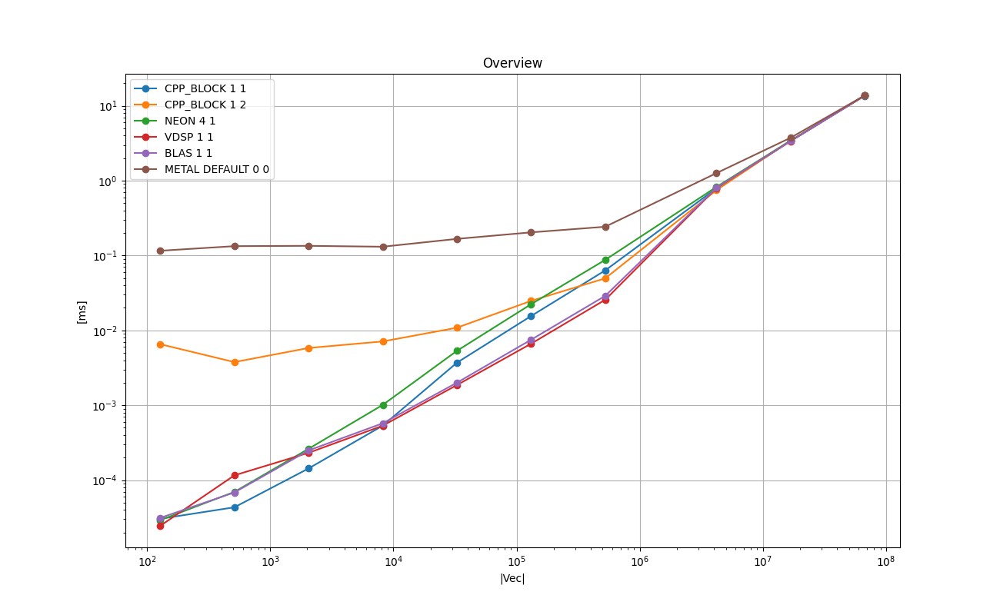

# SAXPY : Streaming Workloads

Multiply vector X by scalar α and add it to vector Y. This type operation is called *Streaming Workloads* in Chapter 11 of [CUDA Handbook](http://www.cudahandbook.com/).

## 0. Instruction for iOS
So far this has been tested on iPhone 13 mini 256GB.

- Open `AppleNumericalComputing/iOSTester_02/iOSTester_02.xcodeproj` with Xcode

- Build a release build

- Run the iOS App in release build

- Press 'Run' on the screen

- Wait until App finished with 'finished!' on the log output.

- Copy and paste the log into `02_saxpy/doc_ios/make_log.txt`.

- Run the following in the terminal.
```
$ cd 01_memcpy
$ grep '\(^INT\|^FLOAT\|^DOUBLE\|data element type\)' doc_ios/make_log.txt > doc_ios/make_log_cleaned.txt
$ python ../common/process_log.py -logfile doc_ios/make_log_cleaned.txt -specfile doc_ios/plot_spec.json -show_impl -plot_charts -base_dir doc_ios/
```
- You will get the PNG files in  `02-saxpy/doc_ios/`.

# 1. Key Points

* For *float*, vDSP, BLAS, and the plain C++ version perform best depending on the problem size.

* For *double*, BLAS, and the plain C++ version perform best depending on the problem size.

* The performance achieved by C++ with the compiler optimization is apparently due to NEON SIMD instructions unrolled with factor 4 with the optimized register allocation.

# 2. Background and Context
Saxpy, or *scalar a x plus y* according to [[GVL96]](https://www.cs.cornell.edu/cv/GVL4/golubandvanloan.htm),
is one of the simplest and easily parallelizable vector computation.
(Many articles and BLAS interpret it as *single precision  a x plus y*.)
This is a good starting point to measure the performance of the numerical computing of a system.

On Apple M1 macOS, there are two main ways to perform this computation:
**vDSP** & **CBLAS** in **Accelerate** framework.
Also Metal is available for the type *float* and *int*.

# 3. Purpose
The purpose of this section is as follows:

* To measure the real running time of this operation in various implementations for vectors in various sizes on Apple M1 Mac Mini.

* To find the best implementation for the problem sizes tested.

* To try to improve the running time in C++ implementations in comparison to vDSP and BLAS routines using a few techniques, namely multithreading, NEON intrinsics, and the explicit loop unrolling.

* To measure the running time of the implementation on Metal.

# 4. Results on Running Time
The following experiments are done with [test_saxpy.cpp](./test_saxpy.cpp) in this directory.

* **Compiler:** Apple clang version 13.0.0 (clang-1300.0.29.3) Target: arm64-apple-darwin20.6.0 Thread model: posix

* **Device:** Mac mini (M1, 2020) Chip Apple M1, Memory 8GB, macOS Big Sur Version 11.6

Please type `make all` in this directory to reproduce the results.


## 4.1. Overview : Float
The following chart shows the mean running times taken to perform one saxpy in *float* for each implementation in log-log scale.
X-axis is the size of the vectors |X| & |Y|, and Y-axis is the time taken in milliseconds.

### Legend

* **CPP_BLOCK 1 1** : Plain C++ implementation with compiler optimization with -O3

* **CPP_BLOCK 2 1** : Based on CPP_BLOCK 1 1 with 2 threads

* **NEON  4 1** : C++ with NEON SIMD intrinsics with the loop unrolling factor of 4

* **VDSP 1 1** : vDSP_vsma() in the Accelerate framework.

* **BLAS 1 1** : cblas_saxpy() in the Accelerate framework.

* **METAL DEFAULT 0 0** : Metal compute kernel

### Plots: Mac Mini M1 2020 8 GB
<a href="doc/FLOAT_VECTOR_Overview.png"></a>

### Plots: iPhone 13 mini 256 GB
<a href="doc_ios/FLOAT_VECTOR_Overview.png"></a>

### Remarks on Mac Mini

* Plain C++ implementation (CPP_BLOCK 1 1) shows the best running times between |V| = 512 and 8K elements.
Beyond that size BLAS & vDSP work best.

* The overhead of synchronizing the multithreads is amortized around |V|=4M, and it does not seem to worth it.

* For Metal, the overhead of launching the kernel is amortized around |V|= 16M.

* 'NEON 4 1' performs constantly slightly worse than 'CPP_BLOCK 1 1'.
Both use NEON SIMD (**fmul.4s** & **fadd.4s**)  with the loop-unrolling of factor 4.

### Analysis on Why 'CPP_BLOCK 1 1' Achieves Good Running Time.

The difference between CPP_BLOCK 1 1 and NEON 4 1 can be explained
in the way the loop body is constructed as shown below.

In 'CPP_BLOCK 1 1' the instructions are optimized with 2 **ldp** and 2 **stp** instructions, 
while 'NEON 1 4'version uses more registers and instructions.
This suggests the compiler can not fully optimize the code when the NEON intrinsics are combined in the C++ code
for this particular code for saxpy.

Excerpt from CPP_BLOCK 1 1:
```
    for ( size_t i = 0; i < N ; i++ ) {
        y[i] = alpha * x[i] + y[i];
    }
```
and excerpt from the generated code:
```
__Z20saxpy_baseline_floatPKfPffm:
...
0000000100003bc4        ldp     q2, q3, [x9, #-0x20]
0000000100003bc8        ldp     q4, q5, [x9], #0x40
0000000100003bcc        fmul.4s v2, v2, v1
0000000100003bd0        fmul.4s v3, v3, v1
0000000100003bd4        fmul.4s v4, v4, v1
0000000100003bd8        fmul.4s v5, v5, v1
0000000100003bdc        ldp     q6, q7, [x10, #-0x20]
0000000100003be0        ldp     q16, q17, [x10]
0000000100003be4        fadd.4s v2, v2, v6
0000000100003be8        fadd.4s v3, v3, v7
0000000100003bec        fadd.4s v4, v4, v16
0000000100003bf0        fadd.4s v5, v5, v17
0000000100003bf4        stp     q2, q3, [x10, #-0x20]
0000000100003bf8        stp     q4, q5, [x10], #0x40
0000000100003bfc        subs    x11, x11, #0x10
0000000100003c00        b.ne    0x100003bc4
```

Excerpt from NEON 4 1:
```
    for (size_t i = 0;  i < N; i += 16 ) {

        const float32x4_t x_q1    = vld1q_f32( &x[i   ] );
        const float32x4_t x_q2    = vld1q_f32( &x[i+ 4] );
        const float32x4_t x_q3    = vld1q_f32( &x[i+ 8] );
        const float32x4_t x_q4    = vld1q_f32( &x[i+12] );

        const float32x4_t y_q1    = vld1q_f32( &y[i   ] );
        const float32x4_t y_q2    = vld1q_f32( &y[i+ 4] );
        const float32x4_t y_q3    = vld1q_f32( &y[i+ 8] );
        const float32x4_t y_q4    = vld1q_f32( &y[i+12] );

        const float32x4_t ax_q1   = vmulq_n_f32( x_q1, alpha );
        const float32x4_t ax_q2   = vmulq_n_f32( x_q2, alpha );
        const float32x4_t ax_q3   = vmulq_n_f32( x_q3, alpha );
        const float32x4_t ax_q4   = vmulq_n_f32( x_q4, alpha );

        const float32x4_t axpy_q1 = vaddq_f32( ax_q1, y_q1 );
        const float32x4_t axpy_q2 = vaddq_f32( ax_q2, y_q2 );
        const float32x4_t axpy_q3 = vaddq_f32( ax_q3, y_q3 );
        const float32x4_t axpy_q4 = vaddq_f32( ax_q4, y_q4 );

        vst1q_f32( &(y[i   ]), axpy_q1 );
        vst1q_f32( &(y[i+ 4]), axpy_q2 );
        vst1q_f32( &(y[i+ 8]), axpy_q3 );
        vst1q_f32( &(y[i+12]), axpy_q4 );
    }
```
and excerpt from the generated code:
```
__ZN18TestCaseSAXPY_neonIfE19calc_block_factor_4Eii:
...
00000001000090b4        ldp     x11, x12, [x0, #0xb8]
00000001000090b8        add     x11, x11, x10
00000001000090bc        ldp     q0, q1, [x11]
00000001000090c0        ldp     q2, q3, [x11, #0x20]
00000001000090c4        add     x11, x12, x10
00000001000090c8        ldp     q4, q5, [x11]
00000001000090cc        ldp     q6, q7, [x11, #0x20]
00000001000090d0        ldr     s16, [x0, #0xc8]
00000001000090d4        fmul.4s v0, v0, v16[0]
00000001000090d8        fmul.4s v1, v1, v16[0]
00000001000090dc        fmul.4s v2, v2, v16[0]
00000001000090e0        fmul.4s v3, v3, v16[0]
00000001000090e4        fadd.4s v0, v4, v0
00000001000090e8        fadd.4s v1, v5, v1
00000001000090ec        fadd.4s v2, v6, v2
00000001000090f0        fadd.4s v3, v7, v3
00000001000090f4        str     q0, [x11]
00000001000090f8        ldr     x11, [x0, #0xc0]
00000001000090fc        add     x11, x11, x10
0000000100009100        str     q1, [x11, #0x10]
0000000100009104        ldr     x11, [x0, #0xc0]
0000000100009108        add     x11, x11, x10
000000010000910c        str     q2, [x11, #0x20]
0000000100009110        ldr     x11, [x0, #0xc0]
0000000100009114        add     x11, x11, x10
0000000100009118        str     q3, [x11, #0x30]
000000010000911c        add     x9, x9, #0x10
0000000100009120        add     x10, x10, #0x40
0000000100009124        cmp     x9, x8
0000000100009128        b.lo    0x1000090b4
```
As shown above, in  the 'NEON 4 1'version the SIMD instructions are not interleaved and the other parts of the logic
has redundancy. This accounts for the difference in the running time.


## 4.2. Overview : Double
The following chart shows the mean running times taken to perform one saxpy in double for each implementation in log-log scale.
X-axis is the size of the vectors |X| & |Y|, and Y-axis is the time taken in milliseconds.


### Legend

* **CPP_BLOCK 1 1** : Plain C++ implementation with compiler optimization with -O3

* **CPP_BLOCK 2 1** : Based on CPP_BLOCK 1 1 and with 2 threads

* **NEON 4 1** : NEON SIMD with loop unrolling factor of 4

* **VDSP 1 1** : vDSP_vsmaD() in the Accelerate framework.

* **BLAS 1 1** : cblas_daxpy() in the Accelerate framework.


### Plots: Mac Mini M1 2020 8 GB
<a href="doc/DOUBLE_VECTOR_Overview.png"></a>

### Plots: iPhone 13 mini 256 GB
<a href="doc_ios/DOUBLE_VECTOR_Overview.png"></a>

### Remarks on Mac Mini

* Plain C++ implementation (CPP_BLOCK 1 1) shows the best running time between |V| = 128 and 2K elements. Beyond that size BLAS works best.

* VDSP seems unoptimized for double.

* The overhead of synchronizing the Multithreads is amortized around |V|=128K.

* The 'NEON 4 1' performs constantly slightly worse than 'CPP_BLOCK 1 1'. Both use NEON SIMD (**fmul.2d** & **fadd.2d**) with the loop unrolling factor of 4.

### Analysis on Why 'CPP_BLOCK 1 1' Achieves Good Running Time
In the same way as for the float implementations, the difference between 'CPP_BLOCK 1 1' and 'NEON 4 1' can be explained
in the way the loop body is constructed as shown below.

In 'CPP_BLOCK 1 1' the instructions are optimized with 2 **ldp** and 2 **stp** instructions, while 'NEON 1 4'version uses more registers and instructions. This suggests the compiler can not fully optimize the code when the NEON intrinsics are combined in the C++ code for this particular code for saxpy.


Excerpt from the generated code for 'CPP_BLOCK 1 1':
```
__Z21saxpy_baseline_doublePKdPddm:
...
0000000100003c80        ldp     q2, q3, [x9, #-0x20]
0000000100003c84        ldp     q4, q5, [x9], #0x40
0000000100003c88        fmul.2d v2, v2, v1
0000000100003c8c        fmul.2d v3, v3, v1
0000000100003c90        fmul.2d v4, v4, v1
0000000100003c94        fmul.2d v5, v5, v1
0000000100003c98        ldp     q6, q7, [x10, #-0x20]
0000000100003c9c        ldp     q16, q17, [x10]
0000000100003ca0        fadd.2d v2, v2, v6
0000000100003ca4        fadd.2d v3, v3, v7
0000000100003ca8        fadd.2d v4, v4, v16
0000000100003cac        fadd.2d v5, v5, v17
0000000100003cb0        stp     q2, q3, [x10, #-0x20]
0000000100003cb4        stp     q4, q5, [x10], #0x40
0000000100003cb8        subs    x11, x11, #0x8
0000000100003cbc        b.ne    0x100003c80
```

Excerpt from the generated code for 'NEON 4 1':
```
__ZN18TestCaseSAXPY_neonIdE19calc_block_factor_4Eii:
...
000000010000c16c        ldp     x11, x12, [x0, #0xb8]
000000010000c170        add     x11, x11, x10
000000010000c174        ldp     q0, q1, [x11]
000000010000c178        ldp     q2, q3, [x11, #0x20]
000000010000c17c        add     x11, x12, x10
000000010000c180        ldp     q4, q5, [x11]
000000010000c184        ldp     q6, q7, [x11, #0x20]
000000010000c188        ldr     d16, [x0, #0xc8]
000000010000c18c        fmul.2d v0, v0, v16[0]
000000010000c190        fmul.2d v1, v1, v16[0]
000000010000c194        fmul.2d v2, v2, v16[0]
000000010000c198        fmul.2d v3, v3, v16[0]
000000010000c19c        fadd.2d v0, v4, v0
000000010000c1a0        fadd.2d v1, v5, v1
000000010000c1a4        fadd.2d v2, v6, v2
000000010000c1a8        fadd.2d v3, v7, v3
000000010000c1ac        str     q0, [x11]
000000010000c1b0        ldr     x11, [x0, #0xc0]
000000010000c1b4        add     x11, x11, x10
000000010000c1b8        str     q1, [x11, #0x10]
000000010000c1bc        ldr     x11, [x0, #0xc0]
000000010000c1c0        add     x11, x11, x10
000000010000c1c4        str     q2, [x11, #0x20]
000000010000c1c8        ldr     x11, [x0, #0xc0]
000000010000c1cc        add     x11, x11, x10
000000010000c1d0        str     q3, [x11, #0x30]
000000010000c1d4        add     x9, x9, #0x8
000000010000c1d8        add     x10, x10, #0x40
000000010000c1dc        cmp     x9, x8
000000010000c1e0        b.lo    0x10000c16c
```

As shown above, in the 'NEON 4 1'version the SIMD instructions are not interleaved and the other parts of the logic has redundancy.
This accounts for the difference in the running time.


## 4.3. Comparison Among NEON Intrinsics Implementations : Float

The following chart shows the relative running times taken to perform Saxpy for the vectors of the given number of floats (4 bytes) for each implementation in log-lin scale.
The X-axis is the size of the vectors, and the Y-axis is the relative running time of each implementation relative to 'CPP BLOCK 1 1', which is fixed at 1.0.


### Legend

* **CPP_BLOCK 1 1** : Plain C++ with -O3 - baseline

* **NEON 1 1** : NEON intrinsics with no loop unrolling

* **NEON 2 1** : NEON intrinsics with loop unrolling of factor 2

* **NEON 4 1** : NEON intrinsics with loop unrolling of factor 4

* **NEON 8 1** : NEON intrinsics with loop unrolling of factor 8

* **NEON 8 2** : NEON intrinsics with loop unrolling of factor 8 with 2 threads

* **NEON 8 4** : NEON intrinsics with loop unrolling of factor 8 with 4 threads

* **NEON 8 8** : NEON intrinsics with loop unrolling of factor 8 with 8 threads

### Plots: Mac Mini M1 2020 8 GB
<a href="doc/FLOAT_VECTOR_Comparison_Among_NEON_Implementations_relative.png"></a>

### Plots: iPhone 13 mini 256 GB
<a href="doc_ios/FLOAT_VECTOR_Comparison_Among_NEON_Implementations_relative.png"></a>

### Remarks on Mac Mini
The 'CPP_BLOCK 1 1' version  works better than the other NEON implementations.
As described above, this is because 'CPP_BLOCK 1 1' is better optimized with the SIMD instructions
as well as with the better register allocations and the load & store with **ldp** & **stp**.
Increasing the factor of loop unrolling improves the performance among the NEON implementations, but it does not exceed the performance of CPP_BLOCK 1 1.
There is little benefit in using multithreads except for the problem of size around 4M floats.


## 4.4. Comparison Among NEON Intrinsics Implementations : Double
The following chart shows the relative running times among the NEON implementations for double (notably `fmul.2d` & `fadd.2d`) with the CPP_BLOCK 1 1 as the baseline fixed at 1.0.

### Legend

* **CPP_BLOCK 1 1** : Plain C++ implementation with compiler optimization with -O3 - baseline

* **NEON 1 1** : NEON SIMD with no loop unrolling

* **NEON 2 1** : NEON SIMD with loop unrolling with factor 2

* **NEON 4 1** : NEON SIMD with loop unrolling with factor 4

* **NEON 8 1** : NEON SIMD with loop unrolling with factor 8

* **NEON 8 2** : NEON SIMD with loop unrolling with factor 8 with 2 threads

* **NEON 8 4** : NEON SIMD with loop unrolling with factor 8 with 4 threads

* **NEON 8 8** : NEON SIMD with loop unrolling with factor 8 with 8 threads

### Plots: Mac Mini M1 2020 8 GB
<a href="doc/DOUBLE_VECTOR_Comparison_Among_NEON_Implementations_relative.png"></a>

### Plots: iPhone 13 mini 256 GB
<a href="doc_ios/DOUBLE_VECTOR_Comparison_Among_NEON_Implementations_relative.png"></a>

### Remarks on Mac Mini
The baseline in the plain C++ (CPP_BLOCK 1 1) works better against other implementations with explicit NEON intrinsics.
As described above, this is because the plain C++ version is highly optimized with NEON instructions as well as the optimized register allocations and the load & store with `ldp` & `stp`.
Increasing the factor of loop unrolling improves the performance, but it does not exceed the performance of CPP_BLOCK 1 1.
There is little benefit in multithreading. Some slight benefits are observed around the problem size of 128K-512K elements.

## 4.5. Experiment on Two Types of Multithreading : Block and Interleaved for Floats
The following chart shows the relative running times among the multithreaded implementations for *float*.
The main purpose of this experiment is to see the difference in the way each thread accesses the memory.
In the 'BLOCK' implementations, each thread accesses two consecutive blocks of X and Y.
In the 'INTERLEAVED' implementations, each thread accesses every N-th element in memory where N is the number of worker threads.
It is expected that the INTERLEAVED implementations perform worse than BLOCK implementations.
The following chart shows the negative impact of INTERLEAVED access in real numbers.

### Legend

* **CPP_BLOCK 1 1** : Plain C++ single-threaded- baseline

* **CPP_BLOCK 1 2** : Plain C++ 2 threads, each thread accesses a consecutive block of memory.

* **CPP_BLOCK 1 4** : Plain C++ 4 threads, each thread accesses a consecutive block of memory.

* **CPP_BLOCK 1 8** : Plain C++ 8 threads, each thread accesses a consecutive block of memory.

* **CPP_BLOCK 1 16** : Plain C++ 16 threads, each thread accesses a consecutive block of memory.

* **CPP_INTERLEAVED 1 2** : Plain C++ 2 threads, each thread accesses interleaved memory locations.

* **CPP_INTERLEAVED 1 4** : Plain C++ 2 threads, each thread accesses interleaved memory locations.

* **CPP_INTERLEAVED 1 8** : Plain C++ 2 threads, each thread accesses interleaved memory locations.

* **CPP_INTERLEAVED 1 16** : Plain C++ 2 threads, each thread accesses interleaved memory locations.

### Plots: Mac Mini M1 2020 8 GB
<a href="doc/FLOAT_VECTOR_Comparison_Among_C++_Multithreaded_Implementations_relative.png">
</a>

### Plots: iPhone 13 mini 256 GB
<a href="doc_ios/FLOAT_VECTOR_Comparison_Among_C++_Multithreaded_Implementations_relative.png">
</a>

### Remarks on Mac Mini
As expected, the CPP_BLOCK versions benefit from cache locality, but the CPP_INTERLEAVED versions don't, and the running times fluctuate wildly.
This indicates the performance is very susceptible to the cache residency.
Also, the overhead of managing the multi threads is amortized at around the size |X|,|Y| = 512K.
However, the multithreaded implementations lose the advantage for the problem size greater than 16M, as the saxpy problem is inherently I/O bound.


## 4.6. Experiment on Two Types of Multithreading : Block and Interleaved for Floats
The following chart shows the relative running times among the multithreaded implementations for double.
The main purpose of this experiment is to see the difference in the way each thread accesses the memory.
In the 'BLOCK' implementations, each thread accesses two consecutive blocks of X and Y.
In the 'INTERLEAVED' implementations, each thread accesses every N-th element in memory where N is the number of worker threads.
It is expected that the INTERLEAVED implementations perform worse than BLOCK implementations.
The following chart shows the negative impact of INTERLEAVED access in real numbers.

### Legend

* **CPP_BLOCK 1 1** : Plain C++ single-threaded- baseline

* **CPP_BLOCK 1 2** : Plain C++ 2 threads, each thread accesses a consecutive block of memory.

* **CPP_BLOCK 1 4** : Plain C++ 4 threads, each thread accesses a consecutive block of memory.

* **CPP_BLOCK 1 8** : Plain C++ 8 threads, each thread accesses a consecutive block of memory.

* **CPP_BLOCK 1 16** : Plain C++ 16 threads, each thread accesses a consecutive block of memory.

* **CPP_INTERLEAVED 1 2** : Plain C++ 2 threads, each thread accesses interleaved memory locations.

* **CPP_INTERLEAVED 1 4** : Plain C++ 2 threads, each thread accesses interleaved memory locations.

* **CPP_INTERLEAVED 1 8** : Plain C++ 2 threads, each thread accesses interleaved memory locations.

* **CPP_INTERLEAVED 1 16** : Plain C++ 2 threads, each thread accesses interleaved memory locations.

### Plots: Mac Mini M1 2020 8 GB
<a href="doc/DOUBLE_VECTOR_Comparison_Among_C++_Multithreaded_Implementations_relative.png">
</a>

### Plots: iPhone 13 mini 256 GB
<a href="doc_ios/DOUBLE_VECTOR_Comparison_Among_C++_Multithreaded_Implementations_relative.png">
</a>


### Remarks on Mac Mini
As expected, the CPP_BLOCK versions benefit from cache locality, but the CPP_INTERLEAVED versions don't, and the running times fluctuate wildly.
This indicates the performance is very susceptible to the cache residency.
Also, the overhead of managing the multi threads is amortized at around the size |X|,|Y| = 128K.
However, the multithreaded implementations lose the advantage for the problem size greater than 4M, as the saxpy problem is inherently I/O bound.


# 5. Implementations
This section briefly describes each of the implementations tested with some key points in the code.
Those are executed as part of the test program in [test_saxpy.cpp](./test_saxpy.cpp).
The top-level object in the 'main()' function is **TestExecutorSAXPY**, which is a subclass of **TestExecutor** found in 
[../common/test_case_with_time_measurements.h](../common/test_case_with_time_measurements.h).
It manages one single test suite, which consists of test cases.
It arranges the input data, allocates memory, executes each test case multiple times and measures the running times, cleans up, and reports the results.
Each implementation type is implemented as a **TestCaseSAXPY**, which is a subclass of **TestCaseWithTimeMeasurements**
in [../common/test_case_with_time_measurements.h](../common/test_case_with_time_measurements.h).
The main part is implemented in **TestCaseSAXPY::run()**, and it is the subject for the running time measurements.


## 5.1. CPP BLOCK 1 1 - baseline
[**class TestCaseSAXPY_baseline** in test_saxpy.cpp](./test_saxpy.cpp)

This is a plain for-loop as follows.
The Clang++ compiler generates an optimized code with SIMD instructions ( **fmul.{4s,2d}** &  **fadd.{4s,2d}**) 
and the pair-wise load & store instructions (**ldp** & **ldp**).
See `__Z20saxpy_baseline_floatPKfPffm` & `__Z21saxpy_baseline_doublePKdPddm` shown above for the generated machine instructions.
Please use `otool -t -v bin/test_saxpy` to see the complete disassembled code.

```
for ( size_t i = 0; i < N; i++ ) {
    y[i] = alpha * x[i] + y[i];
}
```

## 5.2. NEON X 1 - NEON Intrinsics with loop unrolling of factor X
[**class TestCaseSAXPY_neon** in test_saxpy.cpp](./test_saxpy.cpp)

This is a C++ code with NEON intrinsics for numerical operations.
The code below is the main part of for the loop unrolling factor of 1.
```
    void calc_block_factor_1(const int elem_begin, const int elem_end_past_one) {

        if constexpr ( is_same<float, T>::value ) {

            for (size_t i = elem_begin;  i < elem_end_past_one; i += 4 ) {

                //__builtin_prefetch(&this->m_x[i+4], 0 );
                //__builtin_prefetch(&this->m_y[i+4], 1 );

                const float32x4_t x_quad    = vld1q_f32( &this->m_x[i] );
                const float32x4_t ax_quad   = vmulq_n_f32( x_quad, this->m_alpha );
                const float32x4_t y_quad    = vld1q_f32( &this->m_y[i] );
                const float32x4_t axpy_quad = vaddq_f32( ax_quad, y_quad );
                vst1q_f32( &(this->m_y[i]), axpy_quad );
            }
        }      
        else {
            for (size_t i = elem_begin;  i < elem_end_past_one; i += 2 ) {

                //__builtin_prefetch(&this->m_x[i+2], 0 );
                //__builtin_prefetch(&this->m_y[i+2], 1 );

                const float64x2_t x_pair    = vld1q_f64( &this->m_x[i] );
                const float64x2_t ax_pair   = vmulq_n_f64( x_pair, this->m_alpha );
                const float64x2_t y_pair    = vld1q_f64( &this->m_y[i] );
                const float64x2_t axpy_pair = vaddq_f64( ax_pair, y_pair );
                vst1q_f64( &(this->m_y[i]), axpy_pair );
            }
        }
    }
```

For the loop unrolling factor of 2, 4, and 8, please see 
`TestCaseSAXPY_neon::calc_block_factor_2()`, `TestCaseSAXPY_neon::calc_block_factor_4()`, `TestCaseSAXPY_neon::calc_block_factor_8()`.

As stated above, increasing the factor of loop unrolling improves the performance, but 'CPP BLOCK 1 1' performs better
due to its optimized instruction emission, and the register allocation.

## 5.3. CPP_BLOCK 1 Y - C++ with multithreading & memory blocks
[**class TestCaseSAXPY_multithread_block** in test_saxpy.cpp](./test_saxpy.cpp)

This is based on CPP_BLOCK 1 1 with multiple threads, each of which is allocated a consecutive range of elements of X and Y.
Each thread accesses a consecutive range of memory, and a higher cache locality is expected.
Following is the definition of the worker threads.
```
    auto thread_lambda = [this, num_elems_per_thread ]( const size_t tid ) {

        const size_t elem_begin = thread_index * num_elems_per_thread;
        const size_t elem_end   = elem_begin + num_elems_per_thread;

        while ( true ) {

            m_fan_out.wait( tid );
            if( m_fan_out.isTerminating() ) {
                break;
            }

            for ( size_t i = elem_begin; i < elem_end; i++ ) {

               y[i] = alpha * x[i] + y[i];
            }

            m_fan_in.notify();
            if( m_fan_in.isTerminating() ) {
                break;
            }
        }
    };
```
The worker threads are managed by [ThreadSynchrnizer](https://github.com/ShoYamanishi/ThreadSynchronizer). The overhead of synchronization is around 5.2 [μs] for 4 worker threads per iteration.

## 5.4. CPP_INTERLEAVED 1 Y - C++ with multithreading & interleaved memory access
[**class TestCaseSAXPY_multithread_interleave** in test_saxpy.cpp](./test_saxpy.cpp)

This is based on CPP_BLOCK 1 1 with multiple threads, each of which accesses the interleaved memory locations.
Each thread accesses almost the entire range of the allocated memory, and a lower cache locality is expected.
Following is the definition of the worker threads.

```
    auto thread_lambda = [this]( const size_t tid ) {

        while ( true ) {

            m_fan_out.wait( thread_index );
            if( m_fan_out.isTerminating() ) {
                break;
            }

            for ( size_t i = tid; i < this->m_num_elements ; i += m_num_threads ) {
                y[i] = alpha * x[i] + y[i];
            }

            m_fan_in.notify();
            if( m_fan_in.isTerminating() ) {
                break;
            }
        }
    };
```
Please see the increment of the loop `i += m_num_threads`.
As expected, the performance of this type is worse than CPP_BLOCK 1 Y and as the number of threads increases, and the gap between memory accesses increases,
the performance worsens asymptotically. Please see the chart above.

The worker threads are managed by [ThreadSynchrnizer](https://github.com/ShoYamanishi/ThreadSynchronizer). The overhead of synchronization is around 5.2 [μs] for 4 worker threads per iteration.


## 5.5. NEON 8 Y - NEON, loop unrolling factor 8 & multithreading, & memory blocks
[**class TestCaseSAXPY_neon_multithread_block** in test_saxpy.cpp](./test_saxpy.cpp)

This is based on CPP_BLOCK 1 Y, and the body of the loop is replaced with the NEON intrinsics of loop unrolling factor 8.
The performance is similar to CPP_BLOCK 1 Y.


## 5.6. VDSP 1 1 - Accelerate vDSP
[**class TestCaseSAXPY_vDSP** in test_saxpy.cpp](./test_saxpy.cpp)

For float:
```
vDSP_vsma ( x, 1, &alpha, y, 1, y, 1, N );
```

For double:
```
vDSP_vsmaD ( x, 1, &alpha, y, 1, y, 1, N );
```

## 5.7. BLAS 1 1 - Accelerate CBLAS
[**class TestCaseSAXPY_BLAS** in test_saxpy.cpp](./test_saxpy.cpp)

For float:
```
cblas_saxpy( N, alpha, x, 1, y, 1 );
```

For double:
```
cblas_daxpy( N, alpha, x, 1, y, 1 );
```

## 5.8. METAL DEFAULT 0 0 (float only)
[**class TestCaseSAXPY_Metal** in test_saxpy.cpp](./test_saxpy.cpp)

The number of thread-groups is ⌈|V| / 1024⌉.

The number of threads per thread-group is 1024 if |V|>=1024.
If |V| < 1024,  threads per thread-group is aligned up to the nearest multiple of 32.
This is with the following simple Metal Compute kernel:
```
for ( uint i = thread_position_in_grid; i < N; i += threads_per_grid ) {
    Y[i] = X[i] * a + Y[i];
}
```
Please see [metal/saxpy.metal](./metal/saxpy.metal) for the complete shader code.
The OBJ-C and C++ code that manages the shader is found under the directory [metal/](./metal/).

# 6. References

* [GVL96] Matrix Computation by Golub and van Loan 1996
```
@Book{GoluVanl96,
  Title                    = {Matrix Computations},
  Author                   = {Golub, Gene H. and Van Loan, Charles F.},
  Publisher                = {The Johns Hopkins University Press},
  Year                     = {1996},
  Edition                  = {Third}
}
```

* [CUDA Handbook](http://www.cudahandbook.com/)  The CUDA Handbook by Nicholas Wilt