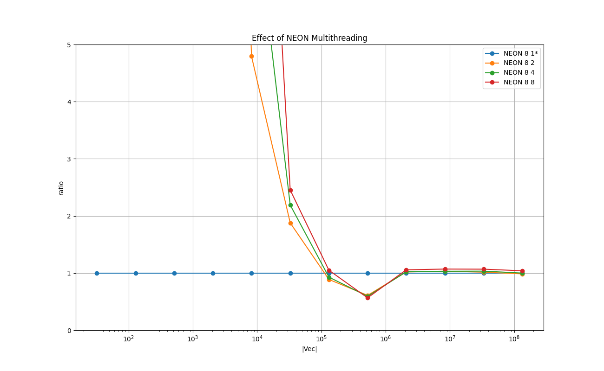

# DOT Product : Reduction

Calculation of the dot product of two vectors X and Y.
This type of operation is called *Reduction* in Chapter 12 of [CUDA Handbook](http://www.cudahandbook.com/).

# 1. Key Points

* BLAS performs best overall.

* NEON Intrinsics with the loop unrolling has a significant advantage over Plain C++. It runs almost on par with BLAS & VDSP.

* Unlike for [Saxpy](../02_saxpy/README.md), Clang++ does not optimize the plain C++ implementation. It does not use NEON SIMD nor unrolls the loop.

* 6 Metal implementation types were made, and the version in one-pass with simd_sum() performs best.

* Metal threadgroups are launched in parallel. As a consequence, the technique described in 12.3 of [CUDA Handbook](http://www.cudahandbook.com/) for the one-pass reduction with the last block detection can not be used.

# 2. Background and Context
Dot product is a representative operation for a type of algorithms called *reduction*, where the output of a fixed size depends on all the input of length |V|.
In the GPU space it is well studied and it is nicely summarized in *Chapter 12 Reduction* of [CUDA Handbook](http://www.cudahandbook.com/).
The commonly occurring idiom in reduction is called the **log-step**.
It is a loop in which the size of the problem is reduced by half at the end of each iteration.

# 3. Purpose
The purpose can be divided into two parts: CPU and GPU.

For CPU, the aim is to measure the performance of vDSP & BLAS, and how the C++ implementations perform against them,
and how the C++ version can be improved by a few techniques, notably, by the NEON intrinsics, the loop-unrolling, and multithreading.

For GPU, the aim is to conduct a similar study described in Chapter 12 of [CUDA Handbook](http://www.cudahandbook.com/).
In the book the following implementations and a technique are presented.

* **12.2 Two-pass reduction with a shared memory** to store the partial sums : an algorithm as the baseline.

* **12.3 Single-pass reduction with the last-block detection** : an attempt to reduce the number of kernel launches using an atomic. 

    **This can not be applied to Metal.** In CUDA, the blocks in a grid are executed serially, but in Metal the thread-groups can be executed in parallel.
    This makes the detection of the last block/thread-group with an atomic counter impossible in Metal.

* **12.4 Single-pass reduction with atomics** : another attempt to reduce the number of kernel launches with an atomic.

* **12.8 Warp reduction with Shuffle** : A technique to improve the performance of the log-step operation
(loop body) with the warp shuffle instruction **__shuf_xor()**.

Due to the difference in the design between CUDA and Metal, it is impossible to port the algorithms in the CUDA Book to Metal as is.
In this section a similar study is conducted based on the CUDA Handbook, but the implementations are changed using technologies available on Metal,
notably the **thread-group memory**, and the **simd instructions**.


# 4. Two Findings on Metal
This subsection states two important findings discovered during my tests and experiments.
Those two are related to how the thread-groups are executed on Metal.

## 4.1. The More Thread-Groups, the Faster It Executes.

In general, it seems the greater the number of thread-groups is, the faster the processing time is.
Assume the number of elements to process is |V|, the number of threads in the thread-group is |T|, and the number of thread-groups in the grid is |B|.
On Mac Mini M1 2020, |T| is 1024.
Assume |V| >> 1024 and |T|=1024. Then 1 <= |B| <= ⌈|V|/|T|⌉.
The kernel execution is faster if |B| is larger, and following loop in the kernel executes fewer times.
```
for (i = tid; i < V; i += T*B) {
    // access memory with i
}
```
Ideally, the loop should be eliminated as follows:

```
if (tid < V ) {
    // access memory with tid
}
```

## 4.2. The Last Block Detection Technique Can Not Be Used for Metal.
This is another consequence of multiple thread-groups launched in parallel.

The following is an excerpt from *Listing 12.6 Single-pass reduction kernel (reduction4SinglePass.cuh)* of [CUDA Handbook](http://www.cudahandbook.com/).

```
__devie__ unsigned int retirementCount = 0;
...
kernel() {
...
    __shared__ bool lastBlock;

    if ( threadIdx.x == 0 ) {
        // first thread in the block.
        unsigned int ticket = atomiAdd( &retirmentCount, 1 );
        ...
        lastBlock = ( ticket == gridDimx - 1 ); // last block.
    }
    __synchthreads();
    if ( lastBlock ) {
        // This is the last block. All the blocks have finished running.

        // Do the last processing here.
    }
}
```
The corresponding Metal shader code is:

```
kernel void dot_type7_atomic_thread_group_counter(...) {

    threadgroup int   last_group = 0; // 'bool' does not work for threadgroup somehow. Use 'int' instead.

    threadgroup_barrier( mem_flags::mem_device ); // <= (Point A)

    if ( thread_position_in_threadgroup == 0 ) {

        uint fetched_val = atomic_fetch_add_explicit( thread_group_counter, 1 , memory_order_relaxed );

        last_group = ( fetched_val == threadgroups_per_grid - 1 )?1:0 ;
    }

    threadgroup_barrier( mem_flags::mem_threadgroup );

    if ( last_group == 1 ) {

        // This would be the last threadgroup.

        // <= (Point B)
    }
}
```
See [metal/dot.metal](./metal/dot.metal) for the complete shader code.

Even if the memory barrier is called at point **A** above, the last thread-group at point **B** does not see the changes made to the device memory before point **A**.
The threadgroup_barrier() ensures the changes made before point **A** are visible to all the threads **in the same thread-group**, not in the other thread-groups.
Even if it is guaranteed that all the thread-groups have finished executing the `atomic_fetch_add_explicit()`, due to this memory inconsistency, this way of implementing a 1-pass algorithm is not possible in Metal.


# 5. Results on Running Time

The following experiments are done with [test_dot.cpp](./test_dot.cpp) in this directory.

Compiler: Apple clang version 13.0.0 (clang-1300.0.29.3) Target: arm64-apple-darwin20.6.0 Thread model: posix

Device: Mac mini (M1, 2020) Chip Apple M1, Memory 8GB, macOS Big Sur Version 11.6

Please type `make all` in this directory to reproduce the results.


## 5.1. Overview : Float
The following chart shows the mean running times taken to perform one dot product operation in *float* for each implementation in log-log scale.
X-axis is the size of the vectors |X| & |Y|, and Y-axis is the time taken in milliseconds.

### Legend

* **CPP_BLOCK 1 1** : Plain C++ implementation with compiler optimization with -O3

* **NEON 1 1** : NEON intrinsics with no loop unrolling

* **NEON 4 1** : NEON intrinsics with loop unrolling of factor 4

* **NEON 8 8** : NEON intrinsics with loop unrolling of factor 8 with 8 threads

* **VDSP 1 1** : vDSP_dotpr () in the Accelerate framework

* **BLAS 1 1** : cblas_sdot() in the Accelerate framework

* **METAL ONE_PASS_ATOMIC_SIMD_SUM 0 0** : Metal Compute kernel, one-pass using simd_sum()

<a href="doc/FLOAT_VECTOR_Overview.png"></a>

### Remarks

* VDSP, BLAS and NEON 4 1 show a good overall performance. VDSP performs best for the size in 32K - 512K.

* CPP_BLOCK 1 1 is approximately 10x-20x slower than VDSP, BLAS and NEON 4 1. This implies the compiler does not optimize the code well.

* The overhead of launching the Metal kernel is amortized at around the size of 32M elements.

* The overhead of synchronizing multiple threads is amortized at around 2M elements. Multithreading does not seem to provide any benefits.

## 5.2. Comparison Among NEON Intrinsics Implementations : Float
The following chart shows the relative running times taken to perform the dot operation in the implementations with a single thread and NEON intrinsics with 4 different factors of loop unrolling in log-lin scale.
The X-axis is the size of the vectors, and the Y-axis is the relative running time of each implementation relative to 'CPP BLOCK 1 1', which is fixed at 1.0.

### Legend

* **CPP_BLOCK 1 1**: Plain C++ implementation with compiler optimization with -O3 - baseline

* **NEON 1 1** : NEON intrinsics with no loop unrolling

* **NEON 2 1** : NEON intrinsics with loop unrolling of factor 2

* **NEON 4 1** : NEON intrinsics with loop unrolling of factor 4

* **NEON 8 1** : NEON intrinsics with loop unrolling of factor 8

<a href="doc/FLOAT_VECTOR_Effect_of_NEON_Loop_Unrolling_relative.png"></a>

### Remarks
There is a wide gap between CPP_BLOCK 1 1 and NEON Y 1 with NEON intrinsics.
This can be explained by the difference in the code Clang++ generates.
In the C++ version, the Clang++ emits *standard* (as opposed to NEON) float instructions with no loop unrolling.
On the other hand, for the NEON intrinsics version, the compiler emits SIMD instructions (**fmul.4s** & **fadd.4s**) as well as
pair-wise load instruction **ldp**.
The generated code seems optimal. This explains the difference and also why NEON Y 1 is almost identical to vDSP's.
See the code snippets below.

#### CPP_BLOCK 1 1 : Plain C++ implementation

```
    float dot = 0.0;

    for ( size_t i = 0; i < N ; i++ ) {
        dot += x[i] * y[i];
    }
```

```
__ZN20TestCaseDOT_baselineIfE3runEv:
...
0000000100004cc8        ldr     s1, [x9], #0x4
0000000100004ccc        ldr     s2, [x10], #0x4
0000000100004cd0        fmul    s1, s1, s2
0000000100004cd4        fadd    s0, s0, s1
0000000100004cd8        str     s0, [x0, #0xc8]
0000000100004cdc        subs    x8, x8, #0x1
0000000100004ce0        b.ne    0x100004cc8
```


#### NEON 1 1 : NEON intrinsics with loop no unrolling

```
    float32x4_t dot_quad1{0.0, 0.0, 0.0, 0.0};

    for ( size_t i = elem_begin; i < elem_end_past_one ; i+=4 ) {
        const float32x4_t x_quad1  = vld1q_f32( &x[i]  );
        const float32x4_t y_quad1  = vld1q_f32( &y[i]  );
        const float32x4_t xy_quad1 = vmulq_f32( x_quad1, y_quad1 );
        dot_quad1 = vaddq_f32( dot_quad1, xy_quad1 );
    } 
    float dot = dot_quad1[0] + dot_quad1[1] + dot_quad1[2] + dot_quad1[3];
```

```
__ZN16TestCaseDOT_neonIfE19calc_block_factor_1EPfii:
...
0000000100005584        ldr     q1, [x11], #0x10
0000000100005588        ldr     q2, [x10], #0x10
000000010000558c        fmul.4s v1, v1, v2
0000000100005590        fadd.4s v0, v0, v1
0000000100005594        add     x9, x9, #0x4
0000000100005598        cmp     x9, x8
000000010000559c        b.lo    0x100005584
```

#### NOEN 4 1 : NEON intrinsics with loop unrolling factor 4

```
    float32x4_t dot_quad1{0.0, 0.0, 0.0, 0.0};
    float32x4_t dot_quad2{0.0, 0.0, 0.0, 0.0};
    float32x4_t dot_quad3{0.0, 0.0, 0.0, 0.0};
    float32x4_t dot_quad4{0.0, 0.0, 0.0, 0.0};

    for ( size_t i = elem_begin; i < elem_end_past_one; i+=16 ) {

        const float32x4_t x_quad1  = vld1q_f32( &x[i]    );
        const float32x4_t x_quad2  = vld1q_f32( &x[i+4]  );
        const float32x4_t x_quad3  = vld1q_f32( &x[i+8]  );
        const float32x4_t x_quad4  = vld1q_f32( &x[i+12] );
        const float32x4_t y_quad1  = vld1q_f32( &y[i]    );
        const float32x4_t y_quad2  = vld1q_f32( &y[i+4]  );
        const float32x4_t y_quad3  = vld1q_f32( &y[i+8]  );
        const float32x4_t y_quad4  = vld1q_f32( &y[i+12] );
        const float32x4_t xy_quad1 = vmulq_f32( x_quad1, y_quad1 );
        const float32x4_t xy_quad2 = vmulq_f32( x_quad2, y_quad2 );
        const float32x4_t xy_quad3 = vmulq_f32( x_quad3, y_quad3 );
        const float32x4_t xy_quad4 = vmulq_f32( x_quad4, y_quad4 );
        dot_quad1 = vaddq_f32( dot_quad1, xy_quad1 );
        dot_quad2 = vaddq_f32( dot_quad2, xy_quad2 );
        dot_quad3 = vaddq_f32( dot_quad3, xy_quad3 );
        dot_quad4 = vaddq_f32( dot_quad4, xy_quad4 );
    } 
    float dot=   dot_quad1[0] + dot_quad1[1] + dot_quad1[2] + dot_quad1[3]
               + dot_quad2[0] + dot_quad2[1] + dot_quad2[2] + dot_quad2[3]
               + dot_quad3[0] + dot_quad3[1] + dot_quad3[2] + dot_quad3[3]
               + dot_quad4[0] + dot_quad4[1] + dot_quad4[2] + dot_quad4[3];
```

```
__ZN16TestCaseDOT_neonIfE19calc_block_factor_4EPfii:
...
00000001000056a0        ldp     q4, q5, [x10, #-0x20]
00000001000056a4        ldp     q6, q7, [x10], #0x40
00000001000056a8        ldp     q16, q17, [x11, #-0x20]
00000001000056ac        ldp     q18, q19, [x11], #0x40
00000001000056b0        fmul.4s v4, v4, v16
00000001000056b4        fmul.4s v5, v5, v17
00000001000056b8        fmul.4s v6, v6, v18
00000001000056bc        fmul.4s v7, v7, v19
00000001000056c0        fadd.4s v3, v3, v4
00000001000056c4        fadd.4s v2, v2, v5
00000001000056c8        fadd.4s v1, v1, v6
00000001000056cc        fadd.4s v0, v0, v7
00000001000056d0        add     x9, x9, #0x10
00000001000056d4        cmp     x9, x8
00000001000056d8        b.lo    0x1000056a0
```

## 5.3. Comparison Among NEON multithreaded Implementations : Float
The following chart shows the relative running times taken to perform one dot product operation in *float* for the implementation with NEON intrinsics
with loop unrolling of factor 8, and 4 different numbers of worker threads.
The baseline is NEON 8 1 at 1.0.
The X-axis is the size of the vectors, and the Y-axis is the relative running time of each implementation relative to 'NEON 8 1', which is fixed at 1.0.

### Legend
* **NEON 8 1** : NEON intrinsics with loop unrolling factor 8 and a single thread

* **NEON 8 2** : NEON intrinsics with loop unrolling factor 8 and 2 threads

* **NEON 8 4** : NEON intrinsics with loop unrolling factor 8 and 4 threads

* **NEON 8 8** : NEON intrinsics with loop unrolling factor 8 and 8 threads

<a href="doc/FLOAT_VECTOR_Effect_of_NEON_Multithreading_relative.png"></a>

### Remarks
The overhead of synchronizing multiple threads is amortized at around 512K elements.
There is a slight advantage in multithreading for the problem sizes around 512K - 2M elements.


## 5.4. Comparison Among GPU Metal Implementations : Float
The following chart shows the relative running times taken to perform one dot production operation in *float* for each implementation in Metal.
The X-axis is the size of the vectors, and the Y-axis is the relative running time of each implementation relative to 'METAL TWO_PASS_DEVICE_MEMORY 0 0', which is fixed at 1.0.
This study is inspired by Chap. 12 of [CUDA Handbook](http://www.cudahandbook.com/).

### Legend

* **METAL TWO_PASS_DEVICE_MEMORY 0 0** - baseline

    It uses two passes (two kernels).
    Let the problem size (length of the vectors *X* & *Y*) is **V**, number of threads per thread-group is **T**,
and the number of thread-groups is **G**. If **V** >> 1024, then **T** = 1024 on macOS.

    At the 1st pass, each thread-group reduces the subproblem of size **Vtg**, and
generate a **partial dot product**. **Vtg** >= **T**.

    At the 2nd pass, one thread-group is launched, which process the **partial dot products** of size **Vtg** into the final dot product.

    At each step, each thread-group performs an operation called **log-step**, which requires a scratch memory to store the internal data unique to each thread-group.
In CUDA, shared memory denoted by `__shared__` is used. The shared memory is amenable to **uncoalesced access**, but susceptible to **bank conflicts**.
In Metal, the analogous memory type is **threadgroup memory**.
The implementation **METAL TWO_PASS_DEVICE_MEMORY 0 0** uses the device memory for the scratch memory, while **METAL TWO_PASS_SHARED_MEMORY 0 0** below uses the threadgroup memory. 

* **METAL TWO_PASS_SHARED_MEMORY 0 0**

    The difference from **METAL TWO_PASS_DEVICE_MEMORY 0 0** is the type of memory it uses for the scratch memory for the **log-step**.
The **log-step** operation accesses the scratch memory in the uncoalesed manner, but with no bank conflicts.
Therefore, the difference in time from **METAL TWO_PASS_DEVICE_MEMORY 0 0** shows the effect of the frequent uncoalesced memory accesses to the device memory in Metal.


* **METAL_TWO_PASS_SIMD_SHUFFLE 0 0**

    This implementation is based on **METAL TWO_PASS_SHARED_MEMORY 0 0** above but with **simd_shuffle_xor()** for the log-step operation of folding size less than 32 (warp size).
    The difference from **METAL TWO_PASS_SHARED_MEMORY 0 0** shows the effect of **simd_shuffle_xor()**.

* **METAL_TWO_PASS_SIMD_SUM 0 0**

    This implementation is based on **METAL TWO_PASS_SHARED_MEMORY 0 0** but with **simd_sum()** for the reduction. The loop of the log-step is replaced with 2 calls to
    **simd_sum()**, one for the warp-level reduction, and the other for the thread-group level reduction performed only by the 1st warp.
    The difference from **METAL TWO_PASS_SHARED_MEMORY 0 0** shows the effect of **simd_sum()**.


* **METAL_ONE_PASS_ATOMIC_SIMD_SHUFFLE 0 0**

    This implementation is based on **METAL_TWO_PASS_SIMD_SHUFFLE 0 0** but it eliminates the 2nd pass with an **atomic variable** to which the partial dot products are accumulated.
    The difference from **METAL_TWO_PASS_SIMD_SHUFFLE 0 0** shows the benefit of removing the 2nd kernel at the cost of using a **grid-wide atomic variable**.


* **METAL_ONE_PASS_ATOMIC_SIMD_SUM 0 0**

    This implementation is based on **METAL_ONE_PASS_ATOMIC_SIMD_SHUFFLE 0 0** but with **simd_sum()**
    The difference from **METAL_TWO_PASS_SIMD_SUM 0 0** shows the benefit of removing the 2nd kernel at the cost of using a **grid-wide atomic variable**.
    The difference from **METAL_ONE_PASS_ATOMIC_SIMD_SHUFFLE 0 0** shows the effect of **simd_sum()**.


* **METAL_ONE_PASS_THREAD_COUNTER 0 0** - **THIS IMPLEMENTATION DOES NOT WORK ON METAL**

    This implementation is based on **METAL_TWO_PASS_SIMD_SHUFFLE 0 0** but it eliminates the 2nd pass
    with **the last block detection** in the first pass. This corresponds to 12.3 of [CUDA Handbook](http://www.cudahandbook.com/).
    Due to the reason described above, it does not work for Metal.

<a href="doc/FLOAT_VECTOR_Comparison_Among_Metal_Implementations_relative.png"></a>

### Remarks
The implementations with **simd_sum()** perform better than the others, and **METAL_ONE_PASS_ATOMIC_SIMD_SUM 0 0** performs best.
It shows the benefit of using **simd_sum()**.
The implementations with **simd_shuffle_xor()** perform better than the ones without by 5-10%.
There is little difference between 2-pass implementations and 1-pass with the atomic accumulator.
This implies the cost of launching the second kernel is comparable to the cost of using an atomic.


## 5.5. Overview : Double
The following chart shows the mean running times taken to perform one dot product operation in *double* for each implementation in log-log scale. X-axis is the size of the vectors |X| & |Y|, and Y-axis is the time taken in milliseconds.
### Legend

* **CPP_BLOCK 1 1** : Plain C++ implementation with compiler optimization with -O3

* **NEON 1 1** : NEON intrinsics with no loop unrolling

* **NEON 4 1** : NEON intrinsics with loop unrolling of factor 4

* **NEON 8 2** : NEON intrinsics with loop unrolling of factor 8 with 2 threads

* **VDSP 1 1** : vDSP_dotprD () in the Accelerate framework

* **BLAS 1 1** : cblas_ddot() in the Accelerate framework

<a href="doc/DOUBLE_VECTOR_Overview.png"></a>

### Remarks

* VDSP and NEON 4 1, and BLAS show a good overall performance.

* The performance profile of VDSP and NEON 4 1 are identical. This suggests the implementations are quite similar.

* The baseline CPP_BLOCK 1 1, the plain C++ is approximately 5x slower than the best implementations. This implies the compiler does not optimize the code well.

* The overhead of synchronizing multiple threads is amortized at around 128K elements. Multithreading does not provide benefits in general.


## 5.6. Comparison Among NEON Intrinsics Implementations : Double
The following chart shows the relative running times taken to perform the dot operation in the implementations with a single thread and NEON intrinsics with 4 different factors of loop unrolling in log-lin scale. The X-axis is the size of the vectors, and the Y-axis is the relative running time of each implementation relative to 'CPP BLOCK 1 1', which is fixed at 1.0.

### Legend

* **CPP_BLOCK 1 1**: Plain C++ implementation with compiler optimization with -O3

* **NEON 1 1** : NEON intrinsics with no loop unrolling

* **NEON 2 1** : NEON intrinsics with loop unrolling of factor 2

* **NEON 4 1** : NEON intrinsics with loop unrolling of factor 4

* **NEON 8 1** : NEON intrinsics with loop unrolling of factor 8


<a href="doc/DOUBLE_VECTOR_Effect_of_NEON_Loop_Unrolling_relative.png"></a>

### Remarks
There is a wide gap between the C++ implementation and the NEON intrinsics.
This can be explained by the difference in the code it generates.
In the C++ version, the compiler emits the standard floating instructions with no loop unrolling.
On the other hand, for the NEON intrinsics version, the compiler emits the SIMD instructions (**fmul.2d** & **fadd.2d**) as well as pair-wise load instruction **ldp**.
The generated code seems optimal. This explains the difference and also why NEON Y 1 is almost identical to vDSP's. See the code snippets below.

#### Plain C++ implementation

```
    double dot = 0.0;

    for ( size_t i = 0; i < N ; i++ ) {
        dot += x[i] * y[i];
    }
```

```
__ZN20TestCaseDOT_baselineIdE3runEv:
...
00000001000076b4        ldr     d1, [x9], #0x8
00000001000076b8        ldr     d2, [x10], #0x8
00000001000076bc        fmul    d1, d1, d2
00000001000076c0        fadd    d0, d0, d1
00000001000076c4        str     d0, [x0, #0xc8]
00000001000076c8        subs    x8, x8, #0x1
00000001000076cc        b.ne    0x1000076b4
```


#### NEON intrinsics with no loop unrolling

```
    float64x2_t dot_pair1{0.0, 0.0};

    for ( size_t i = elem_begin; i < elem_end_past_one ; i+=2 ) {

        const float64x2_t x_pair1  = vld1q_f64( &x[i]  );
        const float64x2_t y_pair1  = vld1q_f64( &y[i]  );
        const float64x2_t xy_pair1 = vmulq_f64( x_pair1, y_pair1 );
        dot_pair1 = vaddq_f64( dot_pair1, xy_pair1 );
    } 
    double dot = dot_pair1[0] + dot_pair1[1];
```

```
__ZN16TestCaseDOT_neonIdE19calc_block_factor_1EPdii:
...
0000000100007828        ldr     q1, [x11], #0x10
000000010000782c        ldr     q2, [x10], #0x10
0000000100007830        fmul.2d v1, v1, v2
0000000100007834        fadd.2d v0, v0, v1
0000000100007838        add     x9, x9, #0x2
000000010000783c        cmp     x9, x8
0000000100007840        b.lo    0x100007828
```

#### NEON intrinsics with loop unrolling factor 4

```
    float64x2_t dot_pair1{0.0, 0.0};
    float64x2_t dot_pair2{0.0, 0.0};
    float64x2_t dot_pair3{0.0, 0.0};
    float64x2_t dot_pair4{0.0, 0.0};

    for ( size_t i = elem_begin; i < elem_end_past_one; i+=8 ) {

        const float64x2_t x_pair1  = vld1q_f64( &this->m_x[i]  );
        const float64x2_t x_pair2  = vld1q_f64( &this->m_x[i+2]  );
        const float64x2_t x_pair3  = vld1q_f64( &this->m_x[i+4]  );
        const float64x2_t x_pair4  = vld1q_f64( &this->m_x[i+6]  );
        const float64x2_t y_pair1  = vld1q_f64( &this->m_y[i]  );
        const float64x2_t y_pair2  = vld1q_f64( &this->m_y[i+2]  );
        const float64x2_t y_pair3  = vld1q_f64( &this->m_y[i+4]  );
        const float64x2_t y_pair4  = vld1q_f64( &this->m_y[i+6]  );
        const float64x2_t xy_pair1 = vmulq_f64( x_pair1, y_pair1 );
        const float64x2_t xy_pair2 = vmulq_f64( x_pair2, y_pair2 );
        const float64x2_t xy_pair3 = vmulq_f64( x_pair3, y_pair3 );
        const float64x2_t xy_pair4 = vmulq_f64( x_pair4, y_pair4 );
        dot_pair1 = vaddq_f64( dot_pair1, xy_pair1 );
        dot_pair2 = vaddq_f64( dot_pair2, xy_pair2 );
        dot_pair3 = vaddq_f64( dot_pair3, xy_pair3 );
        dot_pair4 = vaddq_f64( dot_pair4, xy_pair4 );
    } 
    double dot =   dot_pair1[0] + dot_pair1[1] +  dot_pair2[0] + dot_pair2[1]
                   + dot_pair3[0] + dot_pair3[1] +  dot_pair4[0] + dot_pair4[1];
```

```
__ZN16TestCaseDOT_neonIdE19calc_block_factor_4EPdii:
...
0000000100007910        ldp     q4, q5, [x10, #-0x20]
0000000100007914        ldp     q6, q7, [x10], #0x40
0000000100007918        ldp     q16, q17, [x11, #-0x20]
000000010000791c        ldp     q18, q19, [x11], #0x40
0000000100007920        fmul.2d v4, v4, v16
0000000100007924        fmul.2d v5, v5, v17
0000000100007928        fmul.2d v6, v6, v18
000000010000792c        fmul.2d v7, v7, v19
0000000100007930        fadd.2d v2, v2, v4
0000000100007934        fadd.2d v3, v3, v5
0000000100007938        fadd.2d v1, v1, v6
000000010000793c        fadd.2d v0, v0, v7
0000000100007940        add     x9, x9, #0x8
0000000100007944        cmp     x9, x8
0000000100007948        b.lo    0x100007910
```


## 5.7. Comparison Among NEON multithreaded Implementations : Double
The following chart shows the relative running times taken to perform one dot product operation in *float* for the implementation with NEON intrinsics with loop unrolling of factor 8, and 4 different numbers of worker threads.
The baseline is NEON 8 1 at 1.0. The X-axis is the size of the vectors, and the Y-axis is the relative running time of each implementation relative to 'NEON 8 1', which is fixed at 1.0.

### Legend
* **NEON 8 1** : NEON intrinsics with loop unrolling factor 8 and a single thread

* **NEON 8 2** : NEON intrinsics with loop unrolling factor 8 and 2 threads

* **NEON 8 4** : NEON intrinsics with loop unrolling factor 8 and 4 threads

* **NEON 8 8** : NEON intrinsics with loop unrolling factor 8 and 8 threads

<a href="doc/DOUBLE_VECTOR_Effect_of_NEON_Multithreading_relative.png"></a>

### Remarks
The overhead of synchronizing multiple threads is amortized at around 128K elements.
There is a slight advantage in multithreading for the problem sizes around 512K elements.


# 6. Implementations
This section briefly describes each of the implementations tested with some key points in the code.
Those are executed as part of the test program in [test_dot.cpp](./test_dot.cpp).
The top-level object in the 'main()' function is **TestExecutorDOT**, which is a subclass of **TestExecutor** found
in [../common/test_case_with_time_measurements.h](../common/test_case_with_time_measurements.h).
It manages one single test suite, which consists of test cases.
It arranges the input data, allocates memory, executes each test case multiple times and measures the running times, cleans up, and reports the results.
Each implementation type is implemented as a **TestCaseDOT**, which is a subclass of **TestCaseWithTimeMeasurements**
in [../common/test_case_with_time_measurements.h](../common/test_case_with_time_measurements.h).
The main part is implemented in **TestCaseDOT::run()**, and it is the subject for the running time measurements.


## 6.1. CPP_BLOCK 1 1 - baseline
[**class TestCaseDOT_baseline** in test_dot.cpp](./test_dot.cpp)
```
T m_dot = 0.0;
for ( size_t i = 0; i < N ; i++ ) {
    m_dot += x[i] * y[i];
}
```


## 6.2. NEON X 1 - NEON intrinsics with loop unrolling factor X
[**class TestCaseDOT_neon** in test_dot.cpp](./test_dot.cpp)

This is a C++ code with the NEON intrinsics for the numerical operations.
The code below is the main part of for the loop unrolling factor 1.

For float, 4-lane SIMD:
```
float32x4_t dot_quad{0.0, 0.0, 0.0, 0.0};
for ( size_t i = 0; i < N; i+=4 ) {
    const float32x4_t x_quad  = vld1q_f32( &x[i]  );
    const float32x4_t y_quad  = vld1q_f32( &y[i]  );
    const float32x4_t xy_quad = vmulq_f32( x_quad, y_quad );
    dot_quad = vaddq_f32( dot_quad, xy_quad );
} 
dot = dot_quad[0] + dot_quad[1] + dot_quad[2] + dot_quad[3];
```

For double, 2-lane SIMD:
```
float64x2_t dot_pair{0.0, 0.0};
for ( size_t i = 0; i < N; i+=2 ) {
    const float64x2_t x_pair  = vld1q_f64( &x[i]  );
    const float64x2_t y_pair  = vld1q_f64( &y[i]  );
    const float64x2_t xy_pair = vmulq_f64( x_pair, y_pair );
    dot_pair = vaddq_f64( dot_pair, xy_pair );
} 
dot = dot_pair[0] + dot_pair[1];
```

For the loop unrolling factor of 2, 4, and 8, please see `calc_block_factor_2()`, `calc_block_factor_4()`, and `calc_block_factor_8()` of [class TestCaseDOT_neon](./test_dot.cpp).


## 6.3. NEON 8 Y - NEON intrinsics with multithreading
[**class TestCaseDOT_neon_multithread_block** in test_dot.cpp](./test_dot.cpp)

This is based on NEON 8 1 with multiple threads, each of which is allocated a consecutive range of elements of X and Y. 
Each thread accesses a consecutive range of memory, and a higher cache locality is expected.
Following is the definition of the worker threads.

```
    auto thread_lambda = [ this, num_elems_per_thread ]( const size_t thread_index ) {

        const size_t elem_begin        = thread_index * num_elems_per_thread;
        const size_t elem_end_past_one = elem_begin + num_elems_per_thread;

        while ( true ) {

            m_fan_out.wait( thread_index );
            if( m_fan_out.isTerminating() ) {
                break;
            }

            this->calc_block( &(m_partial_sums[thread_index]), elem_begin, elem_end_past_one );

            m_fan_in.notify();
            if( m_fan_in.isTerminating() ) {
                break;
            }
        }
    };
```


## 6.4. VDSP 1 1 - Accelerate vDSP
[**class TestCaseDOT_vDSP** in test_dot.cpp](./test_dot.cpp)

```
vDSP_dotpr ( x, 1, y, 1, &m_dot, N );
```

```
vDSP_dotprD ( x, 1, y, 1, &m_dot, N );
```

## 6.5. BLAS 1 1  - Accelerate BLAS
[**class TestCaseDOT_BLAS** in test_dot.cpp](./test_dot.cpp)

```
m_dot = cblas_sdot( N, x, 1, y, 1);
```

```
m_dot = cblas_ddot( N, x, 1, y, 1);
```

## 6.6. METAL TWO_PASS_DEVICE_MEMORY 0 0 - baseline for Metal - using two kernels
[**class TestCaseDOT_Metal** in test_dot.cpp](./test_dot.cpp)

This is based on *12.2 Two-Pass Reduction* of The [CUDA Handbook](http://www.cudahandbook.com/),
 but the partial sums are stored to a device memory instead of to a thread-group memory.
The corresponding code is `dot_type1_pass1()` and `dot_type1_pass2()` in [metal/dot.metal](./metal/dot.metal).
In the 1st pass each thread-group processes the block of 1024 consecutive x[i]*y[i]s into one partial sum.
The 2nd pass launches only one thread-group, which takes the partial sums calculated at the 1st pass and calculate the final dot value.
The following is an excerpt from the kernel `dot_type1_pass1()`
It shows the main part of the log-step operation in the loop.

```
kernel void dot_type1_pass1(

    device const float*           X          [[ buffer(0) ]],
    device const float*           Y          [[ buffer(1) ]],
    device       float*           Z          [[ buffer(2) ]],
    device       float*           s_partials [[ buffer(4) ]],
    ...
) {
    float sum = 0;

    for ( size_t i =  thread_position_in_grid;
                 i <  c.num_elements;
                 i += threads_per_grid
    ) {
        sum += (X[i]*Y[i]);
    }

    s_partials[ thread_position_in_grid ] = sum;

    threadgroup_barrier( mem_flags::mem_device );

    for ( uint activeThreads = threads_per_threadgroup >> 1;
               activeThreads >= 1;
               activeThreads >>= 1
    ) {
        if ( thread_position_in_threadgroup < activeThreads ) {

            s_partials[ thread_position_in_grid ] += 
                s_partials[ thread_position_in_grid + activeThreads ];
        }

        threadgroup_barrier( mem_flags::mem_device );
    }

    if ( thread_position_in_threadgroup == 0 ) {

        Z[ threadgroup_position_in_grid ] = s_partials[ thread_position_in_grid ];
    }
}
```
The 2nd pass is performed by `dot_type1_pass2()`, which has a similar log-step reduction loop.

## 6.7. METAL TWO_PASS_SHARED_MEMORY 0 0 - using two kernels and *threadgroup memory*.
[**class TestCaseDOT_Metal** in test_dot.cpp](./test_dot.cpp)

This is based on 'METAL TWO_PASS_DEVICE_MEMORY 0 0' but it uses a threadgroup memory as the scratch memory.
The corresponding code is `dot_type2_threadgroup_memory_pass1()` and `dot_type2_threadgroup_memory_pass2()` in [metal/dot.metal](./metal/dot.metal).
Following is an excerpt from the kernel `dot_type2_threadgroup_memory_pass1()`.
It shows the main part of the log-step operation in the loop.
See the difference in `s_partials` and `threadgroup_barrier()` in `dot_type1_pass1()`.

```
kernel void dot_type2_threadgroup_memory_pass1(

    device const float*           X          [[ buffer(0) ]],
    device const float*           Y          [[ buffer(1) ]],
    device       float*           Z          [[ buffer(2) ]],
    threadgroup  float*           s_partials [[ threadgroup(0) ]],
    ...
) {
    float sum = 0;

    for ( size_t i =  thread_position_in_grid;
                 i <  c.num_elements;
                 i += threads_per_grid
    ) {
        sum += (X[i]*Y[i]);
    }

    s_partials[ thread_position_in_threadgroup ] = sum;

    threadgroup_barrier( mem_flags::mem_threadgroup );

    for ( uint activeThreads = threads_per_threadgroup >> 1;
               activeThreads >= 1;
               activeThreads >>= 1
    ) {
        if ( thread_position_in_threadgroup < activeThreads ) {

            s_partials[ thread_position_in_threadgroup ] += 
                s_partials[ thread_position_in_threadgroup + activeThreads ];
        }
        if ( activeThreads >= threads_per_simdgroup ) {

            threadgroup_barrier( mem_flags::mem_threadgroup );
        }
        else{
            simdgroup_barrier( mem_flags::mem_threadgroup );
        }
    }

    if ( thread_position_in_threadgroup == 0 ) {

        Z[ threadgroup_position_in_grid ] = s_partials[0];
    }
}
```

## 6.8. METAL_TWO_PASS_SIMD_SHUFFLE 0 0  - with threadgroup memory and SIMD shuffle.
[**class TestCaseDOT_Metal** in test_dot.cpp](./test_dot.cpp)

This is based on 'METAL TWO_PASS_SHARED_MEMORY 0 0' but it uses the simd shuffle function **simd_shuffle_xor()**.
The corresponding code is `dot_type3_pass1_simd_shuffle()` and `dot_type3_pass2_simd_shuffle()` in [metal/dot.metal](./metal/dot.metal).
The following is an excerpt from the kernel `dot_type3_pass1_simd_shuffle()`.
It shows the main part of the log-step operation in the loop.
See the log-step operations with the offset less than 32.
```
kernel void dot_type3_pass1_simd_shuffle(

    device const float*           X          [[ buffer(0) ]],
    device const float*           Y          [[ buffer(1) ]],
    device       float*           Z          [[ buffer(2) ]],
    threadgroup  float*           s_partials [[ threadgroup(0) ]],
    ...
) {
    ...

    for ( uint activeThreads = threads_per_threadgroup >> 1;
               activeThreads >= 32;
               activeThreads >>= 1
    ) {
        if ( thread_position_in_threadgroup < activeThreads ) {

            s_partials[ thread_position_in_threadgroup ] += 
                s_partials[ thread_position_in_threadgroup + activeThreads ];
        }
        threadgroup_barrier( mem_flags::mem_threadgroup );
    }

    float simd_sum = s_partials[ thread_position_in_threadgroup ];

    simd_sum += simd_shuffle_xor( simd_sum, 16 );
    simd_sum += simd_shuffle_xor( simd_sum,  8 );
    simd_sum += simd_shuffle_xor( simd_sum,  4 );
    simd_sum += simd_shuffle_xor( simd_sum,  2 );
    simd_sum += simd_shuffle_xor( simd_sum,  1 );

    if ( thread_position_in_threadgroup == 0 ) {

        Z[ threadgroup_position_in_grid ] = simd_sum;
    }
}
```

## 6.9. METAL_TWO_PASS_SIMD_SUM 0 0 - with threadgroup memory and `simd_sum()`
[**class TestCaseDOT_Metal** in test_dot.cpp](./test_dot.cpp)

This is based on 'METAL TWO_PASS_SHARED_MEMORY 0 0' but it uses the simd function **simd_sum()**.
The corresponding code is `dot_type4_pass1_simd_add()` and `dot_type4_pass2_simd_add()` in [metal/dot.metal](./metal/dot.metal).
Following is an excerpt from the kernel `dot_type4_pass1_simd_add()`.
See how the log-step operation is replaced with two phases of `simd_sum()`.

```
kernel void dot_type4_pass1_simd_add(
    device const float*           X          [[ buffer(0) ]],
    device const float*           Y          [[ buffer(1) ]],
    device       float*           Z          [[ buffer(2) ]],
    threadgroup  float*           s_partials [[ threadgroup(0) ]],
    ...
) {

    float sum = 0;

    for ( size_t i = thread_position_in_grid; i < c.num_elements; i += threads_per_grid ) {

        sum += (X[i]*Y[i]);
    }

    // Reset all the 32 elements in case threads_per_threadgroup < 1024.
    if ( simdgroup_index_in_threadgroup == 0 ) { 
        s_partials[thread_index_in_simdgroup] = 0.0;
    }

    threadgroup_barrier( mem_flags::mem_threadgroup );

    thread const float local_sum = simd_sum(sum);

    if ( thread_index_in_simdgroup == 0 ){
        s_partials[simdgroup_index_in_threadgroup] = local_sum;
    }

    threadgroup_barrier( mem_flags::mem_threadgroup );

    if ( simdgroup_index_in_threadgroup == 0 ) {

        thread const float local_sum2 = s_partials[ thread_index_in_simdgroup ];
        thread const float warp_sum   = simd_sum(local_sum2);

        if ( thread_position_in_threadgroup == 0 ) {
            Z[ threadgroup_position_in_grid ] = warp_sum;
        }
    }
}
```

## 6.10. METAL_ONE_PASS_ATOMIC_SIMD_SHUFFLE 0 0 - one-pass with SIMD shuffle and an atomic accumulator.
[**class TestCaseDOT_Metal** in test_dot.cpp](./test_dot.cpp)

This is based on 'METAL TWO_PASS_SIMD_SHUFFLE 0 0' but it eliminates the 2nd pass by using **an atomic accomulator**.
The corresponding code is `dot_type5_atomic_simd_shuffle()` in [metal/dot.metal](./metal/dot.metal).
The following is an excerpt from the kernel.
It shows the last part after the log-step operations in the loop. It accumulates the partial sums in the atomic.

```
kernel void dot_type5_atomic_simd_shuffle(
    device const    float*          X        [[ buffer(0) ]],
    device const    float*          Y        [[ buffer(1) ]],
    device          atomic_uint*    Sint     [[ buffer(2) ]],
    threadgroup  float*           s_partials [[ threadgroup(0) ]],
    ...
) {

    // log step operations.
    ...

    if ( thread_position_in_threadgroup == 0 ) {

        atomic_add_float( Sint, simd_sum );
    }
}
```

### Atomic Add for Float
Metal does not provide an atomic operation in float. The following is a custom accumulator in float based on 
[this post on the NVIDA forum](https://forums.developer.nvidia.com/t/atomicadd-float-float-atomicmul-float-float/14639).
It utilizes the **atomic_exchange operation** in int.
```
void atomic_add_float( device atomic_uint* atom_var, const float val )
{
    uint  fetched_uint,  assigning_uint;
    float fetched_float, assigning_float;

    fetched_uint = atomic_exchange_explicit( atom_var, 0, memory_order_relaxed );

    fetched_float = *( (thread float*) &fetched_uint );

    assigning_float = fetched_float + val;

    assigning_uint =  *( (thread uint*) &assigning_float );

    while ( (fetched_uint = atomic_exchange_explicit( atom_var, assigning_uint, memory_order_relaxed ) ) != 0 )  {

        uint fetched_uint_again = atomic_exchange_explicit( atom_var, 0, memory_order_relaxed );

        float fetched_float_again = *( (thread float*) &fetched_uint_again );

        fetched_float = *( (thread float*) &(fetched_uint) );

        assigning_float = fetched_float_again + fetched_float;

        assigning_uint =  *( (thread uint*) &assigning_float );
    }
} 
```

## 6.11. METAL_ONE_PASS_ATOMIC_SIMD_SUM 0 0 - one-pass with simd_add() and an atomic accumulator.
[**class TestCaseDOT_Metal** in test_dot.cpp](./test_dot.cpp)

This is based on 'METAL ONE_PASS_ATOMIC_SIMD_SHUFFLE 0 0' but it replaces the log-step operations with **simd_sum()**.
The corresponding code is `dot_type6_atomic_simd_add()` in [metal/dot.metal](./metal/dot.metal).
The following is an excerpt from the kernel.

```
kernel void dot_type6_atomic_simd_add(

    device const    float*          X          [[ buffer(0) ]],
    device const    float*          Y          [[ buffer(1) ]],
    device          atomic_uint*    Sint       [[ buffer(2) ]],
    threadgroup  float*             s_partials [[ threadgroup(0) ]],
    ...
) {
    float sum = 0;

    for ( size_t i =  thread_position_in_grid;
                 i <  c.num_elements;
                 i += threads_per_grid
    ) {
        sum += (X[i]*Y[i]);
    }

    // Reset all the 32 elements in case threads_per_threadgroup < 1024.
    if ( simdgroup_index_in_threadgroup == 0 ) { 
        s_partials[thread_index_in_simdgroup] = 0.0;
    }

    threadgroup_barrier( mem_flags::mem_threadgroup );

    thread const float local_sum = simd_sum(sum);
    thread const float warp_sum  = local_sum;

    if ( thread_index_in_simdgroup == 0 ){
        s_partials[simdgroup_index_in_threadgroup] = warp_sum;
    }

    threadgroup_barrier( mem_flags::mem_threadgroup );

    if ( simdgroup_index_in_threadgroup == 0 ) {
        thread const float local_sum2 = s_partials[ thread_index_in_simdgroup ];
        thread const float warp_sum2  = simd_sum(local_sum2);

        if ( thread_position_in_threadgroup == 0 ) {

            atomic_add_float( Sint, warp_sum2 );
        }
    }
}
```

## 6.12. METAL_ONE_PASS_THREAD_COUNTER 0 0 - one-pass with the last block detection
[**class TestCaseDOT_Metal** in test_dot.cpp](./test_dot.cpp)

This corresponds to *12.3 Single-Pass Reduction* in [CUDA Handbook](http://www.cudahandbook.com/).
This type of implementation does not work due to the reason stated above.

In this implementation, each thread-group (Block in CUDA) checks if it is the last thread-group running in the grid.
If so, then it reads all the partial sums in the device memory calculated by other thread-groups (Blocks) to produce the final dot product.

Please see the code snippet from `dot_type6_atomic_thread_group_counter()` in [metal/dot.metal](./metal/dot.metal).
```
kernel void dot_type7_atomic_thread_group_counter(

    device const    float*        X          [[ buffer(0) ]],
    device const    float*        Y          [[ buffer(1) ]],
    device volatile float*        Z          [[ buffer(2) ]],
    device       float*           dot        [[ buffer(3) ]],
    device       atomic_uint*     thread_group_counter 
                                             [[ buffer(4) ]],
) {

    threadgroup int   last_group = 0; // 'bool' does not work for threadgroup somehow. Use 'int' instead.

    // log-step for the 1st pass here
    ...

    if ( thread_position_in_threadgroup == 0 ) {

        Z[ threadgroup_position_in_grid ] = simd_sum;
    }

    threadgroup_barrier( mem_flags::mem_device ); // <= (Point A)

    uint fetched_val = 0;

    if ( thread_position_in_threadgroup == 0 ) {

        fetched_val = atomic_fetch_add_explicit( thread_group_counter, 1 , memory_order_relaxed ); // <= (Point B)

        last_group = ( fetched_val == threadgroups_per_grid - 1 )?1:0 ;
    }

    threadgroup_barrier( mem_flags::mem_threadgroup );

    if ( last_group == 1 ) {

        // <== (Point C)

        sum = 0.0;

        // log-step for the 2nd pass here.

        if ( thread_position_in_threadgroup == 0 ) {

            dot[0] = simd_sum;
        }
    }
}
```

The variable `last_group` becomes 1 in the last thread-group.
The reason why it does not work is that **Z** buffer is not synchronized between **Point A** and **C** described above.
After writing the value to **Z[i]**, we call `thread-group_barrier( mem_flags::mem_device )` at Point **A((,
However the memory consistency is apparently kept within the thread group only.
Even if all the other thread groups finished their execution at Point **B**, i.e., finished writing to **Z** and calling
`threadgroup_barrier( mem_flags::mem_device )` at Point **A**, 
the values the other thread-group have written to **Z** are not visible to the last thread group at Point **C**.

This behavior is different from CUDA where at point **A** `_threadFence()`
is called to guarantee the Grid-wise memory consistency.

# 7. References

* [CUDA Handbook](http://www.cudahandbook.com/) The CUDA Handbook by Nicholas Wilt

* [Blog Post on atomicAdd(float) on CUDA in NVIDA Forum](https://forums.developer.nvidia.com/t/atomicadd-float-float-atomicmul-float-float/14639)


