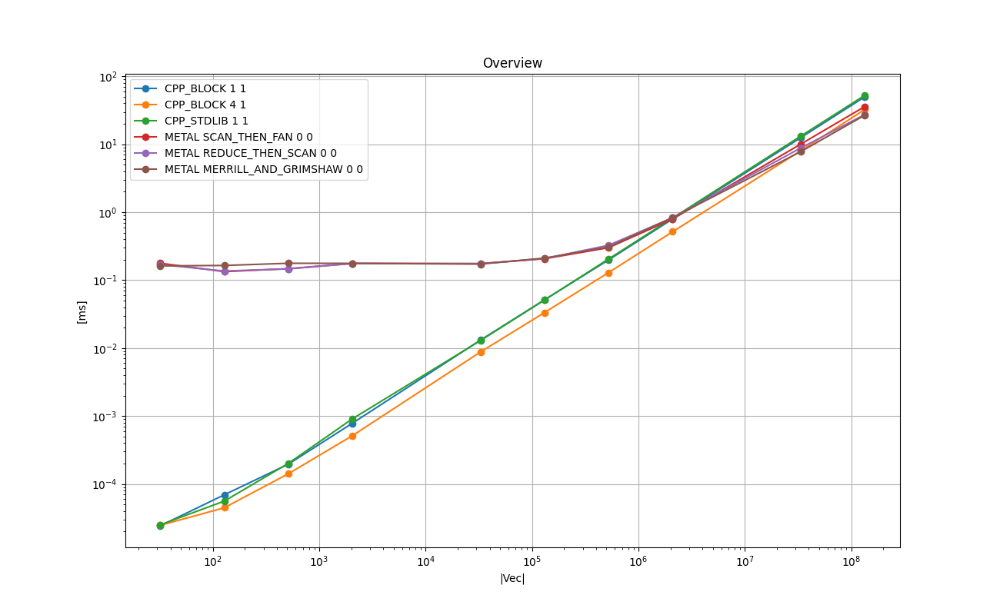
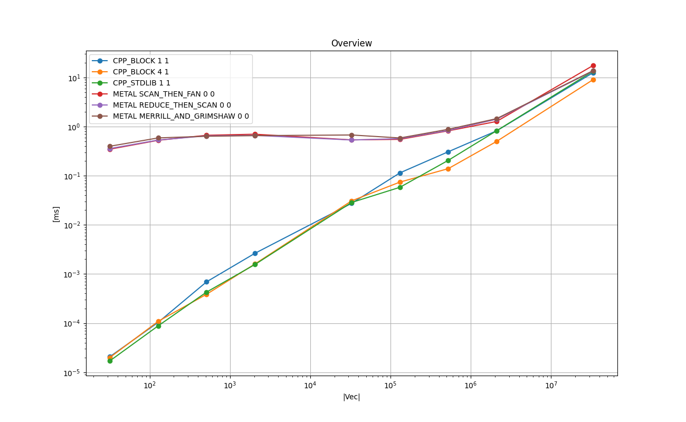

# Prefix-Scan (Prefix-Sum)
**Prefix-Scan** is the following operation to calculate the accumulated partial sums (or any associative operator).
Let *X* and **Y** be vectors of length *K*. X is the input and *Y* is the output.
Each element of *Y* is calculated as follows:
```
   Y_0 = X_i
   Y_i = SUM_{k = 1...i} X_k
       = Y_{i-1} + X_i
```
As shown above, the element *Y_i* depends on the previous elements.
The type of elements are usually integer, as it is mostly used for indexing or sorting.
There are two types of prefix-scan: *inclusive* and *exclusive*. The operation above is the inclusive scan.

## 0. Instruction for iOS
So far this has been tested on iPhone 13 mini 256GB.

- Open `AppleNumericalComputing/iOSTester_04/iOSTester_04.xcodeproj` with Xcode

- Build a release build

- Run the iOS App in release build

- Press 'Run' on the screen

- Wait until App finished with 'finished!' on the log output.

- Copy and paste the log into `04_prefix_sum/doc_ios/make_log.txt`.

- Run the following in the terminal.
```
$ cd 04_prefix_sum
$ grep '\(^INT\|^FLOAT\|^DOUBLE\|data element type\)' doc_ios/make_log.txt > doc_ios/make_log_cleaned.txt
$ python ../common/process_log.py -logfile doc_ios/make_log_cleaned.txt -specfile doc_ios/plot_spec.json -show_impl -plot_charts -base_dir doc_ios/
```
- You will get the PNG files in  `04_prefix_sum/doc_ios/`.


# 1. Key Points

* Three main algorithms described in CUDA Handbook implemented on Metal.

* For Metal, Reduce-then-scan has a slight advantage.

* For CPU the C++ implementation with the explicit loop unrolling runs faster than `std::inclusive_scan()` by approximately 30%.

# 2. Background and Context

Prefix-Scan, or Prefix-Sum is a low level algorithm studied in parallel computing.
This is an important building block in GPGPU programming, from which many important algorithms such radix sort are derived.
Please refer to https://en.wikipedia.org/wiki/Prefix_sum for the formal definition.

In this section we mainly explore the multiple implementations of Prefix-scan according to *Chapter 13 Scan* of The [CUDA Handbook](http://www.cudahandbook.com/).
There are mainly 3 types of implementation.

* **Scan-then-fan** (recursive)

* **Reduce-then-scan** (recursive)

* **Merrill-Grimshaw** (2-pass)

The *scan-then-fan* and *reduce-then-scan* are recursive algorithms, while *Merrill-Grimshaw* is a two-pass algorithm.
The difference between *scan-then-fan* and *reduce-then-scan* is in the timing of the reduce operations to find the narrow-phase partial sums.
In scan-then-fan, the narrow-phase partial sums within each thread-group are calculated first, then the base addendum for each thread-group is
calculated using a reduction.
In *reduce-then-scan*, the base addendum for each thread-group is calculated and then the final narrow-phase partial sums
are calculated together with the addendum, therefore, *reduce-then-scan*'s writing operations are almost as half as *scan-then-fan*s.

*Merrill-Grimshaw* is similar to *reduce-then-scan* but the recursion is limited to 2-level. It also uses a small intermediate memory to store the broad-phase partial sums.

# 3. Purpose
The main purpose is to study how the 3 types of algorithms perform on Metal.
Also another purpose is to study the running times on the CPU implementations in comparison to `std::inclusive_scan()`.
Since the application of Prefix-sum is mainly indexing and sorting, the study was conducted only for *int*.

# 4. Findings in Metal Implementations

## 4.1. Multiple Thread-Group Function Parameters Can Not Be Used for Metal Kernels

Apparently multiple **threadgroup variables** can not be declared in the function parameters for a shader function as follows:
```
kernel func(
    ...
    threadgroup  int* buf1 [[ threadgroup(0) ]],
    threadgroup  int* buf2 [[ threadgroup(1) ]],
    ...
{
   // buf1 and buf2 are inconsistent even within the threadgroup.
   ...
}
```
Otherwise, the memory sync on those buffers between thread 0 and 1023 will not work even in the same thread-group.
The thread-group variables must be declared as local variables in the body of the function.
This applies to at least Mac mini M1 (2020) with 8GB and Apple clang version 13.0.0 (clang-1300.0.29.3).
As long as [Metal Shading Language Specification Version 2.4](https://developer.apple.com/metal/Metal-Shading-Language-Specification.pdf)
 is concerned, there is no such description found.


# 5. Results on Running Time

The following experiments are done with [test_prefix_sum.cpp](./test_prefix_sum.cpp) in this directory.

Compiler: Apple clang version 13.0.0 (clang-1300.0.29.3) Target: arm64-apple-darwin20.6.0 Thread model: posix

Device: Mac mini (M1, 2020) Chip Apple M1, Memory 8GB, macOS Big Sur Version 11.6

Please type `make all` in this directory to reproduce the results.


## 5.1. Overview
The following chart shows the mean running times taken to perform one perfix-scan in *int* for each implementation in log-log scale.
X-axis is the size of the input array, and Y-axis is the time taken in milliseconds.

### Legend

* **CPP_BLOCK 1 1** - C++ implementation with a simple loop. - baseline

* **CPP_BLOCK 4 1** - C++ implementation with loop unrolling of factor 4

* **CPP_STDLIB 1 1** - std::inclusive_scan()

* **METAL_SCAN_THEN_FAN 0 0** - Metal scan-then-fan algorithm

* **METAL_REDUCE_THEN_SCAN 0 0** - Metal reduce-then-scan algorithm

* **METAL_MERRILL_AND_GRIMSHAW 0 0** - Metal Merrill-Grimshaw algorithm

### Plots: Mac Mini M1 2020 8 GB
<a href="doc/INT_VECTOR_Overview.png"></a>

### Plots: iPhone 13 mini 256 GB
<a href="doc_ios/INT_VECTOR_Overview.png"></a>

### Remarks on Mac Mini
* On CPU, 'CPP_BLOCK 4 1', a C++ implementation with the loop unrolling of factor 4 runs approximately 30% faster than 'CPP_BLOCK 1 1' with no loop 
unrolling, and 'CPP_STDLIB 1 1' with `std::inclusive_scan()`.

* The overhead of launching the Metal kernels is amortized at around the problem size of 512K.

## 5.2. Comparison Among Metal Algorithms
The following chart shows the relative running times taken to perform one prefix-scan in *int* for 3 Metal implementations in log-lin scale.
X-axis is the size of the input array, and Y-axis is the relative running time of each implementation relative to 'METAL_SCAN_THEN_FAN 0 0',
which is fixed at 1.0.

### Legend

* **METAL_SCAN_THEN_FAN 0 0** - Metal scan-then-fan algorithm

* **METAL_REDUCE_THEN_SCAN 0 0** - Metal reduce-then-scan algorithm

* **METAL_MERRILL_AND_GRIMSHAW 0 0** - Metal Merrill-Grimshaw algorithm

### Plots: Mac Mini M1 2020 8 GB
<a href="doc/INT_VECTOR_Comparison_Among_GPU_Implementations_relative.png"></a>

### Plots: iPhone 13 mini 256 GB
<a href="doc_ios/INT_VECTOR_Comparison_Among_GPU_Implementations_relative.png"></a>

### Remarks on Mac Mini
There is no clear winner, but it seems 'METAL_REDUCE_THEN_SCAN 0 0' performs best as expected.


## 5.3. Comparison Among CPU Implementations
The following chart shows the relative running times taken to perform one prefix-scan in *int* for 4 CPU implementations in log-lin scale.
X-axis is the size of the input array, and Y-axis is the relative running time of each implementation relative to 'CPP_BLOCK 1 1',
which is fixed at 1.0.

### Legend

* **CPP_BLOCK 1 1** - C++ implementation with a simple loop. - baseline

* **CPP_BLOCK 2 1** - C++ implementation with loop unrolling of factor 2

* **CPP_BLOCK 4 1** - C++ implementation with loop unrolling of factor 4

* **CPP_BLOCK 8 1** - C++ implementation with loop unrolling of factor 8

* **CPP_STDLIB 1 1** - std::inclusive_scan()

### Plots: Mac Mini M1 2020 8 GB
<a href="doc/INT_VECTOR_Comparison_Among_CPU_Implementations_relative.png"></a>

### Plots: iPhone 13 mini 256 GB
<a href="doc_ios/INT_VECTOR_Comparison_Among_CPU_Implementations_relative.png"></a>

### Remarks on Mac Mini
The explicit loop unrolling improves the performance, and the factor of 4 seems to be the sweet spot for Mac Mini 2020.


# 6. Implementations
This section briefly describes each of the implementations tested with some key points in the code.
Those are executed as part of the test program in [test_prefix_sum.cpp](./test_prefix_sum.cpp).
The top-level object in the 'main()' function is **TestExecutorPrefixSum**, which is a subclass of **TestExecutor found**
in [../common/test_case_with_time_measurements.h](../common/test_case_with_time_measurements.h).
It manages one single test suite, which consists of test cases.
It arranges the input data, allocates memory, executes each test case multiple times and measures the running times, cleans up, and reports the results.
Each implementation type is implemented as a **TestCasePrefixSum**, which is a subclass of **TestCaseWithTimeMeasurements**
in [../common/test_case_with_time_measurements.h](../common/test_case_with_time_measurements.h).
The main part is implemented in **TestCaseDOT::run()**, and it is the subject for the running time measurements.


## 6.1. CPP BLOCK 1 1
[**class TestCasePrefixSum_baseline** in test_prefix_sum.cpp](./test_prefix_sum.cpp)

This is a simple C++ implementation.
```
    void run() {

        if ( m_factor_loop_unrolling == 1 ) {

            T sum = 0;
            for ( size_t i = 0; i < this->m_num_elements ; i++ ) {

                this->m_out[i] = this->m_in[i] + sum ;
                sum = this->m_out[i];
            }
       }
        ...
    }
```

## 6.2. CPP BLOCK Y 1
[**class TestCasePrefixSum_baseline** in test_prefix_sum.cpp](./test_prefix_sum.cpp)

This is a C++ implementation with the explicit loop unrolling as follows.
This is part of `TestCasePrefixSum_baseline::run()`.
```
    else if ( m_factor_loop_unrolling == 2 ) {

        T sum = 0;
        for ( size_t i = 0; i < this->m_num_elements ; i+= 2 ) {

            this->m_out[i  ] = this->m_in[i] + sum ;
            this->m_out[i+1] = this->m_in[i] + this->m_in[i+1] + sum ;

            sum = this->m_out[i+1];
        }
    }
    else if ( m_factor_loop_unrolling == 4 ) {

        T sum = 0;
        for ( size_t i = 0; i < this->m_num_elements ; i+= 4 ) {

            this->m_out[i  ] = this->m_in[i] + sum ;
            this->m_out[i+1] = this->m_in[i] + this->m_in[i+1] + sum ;
            this->m_out[i+2] = this->m_in[i] + this->m_in[i+1] + this->m_in[i+2] + sum ;
            this->m_out[i+3] = this->m_in[i] + this->m_in[i+1] + this->m_in[i+2] + this->m_in[i+3] + sum ;

            sum = this->m_out[i+3];
        }
    }
    else if ( m_factor_loop_unrolling == 8 ) {

        T sum = 0;
        for ( size_t i = 0; i < this->m_num_elements ; i+= 8 ) {

            this->m_out[i  ] = this->m_in[i] + sum ;
            this->m_out[i+1] = this->m_in[i] + this->m_in[i+1] + sum ;
            this->m_out[i+2] = this->m_in[i] + this->m_in[i+1] + this->m_in[i+2] + sum ;
            this->m_out[i+3] = this->m_in[i] + this->m_in[i+1] + this->m_in[i+2] + this->m_in[i+3] + sum ;
            this->m_out[i+4] = this->m_in[i] + this->m_in[i+1] + this->m_in[i+2] + this->m_in[i+3]
                                + this->m_in[i+4] + sum ;

            this->m_out[i+5] = this->m_in[i] + this->m_in[i+1] + this->m_in[i+2] + this->m_in[i+3]
                                + this->m_in[i+4] + this->m_in[i+5] + sum ;

            this->m_out[i+6] = this->m_in[i] + this->m_in[i+1] + this->m_in[i+2] + this->m_in[i+3]
                                + this->m_in[i+4] + this->m_in[i+5] + this->m_in[i+6] + sum ;

            this->m_out[i+7] = this->m_in[i] + this->m_in[i+1] + this->m_in[i+2] + this->m_in[i+3]
                                + this->m_in[i+4] + this->m_in[i+5] + this->m_in[i+6] + this->m_in[i+7] + sum ;

            sum = this->m_out[i+7];
        }
    }
```

## 6.3. CPP_STDLIB 1 1
[**class TestCasePrefixSum_stdcpp** in test_prefix_sum.cpp](./test_prefix_sum.cpp)

This implementation uses two `std::vectors`, and `std::inclusive_scan()`, which is available as of *C++17*.

```
    vector<T> m_in_vector;
    vector<T> m_out_vector;
...
    virtual void run() {
        std::inclusive_scan( m_in_vector.begin(), m_in_vector.end(), m_out_vector.begin() );
    }
```

## 6.4. METAL_SCAN_THEN_FAN 0 0 - Metal *scan-then-fan* algorithm
[**class TestCasePrefixSum_Metal** in test_prefix_sum.cpp](./test_prefix_sum.cpp)

Please see *13.4.1. Scan-then-fan* of the [CUDA Handbook](http://www.cudahandbook.com/) for algorithm details.

The original algorithms is recursive, but in this implementation the recursion is limited to 3.
Hence, the maximum problem size is limited to 1G elements. In reality it is impossible to allocate that amount of consecutive memory on Mac Mini with 8GB memory.
The kernel launch sequence depends on the problem size N and it is shown below.
Please see [metal/prefix_sum_metal_objc_recursive.mm](./metal/prefix_sum_metal_objc_recursive.mm) for details.

* 0 < N <= 1K

    1. scan_threadgroupwise_intermediate_32_32

* 1K < N <= 1M

   1. scan_threadgroupwise_intermediate_32_32

   2. scan_threadgroupwise_intermediate_32_32

   3. add_base_32_32


* 1M < N <= 1G

   1. scan_threadgroupwise_intermediate_32_32

   2. scan_threadgroupwise_intermediate_32_32

   3. scan_threadgroupwise_intermediate_32_32

   4. add_base_32_32

   5. add_base_32_32

Those kernels use `simd_shuffle_up()` and `simd_sum()` wherever applicable for efficiency.
Please see [metal/prefix_sum_recursive.metal](./metal/prefix_sum_recursive.metal) for details.


## 6.5. METAL_REDUCE_THEN_SCAN 0 0 - Metal *reduce-then-scan* algorithm
[**class TestCasePrefixSum_Metal** in test_prefix_sum.cpp](./test_prefix_sum.cpp)

Please see *13.4.2. Reduce-then_scan [Recursive]* of the [CUDA Handbook](http://www.cudahandbook.com/) for algorithm details.

The original algorithms is recursive, but in this implementation the recursion is limited to 3.
Hence, the maximum problem size is limited to 1G elements. In reality it is impossible to allocate that amount of consecutive memory on Mac Mini with 8GB memory.
The kernel launch sequence depends on the problem size N and it is shown below.
Please see [metal/prefix_sum_metal_objc_recursive.mm](./metal/prefix_sum_metal_objc_recursive.mm) for details.

* 0 < N <= 1K

    1. scan_threadgroupwise_intermediate_32_32

* 1K < N <= 1M

    1. sum_threadgroup_32_32

    2. scan_threadgroupwise_intermediate_32_32

    3. scan_with_base_threadgroupwise_32_32


* 1M < N <= 1G

    1. sum_threadgroup_32_32

    2. sum_threadgroup_32_32

    3. scan_threadgroupwise_intermediate_32_32

    4. scan_with_base_threadgroupwise_32_32

    5. scan_with_base_threadgroupw

Those kernels use `simd_shuffle_up()` and `simd_sum()` wherever applicable for efficiency.
Please see [metal/prefix_sum_recursive.metal](./metal/prefix_sum_recursive.metal) for details.


## 6.6. Metal Merrill-Grimshaw
[**class TestCasePrefixSum_Metal** in test_prefix_sum.cpp](./test_prefix_sum.cpp)

Please see https://libraopen.lib.virginia.edu/downloads/6t053g00z for algorithm details.

Please see *13.4.3. Reduce-then-scan [Two Pass]* of the [CUDA Handbook](http://www.cudahandbook.com/) for algorithm details.

The kernel launch sequence is as follows:

    1. get_partial_sums_32_32

    2. scan_threadgroupwise_32_32

    3. scan_final_32_32

Please see [metal/prefix_sum_metal_objc_merrill_grimshaw.mm](./metal/prefix_sum_metal_objc_merrill_grimshaw.mm) for the preparation and launch sequence,
and [metal/prefix_sum_merrill_grimshaw.metal ](./metal/prefix_sum_merrill_grimshaw.metal ) for kernel code details.

# 7. References

* [CUDA Handbook](http://www.cudahandbook.com/) The CUDA Handbook by Nicholas Wilt

* [Metal Shading Language Specification Version 2.4](https://developer.apple.com/metal/Metal-Shading-Language-Specification.pdf)
