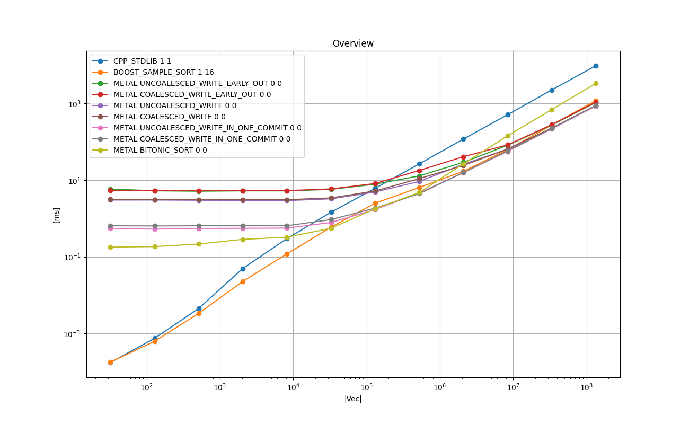
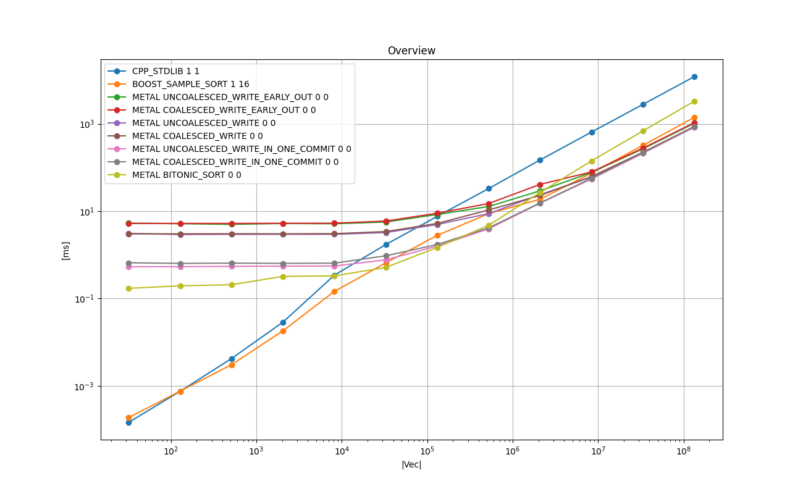
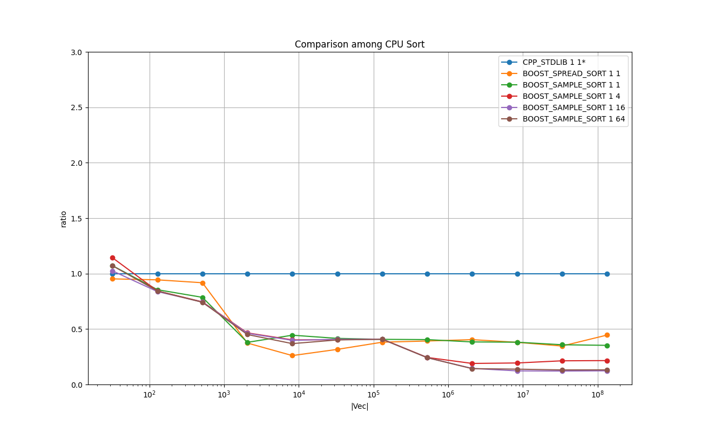
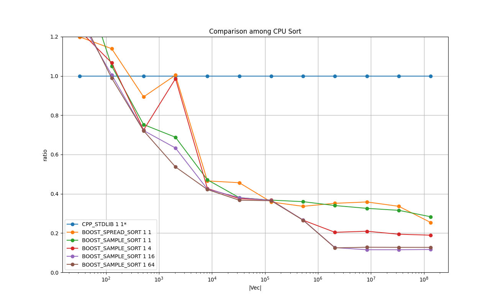
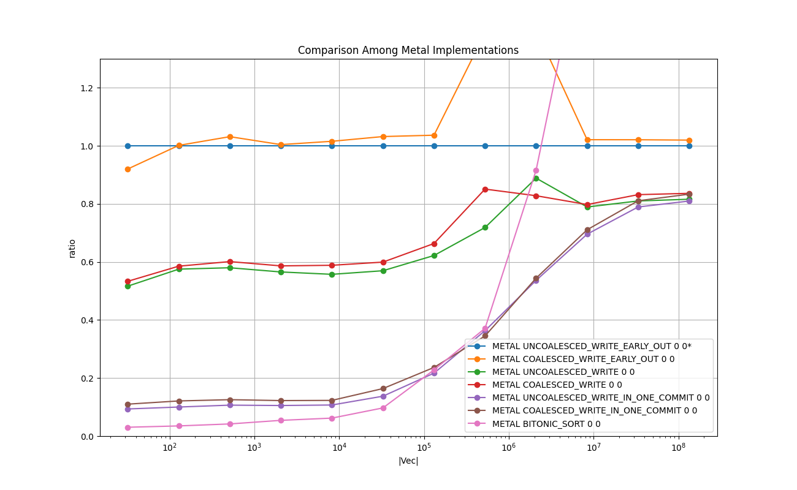
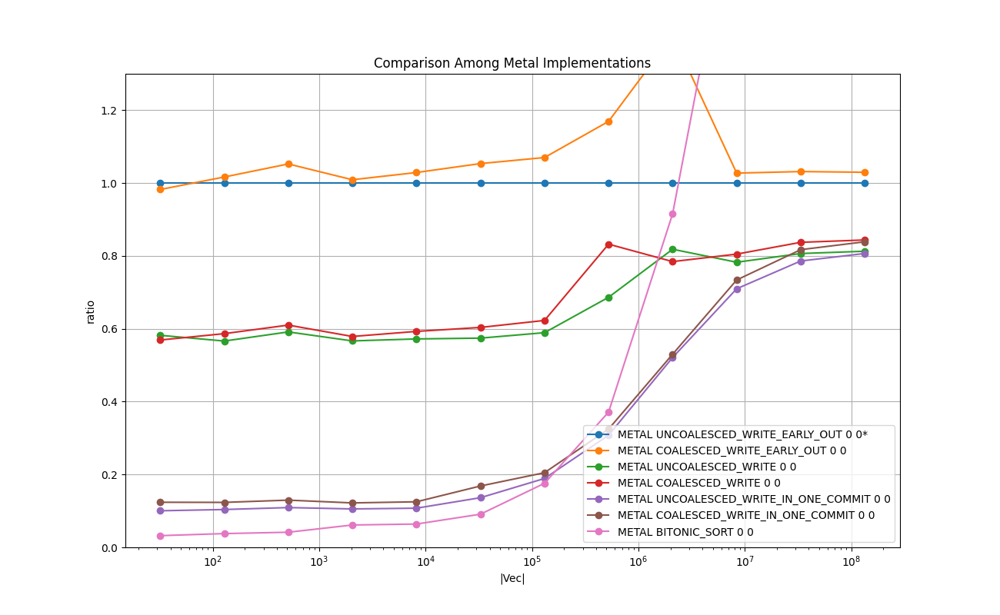

# Numerical Sort in Int and Float
Radix sort in Metal as an application of prefix-scan compared with `std::sort`, `boost::sort::spreadsort`,
and `boost::sort::block_indirect_sort`.

# 1. Key Points

* Probably the Metal implementation is one of the fastest sorting algorithms for *int* and *float* on Apple M1 for the problems with size 8M and larger.

* Probably the only implementation of the radix sort [[HKS 09]](https://onlinelibrary.wiley.com/doi/10.1111/j.1467-8659.2009.01542.x) for Metal publicly available.

* Boost's sample sort with 16 threads shows best overall performance for the problems with size less than 8M.

* On Metal, uncoalesced memory write does not have as much negative impact as on CUDA.

* On Metal, adding the early-out detection mechanism increases the overall time by 50-100%. It may be worth activating it, if the array is almost sorted and 
the loop outmost loop that runs from LSB to MSB can finish before 50% of the iteration.


# 2. Background and Context
Radix sort and Bitonic sort are two sorting algorithms implemented in GPGPU as an application of Prefix-scan.
As far as I know, there is no other Metal implementation of Radix sort.


# 3. Purpose
The purpose is to implement one of the best GPGPU radix sort algorithms [HKS 09] on Metal, and measure the performance 
against the popular implementations on CPU. Since [HKS 09] is designed for CUDA, some modification had to be made to adapt to Metal.

Another purpose is to study the effect of non-coalesced writes to the device memory.
The algorithm writes frequently to the output device memory,
and [HKS 09] has a subroutine called *Algorithm 4 Coalesced block mapping for the n chunk input* to make the writes coalesced.
A similar routine in the same spirit has been implemented to Metal, which can be either turned on or off to measure the effect of coalescing.

The Metal implementations are compared against the following 3 CPU implementations:

* baseline (c++ std::sort())

* boost spread_sort

* boost sample_sort

# 4. Results on Running Time
The following experiments are done with [test_radix_sort.cpp](test_radix_sort.cpp) in this directory.

Compiler: Apple clang version 13.0.0 (clang-1300.0.29.3) Target: arm64-apple-darwin20.6.0 Thread model: posix

Device: Mac mini (M1, 2020) Chip Apple M1, Memory 8GB, macOS Big Sur Version 11.6

Please type `make all` in this directory to reproduce the results.


## 4.1. Overview : Int
The following chart shows the mean running times taken to perform one sort in *int* for each implementation in log-log scale.
X-axis is the size of the input array, and Y-axis is the time taken in milliseconds.

### Legend

* **CPP_STDLIB 1 1** : std::sort() - baseline

* **BOOST_SAMPLE_SORT 1 16** : boost::sort::block_indirect_sort() with 16 threads

* **METAL_UNCOALESCED_WRITE_EARLY_OUT 0 0** : Metal [HKS 09] with early-out & without coalesced write

* **METAL_COALESCED_WRITE_EARLY_OUT 0 0** : Metal [HKS 09] with early-out & with coalesced write

* **METAL_UNCOALESCED_WRITE 0 0** : Metal [HKS 09] without early-out & without coalesced write

* **METAL_COALESCED_WRITE 0 0** : Metal [HKS 09] without early-out & with coalesced write

<a href="doc/INT_VECTOR_Overview.png"></a>

### Remarks

* BOOST_SAMPLE_SORT 1 16 shows the best running time for the problems of size less than 8M.

* METAL without the early-out overhead shows the best running time for 8M and larger.

## 4.2. Overview : Float
The following chart shows the mean running times taken to perform one sort in *float* for each implementation in log-log scale.
X-axis is the size of the input array, and Y-axis is the time taken in milliseconds.

### Legend


* **CPP_STDLIB 1 1** : std::sort() - baseline

* **BOOST_SAMPLE_SORT 1 16** : boost::sort::block_indirect_sort() with 16 threads

* **METAL_UNCOALESCED_WRITE_EARLY_OUT 0 0** : Metal [HKS 09] with early-out & without coalesced write

* **METAL_COALESCED_WRITE_EARLY_OUT 0 0** : Metal [HKS 09] with early-out & with coalesced write

* **METAL_UNCOALESCED_WRITE 0 0** : Metal [HKS 09] without early-out & without coalesced write

* **METAL_COALESCED_WRITE 0 0** : Metal [HKS 09] without early-out & with coalesced write

<a href="doc/FLOAT_VECTOR_Overview.png"></a>

### Remarks

* BOOST_SAMPLE_SORT 1 16 shows the best running time for the problems of size less than 8M.

* METAL without the early-out overhead shows the best running time for 8M and larger.


## 4.3. Comparison Among CPU implementations : Int
The following chart shows the relative running times taken to perform one sort in *int* for the CPU implementations in log-lin scale.
X-axis is the size of the input array, and Y-axis is the relative running time of each implementation relative to 'CPP_STDLIB 1 1', which is fixed at 1.0.

### Legend

* **CPP_STDLIB 1 1** : `std::sort()` - baseline

* **BOOST_SPREAD_SORT 1 1** : `boost::sort::spreadsort`

* **BOOST_SAMPLE_SORT 1 1** : `boost::sort::block_indirect_sort()` with 1 thread

* **BOOST_SAMPLE_SORT 1 4** : `boost::sort::block_indirect_sort()` with 4 threads

* **BOOST_SAMPLE_SORT 1 16** : `boost::sort::block_indirect_sort()` with 16 threads

* **BOOST_SAMPLE_SORT 1 64** : `boost::sort::block_indirect_sort()` with 64 threads

<a href="doc/INT_VECTOR_Comparison_among_CPU_Sort_relative.png"></a>

### Remarks
The `std::sort()` runs fastest for small sizes around 32 elements in the array.
For the problems with size from 512 up to 128K, `boost::sort::block_indirect_sort()` with 1 thread shows the best running time, and it may not worth multiple threads.
For the problems with size greater than 128K, `boost::sort::block_indirect_sort()` with 16 thread gives the best performance.

## 4.4. Comparison Among CPU implementations : Float
The following chart shows the relative running times taken to perform one sort in *float* for the CPU implementations in log-lin scale.
X-axis is the size of the input array, and Y-axis is the relative running time of each implementation relative to 'CPP_STDLIB 1 1', which is fixed at 1.0.

### Legend

* **CPP_STDLIB 1 1** : `std::sort()` - baseline

* **BOOST_SPREAD_SORT 1 1** : `boost::sort::spreadsort`

* **BOOST_SAMPLE_SORT 1 1** : `boost::sort::block_indirect_sort()` with 1 thread

* **BOOST_SAMPLE_SORT 1 4** : `boost::sort::block_indirect_sort()` with 4 threads

* **BOOST_SAMPLE_SORT 1 16** : `boost::sort::block_indirect_sort()` with 16 threads

* **BOOST_SAMPLE_SORT 1 64** : `boost::sort::block_indirect_sort()` with 64 threads

<a href="doc/FLOAT_VECTOR_Comparison_among_CPU_Sort_relative.png"></a>

### Remarks
For the problems with size up to 128K, `boost::sort::block_indirect_sort()` with 1 thread shows the best running time, and it may not worth multiple threads.
For the problems with size greater than 128K, `boost::sort::block_indirect_sort()` with 16 thread gives the best performance.

## 4.5. Comparison Among Metal Implementations
The following chart shows the relative running times taken to perform one sort in *int* and *float* for 4 Metal implementations in log-lin scale.
X-axis is the size of the input array, and Y-axis is the relative running time of each implementation relative to 'METAL UNCOALESCED_WRITE_EARLY_OUT 0 0', which is fixed at 1.0.

### Legend

* **METAL UNCOALESCED_WRITE_EARLY_OUT 0 0** : with uncoalesced writes and with an extra step for early-out.
* **METAL COALESCED_WRITE_EARLY_OUT 0 0** :  with coalesced writes and with an extra step for early-out.
* **METAL UNCOALESCED_WRITE 0 0** : with uncoalesced writes and without an extra step for early-out.
* **METAL COALESCED_WRITE 0 0** :  with coalesced writes and without an extra step for early-out.

<a href="doc/INT_VECTOR_Comparison_Among_Metal_Implementations_relative.png"></a>

<a href="doc/FLOAT_VECTOR_Comparison_Among_Metal_Implementations_relative.png"></a>

### Remarks
Here we study the two aspects in the Metal implementations:
* The effect of the coalesced and uncoalesced writes to the device memory.
* The effect of the overhead of the extra check if the array is already sorted to enable an early break from the loop.

The overhead of uncoalesced writes is negligible, but the overhead of extra check for early-out is 25-70%,
and it should be used only if the array is almost sorted, in the sense that the maximum distance the elements travel to get them sorted is less than 25% of the total length.

### Effect of Coalesced and Uncoalesced Stores to the Device Memory.

The chart also shows that there is no significant disadvantage in uncoalesced write to the device memory.
The implementations with the coalesced memory arrange the elements to write coalesced using an intermediate threadgroup memory to align the write to the device memory.
See `coalesced_block_mapping_for_the_n_chunk_input()` in [metal/radix_sort.metal](metal/radix_sort.metal).
It uses the following threadgroup memory.

```
    threadgroup int copy_src_array[1024];
```

and the following part handles the coalesced writes (for int) to the device memory `target_array` using the threadgroup memory above.
```
    if ( thread_position_in_grid < constants.total_num_elements ) {

        copy_src_array[ thread_position_in_threadgroup ] = src_array_sorted_within_threadgroups[ thread_position_in_grid ];
    }

    threadgroup_barrier( mem_flags::mem_threadgroup );

    if ( constants.bit_right_shift == 30 && constants.for_float ) {

        const int lane2_start_dst =   partial_sums_per_threadgroup_lane0[ threadgroups_per_grid - 1 ]
                                    + partial_sums_per_threadgroup_lane1[ threadgroups_per_grid - 1 ];

        // Should unroll manually if the compiler doesn't?
        for ( int lane = 0; lane < 2 ; lane++ ) {

            const int _lane_start_dst = lane2_start_dst - lane_start_dst[lane] - 1;

            const int simd_group_align_offset = _lane_start_dst % 32;
            const int index_src = ( thread_position_in_threadgroup + simd_group_align_offset ) % 1024;

            const bool valid_src =    ( threadgroup_position_in_grid < (threadgroups_per_grid - 1)  )
                                   || ( index_src < (int)(constants.total_num_elements % 1024) )
                                   || ( (constants.total_num_elements % 1024) == 0 )
                               ;
            if ( valid_src ) {

                const int value_src  = copy_src_array[ index_src ];

                const int lane_src   = calc_lane( value_src, constants );
    
                if ( lane_src == lane ) {

                    const int lane_begin = lane_start_src_in_threadgroup[ lane     ];

                    const int lane_end   = lane_start_src_in_threadgroup[ lane + 1 ];

                    if ( lane_begin <= index_src && index_src < lane_end ) {

                        const int offset_from_lane_start = index_src - lane_begin;

                        target_array [ _lane_start_dst - offset_from_lane_start ]  = value_src;
                    }
                }
            }
        }
    }
```
In contrast to the coalesced writes, the uncoalesced version uses the function
`uncoalesced_block_mapping_for_the_n_chunk_input()` in [metal/radix_sort.metal](metal/radix_sort.metal).
The following is an excerpt from the function, where the uncoalesced write to target_array is performed.

```
    if ( constants.bit_right_shift == 30 && constants.for_float && lane < 2 ) {

        const int lane2_start_dst =   partial_sums_per_threadgroup_lane0[ threadgroups_per_grid - 1 ]
                                    + partial_sums_per_threadgroup_lane1[ threadgroups_per_grid - 1 ];

        const int _lane_start_dst = lane2_start_dst - lane_start_dst[lane] - 1;

        target_array[ _lane_start_dst - src_offset ] = src_array_sorted_within_threadgroups[ thread_position_in_grid ];
    }
    else {
        target_array[ lane_start_dst[lane] + src_offset ] = src_array_sorted_within_threadgroups[ thread_position_in_grid ];
    }
```

Unlinke CUDA, especially the early versions of CUDA devices, there is no significant overhead for uncoalesced writes.


#### The Overhead of the Early-Out
This is the extra check if the array is already sorted to enable an early break from the loop.
The radix sort iterates through a loop from the least significant bit, or LSB to the most significant bit, or MSB.
The sizes of *int* and *float* are 32 bits, and the radix sort of radix 4 iterates the loop body for 8 times.
If the upper bits of all the elements are already sorted, say if the upper 16-bites are already sorted, then the
array will become sorted halfway through the loop.

[HKS 09] proposes a use of reduction-based algorithm in *Algorithm 3 Parallel order checking*.
'METAL UNCOALESCED_WRITE_EARLY_OUT' has a similar reduction-based algorithm utilizing `simd_shuffle_up()` and `simd_sum()`.
Please see `is_sorted_within_threadgroups()` and `are_all_less_than_equal()` in 
[metal/parallel_order_checking.metal](metal/parallel_order_checking.metal).

As the chart shows, the overhead of the extra check is around 70% for the problems with size less than 1M, and 25% for greater than 1M.
It implies that the early-out must occur approximately before the 4th and 6th iteration respectively.


# 5. Implementations
This section briefly describes each of the implementations tested with some key points in the code.
Those are executed as part of the test program in [test_radix_sort.cpp](test_radix_sort.cpp).
The top-level object in the 'main()' function is **TestExecutorRadixSort**, which is a subclass of **TestExecutor found** 
in [../common/test_case_with_time_measurements.h](../common/test_case_with_time_measurements.h).
It manages one single test suite, which consists of test cases.
It arranges the input data, allocates memory, executes each test case multiple times and measures the running times, cleans up, and reports the results.
Each implementation type is implemented as a **TestCaseRadixSort**, which is a subclass of **TestCaseWithTimeMeasurements** 
in [../common/test_case_with_time_measurements.h](../common/test_case_with_time_measurements.h).
The main part is implemented in **TestCaseRadixSort::run()**, and it is the subject for the running time measurements.

## 5.1. CPP_STDLIB 1 1 - baseline (std::sort())
[**class TestCaseRadixSort_baseline** in test_radix_sort.cpp](test_radix_sort.cpp)

```
std::sort( this->m_array, this->m_array + this->m_num_elements );
```

## 5.2. BOOST_SPREAD_SORT 1 1 - boost::spread_sort
[**class TestCaseRadixSort_boost_spread_sort** in test_radix_sort.cpp](test_radix_sort.cpp)

### Int
```
boost::sort::spreadsort::integer_sort( array, array + N );
```

### Float
```
boost::sort::spreadsort::float_sort ( array, array + N );
```

## 5.3. BOOST_SAMPLE_SORT 1 X
[**class TestCaseRadixSort_boost_sample_sort** in test_radix_sort.cpp](test_radix_sort.cpp)

```
boost::sort::block_indirect_sort( array, array + N , X );
```

## 5.4. METAL Implementations
[**class TestCaseRadixSort_Metal** in test_radix_sort.cpp](test_radix_sort.cpp)

The top-level routine of the radix sort is the following loop in [metal/radix_sort_metal_objc.mm](metal/radix_sort_metal_objc.mm).
It corresponds to *Algorithm 1 Four-way radix sorting* in [HKS 09].
```
- (void) performComputation
{
    for ( int i = 0; i < 16; i++ ) {

        _mResultOn1 = ( (i%2) == 0 ) ? false : true;

        if (_mEarlyOut) {

            if ( [ self isArraySorted ] ) {

                _mResultOn1 = ! _mResultOn1;

                // early out
                NSLog(@"Early out at %d.", i );
                return;
            }
        }
        [ self performComputationForOneShift: i*2 ];
    }
}

```
The main part of the loop body is the function  `performComputationForOneShift:(uint)shift`.
It launches the following two kernels:

- **four_way_prefix_sum_with_inblock_shuffle()** in [metal/radix_sort.metal](metal/radix_sort.metal).
This corresponds to *Algorithm 2 4-way prefix sum with in-block shuffle*

- **coalesced_block_mapping_for_the_n_chunk_input()** or **uncoalesced_block_mapping_for_the_n_chunk_input()**
 in [metal/radix_sort.metal](metal/radix_sort.metal).
This corresponds to *Algorithm 4 Coalesced block mapping for the n chunk input*

The early-out is performed in the function `isArraySorted:`, which uses two kernels
**is_sorted_within_threadgroups()** and **are_all_less_than_equal()** defined in [metal/parallel_order_checking.metal](metal/parallel_order_checking.metal).
It uses a similar technique with the log-step reduction described in *'Algorithm 5 Build 4 ways sum tree'* and *'Algorithm 6 Down-Sweep 4 ways'* in [HKS 09].

Please refer to the code in [metal/](metal/), and the literature [[HKS 09]](https://onlinelibrary.wiley.com/doi/10.1111/j.1467-8659.2009.01542.x) for details.

# 6. Reference:

* [HKS 09] Ha, L., Krüger, J., & Silva, C. T. (2009). Fast four-way parallel radix sorting on GPUs. Computer Graphics Forum, 28(8), 2368-2378. https://doi.org/10.1111/j.1467-8659.2009.01542.x