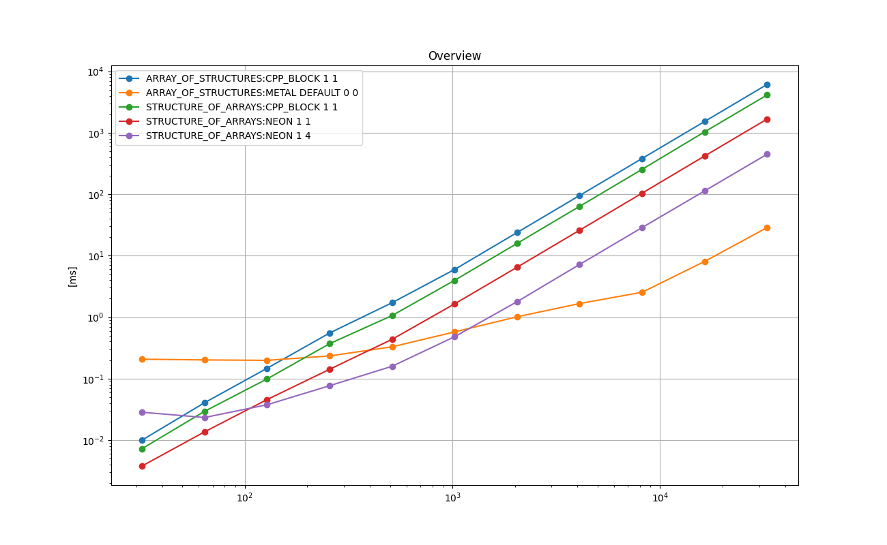
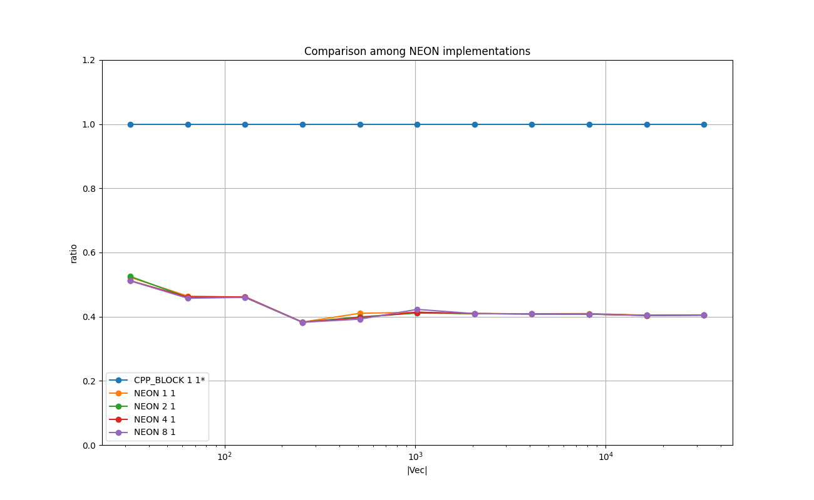
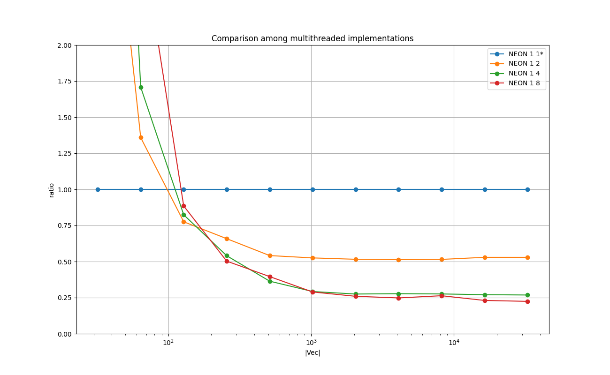

# N-BODY : NxN particle simulation
N-Body denotes a type of computation where each of N objects interacts with all the other N - 1 objects.
Therefore the complexity is in the order of O(N^2).


# 1. Key Points

* Comparable results to the CUDA counterparts observed on Metal.

  *'Body-Body  interactions per second'* is the unit to measure the real running time on a system 
  used throughout Chapter 14 of [CUDA Handbook](http://www.cudahandbook.com/).
  - **37.49** billion interactions per second observed on Metal on Mac Mini M1 2020. CUDA Handbook states **25-45.2** billion interactions per second on 4 GK104 GPUs @ 800MHz.
    This number on Metal accounts for the Euler integration step as well as the body-body acceleration accumulation, but it does not seem that the numbers in CUDA Handbook do not. It is unclear from the description and the code in the book.

  - **2.87** billion interactions per second observed with CPU on Mac Mini M1 2020. CUDA Handbook states **5.65** billion interactions per second on 2 E5-2670 CPUs @2.6GHz.
    This number on Metal accounts for the Euler integration step apart from the body-body acceleration accumulation.

* In Metal kernel, explicit loop unrolling does not improve the time.  Also, manually unrolling the loops with factor 4 or greater makes a runtime error

* With NEON intrinsics, explicit loop unrolling does not improve the running time.

* On GPU AOS (array of structures) is the common way to organize the particle data. On CPU SOA (structure of arrays) shows better performance in general apparantly due to cache locality. Also NEON SIMD can be applied to SOA.

* In the Metal shader kernels, the conditional parts (e.g. the bodies of if-else) should be reduced to improve the running time. Down to a conditional store operation if possible.


# 2. Background and Context

N-Body is known to be a type of problem suitable for GPU. The computation can be parallelizable over N outputs, and each body-body computation is complex enough to make
the whole problem less I/O-bound.
The formula for the body-body interaction is based on Coulomb's law described in 14.1 of CUDA Handbook.
Please see `TestCaseNBody_baselineSOA::bodyBodyInteraction()` in [test_nbody.cpp](./test_nbody.cpp).
After the body-body interactions accumulate all the accelerations (forces/mass) to each particle for the current time step, then a simple Euler integration step is performed to update the velocity and the position of each particle.

# 3. Purpose
The purpose is to measure the real running time of the Metal implementation as well as the CPU implementations
as to how many particles can be processed at the frame rates.


# 4. Problem Formulation

Following is the data structure of one particle for AOS (array of structures).
Please see [nbody_elements_impl.h](./nbody_elements_impl.h).
```
template<>
class NBodyElem<float> {

  public:
    simd_float3  m_p0 ;
    simd_float3  m_p1 ;
    simd_float3  m_v  ;
    simd_float4  m_am ; // xyz: accel, w: mass
};
```
The *m_p0*, *m_p1* represent the position alternatingly per time step, *m_v* the linear velocity, and *m_am.xyz* the acceleration, and *m_am.w* the mass. 
It has two positions that are updated alternatingly.
In the beginning of one step, m_am.xyz is set to 0, and accelerations are accumulated into it based on 
the interactions with the other N-1 particles as follows.
```
    virtual void inline bodyBodyInteraction_P0toP1( NBodyElem<T>& particle_i, const NBodyElem<T>& particle_j ) {

        const T dx = particle_j.m_p0.x - particle_i.m_p0.x;
        const T dy = particle_j.m_p0.y - particle_i.m_p0.y;
        const T dz = particle_j.m_p0.z - particle_i.m_p0.z;

        const T dist_sqr = dx*dx + dy*dy + dz*dz + this->EPSILON; 

        T inv_dist;

        // vDSP's rsqrt. No noticeable difference in speed.
        // const int num_1 = 1;
        //vvrsqrtf( &inv_dist, &dist_sqr, &num_1 ); 

        inv_dist = 1.0 / sqrtf( dist_sqr);

        const T inv_dist_cube = inv_dist * inv_dist * inv_dist;
        const T s = particle_j.m_am.w * inv_dist_cube;

        particle_i.m_am.x += (dx * s);
        particle_i.m_am.y += (dy * s);
        particle_i.m_am.z += (dz * s);
    }
```
After the accumulation of the acceleration, the velocity and the position are updated with a simple Euler step
as follows.
```
     for ( size_t i = 0; i < this->m_num_elements ; i++ ) {

         auto& particle_i = m_aos[i];

         particle_i.m_am.x = 0.0;
         particle_i.m_am.y = 0.0;
         particle_i.m_am.z = 0.0;

         for ( size_t j = 0; j < this->m_num_elements ; j ++ ) {

             const auto& particle_j = m_aos[j];

             bodyBodyInteraction_P0toP1( particle_i, particle_j );
         }

         particle_i.m_v.x += ( particle_i.m_am.x * particle_i.m_am.w * this->COEFF_G * this->m_delta_t );
         particle_i.m_v.y += ( particle_i.m_am.y * particle_i.m_am.w * this->COEFF_G * this->m_delta_t );
         particle_i.m_v.z += ( particle_i.m_am.z * particle_i.m_am.w * this->COEFF_G * this->m_delta_t );

         particle_i.m_p1.x = particle_i.m_p0.x + particle_i.m_v.x * this->m_delta_t;
         particle_i.m_p1.y = particle_i.m_p0.y + particle_i.m_v.y * this->m_delta_t;
         particle_i.m_p1.z = particle_i.m_p0.z + particle_i.m_v.z * this->m_delta_t;
     }
```
Please see `class TestCaseNBody_baselineAOS` in [test_nbody.cpp](./test_nbody.cpp) for details..

For the implementations with the data type SOA (structure of arrays), 
following data structure with 13 arrays is used.
```
template<class T>
class NBodySOA {

    size_t m_num_elements;
    bool   m_p0_is_active;

    T* m_p0x;
    T* m_p0y;
    T* m_p0z;

    T* m_p1x;
    T* m_p1y;
    T* m_p1z;

    T* m_vx;
    T* m_vy;
    T* m_vz;

    T* m_ax;
    T* m_ay;
    T* m_az;

    T* m_mass;
};
```
This type of data organization is suitable for NEON SIMD.
Please see [nbody_elements.h](./nbody_elements.h) for details.


# 5. Results on Running Time
The following experiments are done with [test_nbody.cpp](./test_nbody.cpp) in this directory.

Compiler: Apple clang version 13.0.0 (clang-1300.0.29.3) Target: arm64-apple-darwin20.6.0 Thread model: posix

Device: Mac mini (M1, 2020) Chip Apple M1, Memory 8GB, macOS Big Sur Version 11.6

Please type `make all` in this directory to reproduce the results.


## 5.1. Overview
The following chart shows the mean running times taken to perform one time step for N-body particle simulation in *float* for each implementation in log-log scale.
X-axis is the number of the bodies (particles), and Y-axis is the time taken in milliseconds.

### Legend

* **ARRAY_OF_STRUCTURES:CPP_BLOCK 1 1** : AOS simple C++ implementation in two nested loops - baseline
* **ARRAY_OF_STRUCTURES:METAL_DEFAULT 0 0** : AOS simple Metal implementation with a loop
* **STRUCTURE_OF_ARRAYS:CPP_BLOCK 1 1** : SOA simple C++ implementation in two nested loops
* **STRUCTURE_OF_ARRAYS:NEON 1 1** : SOA NEON intrinsics for body-body interactions
* **STRUCTURE_OF_ARRAYS:NEON 1 4** : SOA NEON intrinsics for body-body interactions with 4 threads

<a href="doc/FLOAT_ANY_Overview.png"></a>

### Remarks
* 'SOA:NEON 1 4' shows the best overall running time on CPU if N>=64, 'SOA:NEON 1 1' works best if N < 64.

* 'AOS:METAL DEFAULT 0 0' shows running time more than 10 times faster than the CPU versions if N >= 8K.

* For plain C++ implementations, it runs faster in STRUCTURE_OF_ARRAYS than ARRAY_OF_STRUCTURES.

* It seems it can handle 16K particles at frame rate (@60Hz) the N body physics update takes 8.05[ms], which gives the other process such as rendering enough time per frame.


## 5.2. Comparison Among SOA NEON Intrincis With Loop Unrolling
The following chart shows the relative running times taken to perform one time step for N-body particle simulation in *float* for the NEON implementations in log-lin scale.
X-axis is the size of the input array, and Y-axis is the relative running time of each implementation relative to 'CPP_BLOCK 1 1', which is fixed at 1.0.

### Legend

* **CPP_BLOCK 1 1** : SOA simple C++ implementation in two nested loops
* **NEON 1 1** : SOA NEON intrinsics for body-body interactions with no loop unrolling
* **NEON 2 1** : SOA NEON intrinsics for body-body interactions with the inner loop unrolled with factor 2
* **NEON 4 1** : SOA NEON intrinsics for body-body interactions with the inner loop unrolled with factor 4
* **NEON 8 1** : SOA NEON intrinsics for body-body interactions with the inner loop unrolled with factor 8


<a href="doc/FLOAT_STRUCTURE_OF_ARRAYS_Comparison_among_NEON_implementations_relative.png"></a>

### Remarks
Loop unrolling the NEON implementation does not improve the performance.
This indicates the body of the inner loop has enough arithmetic complexity to fill the instruction pipeline.

## 5.3. Comparison Among SOA NEON Intrinsics With Multithreading
The following chart shows the relative running times taken to perform one time step for N-body particle simulation in *float* for the NEON implementations with no loop unrolling in different number of threads in log-lin scale.
X-axis is the size of the input array, and Y-axis is the relative running time of each implementation relative to 'NEON 1 1', which is fixed at 1.0.

### Legend
* **NEON 1 1** : SOA NEON intrinsics for body-body interactions with no loop unrolling, single thread
* **NEON 1 2** : SOA NEON intrinsics for body-body interactions with no loop unrolling, with 2 threads
* **NEON 1 4** : SOA NEON intrinsics for body-body interactions with no loop unrolling, with 4 threads
* **NEON 1 8** : SOA NEON intrinsics for body-body interactions with no loop unrolling, with 8 threads

<a href="doc/FLOAT_STRUCTURE_OF_ARRAYS_Comparison_among_multithreaded_implementations_relative.png"></a>

### Remarks
The overhead of synchronizing the worker threads is amortized if N >= 256.
This suggests that N-body problem is parallelizable on CPU as well as on GPU.
The sweet spot seems to be the implementation with with 4 threads, which runs approximately 4 times fastere than the single thread version, which implies this problem can be parallelizable with little overhead.


# 6. Implementations
This section briefly describes each of the implementations tested with some key points in the code.
Those are executed as part of the test program in [test_nbody.cpp](./test_nbody.cpp).
The top-level object in the 'main()' function is **TestExecutorNBody**, which is a subclass of **TestExecutor found** in [here](../common/test_case_with_time_measurements.h).
It manages one single test suite, which consists of test cases.
It arranges the input data, allocates memory, executes each test case multiple times and measures the running times, cleans up, and reports the results.
Each implementation type is implemented as a **TestCaseNBody**, which is a subclass of **TestCaseWithTimeMeasurements** in [here](../common/test_case_with_time_measurements.h).
The main part is implemented in **TestCaseNBody::run()**, and it is the subject for the running time measurements.


## 6.1. SOA CPP_BLOCK 1 1
[class TestCaseNBody_baselineSOA](./test_nbody.cpp)

This is the baseline plain C++ implementation with SOA.

At each iteration the accelerations are reset to 0.
```
    memset( m_soa.m_ax, 0, sizeof(float)*this->m_num_elements ); 
    memset( m_soa.m_ay, 0, sizeof(float)*this->m_num_elements ); 
    memset( m_soa.m_az, 0, sizeof(float)*this->m_num_elements ); 
```
Then the accelerations are accumulated with the N-1 calls to `bodyBodyInteraction()`
and the velocity and the acceleration are updated with the Euler step.
```
    for ( size_t i = 0; i < this->m_num_elements ; i++ ) {

        for ( size_t j = 0; j < this->m_num_elements ; j++ ) {

            if ( i != j ) {
                bodyBodyInteraction(
                    m_soa.m_ax  [i  ], m_soa.m_ay [i  ], m_soa.m_az [i  ],
                    m_soa.m_p0x [i  ], m_soa.m_p0y[i  ], m_soa.m_p0z[i  ],
                    m_soa.m_p0x [j  ], m_soa.m_p0y[j  ], m_soa.m_p0z[j  ],
                    m_soa.m_mass[j  ], this->EPSILON                      );
            }
        }

        m_soa.m_vx[i]   += ( m_soa.m_ax[i] * m_soa.m_mass[i] * this->COEFF_G * this->m_delta_t );
        m_soa.m_vy[i]   += ( m_soa.m_ay[i] * m_soa.m_mass[i] * this->COEFF_G * this->m_delta_t );
        m_soa.m_vz[i]   += ( m_soa.m_az[i] * m_soa.m_mass[i] * this->COEFF_G * this->m_delta_t );

        m_soa.m_p1x[i] = m_soa.m_p0x[i] + m_soa.m_vx[i] * this->m_delta_t;
        m_soa.m_p1y[i] = m_soa.m_p0y[i] + m_soa.m_vy[i] * this->m_delta_t;
        m_soa.m_p1z[i] = m_soa.m_p0z[i] + m_soa.m_vz[i] * this->m_delta_t;
    }
```

## 6.2. AOS CPP_BLOCK 1 1
[class TestCaseNBody_baselineAOS](./test_nbody.cpp)

Following is the core part of the one time step.
For each body *i*, the acceleration is reset to 0, and the calls to `bodyBodyInteraction_P0toP1()`
accumulate the acceleration. And then velocity and the position are updated with the Euler step.
```
    for ( size_t i = 0; i < this->m_num_elements ; i++ ) {

        auto& particle_i = m_aos[i];

        particle_i.m_am.x = 0.0;
        particle_i.m_am.y = 0.0;
        particle_i.m_am.z = 0.0;

        for ( size_t j = 0; j < this->m_num_elements ; j ++ ) {
            if ( i != j ) {
                const auto& particle_j = m_aos[j];
                   
                bodyBodyInteraction_P0toP1( particle_i, particle_j );
            }
        }

        particle_i.m_v.x += ( particle_i.m_am.x * particle_i.m_am.w * this->COEFF_G * this->m_delta_t );
        particle_i.m_v.y += ( particle_i.m_am.y * particle_i.m_am.w * this->COEFF_G * this->m_delta_t );
        particle_i.m_v.z += ( particle_i.m_am.z * particle_i.m_am.w * this->COEFF_G * this->m_delta_t );

        particle_i.m_p1.x = particle_i.m_p0.x + particle_i.m_v.x * this->m_delta_t;
        particle_i.m_p1.y = particle_i.m_p0.y + particle_i.m_v.y * this->m_delta_t;
        particle_i.m_p1.z = particle_i.m_p0.z + particle_i.m_v.z * this->m_delta_t;
    }
```

## 6.3. SOA NEON X 1
[class TestCaseNBody_SOA_NEON](./test_nbody.cpp)

This is based on SOA CPP_BLOCK 1 1, and the body-body interaction is replaced with the following NEON version
where there is no overlap between *i* and *{j, j+1, j+2, j+3}*.
One call to `bodyBodyInteraction_neon()` accumulates accelerations from the interactions with 4 other bodies.

```
    virtual void inline bodyBodyInteraction_neon(

        T& a0x,       T& a0y,       T& a0z,
        const T p0x, const T p0y, const T p0z,
        const T* p1x, const T* p1y, const T* p1z,
        const T* mass1,
        const float32x4_t& qw_epsilon
    ) {
        const float32x4_t qw_p0x = { p0x, p0x, p0x, p0x };
        const float32x4_t qw_p0y = { p0y, p0y, p0y, p0y };
        const float32x4_t qw_p0z = { p0z, p0z, p0z, p0z };

        const float32x4_t qw_p1x = vld1q_f32( p1x );
        const float32x4_t qw_p1y = vld1q_f32( p1y );
        const float32x4_t qw_p1z = vld1q_f32( p1z );

        const float32x4_t qw_mass1 = vld1q_f32( mass1 );

        const float32x4_t qw_dx = vsubq_f32( qw_p1x, qw_p0x );
        const float32x4_t qw_dy = vsubq_f32( qw_p1y, qw_p0y );
        const float32x4_t qw_dz = vsubq_f32( qw_p1z, qw_p0z );

        const float32x4_t qw_dxdx = vmulq_f32( qw_dx, qw_dx );
        const float32x4_t qw_dydy = vmulq_f32( qw_dy, qw_dy );
        const float32x4_t qw_dzdz = vmulq_f32( qw_dz, qw_dz );

        const float32x4_t qw_subsum_1 = vaddq_f32( qw_dxdx, qw_dydy );
        const float32x4_t qw_subsum_2 = vaddq_f32( qw_dzdz, qw_epsilon );

        const float32x4_t qw_dist_sqr = vaddq_f32( qw_subsum_1, qw_subsum_2 );
        const float32x4_t qw_inv_dist = sqrt_f32( qw_dist_sqr );
        const float32x4_t qw_inv_dist_cube = vmulq_f32( vmulq_f32( qw_inv_dist, qw_inv_dist ), qw_inv_dist ); 
        const float32x4_t qw_s = vmulq_f32( qw_mass1, qw_inv_dist_cube );

        const float32x4_t qw_dxs = vmulq_f32( qw_dx, qw_s );
        const float32x4_t qw_dys = vmulq_f32( qw_dy, qw_s );
        const float32x4_t qw_dzs = vmulq_f32( qw_dz, qw_s );

        a0x += ( qw_dxs[0] + qw_dxs[1] + qw_dxs[2] + qw_dxs[3] );
        a0y += ( qw_dys[0] + qw_dys[1] + qw_dys[2] + qw_dys[3] );
        a0z += ( qw_dzs[0] + qw_dzs[1] + qw_dzs[2] + qw_dzs[3] );
    }
```
For the loop unrlling factor greater than 1, the inner-loop over *j* is unrolled as follows.
`bodyBodyInteractionGuarded4LanesP0IsActive()` is an inline function to check if *i* and *{j, j+1, j+2, j+3}*
do not overlap where *X* is the loop unrlling factor. If there is no overlap, then `bodyBodyInteraction_neon()`
is called, if not, the plain C++ version `bodyBodyInteraction_neon()` is called.

```
    for ( int i = elem_begin; i < elem_end_past_one ; i++ ) {

        if ( m_factor_loop_unrolling == 1 ) {

            for ( int j = 0; j < this->m_num_elements ; j += 4 ) {

                bodyBodyInteractionGuarded4LanesP0IsActive( i, j, qw_epsilon );
            }
        }
        else if ( m_factor_loop_unrolling == 2 ) {

            for ( size_t j = 0; j < this->m_num_elements ; j += 8 ) {

                bodyBodyInteractionGuarded4LanesP0IsActive( i, j,   qw_epsilon );
                bodyBodyInteractionGuarded4LanesP0IsActive( i, j+4, qw_epsilon );
            }
        }
        else if ( m_factor_loop_unrolling == 4 ) {

            for ( size_t j = 0; j < this->m_num_elements ; j += 16 ) {

                bodyBodyInteractionGuarded4LanesP0IsActive( i, j,    qw_epsilon );
                bodyBodyInteractionGuarded4LanesP0IsActive( i, j+ 4, qw_epsilon );
                bodyBodyInteractionGuarded4LanesP0IsActive( i, j+ 8, qw_epsilon );
                bodyBodyInteractionGuarded4LanesP0IsActive( i, j+12, qw_epsilon );
            }
        }
        else if ( m_factor_loop_unrolling == 8 ) {

            for ( size_t j = 0; j < this->m_num_elements ; j += 32 ) {

                bodyBodyInteractionGuarded4LanesP0IsActive( i, j,    qw_epsilon );
                bodyBodyInteractionGuarded4LanesP0IsActive( i, j+ 4, qw_epsilon );
                bodyBodyInteractionGuarded4LanesP0IsActive( i, j+ 8, qw_epsilon );
                bodyBodyInteractionGuarded4LanesP0IsActive( i, j+12, qw_epsilon );
                bodyBodyInteractionGuarded4LanesP0IsActive( i, j+16, qw_epsilon );
                bodyBodyInteractionGuarded4LanesP0IsActive( i, j+20, qw_epsilon );
                bodyBodyInteractionGuarded4LanesP0IsActive( i, j+24, qw_epsilon );
                bodyBodyInteractionGuarded4LanesP0IsActive( i, j+28, qw_epsilon );
            }
        }
    }
```

## 6.4. SOA NEON X Y
[class TestCaseNBody_neon_multithread_block](./test_nbody.cpp)

This is based on SOA NEON X 1 with multithreading.
The definition of the worker thread is as follows.
It uses [ThreadSynchronizer](https://github.com/ShoYamanishi/ThreadSynchronizer) for managing threads.
```
    auto thread_lambda = [ this, num_elems_per_thread ]( const size_t thread_index ) {

        const size_t elem_begin = thread_index * num_elems_per_thread;
        const size_t elem_end   = elem_begin + num_elems_per_thread;

        while ( true ) {

            m_fan_out.wait( thread_index );
            if( m_fan_out.isTerminating() ) {
                break;
            }

            this->calc_block( elem_begin, elem_end );

            m_fan_in.notify();
            if( m_fan_in.isTerminating() ) {
                break;
            }
        }
    };
```

## 6.5. AOS METAL DEFAULT 0 0
This is a simple implementation in Metal shader [metal/nbody.metal](./metal/nbody.metal).
Each thread takes one body *i* and the kernel loops through over *j* to accumulate the accelerations.
Then it updates the velocity and the position of body *i*.

The kernel is defined as follows. 
```
kernel void nbody_naive_p0_to_p1(

    device struct particle*       particles                     [[ buffer(0) ]],

    device const nbody_constants& constants                     [[ buffer(1) ]],

    const        uint            thread_position_in_grid        [[ thread_position_in_grid ]]
) {
    if ( thread_position_in_grid < constants.num_elements ) {

        const uint i = thread_position_in_grid;

        device auto& pi = particles[i];

        thread float3 a_sum{0.0, 0.0, 0.0};

        // NOTE: manual unrolling beyond order 4 gives runtime error somehow..
        //       and manual unrolling does not show any performance advantage.
        //       not worth it.
        for ( uint j = 0; j < constants.num_elements ; j++) {

            device const auto& pj1 = particles[j];

            thread float3 a1;

            body_body_interaction_p0_to_p1( a1, pi, pj1, constants );

            if (i!=j) {// Make the branching as small as possible so that it can use conditional store.
                a_sum += a1;
            }
        }

        pi.am.x = a_sum.x;
        pi.am.y = a_sum.y;
        pi.am.z = a_sum.z;

        pi.v.x += ( a_sum.x * pi.am.w * constants.COEFF_G * constants.delta_t );
        pi.v.y += ( a_sum.y * pi.am.w * constants.COEFF_G * constants.delta_t );
        pi.v.z += ( a_sum.z * pi.am.w * constants.COEFF_G * constants.delta_t );

        pi.p1.x = pi.p0.x + pi.v.x * constants.delta_t;
        pi.p1.y = pi.p0.y + pi.v.y * constants.delta_t;
        pi.p1.z = pi.p0.z + pi.v.z * constants.delta_t;
    }
}
```
The loop body calls the following function for body-body interaction.
```
inline void body_body_interaction_p0_to_p1( thread float3& a, device struct particle& pi, device const struct particle& pj, device const struct nbody_c
onstants& c )
{
    const float3 d     = pj.p0 - pi.p0;

//    const float  d_len = length( d ) + c.EPSILON;
//    const float  s = pj.am.w / ( d_len * d_len * d_len );

    const float d_len_sq  = d.x * d.x + d.y * d.y + d.z * d.z + 1.0e-5;
    const float d_len_inv = rsqrt(d_len_sq);
    const float d_len_inv_cube = d_len_inv *  d_len_inv *  d_len_inv ;
    const float  s = pj.am.w * d_len_inv_cube;

    a.x = d.x * s;
    a.y = d.y * s;
    a.z = d.z * s;
}
```
The kernel is managed by the cpp & obj code in [metal/](./metal/)

# References

* [CUDA Handbook](http://www.cudahandbook.com/) The CUDA Handbook by Nicholas Wilt