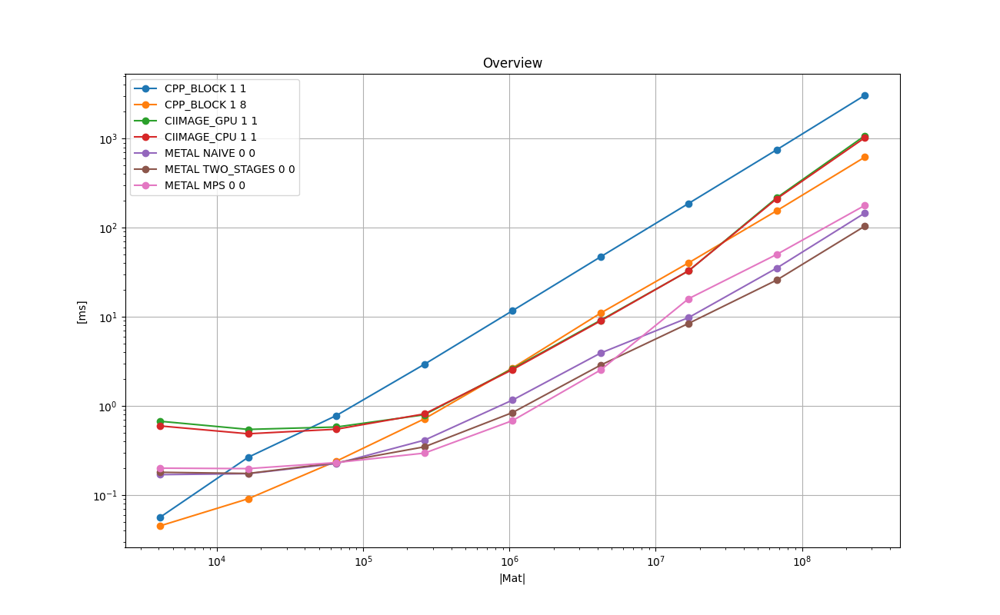
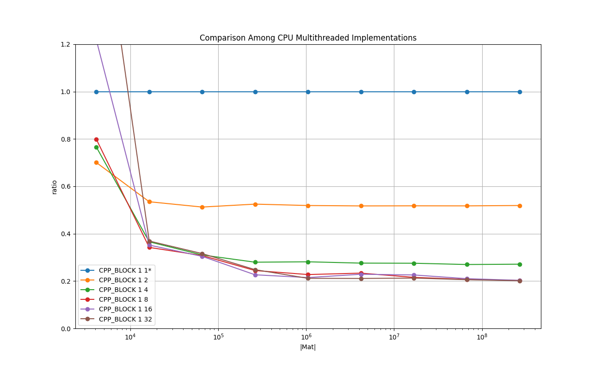
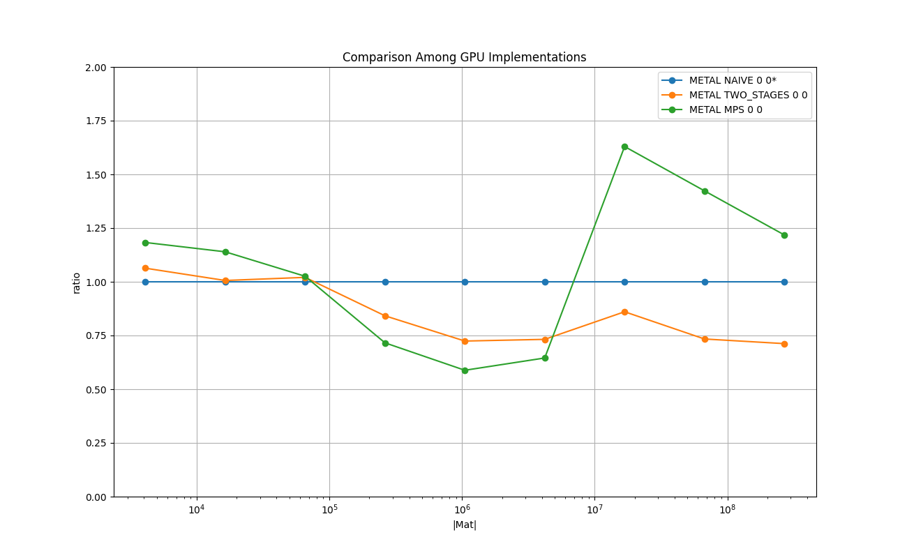

# 2-D Convolution with 5x5 Kernel in Float
The image is in the *row-major* form with the *same* boundary condition with zero padding.
The *same* boundary condition means the size of the output image is the same as the input image's.

# 1. Key Points

* Multi-threading in CPU works well. If the number of threads are 8 or less, then the overhead of thread synchronization is amortized already with 64x64 image.

* On CPU, **CIImage** (both CPU and GPU) performs best if the image size is in (256x256 - 4096x4096).  Apparently **CIImage** is tuned for those practical sizes.

* **MPSImageConvolution**  with **MTLTexture** performs best if the image size is in (256x256 - 2048x2048). Apparently **MTLTexture** is tuned for those practical sizes.

* Otherwise my own Metal shader in two stages performs best

# 2. Background and Context
2-D Convolution is a numerically intensive processing which is common in the image processing, and it can be parallelized.
One characteristic is the way the memory is accessed for each output pixel.
The read memory accesses can be far apart whether the image is arranged row-major or column-major.
CUDA Texture memory seems suitable for this type of memory access.
On Apple devices, two technologies available: **CIImage** (GPU & CPU) and Metal **MPSImageConvolution**.

# 3. Purpose
The purpose is to measure the real running times of the two available technologies, as well as times of my own CPU and GPU implementations.
This gives some insight if a custom algorithm similar to the basic convolution must be implemented, and there is no simple solution in the available libraries or frameworks.


# 4. Results on Running Time
The following experiments are done with [test_convolution_2d.cpp](test_convolution_2d.cpp) in this directory.

Compiler: Apple clang version 13.0.0 (clang-1300.0.29.3) Target: arm64-apple-darwin20.6.0 Thread model: posix

Device: Mac mini (M1, 2020) Chip Apple M1, Memory 8GB, macOS Big Sur Version 11.6

Please type `make all` in this directory to reproduce the results.

## 4.1. Overview
The following chart shows the mean running times taken to perform one image convolution in *float* with a 5x5 kernel for each implementation in log-log scale.
X-axis is the number of the pixels, and Y-axis is the time taken in milliseconds.

### Legend

* **CPP_BLOCK 1 1**: Plain C++ implementation - baseline

* **CPP_BLOCK 1 8**: C++ implementation with 8 threads

* **CIIMAGE_GPU 1 1**: CIFilter convolution5X5Filter, [CIContext contextWithMTLDevice:]

* **CIIMAGE_CPU 1 1**: CIFilter convolution5X5Filter, [CIContext contextWithOptions:]

* **METAL NAIVE 0 0**: Metal kernel - simple implementation

* **METAL TWO_STAGE 0 0**: Metal kernel - twp-pass with simd_shuffle_up() and simd_shuffle_down()

* **METAL MPS 0 0**: MPSImageConvolution

<a href="doc/FLOAT_MATRIX_ROW_MAJOR_Overview.png"></a>

### Remarks

* 'METAL MPS 0 0' performs best if the image size is in (256x256 - 2048x2048), otherwise, 'METAL TWO_STAGE 0 0' performs best.

* Multithreading the C++ implementation works well. It can achieve the performance of *CIImage*, and exceeds if the image size is larger than 4Kx4K.

* There is no noticeable difference between CPU and GPU in CIImage on the system tested.

## 4.2. Comparison Among CPU Implementations
The following chart shows the relative running times taken to perform one image convolution in *float* with a 5x5 kernel for each C++ implementation with different number of worker threads in log-lin scale.
X-axis is the number of pixels, and Y-axis is the relative running time of each implementation relative to 'CPP_BLOCK 1 1', which is fixed at 1.0.


### Legend

* **CPP_BLOCK 1 1**: Plain C++ implementation - baseline

* **CPP_BLOCK 1 2**: C++ implementation with 2 threads

* **CPP_BLOCK 1 4**: C++ implementation with 4 threads

* **CPP_BLOCK 1 8**: C++ implementation with 8 threads

* **CPP_BLOCK 1 16**: C++ implementation with 16 threads

* **CPP_BLOCK 1 32**: C++ implementation with 32 threads

<a href="doc/FLOAT_MATRIX_ROW_MAJOR_Comparison_Among_CPU_Multithreaded_Implementations_relative.png"></a>

### Remarks

* Multithreading in CPU works well.
If the number of threads are 8 or less, then the overhead of thread synchronization is amortized already for the images of size 64x64.

* 'CPP_BLOCK 1 8' performs best if the image size is 128x128 and greater. 'CPP_BLOCK 1 4' performs best if the image size is smaller.


## 4.3. Comparison Among GPU Implementations
The following chart shows the relative running times taken to perform one image convolution in *float* with a 5x5 kernel for each Metal implementation in log-lin scale.
X-axis is the number of pixels, and Y-axis is the relative running time of each implementation relative to 'METAL NAIVE 0 0', which is fixed at 1.0.


### Legend

* **METAL NAIVE 0 0** : Metal kernel - one-pass simple implementation

* **METAL TWO_STAGE 0 0**: Metal kernel - two-pass with simd_shuffle_up and _down

* **METAL MPS 0 0**: MPSImageConvolution

<a href="doc/FLOAT_MATRIX_ROW_MAJOR_Comparison_Among_GPU_Implementations_relative.png"></a>

### Remarks

* The version in two-pass with `simd_shuffle()` instructions works better than the naive one-pass version.
* The performance of MPS varies depending on the size of the image. MPS uses *MTLTexture* to access the image. This result suggests *MTLTexture* is tuned for particular range of the image sizes.

# 5. Implementations
This section briefly describes each of the implementations tested with some key points in the code.
Those are executed as part of the test program in [test_convolution_2d.cpp](test_convolution_2d.cpp).
The top-level object in the 'main()' function is **TestExecutorConvolution2D**, which is a subclass of **TestExecutor found**
 in [../common/test_case_with_time_measurements.h](../common/test_case_with_time_measurements.h).
It manages one single test suite, which consists of test cases.
It arranges the input data, allocates memory, executes each test case multiple times and measures the running times, cleans up, and reports the results.
Each implementation type is implemented as a **TestCaseConvolution2D**, which is a subclass of **TestCaseWithTimeMeasurements**
 in [../common/test_case_with_time_measurements.h](../common/test_case_with_time_measurements.h).
The main part is implemented in **TestCaseConvolution2D::run()**, and it is the subject for the running time measurements.

## 5.1. CPP_BLOCK 1 1
[**class TestCaseConvolution2D_baseline** in test_convolution_2d.cpp](test_convolution_2d.cpp)

The following is the function to calculate one output pixel.
```
// Calculate one NxN convolution.
template<class T, int KERNEL_DIM>
static inline T calc_conv_one_point (
    const T* const kernel,
    const T* const in, 
    const size_t   image_width,
    const size_t   image_height,
    const size_t   center_x,
    const size_t   center_y
) {
    static_assert( KERNEL_DIM % 2 == 1 );// DIM must be odd.
    
    constexpr int KERN_OFFSET = KERNEL_DIM/2;

    T sum = 0;

    for ( int kern_y = 0; kern_y < KERNEL_DIM; kern_y++ ) {

        const int image_y = ( kern_y - KERN_OFFSET ) + center_y;

        if ( 0 <= image_y && image_y < image_height ) {

            for ( int kern_x = 0; kern_x < KERNEL_DIM; kern_x++ ) {

                const int image_x = ( kern_x - KERN_OFFSET ) + center_x;

                const T v =   ( 0 <= image_x && image_x < image_width )
                            ? ( kernel[ index_row_major(kern_x, kern_y, KERNEL_DIM) ] * in[ index_row_major(image_x, image_y, image_width) ] )
                            : 0
                            ;
                sum += v;
            }
        }
    }
    return sum;
}
```

The function `calc_conv_one_point()` is called for each pixed in the following loops.

```
    for ( size_t y = row_start; y < row_end_past_one; y++ ) {

        for ( size_t x = 0; x < width; x++ ) {

            out[ index_row_major( x, y, width) ] = calc_conv_one_point< T,KERNEL_DIM >( kernel, in, width, height, x, y );
        }
    }
```


## 5.2. CPP_BLOCK 1 X
[**class TestCaseConvolution2D_multithreads** in test_convolution_2d.cpp](test_convolution_2d.cpp)

It uses the same function `calc_conv_one_point ()`,
but split into blocks horizontally (in rows), each of which is processed by one thread as follows.

```
        auto thread_lambda = [ this, num_rows_per_thread ]( const size_t thread_index ) {

            while ( true ) {

                const size_t row_begin = thread_index * num_rows_per_thread;
                const size_t row_end   = row_begin + num_rows_per_thread;

                m_fan_out.wait( thread_index );
                if( m_fan_out.isTerminating() ) {
                    break;
                }

                calc_conv_row_block<T,KERNEL_DIM> (
                    this->m_kernel,
                    this->m_image_in,
                    this->m_image_out,
                    this->m_image_width,
                    this->m_image_height,
                    row_begin,
                    row_end
                );

                m_fan_in.notify();
                if( m_fan_in.isTerminating() ) {
                    break;
                }
            }
        };
```


## 5.3. CIIMAGE_GPU 1 1 : CIFilter convolution5X5Filter,  CIContext contextWithMTLDevice:
[**class TestCaseConvolution2D_ciimage** in test_convolution_2d.cpp](test_convolution_2d.cpp)

This implementation involves a sequence of function calls and multiple data structures.

### Arrange an Input Image From an Array of Float Into CIImage
Create CGImage with the following steps : float* => NSData => CGDataProvider => CGImageRef

```
float*  _mInputRawImage  = (float*)malloc( row_array_num_bytes );

CGColorSpaceRef _mColorSpaceRef = CGColorSpaceCreateWithName( kCGColorSpaceLinearGray );

NSData* _mInputNSDataArc = [ NSData dataWithBytesNoCopy : _mInputRawImage length : row_array_num_bytes ];

CGDataProviderRef _mDataProviderRef = CGDataProviderCreateWithCFData( (CFDataRef)_mInputNSDataArc );

CGBitmapInfo bitmap_info = kCGImageAlphaNone | kCGBitmapByteOrder32Host | kCGBitmapFloatComponents;

CGImageRef inputCGImageRef
            = CGImageCreate( 
                  _mImageWidth,                 // size_t width
                  _mImageHeight,                // size_t height
                  32,                           // size_t bitsPerComponent (float=32)
                  32,                           // size_t bitsPerPixel == bitsPerComponent for float
                    row_array_num_bytes
                  / _mImageHeight,              // size_t bytesPerRow -> width in pixels * sizeof(float)
                  _mColorSpaceRef,              // CGColorSpaceRef
                  bitmap_info,                  // CGBitmapInfo
                  _mDataProviderRef,            // CGDataProviderRef
                  NULL,                         // no color mapping
                  NO,                           // no interpoloation
                  kCGRenderingIntentDefault     // CGColorRenderingIntent
              );
```
At this point, the contents of the image can be still updated by assigning values into `_mINputRawImage`.

Then create CIImage.
```
CIImage* input_ciimage_arc = [ CIImage imageWithCGImage: _mInputCGImageRef
                                                 options: @{ kCIImageColorSpace: [NSNull null] } ];
```
At this point, the contents of the image can no longer be changed.

### Arrange a Filter Input Image (Kernel) Into CIVector

```
CGFloat _mFilterWeights[49];// Upto 7x7 convolution.

CIVector* filter_vector_arc = [ [CIVector alloc] initWithValues: _mFilterWeights 
                                                          count: _mKernelDim*_mKernelDim ];
```

### Perform Convolution

```
float * _mOutputRawImage = (float*)malloc( row_array_num_bytes );

id<MTLDevice> metal_device = MTLCreateSystemDefaultDevice();

CIContext* _mContextArc = [ CIContext contextWithMTLDevice: metal_device ];

CIFilter<CIConvolution>* filter_arc = [ CIFilter convolution5X5Filter ];

filter_arc.inputImage = input_ciimage_arc;
filter_arc.bias       = 0.0;
filter_arc.weights    = filter_vector_arc;

[ _mContextArc render:filter_arc.outputImage toBitmap: _mOutputRawImage
                                             rowBytes: sizeof(float)*_mImageWidth
                                               bounds: CGRectMake( 0, 0, _mImageWidth, _mImageHeight )
                                               format: kCIFormatLf
                                           colorSpace: _mColorSpaceRef ];
```

Please see [ciimage/convolution_2d_ciimage_objc.mm](ciimage/convolution_2d_ciimage_objc.mm) for details.

## 5.4. CIIMAGE_CPU 1 1 : CIFilter convolution5X5Filter, CIContext contextWithOptions:
[**class TestCaseConvolution2D_ciimage** in test_convolution_2d.cpp](test_convolution_2d.cpp)

This is similar to 'CIIMAGE_GPU 1 1', but the **CIContext** is created as follows.

```
 _mContextArc = [ CIContext contextWithOptions: @{ kCIContextUseSoftwareRenderer : [NSNumber numberWithBool:true] } ];
```
Please see [ciimage/convolution_2d_ciimage_objc.mm](ciimage/convolution_2d_ciimage_objc.mm) for details.

## 5.5. METAL NAIVE 0 0 : Metal kernel
[**class TestCaseConvolution2D_metal** in test_convolution_2d.cpp](test_convolution_2d.cpp)

In this metal implementation, each thread is responsible for calculating one output pixel as follows.

```
kernel void convolution_2d_naive (

    device float*       input_image                        [[ buffer(0) ]],

    device const float* conv_kernel                        [[ buffer(1) ]],

    device float*       output_image                       [[ buffer(2) ]],

    device const struct convolution_2d_constants&
                        constants                          [[ buffer(3) ]],

    const        uint   thread_position_in_grid            [[ thread_position_in_grid ]]

)
{
    if (thread_position_in_grid < constants.num_elements ) {

        const uint KERN_OFFSET = constants.kernel_size/2;

        const uint center_x = thread_position_in_grid % constants.image_width;

        const uint center_y = thread_position_in_grid / constants.image_width;

        float sum = 0.0;

        for ( int kern_y = 0; kern_y < (int)constants.kernel_size; kern_y++ ) {

            const int image_y = ( kern_y - KERN_OFFSET ) + center_y;

            if ( 0 <= image_y && image_y < (int)constants.image_height ) {

                for ( int kern_x = 0; kern_x < (int)constants.kernel_size; kern_x++ ) {

                    const int image_x = ( kern_x - KERN_OFFSET ) + center_x;

                    const float v =   ( 0 <= image_x && image_x < (int)constants.image_width )

                                    ? (   conv_kernel[ index_from_xy(kern_x,  kern_y,  constants.kernel_size) ]
                                        * input_image[ index_from_xy(image_x, image_y, constants.image_width) ]
                                      )
                                    : 0.0
                                    ;
                    sum += v;
                }
            }
        }

        output_image[ index_from_xy(center_x, center_y, constants.image_width) ] = sum;
    }
}
```
Please see [metal/convolution_2d.metal](metal/convolution_2d.metal) for details.
The kerkel is managed by c++ & objc code found in [metal/](metal/).

## 5.6. METAL TWO_STAGE 0 0: Metal kernel - twp-pass with simd_shuffle_up() and simd_shuffle_down()
[**class TestCaseConvolution2D_metal** in test_convolution_2d.cpp](test_convolution_2d.cpp)

In the 1st phase, the output pixels whose horizontal coordinate is in the range of [2-29]*N, where N={1,2,...}
It utilizes `simd_shuffle_down()` and `simd_shuffle_up()`.
This leaves the vertical strips in the image,  whose horizontal cordinates are in {0,1,30,31}*N.
These are handled in the 2nd phase.

If the 1st phase that handles (100 * 28/32) % of the pixels is fast enough to compensate the overhead of
the 2nd phrase that handles (100* 4/32)%, it is worth it, and the chart above shows, it is indeed the case.

please see `convolution_5x5_stage1()` and `convolution_5x5_stage2()` in [metal/convolution_2d.metal](metal/convolution_2d.metal).

NOTE: convolution_5x5_stage2 () works only with maximum 768 threads per thread-group, not 1024 threads.
This is apparently due to too many local variables used in the kernel, though they are **consts**.

## 5.7. METAL MPS 0 0: MPSImageConvolution
[**class TestCaseConvolution2D_metal** in test_convolution_2d.cpp](test_convolution_2d.cpp)

This implementation uses `MPSImageConvolution` and `MTLTexture`.


The main part of the code is shown below. Please see [metal/convolution_2d_metal_objc_mps.h](metal/convolution_2d_metal_objc_mps.h)
and [metal/convolution_2d_metal_objc_mps.mm](metal/convolution_2d_metal_objc_mps.mm) for details.

```
- (void) performConvolution
{

    id<MTLCommandBuffer> commandBuffer = [ _mCommandQueue commandBuffer ];

    MPSImageConvolution* MPSConvKernel
        = [ [MPSImageConvolution alloc] initWithDevice: _mDevice
                                           kernelWidth: _mKernelSize
                                          kernelHeight: _mKernelSize
                                               weights: _mMPSWeights ];

    [ MPSConvKernel encodeToCommandBuffer: commandBuffer inPlaceTexture: &_mMPSTexture fallbackCopyAllocator: myAllocator ];

    [ commandBuffer commit];

    [ commandBuffer waitUntilCompleted ];

    [ MPSConvKernel release ];
}
```

**NOTE**: **MPSImageConvolution** takes a parameter called **fallbackCopyAllocator:**. An example for it is provided in 
[this article](https://developer.apple.com/documentation/metalperformanceshaders/mpscopyallocator?language=objc) provided by Apple.

# 6. References

* [Apple Developer Documentation : CIImage](https://developer.apple.com/documentation/coreimage/ciimage?language=objc)

* [Apple Developer Documentation : MPSImageConvolution](https://developer.apple.com/documentation/metalperformanceshaders/mpsimageconvolution?language=objc)

* [Apple Developer Documentation : MPSCopyAllocator](https://developer.apple.com/documentation/metalperformanceshaders/mpscopyallocator?language=objc)