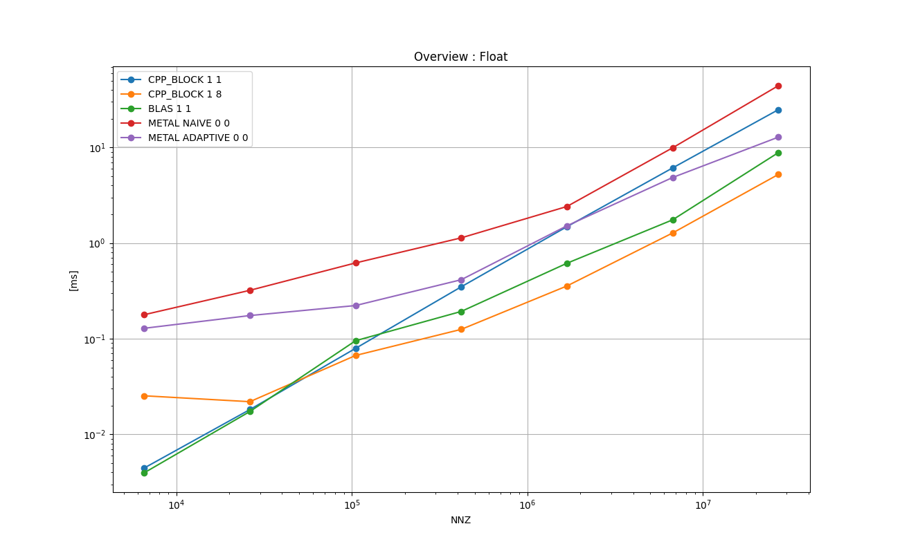
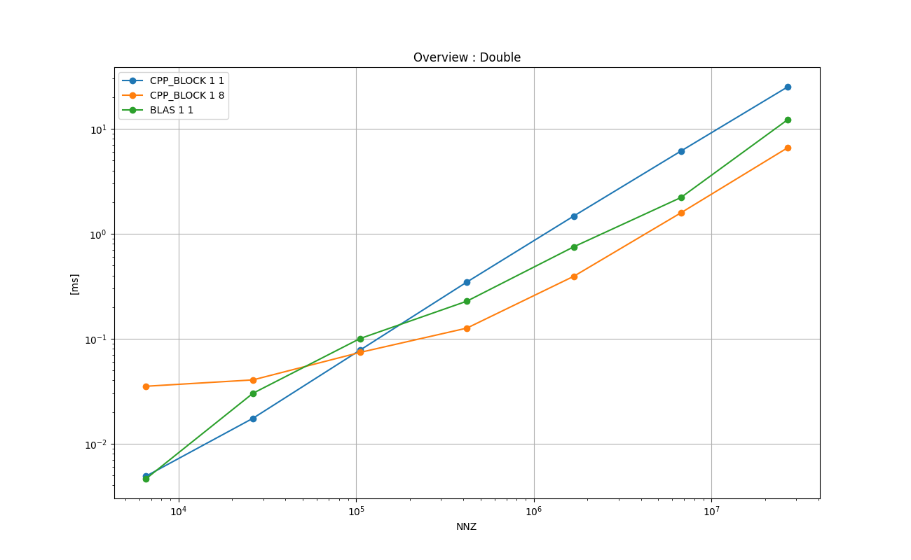
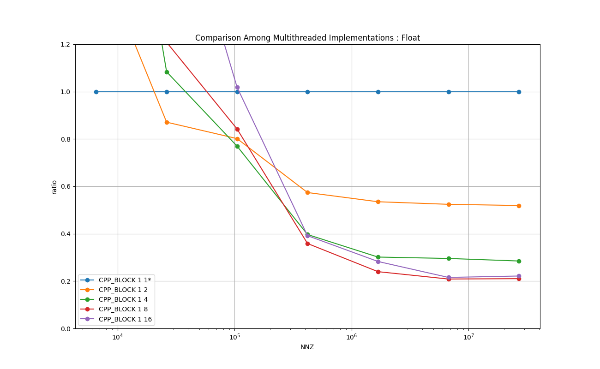
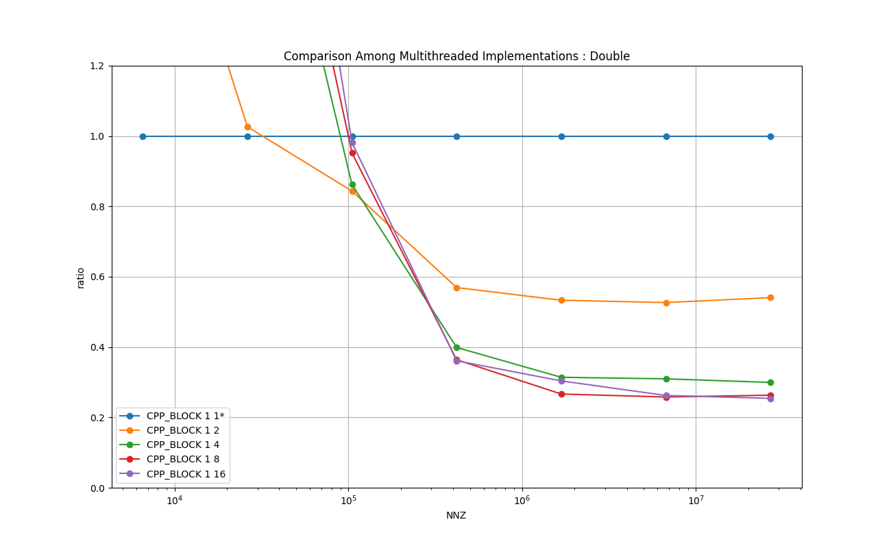
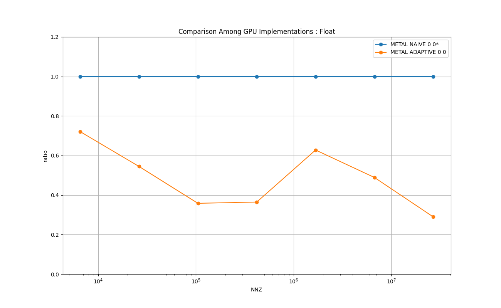

# Sparse Matrix-Vector Multiplication
The matrix is stored in the CSR (compressed sparse row) form.
Please see below and also [the Wiki Pedia: Sparse matrix](https://en.wikipedia.org/wiki/Sparse_matrix) for the definition.

## A. Definition of CSR Sparse Matrix Data Structure

Let *(M,N)* be the dimension of the matrix, and *NNZ* be the number of non-zero elements in the matrix.
The CSR is represented by three arrays:
**csr_row_ptrs** of length *M + 1*, **csr_columns** of length *NNZ*, and **csr_values** of length *NNZ*.


- **csr_row_ptrs**: csr_row_ptrs[0] = 0 and  csr_row_ptrs[M] = NNZ.

   *csr_row_ptrs[i]* is the start index of row *i* (zero-origin) into csr_columns and csr_values.
   Therefore, *csr_row_ptrs[i+1] - csr_rowcsr_row_ptrs[i]* is the number of non-zero elements in row *i*.

- **csr_columns**: represents the column (zero-origin) for the element.

- **csr_values**: represents the value of the element.

## B. Multiplication

Let **csr_vecotor** of size *N* be the vector to multiply on RHS,
and **output_vector** of size *M* be the vector on LHS.
The multiplication can be described as follows.

```
for (int i = 0; i < this->m_M; i++) {

    output_vector[i] = 0.0;

    for ( int j = csr_row_ptrs[i]; j < csr_row_ptrs[i+1]; j++ ){

        output_vector[i] += ( csr_values[j] * csr_vector[ csr_columns[j] ] ) ;
    }
}
```

## C. Characteristics

This operation is characterized by an indirect addressing to one of the operands for the RHS vector.
Each iteration of the outer loop represents one row, and the the inner loop represents compressed columns where `output_vector[i]`
gets accumulated. Please see the RHS `( csr_values[j] * csr_vector[ csr_columns[j] ] )`.
The indirect addressing in the 2nd operant makes it difficult to optimize and parallelize the operation.

In this test the test pattern matrices where 10% of the elements are NNZ.
Those NNZ are uniformly distributed over the matrix.


# 1. Key Points

* Plain C++ implementation with 8 threads shows the best running time most of the time.
If the matrix is small, the implementation with less threads perform better.

* It will not be worth using Metal unless NNZ >= 1 billion, which is impractical for the realistic applications.

* Two types of Metal implementation created

    * Naive version with one thread per row.

    * Adaptive block size with reduction. This is inspired by the 'Hybrid' type described in 
[Blog in Medium: Sparse Matrix-Vector Multiplication with CUDA](https://medium.com/analytics-vidhya/sparse-matrix-vector-multiplication-with-cuda-42d191878e8f).

  The adaptive version runs roughly twice as fast as the one with one thread per row.

# 2. Background and Context
The sparse matrix representations are used when the matrix is sparse, i.e., most of the entries are zero, in which case storing all the values are wasteful.
The sparsity occurs in many scientific and engineering applications, and BLAS has a set of routines that take the sparse matrices.


# 3. Purpose

* To implement a reasonably efficient Metal implementation, as there does not seem to be any implementation available.

* To measure the performance of multiple implementations on both CPU and GPU and find characteristics.

# 4. Results on Running Time
The following experiments are done with [test_sparse_matrix_vector.cpp](test_sparse_matrix_vector.cpp) in this directory.

Compiler: Apple clang version 13.0.0 (clang-1300.0.29.3) Target: arm64-apple-darwin20.6.0 Thread model: posix

Device: Mac mini (M1, 2020) Chip Apple M1, Memory 8GB, macOS Big Sur Version 11.6

Please type `make all` in this directory to reproduce the results.

## 4.1. Overview : Float
The following chart shows the mean running times taken to perform one matrix-vector multiplication in *float* for each implementation in log-log scale.
X-axis is the number of the NNZ, and Y-axis is the time taken in milliseconds.
### Legend

* **CPP_BLOCK 1 1**: baseline C++ implementation

* **CPP_BLOCK 1 8**: C++ with 8 threads

* **BLAS 1 1**: BLAS sparse_matrix_vector_product_dense_float()

* **METAL NAIVE 0 0**: Metal kernel, one thread per row

* **METAL ADAPTIVE 0 0**: Metal kernel, adaptive number of threads per row

<a href="doc/FLOAT_MATRIX_SPARSE_Overview_:_Float.png"></a>

### Remarks
* CPP implementation works best. The number of threads depends on the problem size. However the implementation with 8 threads works well in general.

* There seems to be little benefit in using the Metal implementations for the problems of realistic sizes.


## 4.2. Overview : Double
The following chart shows the mean running times taken to perform one matrix-vector multiplication in *double* for each implementation in log-log scale.
X-axis is the number of the NNZ, and Y-axis is the time taken in milliseconds.

### Legend
* **CPP_BLOCK 1 1**: baseline C++ implementation

* **CPP_BLOCK 1 8**: C++ with 8 threads

* **BLAS 1 1**: BLAS sparse_matrix_vector_product_dense_double()

<a href="doc/DOUBLE_MATRIX_SPARSE_Overview_:_Double.png"></a>

### Remarks
The CPP implementations perform well.
The number of threads depends on the problem size. However the implementation with 8 threads works well in general.


## 4.3. Comparison Among Multithread Implementations : Float
The following chart shows the relative running times taken to perform one matrix-vector multiplication in *float*
for each C++ implementation with different number of worker threads in log-lin scale.
X-axis is the number of the NNZ, and Y-axis is the relative running time of each implementation relative to 'CPP_BLOCK 
1 1', which is fixed at 1.0.

### Legend

* **CPP_BLOCK 1 1**: baseline C++ implementation

* **CPP_BLOCK 1 2**: C++ with 2 threads

* **CPP_BLOCK 1 4**: C++ with 4 threads

* **CPP_BLOCK 1 8**: C++ with 8 threads

* **CPP_BLOCK 1 16**: C++ with 16 threads

<a href="doc/FLOAT_MATRIX_SPARSE_Comparison_Among_Multithreaded_Implementations_:_Float_relative.png"></a>

### Remarks

Depending on the problem sizes, it seems the implementations with single thread, 2 threads, and 8 threads perform well.


## 4.4. Comparison Among Multithread Implementations : Double
The following chart shows the relative running times taken to perform one matrix-vector multiplication in *double* for
each C++ implementation with different number of worker threads in log-lin scale.
X-axis is the number of the NNZ, and Y-axis is the relative running time of each implementation relative to 'CPP_BLOCK 
1 1', which is fixed at 1.0.

### Legend

* **CPP_BLOCK 1 1**: baseline C++ implementation

* **CPP_BLOCK 1 2**: C++ with 2 threads

* **CPP_BLOCK 1 4**: C++ with 4 threads

* **CPP_BLOCK 1 8**: C++ with 8 threads

* **CPP_BLOCK 1 16**: C++ with 16 threads

<a href="doc/DOUBLE_MATRIX_SPARSE_Comparison_Among_Multithreaded_Implementations_:_Double_relative.png"></a>

### Remarks

Depending on the problem sizes, it seems the implementations with single thread, 2 threads, and 8 threads perform well.


## 4.5. Comparison Among Metal Implementations : Float
The following chart shows the relative running times taken to perform one matrix-vector multiplication in *float* with for two Metal implementations in log-lin scale.
X-axis is the number of the NNZ, and Y-axis is the relative running time of each implementation relative to 'METAL NAIVE 0 0', which is fixed at 1.0.

### Legend

* **METAL NAIVE 0 0**: Metal kernel, one thread per row

* **METAL ADAPTIVE 0 0**: Metal kernel, adaptive number of threads per row

<a href="doc/FLOAT_MATRIX_SPARSE_Comparison_Among_GPU_Implementations_:_Float_relative.png"></a>

### Remarks
It seems the adaptive version works better than the naive version. This suggests the threads are better utilized in the adaptive version.

**NOTE:** As stated above, the 10% of the input matrices are NNZ, and they uniformly distributed over each matrix.
This is different from the real matrices in which the NNZ show particular patterns such as clustering and symmetry.
However, this should work as a good indication of the advantage/disadvantage of using this adaptive algorithm.


# 5. Implementations
This section brefly describes each of the implementations tested with some key points in the code.
Those are executed as part of the test program in [test_sparse_matrix_vector.cpp](test_sparse_matrix_vector.cpp).
The top-level object in the 'main()' function is **TestExecutorSPMV**, which is a subclass of **TestExecutor found**
 in [../common/test_case_with_time_measurements.h](../common/test_case_with_time_measurements.h).
It manages one single test suite, which consists of test cases.
It arranges the input data, allocates memory, executes each test case multiple times and measures the running times, cleans up, and reports the results.
Each implementation type is implemented as a **TestCaseSPMV**, which is a subclass of **TestCaseWithTimeMeasurements**
 in [../common/test_case_with_time_measurements.h](../common/test_case_with_time_measurements.h).
The main part is implemented in **TestCaseSPMV::run()**, and it is the subject for the running time measurements.


## 5.1. BLOCK 1 1: C++ implementation - baseline
[**class TestCaseSPMV_baseline** in test_sparse_matrix_vector.cpp](test_sparse_matrix_vector.cpp)

This is a straightforward C++ implementation with a loop as follows.
```
for (int i = 0; i < this->m_M; i++) {

    this->m_output_vector[i] = 0.0;

    for ( int j = this->m_csr_row_ptrs[i]; j < this->m_csr_row_ptrs[i+1]; j++ ){

        this->m_output_vector[i] += ( this->m_csr_values[j] * this->m_csr_vector[ this->m_csr_columns[j] ] ) ;
    }
}
```

## 5.2. BLOCK 1 X: C++ with multithreads
[**class TestCaseSPMV_multithread** in test_sparse_matrix_vector.cpp](test_sparse_matrix_vector.cpp)

This is based on BLOCK 1 1 and rows are distributed over multiple threads as follows.
```
auto thread_lambda = [ this, num_rows_per_thread ]( const size_t thread_index ) {

    const size_t row_begin = thread_index * num_rows_per_thread;
    const size_t row_end   = row_begin + num_rows_per_thread;

    while ( true ) {

        m_fan_out.wait( thread_index );
        if( m_fan_out.isTerminating() ) {
            break;
        }

        for ( int i = row_begin; i < row_end; i++ ) {
            this->m_output_vector[i] = 0.0;

            for ( int j = this->m_csr_row_ptrs[i]; j < this->m_csr_row_ptrs[i+1]; j++ ){

                this->m_output_vector[i] += ( this->m_csr_values[j] * this->m_csr_vector[ this->m_csr_columns[j] ] ) ;
            }
        }

        m_fan_in.notify();
        if( m_fan_in.isTerminating() ) {
            break;
        }
    }
};
```

## 5.3. BLAS 1 1:
[**class TestCaseSPMV_blas** in test_sparse_matrix_vector.cpp](test_sparse_matrix_vector.cpp)

This implementation uses **sparse_matrix_vector_product_dense_double()** and **sparse_matrix_vector_product_dense_double()**.

The time taken in **sparse_matrix_create_float()**,  **sparse_matrix_create_double()**, **sparse_insert_entry_float()**,
 and **sparse_insert_entry_double()** are not counted in the time measurements.

## 5.4. METAL NAIVE 0 0:
[**class TestCaseSPMV_metal** in test_sparse_matrix_vector.cpp](test_sparse_matrix_vector.cpp)

One thread is allocated to one row.
```
kernel void sparse_matrix_vector_row_per_thread (

    device const int*   const csr_row_ptrs                      [[ buffer(0) ]],
    device const int*   const csr_column_indices                [[ buffer(1) ]],
    device const float* const csr_values                        [[ buffer(2) ]],
    device const float* const csr_vector                        [[ buffer(3) ]],
    device float*             output_vector                     [[ buffer(4) ]],
    ...
) {
    if ( thread_position_in_grid < constants.num_rows ) {

        const int pos_begin = csr_row_ptrs[thread_position_in_grid     ];
        const int pos_end   = csr_row_ptrs[thread_position_in_grid + 1 ];

        float sum = 0.0;
        for ( int pos = pos_begin; pos < pos_end; pos++ ) {

            sum += ( csr_values[pos] * csr_vector [ csr_column_indices[pos] ] );
        }

        output_vector [ thread_position_in_grid ] = sum;
    }
}
```
This does not utilize the threads fully, as some threads are idle, while other threads have to process many columns.

See  `sparse_matrix_vector_row_per_thread()` in [metal/sparse_matrix_vector.metal](metal/sparse_matrix_vector.metal) for details.
The kernel is managed by the c++ and objc code found in [metal/](metal/).

## 5.5. METAL ADAPTIVE 0 0:
[**class TestCaseSPMV_metal** in test_sparse_matrix_vector.cpp](test_sparse_matrix_vector.cpp)

This aims at achieving a better overall thread utilization by clustering consecutive rows into blocks.
In literature some adaptive techniques are proposed, but they rearrange rows such that similar rows are grouped together.
*METAL ADAPTIVE*T does not rearrange rows due to the high development- and runtime-complexities of rearranging and restoring the rows.

### Basic Idea

* Scan the rows from top to bottom, and cluster consecutive rows into a block such that:

    Number of rows *Br* is 1024 or less, and *Bnnz*, or the number of NNZ in the block *B*, in those rows are roughly around 1024.

* For each block *B*, Let *Bs* denote the number of sub-blocks for *B*. *Bs* is a minimum of power 2 up to 1024 greater than or equal to *Br*.

* In the block *B*, each row *R* gets one sub-block, which consists of threads *T= 1024 / Bs*, which is also a power of 2.

* In the block *B*, each row *R* uses *T* threads to generate partial sums and the reduce them to one element in the output vector.

* If the number of NNZ in *R*, or *Rnnz*, is greater than *T*, then each thread process multiple columns (and elements in the input vector) in a loop.

### Implementation

In the implementation, it augments the CSR with 3 more arrays: *block_ptrs*, *threads_per_row*, and *max_iters*.

* **block_ptrs** : *block_ptrs[0] = 0*and *block_ptrs[NB] = M - 1*, where *NB* is the number of blocks.
The *block_ptrs[i]* is the start index of the *i*-th block,
and *block_ptrs[i+1] - block_ptrs[i]* is the number of rows in *i*-th block.

* **threads_per_row** : threads_per_row[i] is the number of threads in a power of 2 as described above.

* **max_iters** : max_iters[i] is the number of iterations required per thread in the i-th block.

See **class TestCaseSPMV_metal::create_blocks()** in [test_sparse_matrix_vector.cpp](test_sparse_matrix_vector.cpp) for details.
This process of splitting the rows into blocks is performed in CPU, and counted as the running time as well as the GPU kernel execution.

### Metal Compute Kernel
Each *thread-group* handles one block.
Each thread makes a partial sum in a loop if necessary, and stores it to the threadgroup memory `cache`.
Then each sub-block performs reduction to generate the final output element as follows.
```
kernel void sparse_matrix_vector_adaptive (

    device const int*   const csr_block_ptrs                    [[ buffer(0) ]],
    device const int*   const csr_thrads_per_row                [[ buffer(1) ]],
    device const int*   const csr_max_iters                     [[ buffer(2) ]],
    device const int*   const csr_row_ptrs                      [[ buffer(3) ]],
    device const int*   const csr_column_indices                [[ buffer(4) ]],
    device const float* const csr_values                        [[ buffer(5) ]],
    device const float* const csr_vector                        [[ buffer(6) ]],
    device float*             output_vector                     [[ buffer(7) ]],
    ...
) {

    threadgroup float cache[1024];

    const uint block_row_begin = csr_block_ptrs     [ threadgroup_position_in_grid     ];
    const uint block_row_end   = csr_block_ptrs     [ threadgroup_position_in_grid + 1 ];
    const uint threads_per_row = csr_thrads_per_row [ threadgroup_position_in_grid     ];
    const uint max_iters       = csr_max_iters      [ threadgroup_position_in_grid     ];

    const uint row_pos = thread_position_in_threadgroup / threads_per_row + block_row_begin;

    if ( row_pos < block_row_end ) {

        const uint offset  = thread_position_in_threadgroup % threads_per_row;

        const uint pos_begin = csr_row_ptrs[row_pos     ];
        const uint pos_end   = csr_row_ptrs[row_pos + 1 ];

        float sum = 0.0;
        for ( uint i = 0; i < max_iters ; i++ ) {
            const uint pos = pos_begin + offset + i * threads_per_row;
            if ( pos < pos_end ) {
                sum += ( csr_values[pos] * csr_vector [ csr_column_indices[pos] ] );
            }
        }

        cache[thread_position_in_threadgroup] = sum;

        threadgroup_barrier( mem_flags::mem_threadgroup );

        // reduce    
        for ( uint i = threads_per_row/2 ; i > 0; i >>= 1 ) {
            if ( i>16 ) {
                if ( offset < i ){        
                    sum = cache[thread_position_in_threadgroup ] + cache[thread_position_in_threadgroup + i];
                    cache[thread_position_in_threadgroup] = sum;
                }
            }
            else {
                sum += simd_shuffle_down(sum, i);
            }           
            threadgroup_barrier( mem_flags::mem_threadgroup );
        }

        if (offset == 0) {
            output_vector[row_pos] = sum;
        }
    }
}
```
See  `sparse_matrix_vector_adaptive()` in [metal/sparse_matrix_vector.metal](metal/sparse_matrix_vector.metal) for details.
The kernel is managed by the C++ and objc code found in [metal/](metal/).


# 6. Reference 

* [Blog in Medium: Sparse Matrix-Vector Multiplication with CUDA](https://medium.com/analytics-vidhya/sparse-matrix-vector-multiplication-with-cuda-42d191878e8f).
