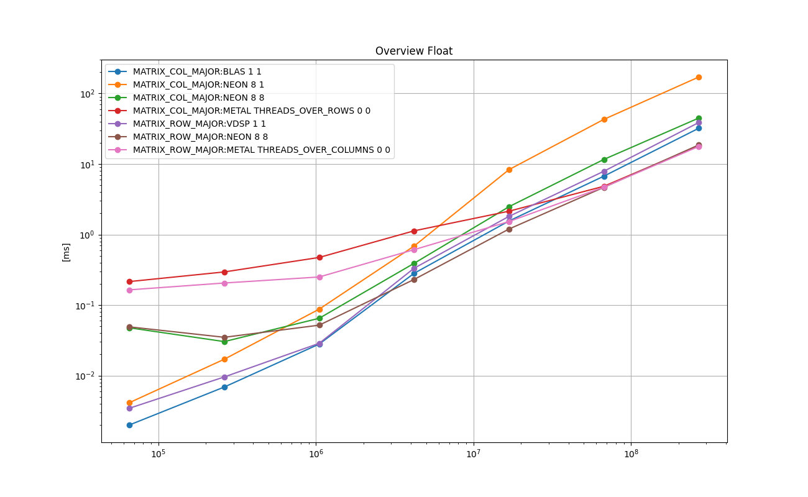
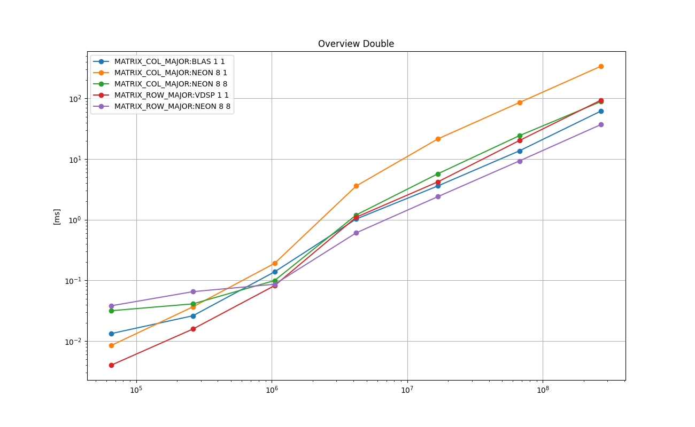

# Dense Matrix-Vector Multiplication
Normal matrix-vector multiplication both in the column-major form and the row-major form.

# 1. Key Points


## General

* **NEON** intrinsics provide significant benefit compared with the plain C++ implementations. The loop unrolling provides further significant benefit.

* The Metal shaders perform well for bigger problems than *(M,N) = (4K, 4K)*, if the Metal threads are alined along the cache line with coalesced reads, i.e., for the col-major, if the threads are assigned vertically over the rows, and for the row-major, if the threads are assigned horizontally over the columns.

## Float Column-Major

* **BLAS** shows the best running time for the problems of size up to *(4K, 4K)*.

* The Metal shader with threads over rows shows the best running time for the bigger problems.

## Float Row-Major

* **vDSP** shows the best running time for the problems of size up to *(1K, 1K)*.

* **NEON** with the loop unrolling of factor 8 with 8 threads shows the best performance for the problems of size *(1K, 1K) - (4K, 4K)*.

* **MPSMatrixVectorMultiplication** & the Metal shader with threads over columns reduction shows the best running time for the bigger problems.

* Apparently **MPSMatrixVectorMultiplication** has a similar implementation as my Metal shader kernel with the *reduction* for each row described below.

## Double Column-Major

* **NEON** with the loop unrolling of factor 8 with a single threaded shows the best performance
for the problems of size up to *(256, 256)*.

* **BLAS** shows the best performance for the bigger problems.

## Double Row-Major

* **BLAS** & **vDSP**  shows the best performance for the problems of size up to *(1K, 1K)*.

* **NEON** with the loop unrolling factor of 8 with 8 threads for the bigger problems.


# 2. Background and Context
Matrix vector multiplication is an essential operation for many numerical processing tasks.
It can also be viewed as a parallelizable set of dot product operations.
There are two ways to store the matrix: The *column-major* used by Fortran and numerical operation softwares,
and the *row-major* is used by mainly by C++.
And there are following main ways available on CPU and Metal.

*  **BLAS**:  **cblas_sgemv()** & **cblas_dgemv()**

*  **vDSP**:  **vDSP_mmul()** & **vDSP_mmulD()**.

*  Metal **MPSMatrixVectorMultiplication**


# 3. Purpose
The purpose is to find the best way to perform the matrix-vector multiplication for 4 combinations:
*col-major* & *row-major*, and in *float* & *double*.

Another purpose is to see how my implementation on CPU utilizing some techniques, notably, NEON intrinsics, the loop-unrolling, and multithreading, performs against BLAS and vDSP.

Yet another purpose on METAL is to measure the performance of the kernels of the following 2 types:

* threads-over-rows (and loop over columns)

* threads-over-columns (with reduction for each row)


# 4. Results on Running Time
This section an overview for each of *float* and *double*.

This section is split further into 4 separate files.
Please see the following 4 READMEs for the *per-type* results.

*  [Float Column-Major](README_runningtime_float_colmajor.md)

*  [Float Row-Major](README_runningtime_float_rowmajor.md)

*  [Double Column-Major](README_runningtime_double_colmajor.md)

*  [Double Row-Major](README_runningtime_double_rowmajor.md)

## 4.1. Overview : Float
The following chart shows the mean running times taken to perform one matrix-vector multiplication in *float*
for the representative implementations from both column-major and row-major in log-log scale.
X-axis is the number of elements, or *M x N*, and Y-axis is the time taken in milliseconds.

This can be used as an indicator for the decision on whether to use the column-major or the row-major.

### Legend

* **MATRIX_COL_MAJOR:BLAS 1 1**: BLAS cblas_sgemv()

* **MATRIX_COL_MAJOR:NEON 8 1**: NEON intrinsics with the loop unrolling factor 8, single thread

* **MATRIX_COL_MAJOR:NEON 8 8**: NEON intrinsics with the loop unrolling factor 8 with 8 worker threads

* **MATRIX_COL_MAJOR:METAL THREADS_OVER_ROWS 0 0**: Metal shader with threads over rows, loop over columns

* **MATRIX_ROW_MAJOR:VDSP 1 1**: vDSP vDSP_mmul()

* **MATRIX_ROW_MAJOR:NEON 8 8**: NEON intrinsics with the loop unrolling factor 8 with 8 worker threads

* **MATRIX_ROW_MAJOR:METAL THREADS_OVER_COLUMNS 0 0**: Metal shader with threads over columns, reduction per row.

<a href="doc/FLOAT_ANY_Overview_Float.png"></a>

### Remarks

* For the problem size smaller than (1K, 1K), it is faster in column-major (BLAS 1 1) than in row-major (VDSP 1 1).

* For the problem size around (1K, 1K) and larger, it is slightly faster in row-major (NEON 8 8) than in column-major (BLAS 1 1).

* On Metal, it is faster if the matrix is in row-major and the kernel spreads the threads over columns, and uses reductions per row, than in column-major and the kernel spreads the threads over the rows, and loops over the columns.


## 4.2. Overview : Double
The following chart shows the mean running times taken to perform one matrix-vector multiplication in *double*
for the representative implementations from both column-major and row-major in log-log scale.
X-axis is the number of elements, or *M x N*, and Y-axis is the time taken in milliseconds.

This can be used as an indicator for the decision on whether to use the column-major or the row-major.


### Legend

* **MATRIX_COL_MAJOR:BLAS 1 1**: BLAS cblas_dgemv()

* **MATRIX_COL_MAJOR:NEON 8 1**: NEON intrinsics with the loop unrolling factor 8, single thread

* **MATRIX_COL_MAJOR:NEON 8 8**: NEON intrinsics with the loop unrolling factor 8 with 8 worker threads

* **MATRIX_ROW_MAJOR:VDSP 1 1**: vDSP vDSP_mmulD()

* **MATRIX_ROW_MAJOR:NEON 8 8**: NEON intrinsics with the loop unrolling factor 8 with 8 worker threads

<a href="doc/DOUBLE_ANY_Overview_Double.png"></a>

### Remarks

* For the problem size smaller than (1K, 1K), it is faster in column-major (BLAS 1 1) than in row-major (VDSP 1 1).

* For the problem size around (1K, 1K) and larger, it is slightly faster in row-major (NEON 8 8) than in column-major (BLAS 1 1).


# 5. Implementations
This section briefly describes each of the implementations tested with some key points in the code.
Those are executed as part of the test program in [test_dense_matrix_vector.cpp](test_dense_matrix_vector.cpp).
The top-level object in the 'main()' function is **TestExecutorDenseMV**, which is a subclass of **TestExecutor found**
 in [../common/test_case_with_time_measurements.h](../common/test_case_with_time_measurements.h).
It manages one single test suite, which consists of test cases.
It arranges the input data, allocates memory, executes each test case multiple times and measures the running times, cleans up, and reports the results.
Each implementation type is implemented as a **TestCaseDenseMV**, which is a subclass of **TestCaseWithTimeMeasurements**
 in [../common/test_case_with_time_measurements.h](../common/test_case_with_time_measurements.h).
The main part is implemented in **TestCaseDenseMV::run()**, and it is the subject for the running time measurements.


## 5.1. CPP_BLOCK 1 1
[**class TestCaseDenseMV_baseline** in test_dense_matrix_vector.cpp](test_dense_matrix_vector.cpp)

A plain C++ implementation with two loops.

```
for ( int i = 0; i < this->m_M; i++ ) {

    output_vector[i] = 0.0;

    for ( int j = 0; j < this->m_N; j++ ) {

        const int mat_index = linear_index_mat<IS_COL_MAJOR>( i, j, M, N );

        output_vector[i] += ( matrix[ mat_index ] * vector[j] );
    }
}
```

## 5.2. NEON 1 1
[**class TestCaseDenseMV_NEON** in test_dense_matrix_vector.cpp](test_dense_matrix_vector.cpp)


There are 4 types of implementations: 2 (col-major or row-major) x 2 (float or double).
In all the cases, the outer loop iterates over the rows, and the inner loop iterates over the columns.
The construct of the loop body is different between column-major and row-major.
In column-major, the SIMD lanes are aligned along one column. They span 4 (float) or 2(double) rows for the same column.
The body of the inner loop handles 4 or 2 rows simultaneously.

In row-major, the SIMD lanes are aligned along one row. They span 4 (float) or 2(double) columns for the same row.
The inner loop handles 1 row per execution, and the body generates partial sum for 4 or 2 columns per inner iteration.

### Column-major: Float
```
for ( int i = row_begin; i < row_end_past_one; i += 4 ) {

    float32x4_t qw_row_sum1 = { 0.0, 0.0, 0.0, 0.0 };

    for ( int j = 0; j < N; j++ ) {

        const int mat_index1 = linear_index_mat<IS_COL_MAJOR>( i, j, M, N );
        const float col_v = this->vector[j];
        const float32x4_t qw_mat1 = vld1q_f32( &(matrix[ mat_index1 ]) );
        const float32x4_t qw_col = { col_v, col_v, col_v, col_v };
        const float32x4_t qw_mc1  = vmulq_f32( qw_mat1, qw_col );

        qw_row_sum1 = vaddq_f32( qw_mc1, qw_row_sum1 );
    }

    memcpy(&(output_vector[i ]), &qw_row_sum1, sizeof(float)*4);
}
```

### Column-major: Double
```
for ( int i = row_begin; i < row_end_past_one; i += 2 ) {

    float64x2_t qw_row_sum1 = { 0.0, 0.0 };

    for ( int j = 0; j < N; j++ ) {

        const int mat_index1 = linear_index_mat<IS_COL_MAJOR>( i, j, M, N );
        const float col_v = this->m_vector[j];
        const float64x2_t qw_mat1 = vld1q_f64( &(matrix[ mat_index1 ]) );
        const float64x2_t qw_col = { col_v, col_v };
        const float64x2_t qw_mc1  = vmulq_f64( qw_mat1, qw_col );

        qw_row_sum1 = vaddq_f64( qw_mc1, qw_row_sum1 );
    }

    memcpy(&(output_vector[i]), &qw_row_sum1, sizeof(double)*2);
}
```

### Row-major: Float

```
for ( int i = row_begin; i < row_end_past_one; i++ ) {

    float32x4_t qw_lanewise_sum1 = { 0.0, 0.0, 0.0, 0.0 };

    for ( int j = 0; j < this->N; j+=4 ) {

        const int mat_index1 = linear_index_mat( i, j, M, N );
        const float32x4_t qw_mat1 = vld1q_f32( &(matrix[ mat_index1 ] ) );
        const float32x4_t qw_col1 = vld1q_f32( &(vector[ j     ]      ) );
        const float32x4_t qw_mc1  = vmulq_f32( qw_mat1, qw_col1 );

        qw_lanewise_sum1 = vaddq_f32( qw_mc1, qw_lanewise_sum1 );
    }
    output_vector[i] = qw_lanewise_sum1[0] + qw_lanewise_sum1[1] + qw_lanewise_sum1[2] + qw_lanewise_sum1[3];
}
```

### Row-major: Double

```
for ( int i = row_begin; i < row_end_past_one; i++ ) {

    float64x2_t qw_lanewise_sum1 = { 0.0, 0.0 };

    for ( int j = 0; j < N; j+=2 ) {

        const int mat_index1 = linear_index_mat( i, j, M, N );
        const float64x2_t qw_mat1 = vld1q_f64( &(matrix[ mat_index1 ] ) );
        const float64x2_t qw_col1 = vld1q_f64( &(vector[ j     ]      ) );
        const float64x2_t qw_mc1  = vmulq_f64( qw_mat1, qw_col1 );

        qw_lanewise_sum1 = vaddq_f64( qw_mc1, qw_lanewise_sum1 );
    }
    output_vector[i] = qw_lanewise_sum1[0] + qw_lanewise_sum1[1];
}
```

Please see `run_col_major_loop_unrolling_1()` and `run_row_major_loop_unrolling_1()` in [test_dense_matrix_vector.cpp](test_dense_matrix_vector.cpp) for details.

## 5.3. NEON X 1 : NEON With Loop Unrolling of Factor X
[**class TestCaseDenseMV_NEON** in test_dense_matrix_vector.cpp](test_dense_matrix_vector.cpp)

This is based on NEON 1 1 and expanding the SIMD lanes by stacking multiple NEON instructions.

In column-major, the SIMD lanes are aligned along one column.
They span 4*X (float) or 2*X(double) rows for the same column.
The body of the inner loop handles 4*X or 2*X rows simultaneously.

In row-major, the SIMD lanes are aligned along one row.
They span 4*X(float) or 2*X(double) columns for the same row.
The inner loop handles 1 row per execution, and the body generates partial sum for 4*X or 2*X columns per inner iteration.
The following are excerpt from the code with loop unrlling factor of 4.

### Column-Major: Float
```
for ( int i = row_begin; i < row_end_past_one; i += 16 ) {

    float32x4_t qw_row_sum1 = { 0.0, 0.0, 0.0, 0.0 };
    float32x4_t qw_row_sum2 = { 0.0, 0.0, 0.0, 0.0 };
    float32x4_t qw_row_sum3 = { 0.0, 0.0, 0.0, 0.0 };
    float32x4_t qw_row_sum4 = { 0.0, 0.0, 0.0, 0.0 };

    for ( int j = 0; j < N; j++ ) {

        const int mat_index1 = linear_index_mat( i, j, M, N );
        const int mat_index2 = mat_index1 +  4 ;
        const int mat_index3 = mat_index1 +  8 ;
        const int mat_index4 = mat_index1 + 12 ;
        const float col_v = this->m_vector[j];
        const float32x4_t qw_mat1 = vld1q_f32( &(matrix[ mat_index1 ]) );
        const float32x4_t qw_mat2 = vld1q_f32( &(matrix[ mat_index2 ]) );
        const float32x4_t qw_mat3 = vld1q_f32( &(matrix[ mat_index3 ]) );
        const float32x4_t qw_mat4 = vld1q_f32( &(matrix[ mat_index4 ]) );
        const float32x4_t qw_col = { col_v, col_v, col_v, col_v };
        const float32x4_t qw_mc1  = vmulq_f32( qw_mat1, qw_col );
        const float32x4_t qw_mc2  = vmulq_f32( qw_mat2, qw_col );
        const float32x4_t qw_mc3  = vmulq_f32( qw_mat3, qw_col );
        const float32x4_t qw_mc4  = vmulq_f32( qw_mat4, qw_col );

        qw_row_sum1 = vaddq_f32( qw_mc1, qw_row_sum1 );
        qw_row_sum2 = vaddq_f32( qw_mc2, qw_row_sum2 );
        qw_row_sum3 = vaddq_f32( qw_mc3, qw_row_sum3 );
        qw_row_sum4 = vaddq_f32( qw_mc4, qw_row_sum4 );
    }
    memcpy(&(output_vector[i   ]), &qw_row_sum1, sizeof(float)*4);
    memcpy(&(output_vector[i+ 4]), &qw_row_sum2, sizeof(float)*4);
    memcpy(&(output_vector[i+ 8]), &qw_row_sum3, sizeof(float)*4);
    memcpy(&(output_vector[i+12]), &qw_row_sum4, sizeof(float)*4);
}
```

### Column-Major: Double
```
for ( int i = row_begin; i < row_end_past_one; i += 8 ) {

    float64x2_t qw_row_sum1 = { 0.0, 0.0 };
    float64x2_t qw_row_sum2 = { 0.0, 0.0 };
    float64x2_t qw_row_sum3 = { 0.0, 0.0 };
    float64x2_t qw_row_sum4 = { 0.0, 0.0 };

    for ( int j = 0; j < N; j++ ) {

        const int mat_index1 = linear_index_mat( i, j, M, N );
        const int mat_index2 = mat_index1 + 2 ;
        const int mat_index3 = mat_index1 + 4 ;
        const int mat_index4 = mat_index1 + 6 ;
        const float col_v = this->m_vector[j];
        const float64x2_t qw_mat1 = vld1q_f64( &(matrix[ mat_index1 ]) );
        const float64x2_t qw_mat2 = vld1q_f64( &(matrix[ mat_index2 ]) );
        const float64x2_t qw_mat3 = vld1q_f64( &(matrix[ mat_index3 ]) );
        const float64x2_t qw_mat4 = vld1q_f64( &(matrix[ mat_index4 ]) );
        const float64x2_t qw_col = { col_v, col_v };
        const float64x2_t qw_mc1  = vmulq_f64( qw_mat1, qw_col );
        const float64x2_t qw_mc2  = vmulq_f64( qw_mat2, qw_col );
        const float64x2_t qw_mc3  = vmulq_f64( qw_mat3, qw_col );
        const float64x2_t qw_mc4  = vmulq_f64( qw_mat4, qw_col );

        qw_row_sum1 = vaddq_f64( qw_mc1, qw_row_sum1 );
        qw_row_sum2 = vaddq_f64( qw_mc2, qw_row_sum2 );
        qw_row_sum3 = vaddq_f64( qw_mc3, qw_row_sum3 );
        qw_row_sum4 = vaddq_f64( qw_mc4, qw_row_sum4 );
    }

    memcpy(&(output_vector[i  ]), &qw_row_sum1, sizeof(double)*2);
    memcpy(&(output_vector[i+2]), &qw_row_sum2, sizeof(double)*2);
    memcpy(&(output_vector[i+4]), &qw_row_sum3, sizeof(double)*2);
    memcpy(&(output_vector[i+6]), &qw_row_sum4, sizeof(double)*2);
}
```

### Row-Major: Float
```
for ( int i = row_begin; i < row_end_past_one; i++ ) {

    float32x4_t qw_lanewise_sum1 = { 0.0, 0.0, 0.0, 0.0 };
    float32x4_t qw_lanewise_sum2 = { 0.0, 0.0, 0.0, 0.0 };
    float32x4_t qw_lanewise_sum3 = { 0.0, 0.0, 0.0, 0.0 };
    float32x4_t qw_lanewise_sum4 = { 0.0, 0.0, 0.0, 0.0 };

    for ( int j = 0; j < N; j+=16 ) {

        const int mat_index1 = linear_index_mat( i, j, M, N );
        const int mat_index2 = mat_index1 +  4;
        const int mat_index3 = mat_index1 +  8;
        const int mat_index4 = mat_index1 + 12;
        const float32x4_t qw_mat1 = vld1q_f32( &(matrix[ mat_index1 ] ) );
        const float32x4_t qw_mat2 = vld1q_f32( &(matrix[ mat_index2 ] ) );
        const float32x4_t qw_mat3 = vld1q_f32( &(matrix[ mat_index3 ] ) );
        const float32x4_t qw_mat4 = vld1q_f32( &(matrix[ mat_index4 ] ) );
        const float32x4_t qw_col1 = vld1q_f32( &(vector[ j      ]      ) );
        const float32x4_t qw_col2 = vld1q_f32( &(vector[ j +  4 ]      ) );
        const float32x4_t qw_col3 = vld1q_f32( &(vector[ j +  8 ]      ) );
        const float32x4_t qw_col4 = vld1q_f32( &(vector[ j + 12 ]      ) );
        const float32x4_t qw_mc1  = vmulq_f32( qw_mat1, qw_col1 );
        const float32x4_t qw_mc2  = vmulq_f32( qw_mat2, qw_col2 );
        const float32x4_t qw_mc3  = vmulq_f32( qw_mat3, qw_col3 );
        const float32x4_t qw_mc4  = vmulq_f32( qw_mat4, qw_col4 );

        qw_lanewise_sum1 = vaddq_f32( qw_mc1, qw_lanewise_sum1 );
        qw_lanewise_sum2 = vaddq_f32( qw_mc2, qw_lanewise_sum2 );
        qw_lanewise_sum3 = vaddq_f32( qw_mc3, qw_lanewise_sum3 );
        qw_lanewise_sum4 = vaddq_f32( qw_mc4, qw_lanewise_sum4 );
    }
    vector[i] =   qw_lanewise_sum1[0] + qw_lanewise_sum1[1] + qw_lanewise_sum1[2] + qw_lanewise_sum1[3]
                + qw_lanewise_sum2[0] + qw_lanewise_sum2[1] + qw_lanewise_sum2[2] + qw_lanewise_sum2[3]
                + qw_lanewise_sum3[0] + qw_lanewise_sum3[1] + qw_lanewise_sum3[2] + qw_lanewise_sum3[3]
                + qw_lanewise_sum4[0] + qw_lanewise_sum4[1] + qw_lanewise_sum4[2] + qw_lanewise_sum4[3];
}
```

### Row-Major: Double
```
for ( int i = row_begin; i < row_end_past_one; i++ ) {

    float64x2_t qw_lanewise_sum1 = { 0.0, 0.0 };
    float64x2_t qw_lanewise_sum2 = { 0.0, 0.0 };
    float64x2_t qw_lanewise_sum3 = { 0.0, 0.0 };
                float64x2_t qw_lanewise_sum4 = { 0.0, 0.0 };

    for ( int j = 0; j < N; j+=8 ) {

        const int mat_index1 = linear_index_mat( i, j, M, N );
        const int mat_index2 = mat_index1 + 2;
        const int mat_index3 = mat_index1 + 4;
        const int mat_index4 = mat_index1 + 6;
        const float64x2_t qw_mat1 = vld1q_f64( &(matrix[ mat_index1 ] ) );
        const float64x2_t qw_mat2 = vld1q_f64( &(matrix[ mat_index2 ] ) );
        const float64x2_t qw_mat3 = vld1q_f64( &(matrix[ mat_index3 ] ) );
        const float64x2_t qw_mat4 = vld1q_f64( &(matrix[ mat_index4 ] ) );
        const float64x2_t qw_col1 = vld1q_f64( &(vector[ j     ]      ) );
        const float64x2_t qw_col2 = vld1q_f64( &(vector[ j + 2 ]      ) );
        const float64x2_t qw_col3 = vld1q_f64( &(vector[ j + 4 ]      ) );
        const float64x2_t qw_col4 = vld1q_f64( &(vector[ j + 6 ]      ) );
        const float64x2_t qw_mc1  = vmulq_f64( qw_mat1, qw_col1 );
        const float64x2_t qw_mc2  = vmulq_f64( qw_mat2, qw_col2 );
        const float64x2_t qw_mc3  = vmulq_f64( qw_mat3, qw_col3 );
        const float64x2_t qw_mc4  = vmulq_f64( qw_mat4, qw_col4 );

        qw_lanewise_sum1 = vaddq_f64( qw_mc1, qw_lanewise_sum1 );
        qw_lanewise_sum2 = vaddq_f64( qw_mc2, qw_lanewise_sum2 );
        qw_lanewise_sum3 = vaddq_f64( qw_mc3, qw_lanewise_sum3 );
        qw_lanewise_sum4 = vaddq_f64( qw_mc4, qw_lanewise_sum4 );
    }
    output_vector[i] =   qw_lanewise_sum1[0] + qw_lanewise_sum1[1] + qw_lanewise_sum2[0] + qw_lanewise_sum2[1]
                       + qw_lanewise_sum3[0] + qw_lanewise_sum3[1] + qw_lanewise_sum4[0] + qw_lanewise_sum4[1];
}
```

Please see `run_col_major_loop_unrolling_X()` and `run_row_major_loop_unrolling_X()` in [test_dense_matrix_vector.cpp](test_dense_matrix_vector.cpp) for details.

## 5.4. NEON X Y : Neon With Loop Unrolling of Factor X With Y Threads
[**class TestCaseDenseMV_NEON_multithread** in test_dense_matrix_vector.cpp](test_dense_matrix_vector.cpp)
This is based on NEON X 1, and the rows are split over Y threads.

The following is the definition of the worker threads. Each thread is responsible for the given range of rows.
```
auto thread_lambda = [ this, num_rows_per_thread ]( const size_t thread_index ) {

    const size_t row_begin = thread_index * num_rows_per_thread;
    const size_t row_end   = row_begin + num_rows_per_thread;

    while ( true ) {

    m_fan_out.wait( thread_index );
    if( m_fan_out.isTerminating() ) {
        break;
    }

    this->calc_block( row_begin, row_end );

    m_fan_in.notify();
    if( m_fan_in.isTerminating() ) {
        break;
    }
}
```

Please see `class TestCaseDenseMV_NEON_multithread`  in [test_dense_matrix_vector.cpp](test_dense_matrix_vector.cpp) for details.


## 5.5. CPP_BLOCK 1 Y : Plain C++ Implementation With Y Threads
[**class TestCaseDenseMV_multithread** in test_dense_matrix_vector.cpp](test_dense_matrix_vector.cpp)

This is based on CPP_BLOCK 1 1, and the rows are split over Y threads.

The following is the definition of the worker threads. Each thread is responsible for the given range of rows.

```
auto thread_lambda = [ this, num_rows_per_thread ]( const size_t thread_index ) {

    const size_t row_begin = thread_index * num_rows_per_thread;
    const size_t row_end   = row_begin + num_rows_per_thread;

    while ( true ) {

        m_fan_out.wait( thread_index );
        if( m_fan_out.isTerminating() ) {
            break;
        }

        for ( int i = row_begin; i < row_end; i++ ) {

            this->m_output_vector[i] = 0.0;
            for ( int j = 0; j < this->m_N; j++ ) {

                const int mat_index = linear_index_mat<IS_COL_MAJOR>( i, j, this->m_M, this->m_N );

                this->m_output_vector[i] += ( this->m_matrix[ mat_index ] * this->m_vector[j] );
            }
        }

        m_fan_in.notify();
        if( m_fan_in.isTerminating() ) {
            break;
        }
    }
};
```

Please see `class TestCaseDenseMV_multithread`  in [test_dense_matrix_vector.cpp](test_dense_matrix_vector.cpp) for details.

## 5.6. BLAS 1 1 : `cblas_sgemv()` and `cblas_dgemv()`
[**class TestCaseDenseMV_blas** in test_dense_matrix_vector.cpp](test_dense_matrix_vector.cpp)

This is for BLAS cblas_sgemv() and cblas_dgemv().

```
virtual void run() {

    CBLAS_ORDER order = IS_COL_MAJOR ? CblasColMajor : CblasRowMajor;

    if constexpr ( is_same< float,T >::value ) {

        cblas_sgemv( order, CblasNoTrans, M,  N, 1.0, matrix, M, vector, 1, 1.0, output_vector, 1 );
    }
    else { // is_same< double,T >::value
        cblas_dgemv( order, CblasNoTrans, M,  N, 1.0, matrix, M, vector, 1, 1.0, output_vector, 1 );
    }
}
```

## 5.7. VDSP 1 1 : (Row-Major Only) `vDSP_mmul()` and `vDSP_mmulD()`.
[**class TestCaseDenseMV_vDSP** in test_dense_matrix_vector.cpp](test_dense_matrix_vector.cpp)

This is for vDSP's `vDSP_mmul()` and `vDSP_mmulD()`.

```
virtual void run() {

    if constexpr ( is_same< float,T >::value ) {
        vDSP_mmul( matrix, 1, vector, 1, output_vector, 1, M, 1, N );
    }
    else { // is_same< double,T >::value
        vDSP_mmulD( matrix, 1, vector, 1, output_vector, 1, M, 1, N );
    }
}
```

## 5.8. METAL MPS 0 0 : `MPSMatrixVectorMultiplication`
[**class TestCaseDenseMV_MPS** in test_dense_matrix_vector.cpp](test_dense_matrix_vector.cpp)

This involves an encoding with Metal, but it is straightforward to understand.

Please see [metal/dense_matrix_vector_metal_objc_mps.h](metal/dense_matrix_vector_metal_objc_mps.h) and
 [metal/dense_matrix_vector_metal_objc_mps.mm](metal/dense_matrix_vector_metal_objc_mps.mm) for details.
It is managed by **class TestCaseDenseMV_MPS** in [test_dense_matrix_vector.cpp](test_dense_matrix_vector.cpp).

Judging from the charts above, `MPSMatrixVectorMultiplication` performs a similar reduction found in 
`mult_row_major_threads_over_columns ()` in [metal/dense_matrix_vector.metal](metal/dense_matrix_vector.metal).


## 5.9. METAL THREADS_OVER_ROWS 0 0 - Metal Kernel, Threads Over Rows
[**class TestCaseDenseMV_metal** in test_dense_matrix_vector.cpp](test_dense_matrix_vector.cpp)

This is suitable for matrices in the col-major.
This is similar to *NEON X 1* but with much more lanes (up to 1024).
The following are the kernel definitions for both col-major and row-major.

```
kernel void mult_col_major_threads_over_rows (
    device float*                    mat                            [[ buffer(0) ]],
    device float*                    vec                            [[ buffer(1) ]],
    device float*                    outvec                         [[ buffer(2) ]],
    ...
) {

    if ( (int)thread_position_in_grid < constants.M ) {

        float sum = 0.0;
        for ( int col = 0; col < constants.N; col++ ) {

            sum += ( mat[ thread_position_in_grid + constants.M * col ] * vec[ col ] );
        }

        outvec[ thread_position_in_grid ] = sum;
    }
}


kernel void mult_row_major_threads_over_rows (
    device float*                    mat                            [[ buffer(0) ]],
    device float*                    vec                            [[ buffer(1) ]],
    device float*                    outvec                         [[ buffer(2) ]],
    ...
) {
    if ( (int)thread_position_in_grid < constants.M ) {

        float sum = 0.0;
        const uint row_base = thread_position_in_grid * constants.N;

        for ( int col = 0; col < constants.N; col++ ) {

            sum += ( mat[ row_base + col ] * vec[ col ] );
        }

        outvec[ thread_position_in_grid ] = sum;
    }
}
```

Pelase see [metal/dense_matrix_vector.metal](metal/dense_matrix_vector.metal) for details.

## 5.10. METAL THREADS_OVER_COLUMNS 0 0 - Metal Kernel, Threads Over Columns With Reduction
[**class TestCaseDenseMV_metal** in test_dense_matrix_vector.cpp](test_dense_matrix_vector.cpp)

In this case, each thread-group performs one reduction for one row.
The reduction uses a shared memory and **simd_sum()** for better performance.

```
kernel void mult_col_major_threads_over_columns (

    device float*                    mat                            [[ buffer(0) ]],

    device float*                    vec                            [[ buffer(1) ]],

    device float*                    outvec                         [[ buffer(2) ]],
    ...
) {
    const int THREADS_PER_THREADGROUP      = 1024;    // macos

    threadgroup float sum_cache[ THREADS_PER_THREADGROUP ];

    const int row = threadgroup_position_in_grid;

    float sum = 0.0;
    for ( int col  = thread_position_in_threadgroup ; col < constants.N ; col += threads_per_threadgroup ) {
        sum += ( mat[ row + constants.M * col ] * vec[ col ] );
    }

    const float warp_sum = simd_sum (sum);

    if ( thread_index_in_simdgroup == 0 ){

        sum_cache[ simdgroup_index_in_threadgroup ] = warp_sum;
    }
    threadgroup_barrier( mem_flags::mem_threadgroup );

    if ( simdgroup_index_in_threadgroup == 0 ) {

        const float local_sum = (thread_index_in_simdgroup< simdgroups_per_threadgroup)? sum_cache[ thread_index_in_simdgroup ] : 0.0;

        const float warp_sum =  simd_sum( local_sum );

        if ( thread_position_in_threadgroup == 0 ) {
            outvec[row] =warp_sum;
        }
    }
}


kernel void mult_row_major_threads_over_columns (

    device float*                    mat                            [[ buffer(0) ]],

    device float*                    vec                            [[ buffer(1) ]],

    device float*                    outvec                         [[ buffer(2) ]],
    ...
) {
    const int THREADS_PER_THREADGROUP      = 1024;    // macos

    threadgroup float sum_cache[ THREADS_PER_THREADGROUP ];

    const int row = threadgroup_position_in_grid;

    float sum = 0.0;
    for ( int col  = thread_position_in_threadgroup ; col < constants.N ; col += threads_per_threadgroup ) {
        sum += ( mat[ row * constants.N + col ] * vec[ col ] );
    }

    const float warp_sum = simd_sum (sum);

    if ( thread_index_in_simdgroup == 0 ){

        sum_cache[ simdgroup_index_in_threadgroup ] = warp_sum;
    }
    threadgroup_barrier( mem_flags::mem_threadgroup );

    if ( simdgroup_index_in_threadgroup == 0 ) {

        const float local_sum = (thread_index_in_simdgroup< simdgroups_per_threadgroup)? sum_cache[ thread_index_in_simdgroup ] : 0.0;

        const float warp_sum =  simd_sum( local_sum );

        if ( thread_position_in_threadgroup == 0 ) {
            outvec[row] =warp_sum;
        }
    }
}
```

Please see [metal/dense_matrix_vector.metal](metal/dense_matrix_vector.metal) for details.

# 6. References

* [Apple Developer Documentation : MPSMatrixVectorMultiplication](https://developer.apple.com/documentation/metalperformanceshaders/mpsmatrixvectormultiplication?language=objc)