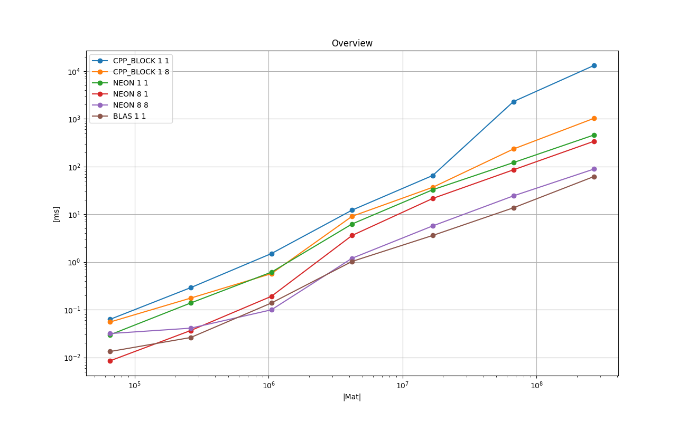
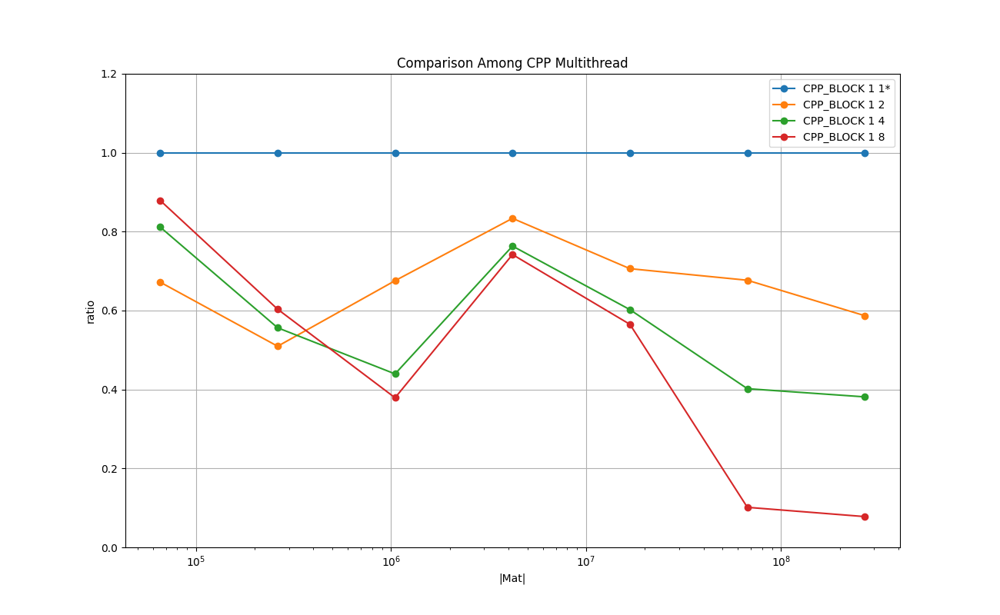
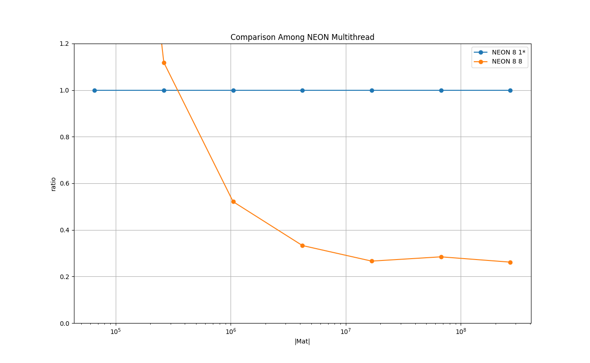

# Results on Running Time : Double, Column-Major

## Overview

### Legend

* **CPP_BLOCK 1 1** : C++ implementation - baseline

* **CPP_BLOCK 1 8** : C++ implementation with 8 threads

* **NEON 1 1** : NEON intrinsics no loop unrolling, single thread

* **NEON 8 1** : NEON intrinsics loop unrolling of factor 8, single thread

* **NEON 8 8** : NEON intrinsics loop unrolling of factor 8, 8 threads

* **BLAS 1 1** : BLAS cblas_dgemv()

### Remarks

* BLAS performs best overall. NEON 8 8 performs almost as well as BLAS.

## Comparison Among C++ Multithreaded

### Legend

* **CPP_BLOCK 1 1** : C++ implementation - baseline

* **CPP_BLOCK 1 2** : C++ implementation with 8 threads

* **CPP_BLOCK 1 4** : C++ implementation with 8 threads

* **CPP_BLOCK 1 8** : C++ implementation with 8 threads

### Remarks
This shows the effectiveness of multithreading for the plain C++ implementation.
The cost of synchronizing the threads is quickly amortized already around the size of *(256, 256)*.

## Comparison Among NEON with loop unrolling

### Legend

* **CPP_BLOCK 1 1** : C++ implementation - baseline

* **NEON 1 1** : NEON intrinsics no loop unrolling, single thread

* **NEON 2 1** : NEON intrinsics loop unrolling of factor 8, single thread

* **NEON 4 1** : NEON intrinsics loop unrolling of factor 8, single thread

* **NEON 8 1** : NEON intrinsics loop unrolling of factor 8, single thread

### Remarks
NEON intrinsics make it faster more than 200% than the plain C++ implementation.
The explicit loop unrolling improves the performance, and the sweet spot seems to be around the factor 4.

## Comparison Among NEON Multithreaded

### Legend

* **NEON 8 1** : NEON intrinsics loop unrolling of factor 8, single thread - baseline

* **NEON 8 8** : NEON intrinsics loop unrolling of factor 8, 8 threads

### Remarks

The overhead of the synchronizing multiple threads is amortized around *(1K, 1K)* and use of multithread is beneficial.

