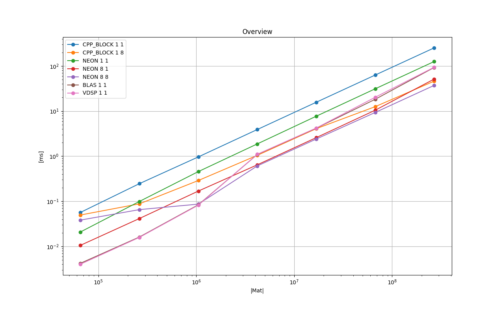
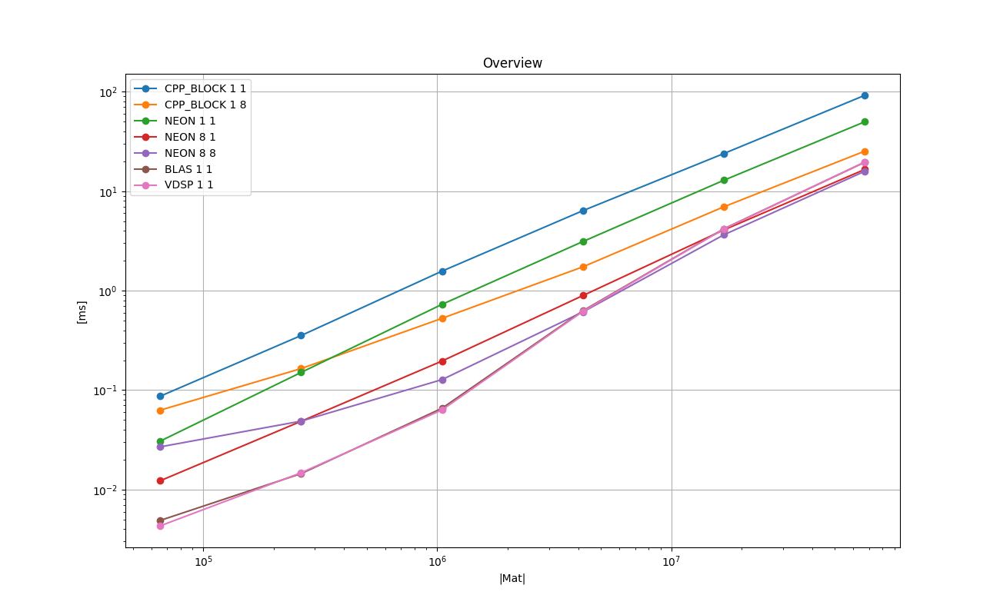
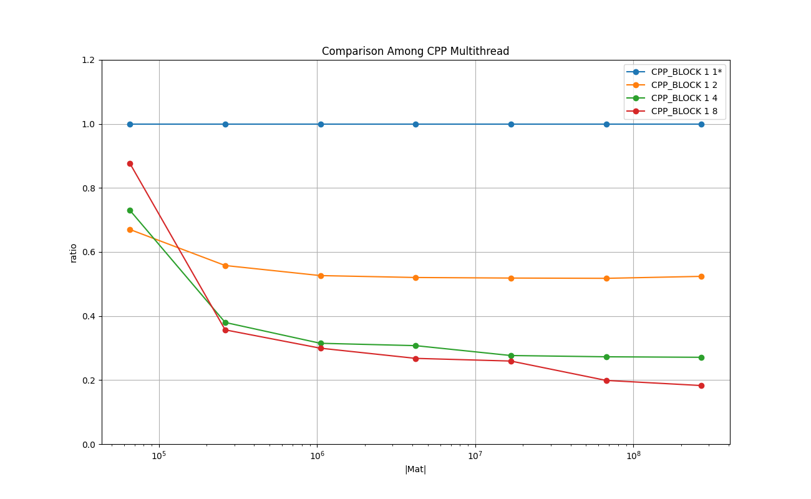
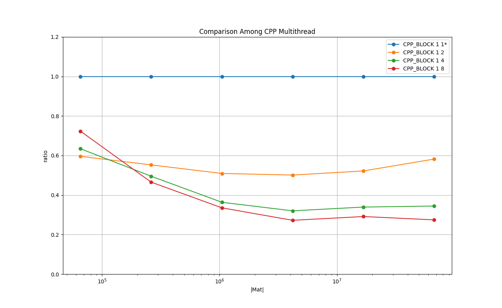
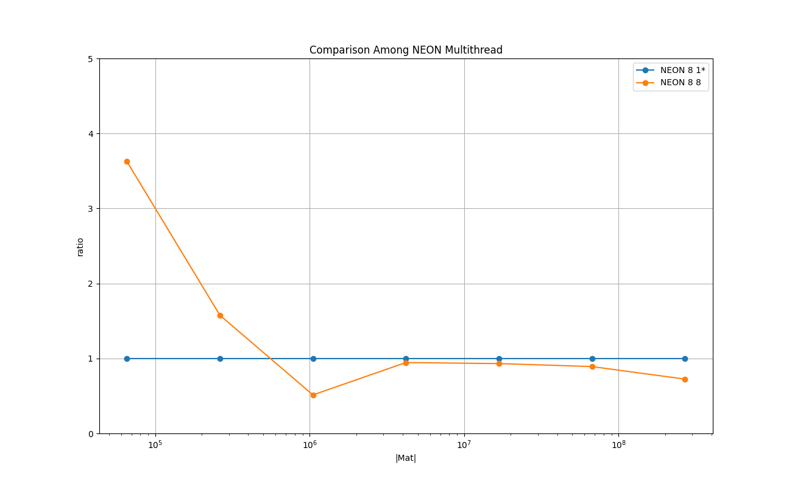
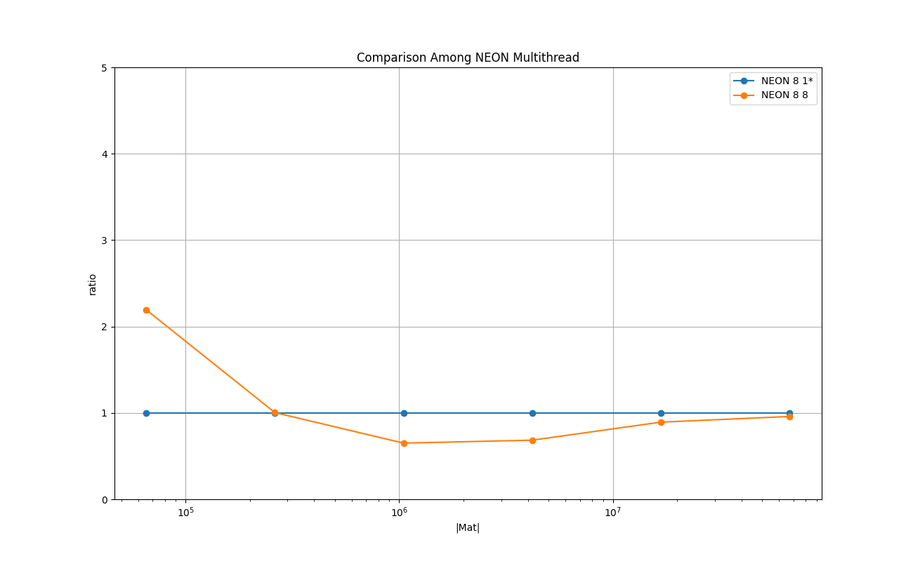

# Results on Running Time : Double, Column-Major

## Overview

### Legend

* **CPP_BLOCK 1 1** : C++ implementation - baseline

* **CPP_BLOCK 1 8** : C++ implementation with 8 threads

* **NEON 1 1** : NEON intrinsics no loop unrolling, single thread

* **NEON 8 1** : NEON intrinsics loop unrolling of factor 8, single thread

* **NEON 8 8** : NEON intrinsics loop unrolling of factor 8, 8 threads

* **BLAS 1 1** : BLAS cblas_dgemv()

* **VDSP 1 1** : vDSP vDSP_mmulD()

### Plots: Mac Mini M1 2020 8 GB

### Plots: iPhone 13 mini 256 GB

### Remarks on Mac Mini

* vDSP/BLAS shows the best running time up to the size *(1K, 1K)*.

* NEON with the loop unrolling of factor 8 with 8 threads shows the best running time from the size *(2K, 2K)*.

The plots for BLAS and VDSP are completely overlapped and only the lines for VDSP is shown above.
This implies that the two implementations are identical.

## Comparison Among C++ Multithreaded

### Legend

* **CPP_BLOCK 1 1** : C++ implementation - baseline

* **CPP_BLOCK 1 2** : C++ implementation with 8 threads

* **CPP_BLOCK 1 4** : C++ implementation with 8 threads

* **CPP_BLOCK 1 8** : C++ implementation with 8 threads

### Plots: Mac Mini M1 2020 8 GB

### Plots: iPhone 13 mini 256 GB

### Remarks on Mac Mini
This shows the effectiveness of multithreading for the plain C++ implementations.
The cost of synchronizing the threads is quickly amortized already around the size of *(256, 256)*.

## Comparison Among NEON with loop unrolling

### Legend

* **CPP_BLOCK 1 1** : C++ implementation - baseline

* **NEON 1 1** : NEON intrinsics no loop unrolling, single thread

* **NEON 2 1** : NEON intrinsics loop unrolling of factor 8, single thread

* **NEON 4 1** : NEON intrinsics loop unrolling of factor 8, single thread

* **NEON 8 1** : NEON intrinsics loop unrolling of factor 8, single thread

### Plots: Mac Mini M1 2020 8 GB

### Plots: iPhone 13 mini 256 GB

### Remarks on Mac Mini

NEON intrinsics make it run faster more than 200% than the plain C++ implementation.
The explicit loop unrolling improves the performance and the sweet spot seems to be around the factor of 4.

## Comparison Among NEON Multithreaded

### Legend

* **NEON 8 1** : NEON intrinsics loop unrolling of factor 8, single thread - baseline

* **NEON 8 8** : NEON intrinsics loop unrolling of factor 8, 8 threads - baseline

### Plots: Mac Mini M1 2020 8 GB

### Plots: iPhone 13 mini 256 GB

### Remarks on Mac Mini

The overhead of the synchronizing threads is amortized around the size *(1K, 1K)*, but use of multithreads does not seem to be particularly beneficial.

