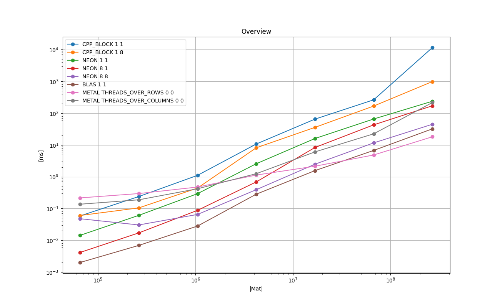
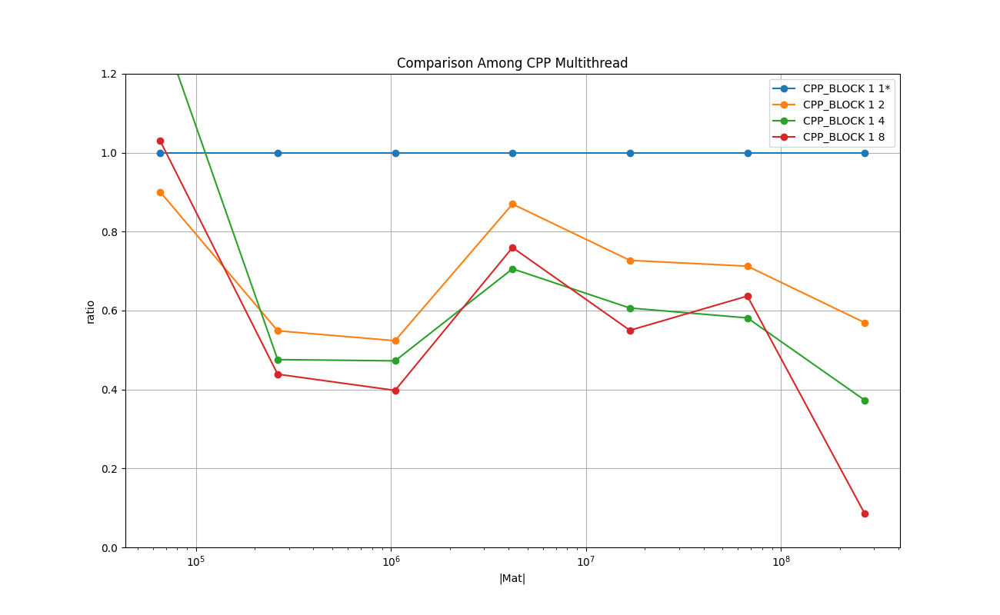
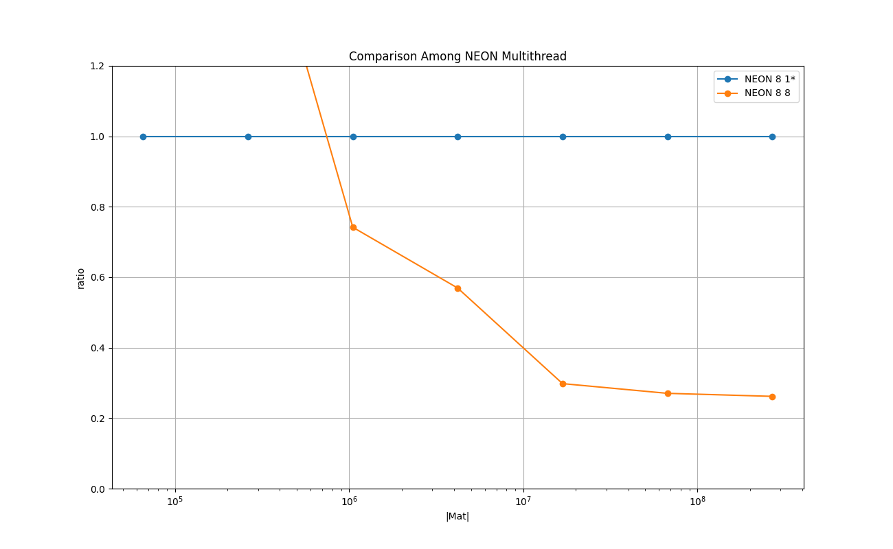
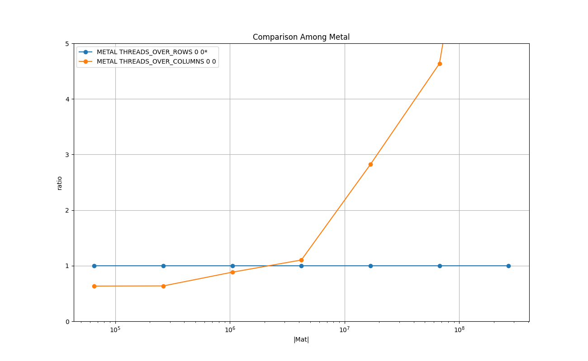

# Results on Running Time : Float, Column-Major

## Overview

### Legend

* **CPP_BLOCK 1 1** : C++ implementation - baseline

* **CPP_BLOCK 1 8** : C++ implementation with 8 threads

* **NEON 1 1** : NEON intrinsics no loop unrolling, single thread

* **NEON 8 1** : NEON intrinsics loop unrolling of factor 8, single thread

* **NEON 8 8** : NEON intrinsics loop unrolling of factor 8, 8 threads

* **BLAS 1 1**: BLAS cblas_sgemv()

* **METAL THREADS_OVER_ROWS 0 0** : Metal shader, threads over rows, loop over columns

* **METAL THREADS_OVER_COLUMNS 0 0** : Metal shader, threads over columns, reduction per row per threadgroup

### Remarks

* BLAS performs best up to *(4K, 4K)*.

* Metal threads-over-rows performs best from *(8K, 8K)*.

## Comparison Among C++ Multithreaded

### Legend

* **CPP_BLOCK 1 1** : C++ implementation - baseline

* **CPP_BLOCK 1 2** : C++ implementation with 2 threads

* **CPP_BLOCK 1 4** : C++ implementation with 4 threads

* **CPP_BLOCK 1 8** : C++ implementation with 8 threads

### Remarks
This shows the effectiveness of threadding for the plain C++ implementations.
The cost of synchronizing the threads are quickly amortized already around the size of *(256, 256)*.

## Comparison Among NEON with loop unrolling

### Legend

* **CPP_BLOCK 1 1** : C++ implementation - baseline

* **NEON 1 1** : NEON intrinsics no loop unrolling, single thread

* **NEON 2 1** : NEON intrinsics loop unrolling of factor 8, single thread

* **NEON 4 1** : NEON intrinsics loop unrolling of factor 8, single thread

* **NEON 8 1** : NEON intrinsics loop unrolling of factor 8, single thread

### Remarks
NEON intrinsics make it run more than 4 times faster than the plain C++ implementation.
The explicit unrolling improves the running time further. The sweet spot seems to be around the factor of 4.

## Comparison Among NEON Multithreaded

### Legend

* **NEON 8 1** : NEON intrinsics with loop unrolling of factor 8, single thread - baseline

* **NEON 8 8** : NEON intrinsics with loop unrolling of factor 8, 8 threads

### Remarks
The overhead of the synchronization of threads is amortized around the size *(1K, 1K)*
 and use of multithread becomes more effective as the problem size grows.

## Comparison Among Metal Implementations

### Legend

* **METAL THREADS_OVER_ROWS 0 0** : Metal shader,  threads over rows, loop over columns - baseline

* **METAL THREADS_OVER_COLUMNS 0 0** : Metal shader, threads over columns, reduction per row per threadgroup

### Remarks
Since this is for the col-major, THREADS_OVER_ROWS reads one column in the threadgroup ideally coalesced in the loop.

On the other hand, THREAD_OVER_COLUMNS reads one row per threadgroup and the threadgroup reduces it to the output element.
The memory load by the threads for one row are uncoalesced, and it increases the cache misses as the size of the row becomes larger, and it makes the execution less effective.
The chart above shows it.
