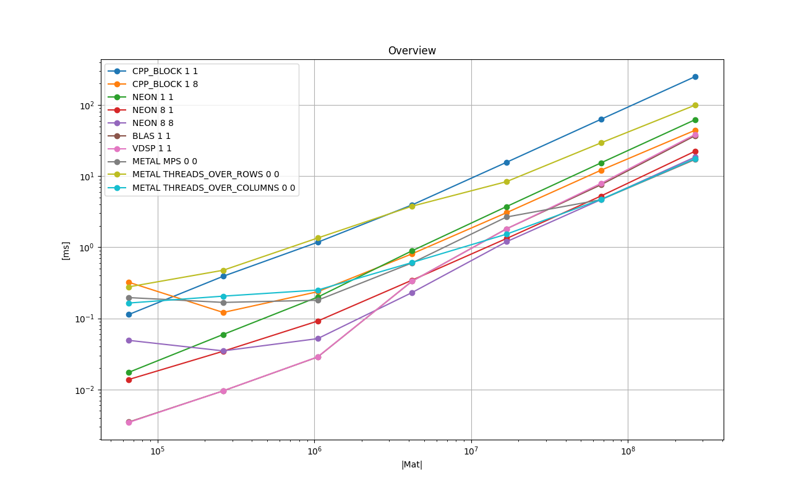
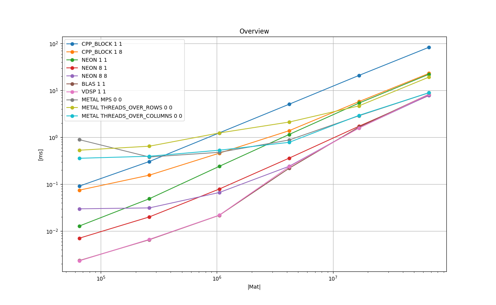
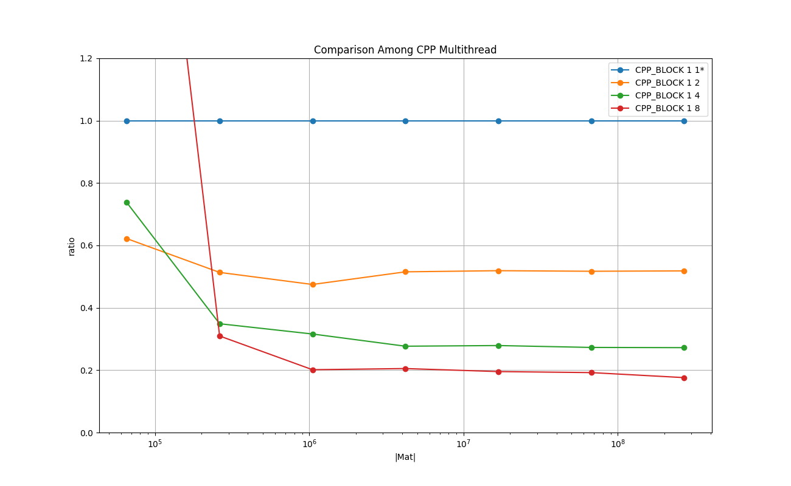
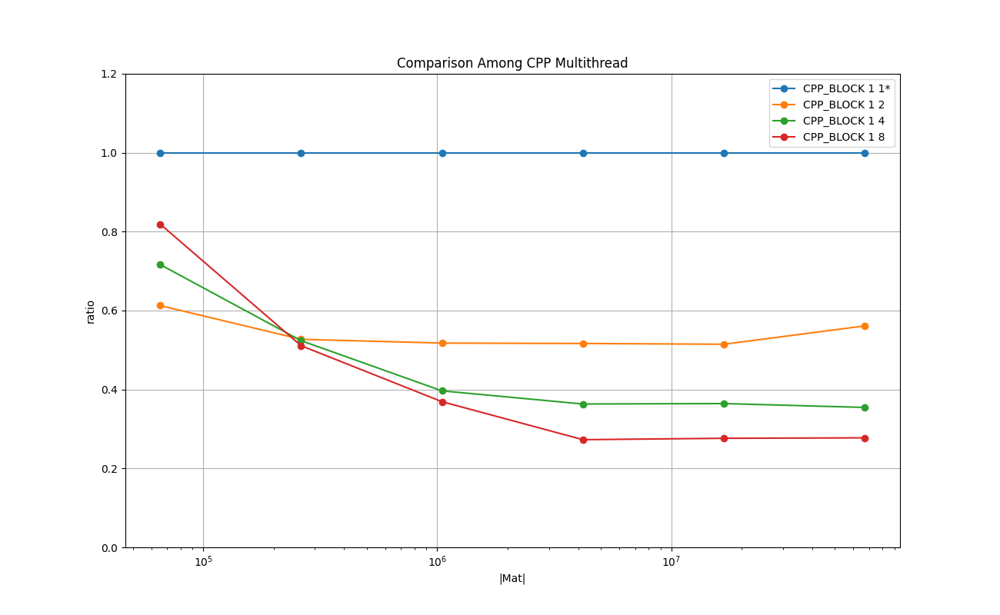
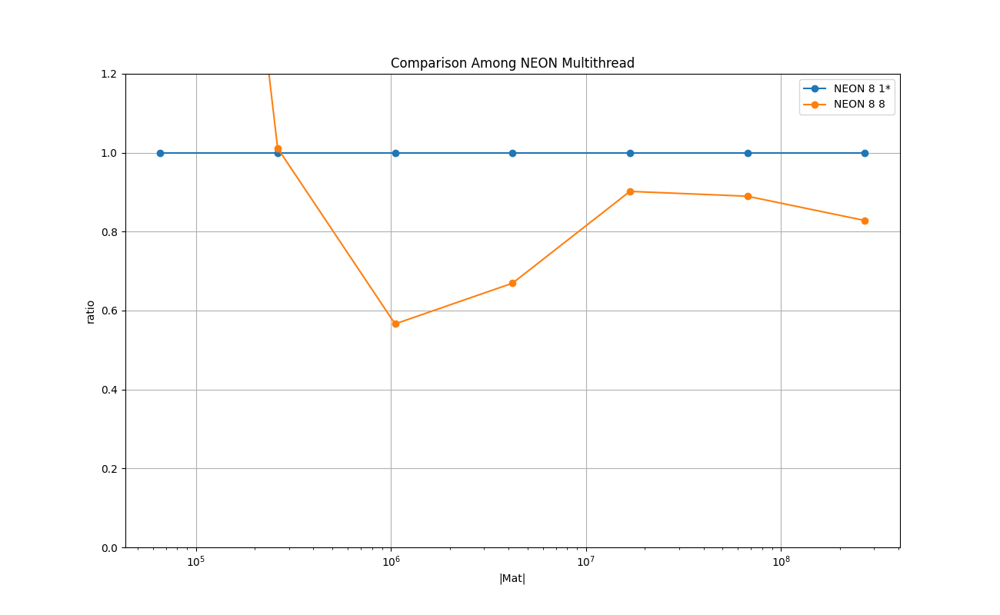
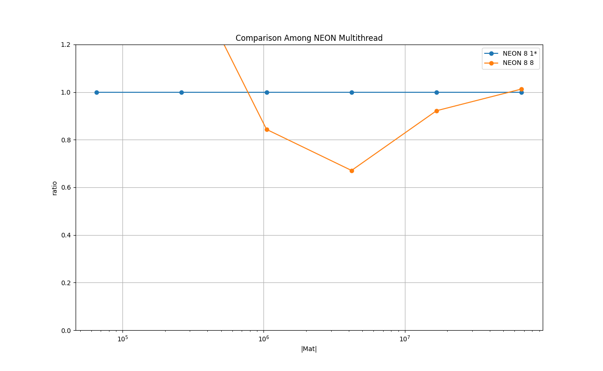
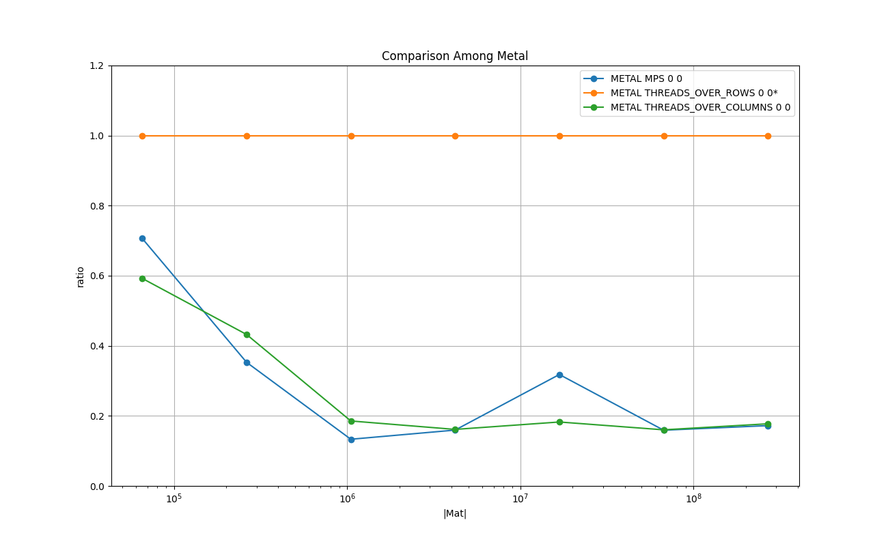
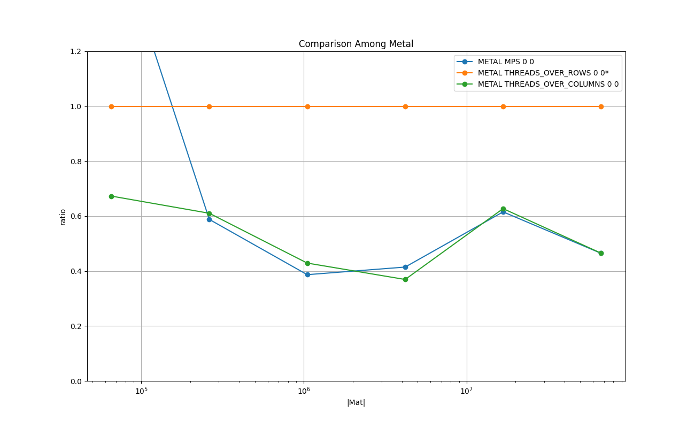

# Results on Running Time : Float, Row-Major

## Overview

### Legend

* **CPP_BLOCK 1 1** : C++ implementation - baseline

* **CPP_BLOCK 1 8** : C++ implementation with 8 threads

* **NEON 1 1** : NEON** intrinsics no loop unrolling, single thread

* **NEON 8 1** : NEON intrinsics loop unrolling of factor 8, single thread

* **NEON 8 8** : NEON intrinsics loop unrolling of factor 8, 8 threads

* **BLAS 1 1** : BLAS cblas_sgemv()

* **VDSP 1 1** : vDSP vDSP_mmul()

* **METAL MPS 0 0** : Metal MPSMatrixVectorMultiplication

* **METAL THREADS_OVER_ROWS 0 0** : Metal shader,  threads over rows, loop over columns

* **METAL THREADS_OVER_COLUMNS 0 0** : Metal shader, threads over columns, reduction per row per threadgroup

### Plots: Mac Mini M1 2020 8 GB

### Plots: iPhone 13 mini 256 GB

### Remarks on Mac Mini

* vDSP/BLAS shows the best running time for the size up to *(1K, 1K)*.

* NEON with the loop unrolling factor of 8 with 8 threads shows the best running time for the sizes from 
*(2K, 2K)* to *(4K, 4K)*.

* Beyond the size *(4K, 4K)*, METAL THREADS_OVER_COLUMNS and MPS perform best.

The plots for BLAS and VDSP are completely overlapped and only the lines for VDSP is shown above.
This implies that the two implementations are identical.

## Comparison Among C++ Multithreaded

### Legend

* **CPP_BLOCK 1 1** : C++ implementation - baseline

* **CPP_BLOCK 1 2** : C++ implementation with 8 threads

* **CPP_BLOCK 1 4** : C++ implementation with 8 threads

* **CPP_BLOCK 1 8** : C++ implementation with 8 threads

### Plots: Mac Mini M1 2020 8 GB

### Plots: iPhone 13 mini 256 GB

### Remarks on Mac Mini
This shows the effectiveness of threadding for the plain C++ implementation.
The cost of synchronizing the threads are quickly amortized already around the size of *(256, 256)*.

## Comparison Among NEON with loop unrolling

### Legend

* **CPP_BLOCK 1 1** : C++ implementation - baseline

* **NEON 1 1** : NEON intrinsics no loop unrolling, single thread

* **NEON 2 1** : NEON intrinsics loop unrolling of factor 8, single thread

* **NEON 4 1** : NEON intrinsics loop unrolling of factor 8, single thread

* **NEON 8 1** : NEON intrinsics loop unrolling of factor 8, single thread

### Plots: Mac Mini M1 2020 8 GB

### Plots: iPhone 13 mini 256 GB

### Remarks on Mac Mini
NEON intrinsics make it run faster more than 400% than the plain implementation.
The loop unrolling also improves the performance, and the sweet spot for the loop unrolling seems to be around the factor 4.

## Comparison Among NEON with Multithreads

### Legend

* **NEON 8 1** : NEON intrinsics with loop unrolling of factor 8, single thread - baseline

* **NEON 8 8** : NEON intrinsics with loop unrolling of factor 8, 8 threads - baseline

### Plots: Mac Mini M1 2020 8 GB

### Plots: iPhone 13 mini 256 GB

### Remarks on Mac Mini

The overhead of the synchrnization of threads is amortized around *(1K, 1K)* and use of multithread is beneficial, though the benefit is not as dramatic as the case for the col-major.

## Comparison Among Metal Implementations

### Legend

* **METAL THREADS_OVER_ROWS 0 0** : Metal shader, threads over rows, loop over columns - baseline

* **METAL THREADS_OVER_COLUMNS 0 0** : Metal shader, threads over columns, reduction per row per threadgroup

* **METAL MPS 0 0** : Metal MPSMatrixVectorMultiplication

### Plots: Mac Mini M1 2020 8 GB

### Plots: iPhone 13 mini 256 GB

### Remarks on Mac Mini
Since this is for the row-major, THREADS_OVER_COLUMNS reads in the threadgroup one row ideally coalesced, and the reduction is very effective.

On the other hand, THREAD_OVER_ROWS reads one columns per threadgroup and the loop in the threadgroup iterates over the columns.
The memory load by the threads for one column is uncoalesced, and it increases the cache misses as the size of the column becomes larger, and it makes the execution less effective.
The chart above shows it.

It seems MPS takes the similar approach as THREAD_OVER_COLUMNS, as two plots are similar.
