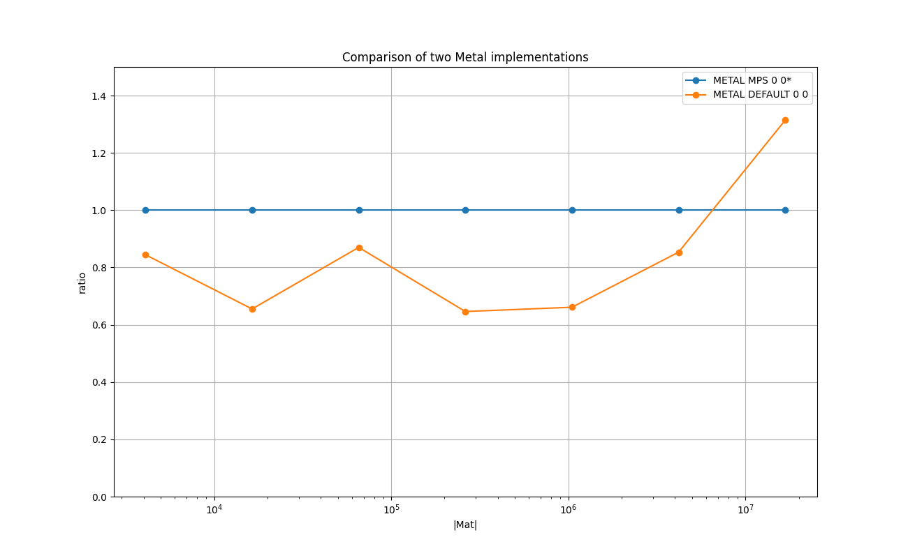
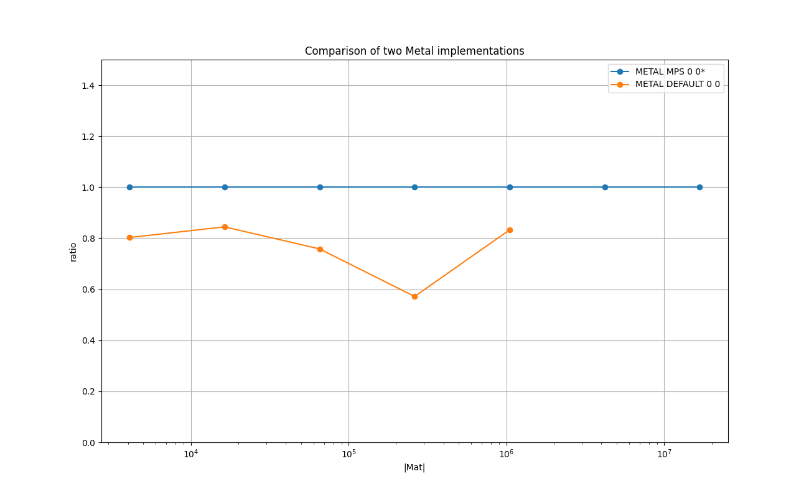
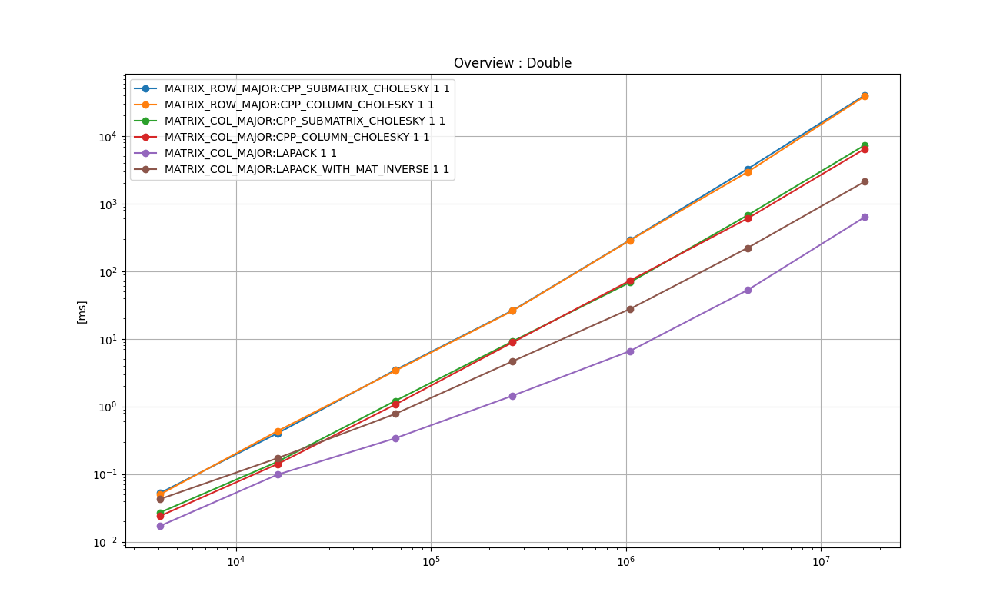

# Cholesky Factorizer & Solver

Decomposing a symmetric real PD matrix *A* into *L x Lt*, and then solving *x* for  *Ax = b*, where *L* is a lower triangular matrix, and *Lt* is the transpose of *L*.


## 0. Instruction for iOS
So far this has been tested on iPhone 13 mini 256GB.

- Open `AppleNumericalComputing/iOSTester_10/iOSTester_10.xcodeproj` with Xcode

- Build a release build

- Run the iOS App in release build

- Press 'Run' on the screen

- Wait until App finished with 'finished!' on the log output.

- Copy and paste the log into `10_cholesky_decomp/doc_ios/make_log.txt`.

- Run the following in the terminal.
```
$ cd 10_cholesky_decomp
$ grep '\(^INT\|^FLOAT\|^DOUBLE\|data element type\)' doc_ios/make_log.txt > doc_ios/make_log_cleaned.txt
$ python ../common/process_log.py -logfile doc_ios/make_log_cleaned.txt -specfile doc_ios/plot_spec.json -show_impl -plot_charts -base_dir doc_ios/
```
- You will get the PNG files in  `10_cholesky_decomp/doc_ios/`.


# 1. Key Points

* LAPACK shows best running time for all the cases

* On Metal, my shader runs about 20% faster than MPSMatrixDecompositionCholesky

# 2. Background and Context
Cholesky factorization (decomposition) is one of the major operations on the symmetric PD matrices that has many practical applications, including solution to *Ax=b*.

LAPACK provides **sposv_()** & **dposv_()**, and Apple provides **MPSMatrixDecompositionCholesky** in Metal.
There are some other public implementations such as Eigen3 and GNU scientific library, which are also tested below.

In the field of parallel computing research, the problem of the Cholesky factorization is split into two:
the parallel dense Cholesky, and the parallel sparse Cholesky.
This section deals with the dense Cholesky only, and the sparse Cholesky is out of the scope.

# 3. Purpose
The main purpose is to measure the performance of the GPU implementations, my own shader ,and MPSMatrixDecomposition against the established CPU implementations, notably LAPACK.

# 4. Results on Running Time
The following experiments are done with [test_cholesky.cpp](./test_cholesky.cpp) in this directory.

Compiler: Apple clang version 13.0.0 (clang-1300.0.29.3) Target: arm64-apple-darwin20.6.0 Thread model: posix

Device: Mac mini (M1, 2020) Chip Apple M1, Memory 8GB, macOS Big Sur Version 11.6

Please type `make all` in this directory to reproduce the results.

## 4.1. Overview : Float
The following chart shows the mean running times taken to perform one cholesky factorization and then solution to the output vector in *float* for each implementation in log-log scale.
X-axis is *(M x N)*, and Y-axis is the time taken in milliseconds.

### Legend

* **MATRIX_ROW_MAJOR:CPP_SUBMATRIX_CHOLESKY 1 1** : row-major, C++ implementation, the algorithm is type *submatrix*.

* **MATRIX_ROW_MAJOR:CPP_COLUMN_CHOLESKY 1 1** : row-major, C++ implementation, the algorithm is type *column*.

* **MATRIX_COL_MAJOR:CPP_SUBMATRIX_CHOLESKY 1 1** : col-major, C++ implementation, the algorithm is type *submatrix*.

* **MATRIX_COL_MAJOR:CPP_COLUMN_CHOLESKY 1 1** : col-major, C++ implementation, the algorithm is type *column*.

* **MATRIX_COL_MAJOR:EIGEN3 1 1** : col-major with **eigen3 Eigen::LLT**.

* **MATRIX_COL_MAJOR:LAPACK 1 1** : col-major with **LAPACK sposv_()**.

* **MATRIX_COL_MAJOR:LAPACK_WITH_MAT_INVERSE 1 1** : col-major with **LAPACK sposv_() with extra calculation of the matric inverse**.

* **MATRIX_COL_MAJOR:METAL MPS 0 0** : col-major with **MPSMatrixDecompositionCholesky**.

* **MATRIX_COL_MAJOR:METAL DEFAULT 0 0** : Metal shader, the algorithm is type *column*.

### Plots: Mac Mini M1 2020 8 GB
<a href="doc/FLOAT_ANY_Overview_:_Float.png"></a>

### Plots: iPhone 13 mini 256 GB
<a href="doc_ios/FLOAT_ANY_Overview_:_Float.png"></a>

### Remarks on Mac Mini

* LAPACK is the clear winner.

* The implementations in the col-major perform clearly better than in the row-major regardless of the underlying algorithm.

* The overhead of launching the Metal kernel is not amortized within the range of sizes tested above. Use of Metal is probably not justified.


## 4.2. Comparison Between Two Metal Implementations
The following chart shows the relative running times taken to perform one cholesky factorization and then solution to the output vector in *float* with for two Metal implementations in log-lin scale.
X-axis is *(M x N)*, and Y-axis is the relative running time of each implementation relative to 'MATRIX_COL_MAJOR:METAL MPS 0 0', which is fixed at 1.

### Legend

* **MATRIX_COL_MAJOR:METAL MPS 0 0** : **MPSMatrixDecompositionCholesky**.

* **MATRIX_COL_MAJOR:METAL DEFAULT 0 0** : own shader, the algorithm is type *column*.

### Plots: Mac Mini M1 2020 8 GB
<a href="doc/FLOAT_MATRIX_COL_MAJOR_Comparison_of_two_Metal_implementations_relative.png"></a>

### Plots: iPhone 13 mini 256 GB
<a href="doc_ios/FLOAT_MATRIX_COL_MAJOR_Comparison_of_two_Metal_implementations_relative.png"></a>

### Remarks on Mac Mini
My implementation based on the algorithm *column cholesky* performs better than **MPSMatrixDecompositionCholesky**.

## 4.3. Overview : Double
The following chart shows the mean running times taken to perform one cholesky factorization and then solution to the output vector in *double* 
for each implementation in log-log scale. X-axis is *(M x N)*, and Y-axis is the time taken in milliseconds.

### Legend

* **MATRIX_ROW_MAJOR:CPP_SUBMATRIX_CHOLESKY 1 1** : row-major, C++ implementation, the algorithm is type *submatrix*.

* **MATRIX_ROW_MAJOR:CPP_COLUMN_CHOLESKY 1 1** : row-major, C++ implementation, the algorithm is type *column*.

* **MATRIX_COL_MAJOR:CPP_SUBMATRIX_CHOLESKY 1 1** : col-major, C++ implementation, the algorithm is type *submatrix*.

* **MATRIX_COL_MAJOR:CPP_COLUMN_CHOLESKY 1 1** : col-major, C++ implementation, the algorithm is type *column*.

* **MATRIX_COL_MAJOR:EIGEN3 1 1** : col-major with Eigen3 **Eigen::LLT**.

* **MATRIX_COL_MAJOR:LAPACK 1 1** : col-major with LAPACK **sposv_()**.

* **MATRIX_COL_MAJOR:LAPACK_WITH_MAT_INVERSE 1 1** : col-major with **LAPACK sposv_() with extra calculation of the matric inverse**.

* **MATRIX_COL_MAJOR:GSL 1 1** : col-major with **gsl_linalg_cholesky_decomp()**.

### Plots: Mac Mini M1 2020 8 GB
<a href="doc/DOUBLE_ANY_Overview_:_Double.png"></a>

### Plots: iPhone 13 mini 256 GB
<a href="doc_ios/DOUBLE_ANY_Overview_:_Double.png"></a>

### Remarks on Mac Mini

* LAPACK is the clear winner.

* The implementations in the col-major perform clearly better than in the row-major regardless of the underlying algorithm.


# 5. Implementations
This section briefly describes each of the implementations tested with some key points in the code.
Those are executed as part of the test program in [test_cholesky.cpp](./test_cholesky.cpp).
The top-level object in the 'main()' function is **TestExecutorCholesky**, which is a subclass of **TestExecutor found**
 in [../common/test_case_with_time_measurements.h](../common/test_case_with_time_measurements.h).
It manages one single test suite, which consists of test cases.
It arranges the input data, allocates memory, executes each test case multiple times and measures the running times, cleans up, and reports the results.
Each implementation type is implemented as a **TestCaseCholesky**, which is a subclass of **TestCaseWithTimeMeasurements**
 in [../common/test_case_with_time_measurements.h](../common/test_case_with_time_measurements.h).
The main part is implemented in **TestCaseCholesky::run()**, and it is the subject for the running time measurements.


## 5.1. CPP_SUBMATRIX_CHOLESKY 1 1 - algorithm type *submatrix*
[**class TestCaseCholesky_baseline** in test_case_cholesky_baseline.h](./test_case_cholesky_baseline.h)


This corresponds to 'The cholesky algorithm' in [Wikipedia](https://en.wikipedia.org/wiki/Cholesky_decomposition).
Following is an excerpt from [test_case_cholesky_baseline.h](./test_case_cholesky_baseline.h).
```
template<class T, bool IS_COL_MAJOR>
static void factorize_in_place_submatrix_cholesky( T* A, const int dim )
{
    for ( int k = 0; k < dim; k++ ) {

        const T A_kk = sqrt( A[ lower_mat_index<IS_COL_MAJOR>( k, k, dim ) ] );

        A[ lower_mat_index<IS_COL_MAJOR>( k, k, dim ) ] = A_kk;

        for ( int i = k + 1; i < dim ; i++ ) {

            A[ lower_mat_index<IS_COL_MAJOR>( i, k, dim ) ] /= A_kk;
        }

        for ( int j = k + 1; j < dim ; j++ ) {

            for ( int i = j; i < dim; i++ ) {

                A[ lower_mat_index<IS_COL_MAJOR>( i, j, dim ) ]
                    -= ( A[ lower_mat_index<IS_COL_MAJOR>( i, k, dim ) ] * A[ lower_mat_index<IS_COL_MAJOR>( j, k, dim )] );
            }
        }
    }
}
```

## 5.2. CPP_COLUMN_CHOLESKY 1 1 - algorithm type parallelizable *column cholesky*
[**class TestCaseCholesky_baseline** in test_case_cholesky_baseline.h](./test_case_cholesky_baseline.h)

This is a version of the parallelizable algorithms described in [UoI course](https://courses.engr.illinois.edu/cs554/fa2015/notes/07_cholesky.pdf).

Following is an excerpt from [test_case_cholesky_baseline.h](./test_case_cholesky_baseline.h).
```
template<class T, bool IS_COL_MAJOR>
static void factorize_in_place_column_cholesky( T* A, const int dim )
{
    for ( int j = 0; j < dim; j++ ) {

        for ( int k = 0 ; k < j - 1; k++ ) {

            for ( int i = j; i < dim; i++ ) {

                A[ lower_mat_index<IS_COL_MAJOR>( i, j, dim ) ]

                    -= ( A[ lower_mat_index<IS_COL_MAJOR>( i, k, dim ) ] * A[ lower_mat_index<IS_COL_MAJOR>( j, k, dim ) ] );
            }
        }

        const T A_jj = sqrt( A[ lower_mat_index<IS_COL_MAJOR>( j, j, dim ) ] );
        A[ lower_mat_index<IS_COL_MAJOR>( j, j, dim ) ] = A_jj;

        for ( int i = j + 1; i < dim ; i++ ) {

            A[ lower_mat_index<IS_COL_MAJOR>( i, j, dim ) ] /= A_jj;
        }
    }
}
```

The two parts in the loop body before and after the *A_jj* assignment are parallelizable.
However NEON or Multi-thread version is not implemented for this study due to high complexity.

## 5.3. EIGEN3 1 1 - Eigen3 library
[**class TestCaseCholesky_eigen3** in test_case_cholesky_baseline.h](./test_case_cholesky_eigen3.h)

This uses [the Eigen3 library](http://eigen.tuxfamily.org/dox/classEigen_1_1LLT.html).

Following is an excerpt from [test_case_cholesky_eigen3.h ](./test_case_cholesky_eigen3.h).
```
#include <Eigen/Cholesky>
...

Eigen::Matrix<T, Eigen::Dynamic, Eigen::Dynamic> eA;
Eigen::Matrix<T, Eigen::Dynamic, Eigen::Dynamic> eL;
Eigen::Matrix<T, Eigen::Dynamic, 1>              ex;
Eigen::Matrix<T, Eigen::Dynamic, 1>              eb;
...
Eigen::LLT< Eigen::Matrix<T, Eigen::Dynamic, Eigen::Dynamic> , Eigen::Lower > llt( eA );

eL = llt.matrixL();
ex = llt.solve( eb );
```

## 5.4. LAPACK 1 1
[**class TestCaseCholesky_lapack** in test_case_cholesky_baseline.h](./test_case_cholesky_lapack.h)

This uses [LAPACK](http://www.netlib.org/lapack/).
It uses  `sposv_()` for float, and `dposv_()` for double.
The implementation is found in [test_case_cholesky_lapack.h](./test_case_cholesky_lapack.h).

Another example code is found in [this Intel site](https://software.intel.com/sites/products/documentation/doclib/mkl_sa/11/mkl_lapack_examples/sposv_ex.c.htm).

## 5.5. GSL 1 1 - GNU Scientific Library
[**class TestCaseCholesky_gsl** in test_case_cholesky_baseline.h](./test_case_cholesky_gsl.h)

This implementation is for double only.
This implementation uses **gsl_linalg_cholesky_decomp1()** and **gsl_linalg_cholesky_solve()**.

The documentation is found in [the official documentation at gnu.org](https://www.gnu.org/software/gsl/doc/html/linalg.html).

The test implementation is found in [test_case_cholesky_gsl.cpp](./test_case_cholesky_gsl.cpp).

## 5.6. METAL MPS 0 0
[**class TestCaseCholesky_metal** in test_case_cholesky_baseline.h](./test_case_cholesky_metal.h)

This implementation uses **MPSMatrixDecompositionCholesky** and **MPSMatrixSolveTriangular** in MPS.
Please see [metal/cholesky_metal_objc_mps.mm](./metal/cholesky_metal_objc_mps.mm) for details.

## 5.7. METAL DEFAULT 0 0
[**class TestCaseCholesky_metal** in test_case_cholesky_baseline.h](./test_case_cholesky_metal.h)

This is my own kernel in *column cholesky* algorithm.

Following is an excerpt from the decomposition kernel.
The outer loop iterates over the column and in the body threads are assigned the rows to parallelize.
Please see [metal/cholesky.metal](./metal/cholesky.metal) for details.

```
kernel void decompose_cholesky (

    device float* L [[ buffer(0) ]],
    ...
) {

    threadgroup float recip_a_jj;

    threadgroup float col_cache[1024];

    const int DIM = (int)constants.dim;

    for ( int col = 0; col < DIM; col++ ) {

        if ( col > 0 ) {
            threadgroup_barrier(  mem_flags::mem_device );
        }

        const int first_valid_row_pos = ((int)(col / 1024)) * 1024;

        const int remaining_col = DIM - col;

        for ( int iter_row_pos = first_valid_row_pos; iter_row_pos < DIM; iter_row_pos += 1024 ) {

            const int row = iter_row_pos + thread_position_in_threadgroup;

            const int Lpos = lower_mat_index( row, col, DIM );

            if ( row >= col && row < DIM ) {

                float Lval = L[ Lpos ];

                for ( int k = 0; k < col; k++ ) {

                    Lval -= ( L [ lower_mat_index( row, k, DIM ) ] * L [ lower_mat_index( col, k, DIM ) ] );
                }
                if ( col == row ) {

                    Lval = sqrt(Lval);
                    recip_a_jj = 1.0 / Lval;
                }

                if ( remaining_col <= 1024 ) {
                    col_cache[ thread_position_in_threadgroup ] = Lval;
                }
                else {
                    L [ Lpos ] = Lval;
                }
            }
        }

        if ( remaining_col > 1024 ) {

            threadgroup_barrier(  mem_flags::mem_device );
        }

        threadgroup_barrier( mem_flags::mem_threadgroup );

        for ( int iter_row_pos = first_valid_row_pos; iter_row_pos < DIM; iter_row_pos += 1024 ) {

            const int row = iter_row_pos + thread_position_in_threadgroup;

            const int Lpos = lower_mat_index( row, col, DIM );

            if ( remaining_col > 1024 ) {

                if ( row > col && row < DIM ) {

                    L [ Lpos ] = L [ Lpos ] * recip_a_jj;
                }
            }
            else {

                if ( row >= col && row < DIM ) {
                    if (row == col) {
                        L [ Lpos ] = col_cache[ thread_position_in_threadgroup ];
                    }
                    else {
                        L [ Lpos ] = col_cache[ thread_position_in_threadgroup ] * recip_a_jj;
                    }
                }
            }
        }
    }
}
```
And the following is the forward substitution to solve *Ly = b*.
The outer loop iterates over the rows, and threads are assigned the columns to parallelize, and then reduction is performed.
Following is an excerpt from **solve_Lyeb()** in  in [metal/cholesky.metal](./metal/cholesky.metal) for details.

```
kernel void solve_Lyeb (

    device float*                    L                              [[ buffer(0) ]],

    device float*                    y                              [[ buffer(1) ]],

    device float*                    b                              [[ buffer(2) ]],
    ...
) {
    threadgroup float sum_cache[1024];

    const int DIM = (int)constants.dim;

    for ( int row = 0; row < DIM; row++ ) {

        // local sum
        float sum = 0.0;
        for ( int col_pos_offset = 0; col_pos_offset < row; col_pos_offset += 1024 ) {

            const int col_pos = col_pos_offset + thread_position_in_threadgroup;
            if (col_pos < row ) {
                sum += ( L [ lower_mat_index( row, col_pos, DIM ) ] * y[col_pos] );
            }
        }

        sum_cache[ thread_position_in_threadgroup ] = sum;
        threadgroup_barrier( mem_flags::mem_threadgroup );

        // reduce
        for ( int i = 512; i > 0 ; i = i >> 1 ) {
            if ( (int)thread_position_in_threadgroup < i ) {

                sum_cache[ thread_position_in_threadgroup ] += sum_cache[ thread_position_in_threadgroup + i ];
            }
            threadgroup_barrier( mem_flags::mem_threadgroup );
        }

        if ( thread_position_in_threadgroup == 0 ) {
            y[row] = ( b[row] - sum_cache[ thread_position_in_threadgroup ] )/ L [ lower_mat_index( row, row, DIM ) ];
        }
    }
}
```

The backward substitution is done in a similar way. Please see ` solve_Ltxey()` in [metal/cholesky.metal](./metal/cholesky.metal) for details.


# 6. References

* [Wiki Page: Cholesky Decomposition](https://en.wikipedia.org/wiki/Cholesky_decomposition)

* [Course Notes From Univercity of Illinois](https://courses.engr.illinois.edu/cs554/fa2015/notes/07_cholesky.pdf) - explains the submatrix cholesky and the column cholesky