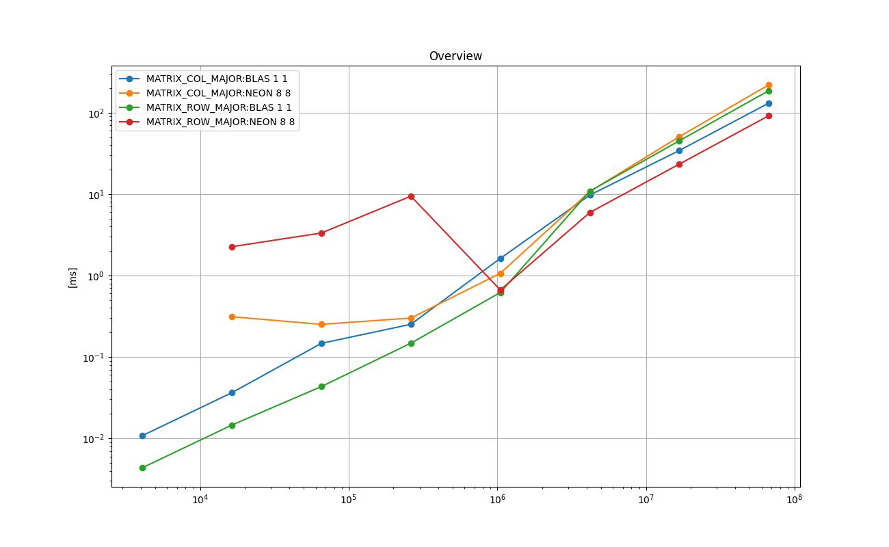

# Jacobi Iterative Solver

Jacobi solver is an iterative solver mainly used to solve linear equations with PD matrices.

The following shows the basic idea to derive the iteration.
```
           Ax = b
(A - D)x + Dx = b 
           Dx = b - (A-D)x
            x = (b - (A-D)x) / D
therefore
x_{t+1} = (b - (A-D)x_{t}) * D_inv
```
The convergence holds if *A* is *diagonally dominant*, such as PD.

As shown above, the main operations are the matrix-vector multiplication, vector subtraction, and element-wise multiplication.
Also the implementations below include the calculation of RMS of *x_new* and *x_old* in the each iteration to check the convergence.


# 1. Key Points

* BLAS does not provide a direct solver, but combination of BLAS Mat-Vec multplier and vDSP's vector operations performs best among CPU implementations.

* NEON implementations with an explicit loop unrolling with multithreads work almost as well as BLAS.
For problems in the *row-major* whose sizes are *(1K, 1K)* or greater, it performs best among CPU implementations.

* The overhead of METAL is amortized at around the size of *(2K , 2K)*, and they work best for the problem sizes *(4K, 4K)* or greater.

# 2. Background and Context

The Jacobi solver is a popular iterative algorithm to solve linear equations with PD matrices.
It is probably the simplest iterative algorithm.
LAPACK does not provide a direct solution, but a solver can be constructed from BLAS's **cblas_sgemv()**, **cblas_dgemv()**, and other vDSP routines available.
Also, it is realtively straightforward to implement it in C++ with NEON as well as in Metal.
For the *row-major*, a reduction technique over each row can be used to perform the matrix-vector multiplication efficiently.

# 3. Purpose
The purpose is to find the best way to implement the solver in both CPU and GPU. Also, since this is a simple algorithm, it is a good material to study the effect of using NEON, the loop unrolling, multi-threading, and the difference between the *column-major* and the *row-major*.

# 4. Results on Running Time
This section an overview for each of *float* and *double*.

This section is split further into 4 separate files.
Please see the following 4 READMEs for the *per-type* results.

*  [Float Column-Major](./README_runningtime_float_colmajor.md)

*  [Float Row-Major](./README_runningtime_float_rowmajor.md)

*  [Double Column-Major](./README_runningtime_double_colmajor.md)

*  [Double Row-Major](./README_runningtime_double_rowmajor.md)

## 4.1. Overview : Float
The following chart shows the mean running times taken to perform 10 iterations of the Jacobian method in *float*
for the representative implementations from both column-major and row-major in log-log scale.
X-axis is the number of elements, or *M x M*, and Y-axis is the time taken in milliseconds.

This can be used as an indicator for the decision on whether to use the column-major or the row-major.

### Legend

* **MATRIX_COL_MAJOR:BLAS 1 1**: combination of **cblas_sgemv()**, **vDSP_vdiv()** and **vDSP_vsbm()**.

* **MATRIX_COL_MAJOR:METAL DEFAULT 0 0**: own kernel, threads over rows, loop over columns

* **MATRIX_ROW_MAJOR:BLAS 1 1**: combination of cblas_sgemv(), vDSP_vdiv() and vDSP_vsbm().

* **MATRIX_ROW_MAJOR:NEON 8 8**: NEON intrinsics with loop unrolling factor 8, 8 threads

* **MATRIX_ROW_MAJOR:METAL DEFAULT 0 0**: Metal kernel, threads over columns, reduction over one row per thread-group

<a href="doc/FLOAT_ANY_Overview.png"></a>

### Remarks


## 4.2. Overview : Double
The following chart shows the mean running times taken to perform 10 iterations of the Jacobian method in *double*
for the representative implementations from both column-major and row-major in log-log scale.
X-axis is the number of elements, or *M x M*, and Y-axis is the time taken in milliseconds.

This can be used as an indicator for the decision on whether to use the column-major or the row-major.

### Legend

* **MATRIX_COL_MAJOR:BLAS 1 1**: combination of **cblas_dgemv()**, **vDSP_vdivD()** and **vDSP_vsbmD()**.

* **MATRIX_COL_MAJOR:NEON 8 8**: NEON intrinsics with loop unrolling factor 8, 8 threads

* **MATRIX_ROW_MAJOR:BLAS 1 1**: combination of **cblas_dgemv()**, **vDSP_vdivD()** and **vDSP_vsbmD()**.

* **MATRIX_ROW_MAJOR:NEON 8 8**: NEON intrinsics with loop unrolling factor 8, 8 threads

<a href="doc/DOUBEL_ANY_Overview.png"></a>

### Remarks


# 5. Implementations
This section briefly describes each of the implementations tested with some key points in the code.
Those are executed as part of the test program in [test_jacobi_solver.cpp](./test_jacobi_solver.cpp).
The top-level object in the 'main()' function is **TestExecutorJacobiSolver**, which is a subclass of **TestExecutor found**
in [../common/test_case_with_time_measurements.h](../common/test_case_with_time_measurements.h).
It manages one single test suite, which consists of test cases.
It arranges the input data, allocates memory, executes each test case multiple times and measures the running times, cleans up, and reports the results.
Each implementation type is implemented as a **TestCaseJacobiSolver**, which is a subclass of **TestCaseWithTimeMeasurements**
in [../common/test_case_with_time_measurements.h](../common/test_case_with_time_measurements.h).
The main part is implemented in **TestCaseJacobiSolver::run()**, and it is the subject for the running time measurements.


## 5.1. CPP_BLOCK 1 1 : plain C++ implementation - baseline
[**class TestCaseJacobiSolver_baseline** in test_jacobi_solver.cpp](./test_jacobi_solver.cpp)

This is a plain C++ implementation as the baseline for the experiments.
The main part is shown as follows.

```
for ( int i = 0; i < dim; i++ ) {

    T sum = 0.0;

    for ( int j = 0; j < dim; j++ ) {
        sum += ( A[ i + dim * j ] * x2[j] );
    }

    x1[i] = (b[i] - sum) * Dinv[ i ];
}
```
Please see `class TestCaseJacobiSolver_baseline` in [test_jacobi_solver.cpp](./test_jacobi_solver.cpp) for details.


## 5.2. NEON 1 1
[**class TestCaseJacobiSolver_NEON** in test_jacobi_solver.cpp](./test_jacobi_solver.cpp)


First, to avoid division, it calculates the reciprocal of the diagonal elements as follows.

Float:
```
for (int i = 0; i < dim; i += 4 ) {

    const float32x4_t qw_d1       = { D[i  ], D[i+1], D[i+2], D[i+3] };
    const float32x4_t qw_d_inv1_1 = vrecpeq_f32( qw_d1 );
    const float32x4_t qw_d_inv2_1 = vmulq_f32( vrecpsq_f32( qw_d1, qw_d_inv1_1 ), qw_d_inv1_1 );

    memcpy(&(Dinv[i]), &qw_d_inv2_1, sizeof(float)*4);
}
```

Double:
```
for (int i = 0; i < dim; i+=2 ) {

    const float64x2_t qw_d1       = { D[i  ], D[i+1] };
    const float64x2_t qw_d_inv1_1 = vrecpeq_f64( qw_d1 );
    const float64x2_t qw_d_inv2_1 = vmulq_f64( vrecpsq_f64( qw_d1, qw_d_inv1_1 ), qw_d_inv1_1 );
    const float64x2_t qw_d_inv3_1 = vmulq_f64( vrecpsq_f64( qw_d1, qw_d_inv2_1 ), qw_d_inv2_1 );

    memcpy(&(Dinv[i]), &qw_d_inv3_1, sizeof(double)*2);
}
```

And the following is executed as the main part of the iteration.

Float Column-Major:
```
for ( int i = row_begin; i < row_end_past_one; i += 4 ) {

    float32x4_t qw_row_sum1 = { 0.0, 0.0, 0.0, 0.0 };

    for ( int j = 0; j < dim; j++ ) {

        const float       col_v   = x2[j];
        const float32x4_t qw_mat1 = vld1q_f32( &(A[ i + dim * j ]) );
        const float32x4_t qw_col  = { col_v, col_v, col_v, col_v };
        const float32x4_t qw_mc1  = vmulq_f32( qw_mat1, qw_col );

        qw_row_sum1 = vaddq_f32( qw_mc1, qw_row_sum1 );
    }

    const float32x4_t qw_b1           = vld1q_f32( &(b[i]) );
    const float32x4_t qw_Dinv1        = vld1q_f32( &(Dinv[i]) );
    const float32x4_t qw_b_minus_sum1 = vsubq_f32( qw_b1, qw_row_sum1 );
    const float32x4_t qw_x1_1         = vmulq_f32( qw_b_minus_sum1 , qw_Dinv1 );

    memcpy( &(x1[i  ]), &qw_x1_1, sizeof(float)*4 );
}
```

Double Column-Major:
```
for ( int i = row_begin; i < row_end_past_one; i += 2 ) {

    float64x2_t qw_row_sum1 = { 0.0, 0.0 };

    for ( int j = 0; j < dim; j++ ) {

        const double      col_v   = x2[j];
        const float64x2_t qw_mat1 = vld1q_f64( &(A[ i + dim * j ]) );
        const float64x2_t qw_col  = { col_v, col_v };
        const float64x2_t qw_mc1  = vmulq_f64( qw_mat1, qw_col );

        qw_row_sum1 = vaddq_f64( qw_mc1, qw_row_sum1 );
    }

    const float64x2_t qw_b1           = vld1q_f64( &(b[i]) );
    const float64x2_t qw_Dinv1        = vld1q_f64( &(Dinv[i]) );
    const float64x2_t qw_b_minus_sum1 = vsubq_f64( qw_b1, qw_row_sum1 );
    const float64x2_t qw_x1_1         = vmulq_f64( qw_b_minus_sum1 , qw_Dinv1 );

    memcpy( &(x1[i]), &qw_x1_1, sizeof(double)*2 );
}
```

Float Row-Major
```
for ( int i = row_begin; i < row_end_past_one; i++ ) {

    float32x4_t qw_lanewise_sum1 = { 0.0, 0.0, 0.0, 0.0 };

    for ( int j = 0; j < dim; j+=4 ) {

        const float32x4_t qw_mat1 = vld1q_f32( &(A[ dim * i + j ] ) );
        const float32x4_t qw_col1 = vld1q_f32( &(x2[ j ] ) );
        const float32x4_t qw_mc1  = vmulq_f32( qw_mat1, qw_col1 );
        qw_lanewise_sum1 = vaddq_f32( qw_mc1, qw_lanewise_sum1 );
    }
    const float sum =   qw_lanewise_sum1[0] + qw_lanewise_sum1[1] + qw_lanewise_sum1[2] + qw_lanewise_sum1[3];
    x1[i] = (b[i] - sum ) * Dinv[i];
}
```

Double Row-Major
```
for ( int i = row_begin; i < row_end_past_one; i++ ) {

    float64x2_t qw_lanewise_sum1 = { 0.0, 0.0 };

    for ( int j = 0; j < this->m_dim; j+=2 ) {

        const float64x2_t qw_mat1 = vld1q_f64( &(A[ dim * i + j     ] ) );
        const float64x2_t qw_col1 = vld1q_f64( &(x2[ j     ] ) );
        const float64x2_t qw_mc1  = vmulq_f64( qw_mat1, qw_col1 );
        qw_lanewise_sum1 = vaddq_f64( qw_mc1, qw_lanewise_sum1 );
    }
    const double sum = qw_lanewise_sum1[0] + qw_lanewise_sum1[1];
                             
    x1[i] = (b[i] - sum ) * Dinv[i];
}
```

Finally, the distance of new X and hte old X is calculated to check the convergence.

Float:
```
for ( int i = 0; i < dim; i+=4 ) {

    const float32x4_t qw_x1_1  = vld1q_f32( &(x1[ i ] ) );
    const float32x4_t qw_x2_1  = vld1q_f32( &(x2[ i ] ) );
    const float32x4_t qw_diff1 = vsubq_f32( qw_x1_1, qw_x2_1 );
    const float32x4_t qw_sq1   = vmulq_f32( qw_diff1,  qw_diff1 ); 
    sum_sq_dist += ( qw_sq1[0] + qw_sq1[1] + qw_sq1[2] + qw_sq1[3] );
}
dist = sqrt( sum_sq_dist );
```

Double:
```
for ( int i = 0; i < dim; i+=4 ) {

    const float64x2_t qw_x1_1  = vld1q_f64( &(x1[ i ] ) );
    const float64x2_t qw_x2_1  = vld1q_f64( &(x2[ i ] ) );
    const float64x2_t qw_diff1 = vsubq_f64( qw_x1_1, qw_x2_1 );
    const float64x2_t qw_sq1   = vmulq_f64( qw_diff1,  qw_diff1 ); 
    sum_sq_dist += ( qw_sq1[0] + qw_sq1[1] );
}
dist = sqrt( sum_sq_dist );
```

Please see `class TestCaseJacobiSolver_NEON` in [test_jacobi_solver.cpp](./test_jacobi_solver.cpp) for details.


## 5.3. NEON X 1
[**class TestCaseJacobiSolver_NEON** in test_jacobi_solver.cpp](./test_jacobi_solver.cpp)

This is based on 'NEON 1 1' with the loop bodies unrolled according to the given factor.

Following is the main loop body in float and with loop unrolling factor of 4 as an example.

```
for ( int i = row_begin; i < row_end_past_one; i += 16 ) {

    float32x4_t qw_row_sum1 = { 0.0, 0.0, 0.0, 0.0 };
    float32x4_t qw_row_sum2 = { 0.0, 0.0, 0.0, 0.0 };
    float32x4_t qw_row_sum3 = { 0.0, 0.0, 0.0, 0.0 };
    float32x4_t qw_row_sum4 = { 0.0, 0.0, 0.0, 0.0 };

    for ( int j = 0; j < dim; j++ ) {

        const float       col_v   = x2[j];
        const float32x4_t qw_mat1 = vld1q_f32( &(A[ i      + dim * j ]) );
        const float32x4_t qw_mat2 = vld1q_f32( &(A[ i +  4 + dim * j ]) );
        const float32x4_t qw_mat3 = vld1q_f32( &(A[ i +  8 + dim * j ]) );
        const float32x4_t qw_mat4 = vld1q_f32( &(A[ i + 12 + dim * j ]) );
        const float32x4_t qw_col  = { col_v, col_v, col_v, col_v };
        const float32x4_t qw_mc1  = vmulq_f32( qw_mat1, qw_col );
        const float32x4_t qw_mc2  = vmulq_f32( qw_mat2, qw_col );
        const float32x4_t qw_mc3  = vmulq_f32( qw_mat3, qw_col );
        const float32x4_t qw_mc4  = vmulq_f32( qw_mat4, qw_col );

        qw_row_sum1 = vaddq_f32( qw_mc1, qw_row_sum1 );
        qw_row_sum2 = vaddq_f32( qw_mc2, qw_row_sum2 );
        qw_row_sum3 = vaddq_f32( qw_mc3, qw_row_sum3 );
        qw_row_sum4 = vaddq_f32( qw_mc4, qw_row_sum4 );
    }

    const float32x4_t qw_b1           = vld1q_f32( &(b[i   ]) );
    const float32x4_t qw_b2           = vld1q_f32( &(b[i+ 4]) );
    const float32x4_t qw_b3           = vld1q_f32( &(b[i+ 8]) );
    const float32x4_t qw_b4           = vld1q_f32( &(b[i+12]) );
    const float32x4_t qw_Dinv1        = vld1q_f32( &(Dinv[i   ]) );
    const float32x4_t qw_Dinv2        = vld1q_f32( &(Dinv[i+ 4]) );
    const float32x4_t qw_Dinv3        = vld1q_f32( &(Dinv[i+ 8]) );
    const float32x4_t qw_Dinv4        = vld1q_f32( &(Dinv[i+12]) );
    const float32x4_t qw_b_minus_sum1 = vsubq_f32( qw_b1, qw_row_sum1 );
    const float32x4_t qw_b_minus_sum2 = vsubq_f32( qw_b2, qw_row_sum2 );
    const float32x4_t qw_b_minus_sum3 = vsubq_f32( qw_b3, qw_row_sum3 );
    const float32x4_t qw_b_minus_sum4 = vsubq_f32( qw_b4, qw_row_sum4 );
    const float32x4_t qw_x1_1         = vmulq_f32( qw_b_minus_sum1 , qw_Dinv1 );
    const float32x4_t qw_x1_2         = vmulq_f32( qw_b_minus_sum2 , qw_Dinv2 );
    const float32x4_t qw_x1_3         = vmulq_f32( qw_b_minus_sum3 , qw_Dinv3 );
    const float32x4_t qw_x1_4         = vmulq_f32( qw_b_minus_sum4 , qw_Dinv4 );

    memcpy( &(x1[i   ]), &qw_x1_1, sizeof(float)*4 );
    memcpy( &(x1[i+ 4]), &qw_x1_2, sizeof(float)*4 );
    memcpy( &(x1[i+ 8]), &qw_x1_3, sizeof(float)*4 );
    memcpy( &(x1[i+12]), &qw_x1_4, sizeof(float)*4 );
}
```

Please see `class TestCaseJacobiSolver_NEON` in [test_jacobi_solver.cpp](./test_jacobi_solver.cpp) for details.


## 5.4. NEON X Y
[**class TestCaseJacobiSolver_multithread** in test_jacobi_solver.cpp](./test_jacobi_solver.cpp)

This is based on 'NEON X 1' but with multithreads as follows.

```
const size_t num_rows_per_thread = dim / m_num_threads;

auto thread_lambda = [ this, num_rows_per_thread ]( const size_t thread_index ) {

    const size_t row_begin = thread_index * num_rows_per_thread;
    const size_t row_end   = row_begin + num_rows_per_thread;

     while ( true ) {

        m_fan_out.wait( thread_index );
        if( m_fan_out.isTerminating() ) {
            break;
        }

        if constexpr ( IS_COL_MAJOR ) {
            if ( this->m_updating_x1 ) {
                this->calcX1ColMajor( row_begin, row_end );
            }
            else {
                this->calcX2ColMajor( row_begin, row_end );
            }
        }
        else {
            if ( this->m_updating_x1 ) {
                this->calcX1RowMajor( row_begin, row_end );
            }
            else {
                this->calcX2RowMajor( row_begin, row_end );
            }
        }

        m_fan_in.notify();
        if( m_fan_in.isTerminating() ) {
            break;
        }
    }
};
```

Please see `class TestCaseJacobiSolver_multithread` in [test_jacobi_solver.cpp](./test_jacobi_solver.cpp) for details.

## 5.5. BLAS 1 1
[**class TestCaseJacobiSolver_blas** in test_jacobi_solver.cpp](./test_jacobi_solver.cpp)

This is a combination of the BLAS and vDSP routines.

First, as a preparation, the reciprocal of the diagonal elements are calculated as follows.

```
vDSP_vdiv( D, 1, ones, 1, Dinv, 1, dim ); // float

vDSP_vdivD( D, 1, ones, 1, Dinv, 1, dim );// double
```
where `ones` is the array of 1.0 in float or double.

The main part is as follows.

Float:
```
const enum CBLAS_ORDER blas_order = IS_COL_MAJOR ? CblasColMajor : CblasRowMajor;

for (int i = 0; i < iteration; i++ ) {
    ...
    cblas_sgemv( blas_order, CblasNoTrans, dim,  dim, 1.0, A, dim, x2, 1, 1.0, sums, 1 );
    vDSP_vsbm( b, 1, sums, 1, Dinv, 1, x1, 1, dim );
    ...

    vDSP_vsub( x1, 1, x2, 1, sums, 1, dim );
    float dot;
    vDSP_dotpr( sums, 1,sums, 1, &dot, dim );
    float err = sqrt( dot );
}
```

Double:
```
for (int i = 0; i < iteration; i++ ) {

    cblas_dgemv( blas_order, CblasNoTrans, dim,  dim, 1.0, A, dim, x2, 1, 1.0, sums, 1 );
    vDSP_vsbmD( b, 1, sums, 1, Dinv, 1, x1, 1, dim );

    vDSP_vsubD( x1, 1, x2, 1, sums, 1, dim );
    double dot;
    vDSP_dotprD( sums, 1, sums, 1, &dot, dim );
    double err = sqrt( dot );
}
```

Please see `class TestCaseJacobiSolver_blas` in [test_jacobi_solver.cpp](./test_jacobi_solver.cpp) for details.


## 5.6. VDSP 1 1 (row-major only)
[**class TestCaseJacobiSolver_vDSP** in test_jacobi_solver.cpp](./test_jacobi_solver.cpp)

This is very similar to 'BLAS 1 1' but the matrix-vector multiplication is replaced with the following.

```
vDSP_mmul( A, 1, x2, 1, sums, 1, dim, 1, dim ); // float
...
vDSP_mmulD( A, 1, x2, 1, sums, 1, dim, 1, dim ); // double
```

Please see `class TestCaseJacobiSolver_vDSP` in [test_jacobi_solver.cpp](./test_jacobi_solver.cpp) for details.


## 5.7. METAL DEFAULT 0 0
[**class TestCaseJacobiSolver_metal** in test_jacobi_solver.cpp](./test_jacobi_solver.cpp)

This is a METAL kernel implementation 
The inverse of the diagonal elements are pre-calculated in the CPU.

Column-major:
```
kernel void solve_col_major (

    device const float*              A                              [[ buffer(0) ]],
    device const float*              Dinv                           [[ buffer(1) ]],
    device const float*              b                              [[ buffer(2) ]],
    device const float*              xin                            [[ buffer(3) ]],
    device float*                    xout                           [[ buffer(4) ]],
    device atomic_uint*              x_error                        [[ buffer(5) ]],
    ...
) {

    if ( (int)thread_position_in_grid < constants.dim ) {

        const int row = thread_position_in_grid;

        float sum = 0.0;

        for ( int col = 0; col < constants.dim; col++ ) {

            sum += ( A[ row + constants.dim * col] * xin[col] );
        }

        xout[row] = (b[row] - sum)*Dinv[row];

        atomic_add_float( x_error, (xout[row] - xin[row])*(xout[row] - xin[row]) );
    }
}
```


Row-major:
```
kernel void solve_row_major (

    device const float*              A                              [[ buffer(0) ]],
    device const float*              Dinv                           [[ buffer(1) ]],
    device const float*              b                              [[ buffer(2) ]],
    device const float*              xin                            [[ buffer(3) ]],
    device float*                    xout                           [[ buffer(4) ]],
    device atomic_uint*              x_error                        [[ buffer(5) ]],
    ...
) {
    const int THREADS_PER_THREADGROUP      = 1024;    // macos

    threadgroup float sum_cache[ THREADS_PER_THREADGROUP ];

    const int row = threadgroup_position_in_grid;

    float sum = 0.0;
    for ( int col  = thread_position_in_threadgroup ; col < constants.dim ; col += threads_per_threadgroup ) {

        sum += ( A[ row * constants.dim + col ] * xin[ col ] );
    }

    const float warp_sum = simd_sum (sum);

    if ( thread_index_in_simdgroup == 0 ){

        sum_cache[ simdgroup_index_in_threadgroup ] = warp_sum;
    }

    threadgroup_barrier( mem_flags::mem_threadgroup );

    if ( simdgroup_index_in_threadgroup == 0 ) {

        const float local_sum = (thread_index_in_simdgroup< simdgroups_per_threadgroup)? sum_cache[ thread_index_in_simdgroup ] : 0.0;

        const float warp_sum =  simd_sum( local_sum );

        if ( thread_position_in_threadgroup == 0 ) {

            xout[row] = (b[row] - warp_sum)*Dinv[row];

            atomic_add_float( x_error, (xout[row] - xin[row])*(xout[row] - xin[row]) );
        }
    }
}
```

In both cases, the error |x1-x2| is accumulated into x_error using an atomic operation in float.
Metal does not provide atomic in float. Following shader function is used to implement atomic float based on atomic uint.

```
void atomic_add_float( device atomic_uint* atom_var, const float val )
{
    uint  fetched_uint,  assigning_uint;
    float fetched_float, assigning_float;

    fetched_uint = atomic_exchange_explicit( atom_var, 0, memory_order_relaxed );

    fetched_float = *( (thread float*) &fetched_uint );

    assigning_float = fetched_float + val;

    assigning_uint =  *( (thread uint*) &assigning_float );

    while ( (fetched_uint = atomic_exchange_explicit( atom_var, assigning_uint, memory_order_relaxed ) ) != 0 )  {

        uint fetched_uint_again = atomic_exchange_explicit( atom_var, 0, memory_order_relaxed );

        float fetched_float_again = *( (thread float*) &fetched_uint_again );

        fetched_float = *( (thread float*) &(fetched_uint) );

        assigning_float = fetched_float_again + fetched_float;

        assigning_uint =  *( (thread uint*) &assigning_float );
    }
}
```

Please see [metal/jacobi_solver.metal](./metal/jacobi_solver.metal) for details.

