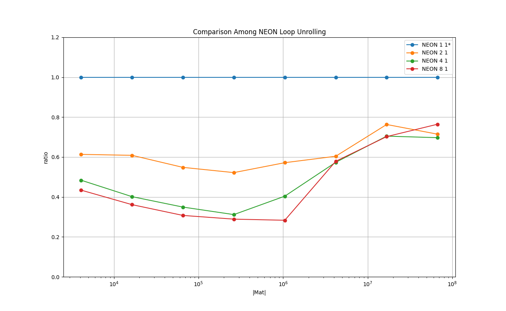
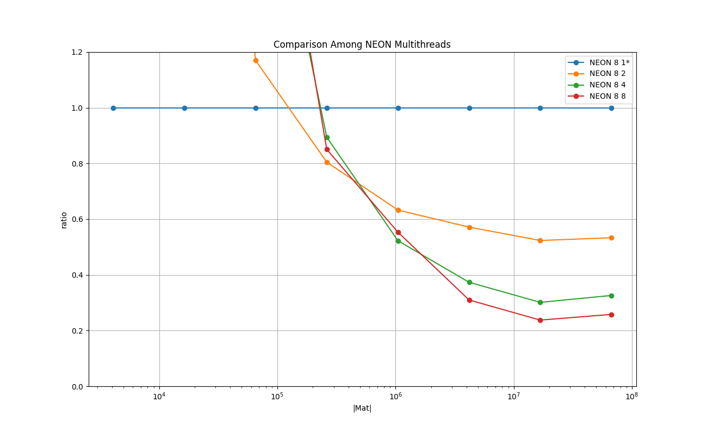

# Results on Running Time : Double, Column-Major

## Overview : double column-major

### Legend

* **CPP_BLOCK 1 1** : plain C++ implementation - baseline

* **NEON 8 1** : NEON with loop unrolling factor 8, single thread

* **NEON 8 8** : NEON with loop unrolling factor 8, 8 threads

* **BLAS 1 1** : the combination of **cblas_dgemv()**, **vDSP_vdivD()**, and **vDSP_vsbmD()**.

### Plots: Mac Mini M1 2020 8 GB

### Plots: iPhone 13 mini 256 GB

### Remarks on Mac Mini

* 'BLAS 1 1' shows the best overall performance. 'NEON 8 8' performs good, too.

## Comparison among NEON Loop unrolling

### Legend

* **NEON 1 1** : NEON with no loop unrolling, single thread

* **NEON 2 1** : NEON with loop unrolling factor 2, single thread

* **NEON 4 1** : NEON with loop unrolling factor 4, single thread

* **NEON 8 1** : NEON with loop unrolling factor 8, single thread

### Plots: Mac Mini M1 2020 8 GB

### Plots: iPhone 13 mini 256 GB

### Remarks on Mac Mini

There is a clear benefit in using NEON intrinsics, and the explicit loop unrolling.

## Comparison among NEON Multithreads

### Legend

* **NEON 8 1** : NEON with loop unrolling factor 8, single thread

* **NEON 8 2**: NEON with loop unrolling factor 8, 2 threads

* **NEON 8 4**: NEON with loop unrolling factor 8, 4 threads

* **NEON 8 8**: NEON with loop unrolling factor 8, 8 threads

### Plots: Mac Mini M1 2020 8 GB

### Plots: iPhone 13 mini 256 GB

### Remarks on Mac Mini

There is a clear benefit in using multithreads.
The overhead of synchronizing the threads is amortized around the size *(512, 512)*.
