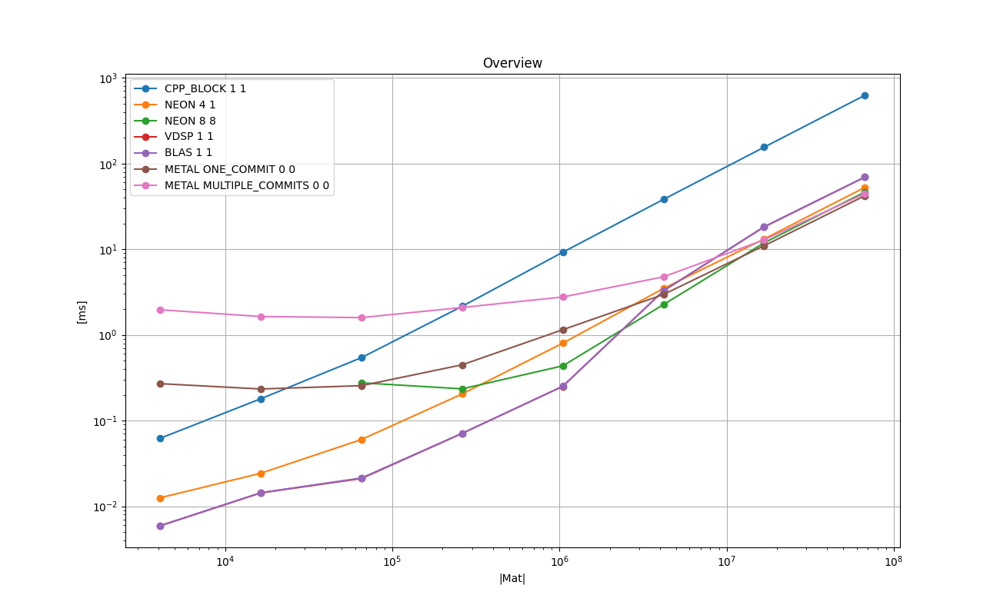
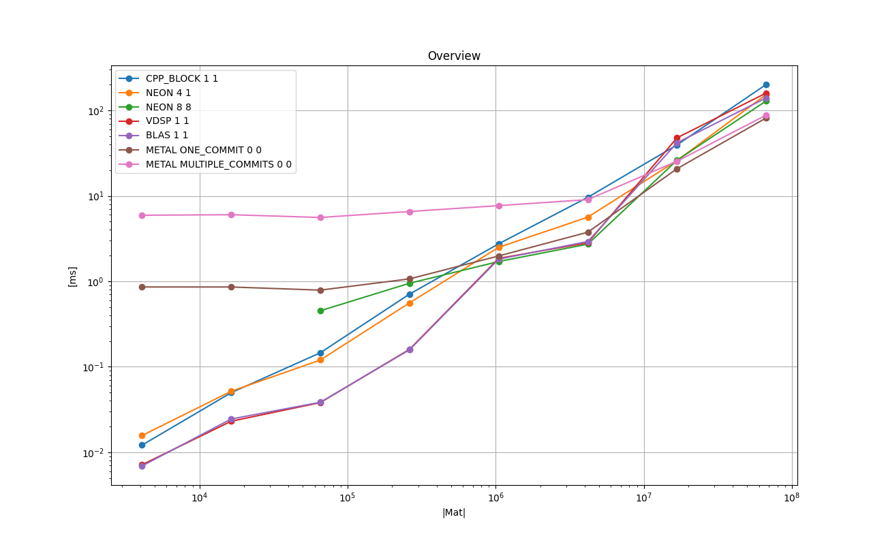
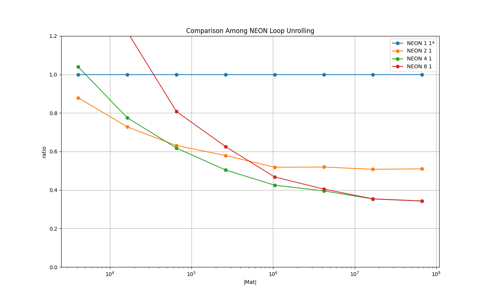
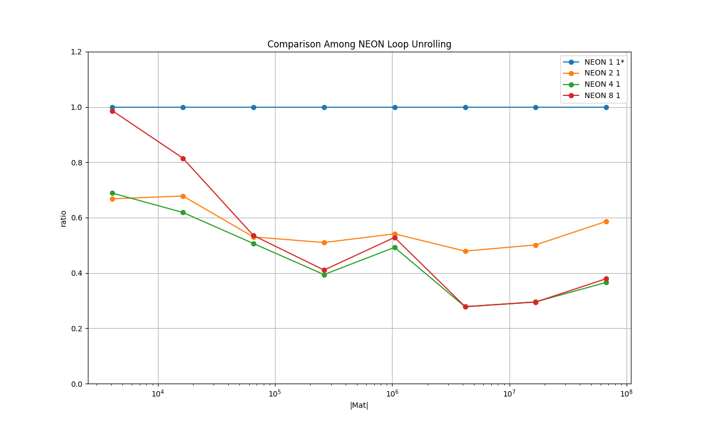
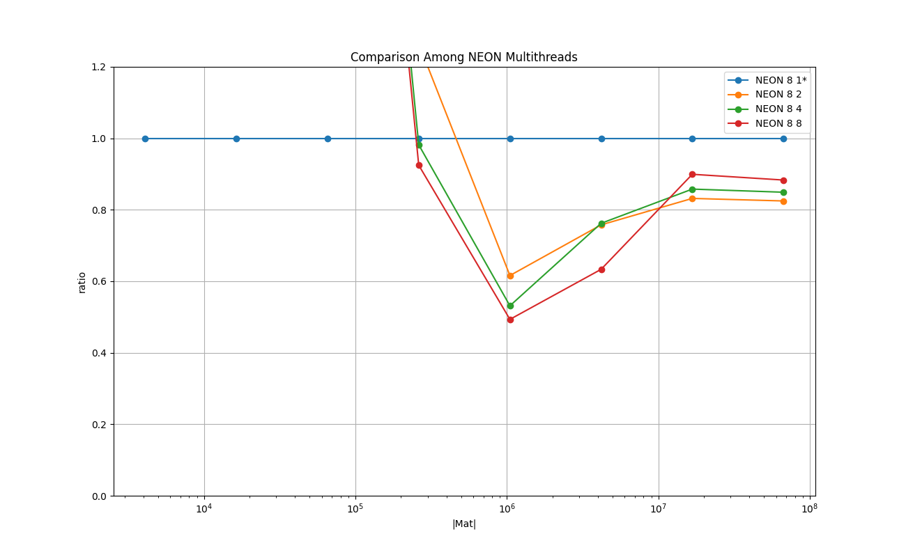
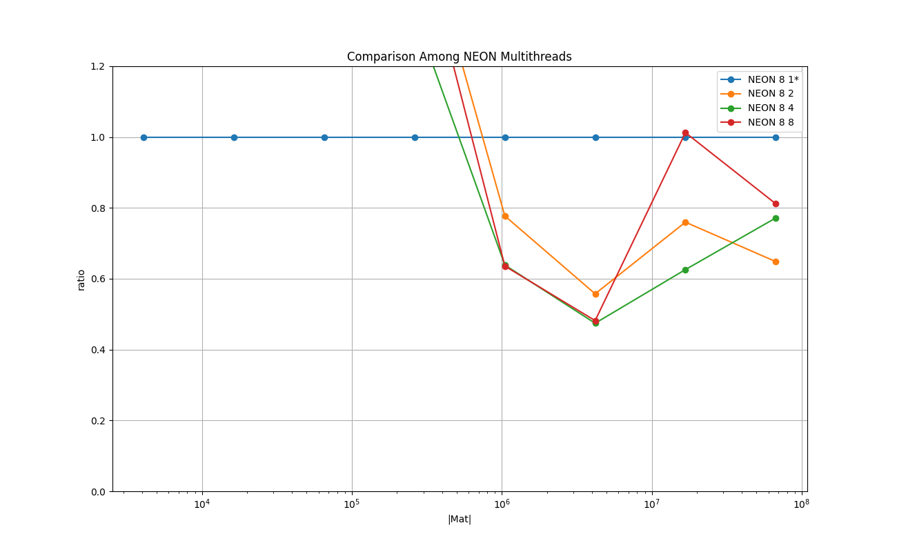

# Results on Running Time : Float, Row-Major

## Overview

### Legend

* **CPP_BLOCK 1 1** : plain C++ implementation - baseline

* **NEON 4 1** : NEON with loop unrolling factor 4, single thread

* **NEON 8 8** : NEON with loop unrolling factor 8, 8 threads

* **VDSP 1 1** : with **vDSP_mmul()**, **vDSP_vdiv()**, and **vDSP_vsbm()**.

* **BLAS 1 1** : the combination of **cblas_sgemv()**, **vDSP_vdiv()**, and **vDSP_vsbm()**.

* **METAL DEFAULT 0 0** : own kernel, threads over columns, reduction over one row per threadgroup

### Plots: Mac Mini M1 2020 8 GB

### Plots: iPhone 13 mini 256 GB

### Remarks

* 'BLAS 1 1' performs best up to the problem size of *(1K, 1K)*.

* 'NEON 8 8' performs best for the size greater than *(1K, 1K)*

* The overhead of METAL implementation is amortized around *(2K,  2K)* and exceeds the performance of CPU implementations beyond that size.

## Comparison among NEON Loop unrolling

### Legend

* **NEON 1 1**: NEON with no loop unrolling, single thread

* **NEON 2 1**: NEON with loop unrolling factor 2, single thread

* **NEON 4 1**: NEON with loop unrolling factor 4, single thread

* **NEON 8 1**: NEON with loop unrolling factor 8, single thread

### Plots: Mac Mini M1 2020 8 GB

### Plots: iPhone 13 mini 256 GB

### Remarks
There is a clear benefit in using NEON intrinsics, and the explicit loop unrolling. The sweet spot seems to be the factor 4.

## Comparison among NEON Multithreads

### Legend

* **NEON 8 1** : NEON with loop unrolling factor 8, single thread

* **NEON 8 2**: NEON with loop unrolling factor 8, 2 threads

* **NEON 8 4**: NEON with loop unrolling factor 8, 4 threads

* **NEON 8 8**: NEON with loop unrolling factor 8, 8 threads

### Plots: Mac Mini M1 2020 8 GB

### Plots: iPhone 13 mini 256 GB

### Remarks

There is a benefit in multithreading the NEON implementation, although it is not significant as in the column-major case.
