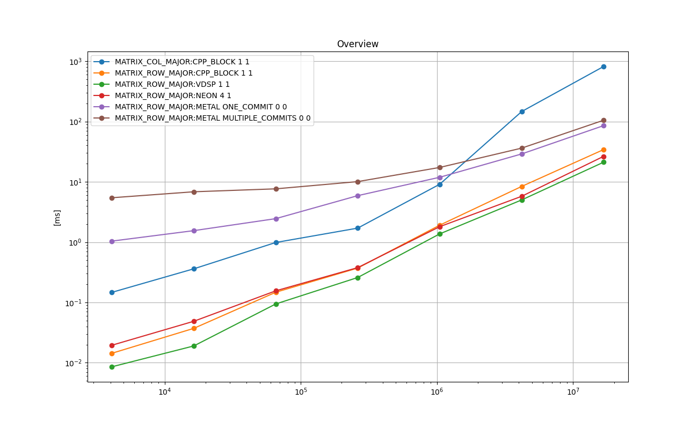
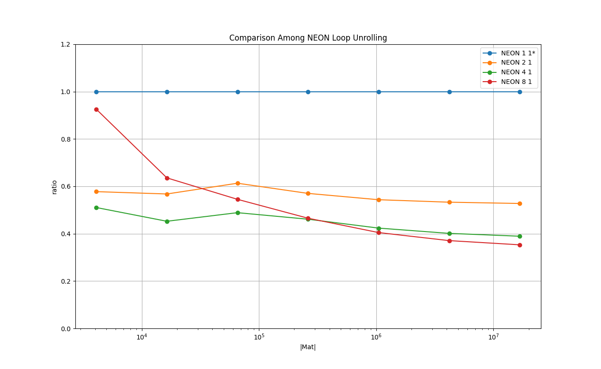

# Gauss-Seidel Iterative Solver

Gauss-Seidel solver is an iterative solver mainly used to solve linear equations with PD matrices.

The following shows the basic idea to derive the iteration.
```
            Ax = b
  (D + L + U)x = b  // D: diagonal, L: Lowertriangular, U: Uppertriangular
      (D + L)x = b - Ux
             x = (b - Ux) / (D+L)    
```
As shown above, the main operations are the matrix-vector multiplication and the vector subtraction and the element-wise multiplication.
This is similar to the Jacobi solver, but it is more difficult to parallelize, as *x_i^{t+1}* depends on *x_j^{t+1}*, where *1 <= j < i*.
This implies that the each row of the matrix must be processed serially.

The following implementation include also the calculation of RMS of *x_new* and *x_old* in the each iteration to check the convergence.


## 0. Instruction for iOS
So far this has been tested on iPhone 13 mini 256GB.

- Open `AppleNumericalComputing/iOSTester_12/iOSTester_12.xcodeproj` with Xcode

- Build a release build

- Run the iOS App in release build

- Press 'Run' on the screen

- Wait until App finished with 'finished!' on the log output.

- Copy and paste the log into `12_gauss_seidel_solver/doc_ios/make_log.txt`.

- Run the following in the terminal.
```
$ cd 10_cholesky_decomp
$ grep '\(^INT\|^FLOAT\|^DOUBLE\|data element type\)' doc_ios/make_log.txt > doc_ios/make_log_cleaned.txt
$ python ../common/process_log.py -logfile doc_ios/make_log_cleaned.txt -specfile doc_ios/plot_spec.json -show_impl -plot_charts -base_dir doc_ios/
```
- You will get the PNG files in  `12_gauss_seidel_solver/doc_ios/`.


# 1. Key Points

* The Matrix should be in the row-major for efficient computation.

* BLAS or vDSP does not provide a direct solution to the solver, but the combination of **vDSP_vdiv()**, **vDSP_dotpr()**, **vDSP_vsbm()**, and **vDSP_vsub()** performs best among CPU implementations.

* NEON intrinsics with the loop unrolling of factor 4 performs almost as well as the vDSP implementation.

* Use of Metal kernel can not be justified as the overhead of launching the kernel is not amortized at the size of *(4K, 4K)*.


# 2. Background and Context
The Gauss-Seidel solver is a popular iterative algorithm to solve linear equations with PD matrices.
The convergence is supposed to be faster than the Jacobi solver.
Unlike the Jacobi solver, it is not easy to parallelize over the rows of the matrix, as the solution *x_{t+1}*
depends partially on *x_{t+1}* as well as *x_{t}*.
This implies it is difficult to utilize multithreads on CPU.
LAPACK or vDSP does not provide a direct solution, but a solver can be constructed from vDSP routines available.
Also, it is relatively straightforward to implement it in C++ with NEON as well as in Metal.
For the row-major, a reduction technique over each row can be used to perform the matrix-vector multiplication efficiently.

# 3. Purpose
The purpose is to find the best way to implement the solver in both CPU and GPU. 
Another purpose is to compare the running times with the ones from the Jacobi solver.
The Jacobi solver is supposed to be efficient than the Gauss-Seidel solver, but the convergence of the Jacobi solver is supposed to be slower.
The decision whether to use Jacobi-based solver or GS-based depends on the time spent in each iteration as well as the convergence rate.


# 4. Results on Running Time
The following experiments are done with [test_gauss_seidel_solver.cpp](./test_gauss_seidel_solver.cpp) in this directory.

Compiler: Apple clang version 13.0.0 (clang-1300.0.29.3) Target: arm64-apple-darwin20.6.0 Thread model: posix

Device: Mac mini (M1, 2020) Chip Apple M1, Memory 8GB, macOS Big Sur Version 11.6

Please type make all in this directory to reproduce the results.


## 4.1. Overview : Float
The following chart shows the mean running times taken to perform 10 iterations of the Gauss-Seidel method in *float* for each implementation in log-log scale.
X-axis is *Dim x Dim*, and Y-axis is the time taken in milliseconds.

### Legend

* **MATRIX_COL_MAJOR:CPP_BLOCK 1 1** : plain C++ implementation for the *column-major* matrices

* **MATRIX_ROW_MAJOR:CPP_BLOCK 1 1** : plain C++ implementation for the  *row-major* matrices

* **MATRIX_ROW_MAJOR:NEON 4 1** : NEON implementation with the loop unrolling of factor 4.

* **MATRIX_ROW_MAJOR:VDSP 1 1** : vDSP implementation with **vDSP_vsub()**, **vDSP_dotpr()**, and **vDSP_vdiv()**.

* **MATRIX_ROW_MAJOR:METAL ONE COMMIT 0 0** : Metal implementation, threads over columns, reduction over one row per thread-group, one commit for all the iterations (10 iterations)

* **MATRIX_ROW_MAJOR:METAL MULTIPLE COMMITS 0 0** : Metal implementation, threads over columns, reduction over one row per thread-group, one commpt per iteration

### Plots: Mac Mini M1 2020 8 GB
<a href="doc/FLOAT_ANY_Overview.png"></a>

### Plots: iPhone 13 mini 256 GB
<a href="doc_ios/FLOAT_ANY_Overview.png"></a>

### Remarks on Mac Mini

* 'VDSP 1 1' shows the best running time for all the cases.

* 'NEON 4 1' performs good, if the problem size is around *(2K, 2K)* and bigger.

* The *row-major* version performs better than the *column-major* version in the plain C++ implementations.

* The overhead of using Metal kernel is significant, and it is probably not worth using it.
This is due to the fact that only one thread-group can be launched.

* The Metal implementations in a single commit have a noticeable advantage over the implementation with multiple commits, if the problem size is small. However this advantage is lost for the problem sizes for which the metal implementations have an advantage over the CPU implementations.


## 4.2. Comparison Among the NEON Implementations With Different Loop Unrolling Factors.
The following chart shows the relative running times taken to perform 10 iterations of the Gauss-Seidel method in *float* for 4 NEON implementations in log-lin scale.
X-axis is *Dim x Dim*, and Y-axis is the relative running time of each implementation relative to 'NEON 1 1', which is fixed at 1.0.

### Legend

* **NEON 1 1** : NEON implementation with 4 lanes over columns in a single row.

* **NEON 2 1** : NEON implementation with 8 lanes over columns in a single row, loop unrolling factor 2.

* **NEON 4 1** : NEON implementation with 16 lanes over columns in a single row, loop unrolling factor 4.

* **NEON 8 1** : NEON implementation with 32 lanes over columns in a single row, loop unrolling factor 8.

### Plots: Mac Mini M1 2020 8 GB
<a href="doc/FLOAT_MATRIX_ROW_MAJOR_Comparison_Among_NEON_Loop_Unrolling_relative.png"></a>

### Plots: iPhone 13 mini 256 GB
<a href="doc_ios/FLOAT_MATRIX_ROW_MAJOR_Comparison_Among_NEON_Loop_Unrolling_relative.png"></a>

### Remarks on Mac Mini
There is a clear benefit in using NEON intrinsics and the sweet spot seems to be with the loop unrolling factor 4.


## 4.3. Overview : Double
The following chart shows the mean running times taken to perform 10 iterations of the Gauss-Seidel method in *double* for each implementation in log-log scale.
X-axis is *Dim x Dim*, and Y-axis is the time taken in milliseconds.

### Legend

* **MATRIX_COL_MAJOR:CPP_BLOCK 1 1** : plain C++ implementation for the *column-major* matrices

* **MATRIX_ROW_MAJOR:CPP_BLOCK 1 1** : plain C++ implementation for the *row-major* matrices

* **MATRIX_ROW_MAJOR:NEON 8 1** : NEON implementation with the loop unrolling factor of 8

* **MATRIX_ROW_MAJOR:VDSP 1 1** : vDSP implementation with **vDSP_vsubD()**, **vDSP_dotprD()**, and **vDSP_vdivD()**.

### Plots: Mac Mini M1 2020 8 GB
<a href="doc/DOUBLE_ANY_Overview.png"></a>

### Plots: iPhone 13 mini 256 GB
<a href="doc_ios/DOUBLE_ANY_Overview.png"></a>

### Remarks on Mac Mini

* 'VDSP 1 1' shows the best running time for all the cases.

* 'NEON 8 1' performs good, if the problem size is around *(2K, 2K)* and bigger.

* The *row-major* version performs better than the *column-major* version in the plain C++ implementations.


## 4.4. Comparison Among NEON Implementations With Different Loop Unrolling Factors.

### Legend

* **NEON 1 1** : NEON implementation with 2 lanes over columns in a single row.

* **NEON 2 1** : NEON implementation with 4 lanes over columns in a single row, loop unrolling factor 2.

* **NEON 4 1** : NEON implementation with 8 lanes over columns in a single row, loop unrolling factor 4.

* **NEON 8 1** : NEON implementation with 16 lanes over columns in a single row, loop unrolling factor 8.

### Plots: Mac Mini M1 2020 8 GB
<a href="doc/DOUBLE_MATRIX_ROW_MAJOR_Comparison_Among_NEON_Loop_Unrolling_relative.png"></a>

### Plots: iPhone 13 mini 256 GB
<a href="doc_ios/DOUBLE_MATRIX_ROW_MAJOR_Comparison_Among_NEON_Loop_Unrolling_relative.png"></a>


### Remarks on Mac Mini
There is a clear benefit in using NEON intrinsics and also the explicit loop unrolling. The sweet spot seems to be the factor 4.


# 5. Implementations
This section briefly describes each of the implementations tested with some key points in the code.
Those are executed as part of the test program in [test_gauss_seidel_solver.cpp](./test_gauss_seidel_solver.cpp).
The top-level object in the 'main()' function is **TestExecutorGaussSeidelSolver**, which is a subclass of **TestExecutor found** 
in [../common/test_case_with_time_measurements.h](../common/test_case_with_time_measurements.h).
It manages one single test suite, which consists of test cases.
It arranges the input data, allocates memory, executes each test case multiple times and measures the running times, cleans up, and reports the results.
Each implementation type is implemented as a **TestCaseGaussSeidelSolver**, which is a subclass of **TestCaseWithTimeMeasurements**
 in [../common/test_case_with_time_measurements.h](../common/test_case_with_time_measurements.h).
The main part is implemented in **TestCaseGaussSeidelSolver::run()**, and it is the subject for the running time measurements.


## 5.1. CPP_BLOCK 1 1 - plain C++ implementation - baseline
[**class TestCaseGaussSeidelSolver_baseline** in test_gauss_seidel_solver.cpp](./test_gauss_seidel_solver.cpp).

This is a plain C++ implementation as the baseline for the experiments. The main part is shown as follows.

```
for ( int i = 0; i < dim; i++ ) {

    T sum = 0.0;

    for ( int j = 0; j < i; j++ ) {

        sum += ( A[ linear_index_mat<IS_COL_MAJOR>(i, j, dim, dim) ] * x1[j] );
    }
    for ( int j = i+1; j < this->m_dim; j++ ) {
        sum += ( A[ linear_index_mat<IS_COL_MAJOR>(i, j, dim, dim) ] * x2[j] );
    }

    x1[i] = (b[i] - sum) * Dinv[ i ];
}
```

Please see `TestCaseGaussSeidelSolver_baseline` in [test_gauss_seidel_solver.cpp](./test_gauss_seidel_solver.cpp) for details.

## 5.2. NEON 1 1 : NEON Intrinsics
[**class TestCaseGaussSeidelSolver_NEON** in test_gauss_seidel_solver.cpp](./test_gauss_seidel_solver.cpp).

First, to avoid division, it calculates the reciprocal of the diagonal elements as follows.

Float:
```
for (int i = 0; i < dim; i+=4 ) {

    const float32x4_t qw_d1      = { D[i], D[i+1], D[i+2], D[i+3] };
    const float32x4_t qw_d_inv1_1 = vrecpeq_f32( qw_d1 );
    const float32x4_t qw_d_inv2_1 = vmulq_f32( vrecpsq_f32( qw_d1, qw_d_inv1_1 ), qw_d_inv1_1 );
    
    memcpy( &(Dinv[i  ]), &qw_d_inv2_1, sizeof(float)*4 );
}
```

Double:
```
for (int i = 0; i < dim; i+=2 ) {

    const float64x2_t qw_d1      = { D[i], D[i+1] };
    const float64x2_t qw_d_inv1_1 = vrecpeq_f64( qw_d1 );
    const float64x2_t qw_d_inv2_1 = vmulq_f64( vrecpsq_f64( qw_d1, qw_d_inv1_1 ), qw_d_inv1_1 );
    const float64x2_t qw_d_inv3_1 = vmulq_f64( vrecpsq_f64( qw_d1, qw_d_inv2_1 ), qw_d_inv2_1 );

    memcpy( &(Dinv[i]), &qw_d_inv3_1, sizeof(double)*2 );
}
```

And the following is the main part of the iteration.

Float:
```
for ( int i = row_begin; i < row_end_past_one; i++ ) {

    float32x4_t qw_lanewise_sum1 = { 0.0, 0.0, 0.0, 0.0 };

    for ( int j = 0; j < dim; j+=4 ) {

        float32x4_t qw_col1;

        if (j + 4 <= i ) {
            qw_col1 = vld1q_f32( &(x1[ j ]) );
        }
        else if (i + 4 <= j) {
            qw_col1 = vld1q_f32( &(x2[ j ]) );
        }
        else {
            qw_col1[0] = (j   < i) ? x1[ j   ] : x2[ j   ];
            qw_col1[1] = (j+1 < i) ? x1[ j+1 ] : x2[ j+1 ];
            qw_col1[2] = (j+2 < i) ? x1[ j+2 ] : x2[ j+2 ];
            qw_col1[3] = (j+3 < i) ? x1[ j+3 ] : x2[ j+3 ];
        }
        const float32x4_t qw_mat1 = vld1q_f32( &(A[ dim * i + j ] ) );
        const float32x4_t qw_mc1  = vmulq_f32( qw_mat1, qw_col1 );

        qw_lanewise_sum1 = vaddq_f32( qw_mc1, qw_lanewise_sum1 );
    }
    const float sum = qw_lanewise_sum1[0] + qw_lanewise_sum1[1] + qw_lanewise_sum1[2] + qw_lanewise_sum1[3];
    x1[i] = (b[i] - sum ) * Dinv[i];
}
```

Double:
```
for ( int i = row_begin; i < row_end_past_one; i++ ) {

    float64x2_t qw_lanewise_sum1 = { 0.0, 0.0 };

    for ( int j = 0; j < dim; j+=2 ) {

        float64x2_t qw_col1;

        if (j + 2 <= i ) {
            qw_col1 = vld1q_f64( &(x1[ j ]) );
        }
        else if (i + 2 <= j) {
            qw_col1 = vld1q_f64( &(x2[ j ]) );
        }
        else {
            qw_col1[0] = (j   < i) ? x1[ j   ] : x2[ j   ];
            qw_col1[1] = (j+1 < i) ? x1[ j+1 ] : x2[ j+1 ];
        }
        const float64x2_t qw_mat1 = vld1q_f64( &(A[ dim * i + j ] ) );
        const float64x2_t qw_mc1  = vmulq_f64( qw_mat1, qw_col1 );

        qw_lanewise_sum1 = vaddq_f64( qw_mc1, qw_lanewise_sum1 );
    }
    const float sum = qw_lanewise_sum1[0] + qw_lanewise_sum1[1];
                                 
    x1[i] = (b[i] - sum ) * Dinv[i];
}
```

Finally, distance of new X and hte old X is calculated to check the convergence.

Float:

```
float sum_sq_dist = 0.0;

for ( int i = 0; i < dim; i+=4 ) {

    const float32x4_t qw_x1_1   = vld1q_f32( &(x1[ i ] ) );
    const float32x4_t qw_x2_1   = vld1q_f32( &(x2[ i ) );
    const float32x4_t qw_diff1  = vsubq_f32( qw_x1_1, qw_x2_1 );
    const float32x4_t qw_sq1    = vmulq_f32( qw_diff1,  qw_diff1 );
    sum_sq_dist += (qw_sq1[0] + qw_sq1[1] + qw_sq1[2] + qw_sq1[3]);
}
float err = sqrt( sum_sq_dist );
```

Double:

```
double sum_sq_dist = 0.0;

for ( int i = 0; i < dim; i+=2 ) {

    const float64x2_t qw_x1_1   = vld1q_f64( &(x1[ i ] ) );
    const float64x2_t qw_x2_1   = vld1q_f64( &(x2[ i ] ) );
    const float64x2_t qw_diff1  = vsubq_f64( qw_x1_1, qw_x2_1 );
    const float64x2_t qw_sq1    = vmulq_f64( qw_diff1,  qw_diff1 );
    sum_sq_dist += ( qw_sq1[0] + qw_sq1[1] );
}
double err = sqrt( sum_sq_dist );
```

Please see `TestCaseGaussSeidelSolver_NEON` in [test_gauss_seidel_solver.cpp](./test_gauss_seidel_solver.cpp) for details.


## 5.3. NEON X 1 - NEON intrinsics with loop unrolling factor X
[**class TestCaseGaussSeidelSolver_NEON** in test_gauss_seidel_solver.cpp](./test_gauss_seidel_solver.cpp).

This is based on 'NEON 1 1' with the loop bodies unrolled according to the given factor.

Following is the main loop body in float and with loop unrolling factor of 4 as an example.

```
for ( int i = row_begin; i < row_end_past_one; i++ ) {

    float32x4_t qw_lanewise_sum1 = { 0.0, 0.0, 0.0, 0.0 };
    float32x4_t qw_lanewise_sum2 = { 0.0, 0.0, 0.0, 0.0 };
    float32x4_t qw_lanewise_sum3 = { 0.0, 0.0, 0.0, 0.0 };
    float32x4_t qw_lanewise_sum4 = { 0.0, 0.0, 0.0, 0.0 };

    for ( int j = 0; j < dim; j+=16 ) {

        float32x4_t qw_col1;
        float32x4_t qw_col2;
        float32x4_t qw_col3;
        float32x4_t qw_col4;

        if (j + 16 <= i ) {
            qw_col1 = vld1q_f32( &(x1[ j      ]) );
            qw_col2 = vld1q_f32( &(x1[ j +  4 ]) );
            qw_col3 = vld1q_f32( &(x1[ j +  8 ]) );
            qw_col4 = vld1q_f32( &(x1[ j + 12 ]) );
        }
        else if (i + 16 <= j) {
            qw_col1 = vld1q_f32( &(x2[ j      ]) );
            qw_col2 = vld1q_f32( &(x2[ j +  4 ]) );
            qw_col3 = vld1q_f32( &(x2[ j +  8 ]) );
            qw_col4 = vld1q_f32( &(x2[ j + 12 ]) );
        }
        else {
            qw_col1[0] = (j    < i) ? x1[ j    ] : x2[ j    ];
            qw_col1[1] = (j+ 1 < i) ? x1[ j+ 1 ] : x2[ j+ 1 ];
            qw_col1[2] = (j+ 2 < i) ? x1[ j+ 2 ] : x2[ j+ 2 ];
            qw_col1[3] = (j+ 3 < i) ? x1[ j+ 3 ] : x2[ j+ 3 ];
            qw_col2[0] = (j+ 4 < i) ? x1[ j+ 4 ] : x2[ j+ 4 ];
            qw_col2[1] = (j+ 5 < i) ? x1[ j+ 5 ] : x2[ j+ 5 ];
            qw_col2[2] = (j+ 6 < i) ? x1[ j+ 6 ] : x2[ j+ 6 ];
            qw_col2[3] = (j+ 7 < i) ? x1[ j+ 7 ] : x2[ j+ 7 ];
            qw_col3[0] = (j+ 8 < i) ? x1[ j+ 8 ] : x2[ j+ 8 ];
            qw_col3[1] = (j+ 9 < i) ? x1[ j+ 9 ] : x2[ j+ 9 ];
            qw_col3[2] = (j+10 < i) ? x1[ j+10 ] : x2[ j+10 ];
            qw_col3[3] = (j+11 < i) ? x1[ j+11 ] : x2[ j+11 ];
            qw_col4[0] = (j+12 < i) ? x1[ j+12 ] : x2[ j+12 ];
            qw_col4[1] = (j+13 < i) ? x1[ j+13 ] : x2[ j+13 ];
            qw_col4[2] = (j+14 < i) ? x1[ j+14 ] : x2[ j+14 ];
            qw_col4[3] = (j+15 < i) ? x1[ j+15 ] : x2[ j+15 ];
        }
        const float32x4_t qw_mat1 = vld1q_f32( &(A[ dim * i + j      ] ) );
        const float32x4_t qw_mat2 = vld1q_f32( &(A[ dim * i + j +  4 ] ) );
        const float32x4_t qw_mat3 = vld1q_f32( &(A[ dim * i + j +  8 ] ) );
        const float32x4_t qw_mat4 = vld1q_f32( &(A[ dim * i + j + 12 ] ) );
        const float32x4_t qw_mc1  = vmulq_f32( qw_mat1, qw_col1 );
        const float32x4_t qw_mc2  = vmulq_f32( qw_mat2, qw_col2 );
        const float32x4_t qw_mc3  = vmulq_f32( qw_mat3, qw_col3 );
        const float32x4_t qw_mc4  = vmulq_f32( qw_mat4, qw_col4 );

        qw_lanewise_sum1 = vaddq_f32( qw_mc1, qw_lanewise_sum1 );
        qw_lanewise_sum2 = vaddq_f32( qw_mc2, qw_lanewise_sum2 );
        qw_lanewise_sum3 = vaddq_f32( qw_mc3, qw_lanewise_sum3 );
        qw_lanewise_sum4 = vaddq_f32( qw_mc4, qw_lanewise_sum4 );

    }
    const float sum =   qw_lanewise_sum1[0] + qw_lanewise_sum1[1] + qw_lanewise_sum1[2] + qw_lanewise_sum1[3]
                      + qw_lanewise_sum2[0] + qw_lanewise_sum2[1] + qw_lanewise_sum2[2] + qw_lanewise_sum2[3]
                      + qw_lanewise_sum3[0] + qw_lanewise_sum3[1] + qw_lanewise_sum3[2] + qw_lanewise_sum3[3]
                      + qw_lanewise_sum4[0] + qw_lanewise_sum4[1] + qw_lanewise_sum4[2] + qw_lanewise_sum4[3];
    x1[i] = (b[i] - sum ) * Dinv[i];
}
```

Please see `TestCaseGaussSeidelSolver_NEON` in [test_gauss_seidel_solver.cpp](./test_gauss_seidel_solver.cpp) for details.

## 5.4. VDSP 1 1 - implementation with vDSP_vsub(), vDSP_dotpr(), and vDSP_vdiv().
[**class TestCaseGaussSeidelSolver_vDSP** in test_gauss_seidel_solver.cpp](./test_gauss_seidel_solver.cpp)

First, as a preparation, the inverse of the diagonal elements are calculated as follows.
```
vDSP_vdiv( D, 1, ones, 1, Dinv, 1, dim ); // float

vDSP_vdivD( D, 1, ones, 1, Dinv, 1, dim );// double
```
where ones is the array of 1.0 in float or double.

The main part is as follows.

Float:
```
for ( int i = 0; i < dim; i++ ) {

    float dot1 = 0.0;
    if ( i > 0 ) {
        vDSP_dotpr(&(A[dim * i]), 1, x1, 1, &dot1, i );
    }
    float dot2 = 0.0;
    if ( i < dim - 1 ) {
        vDSP_dotpr( &(A[dim * i + (i+1)]), 1, &(x2[(i+1)]), 1, &dot2, (dim - 1) - i );
    }
    sums[i] = dot1 + dot2;
}
vDSP_vsbm( b, 1, sums, 1, Dinv, 1, x1, 1, dim );

vDSP_vsub( x1, 1, x2, 1, sums_err, 1, dim );
float dot_err;
vDSP_dotpr(sums_err, 1, sums_err, 1, &dot_err, dim );
float err = sqrt(dot_err);
```

Double:
```
for ( int i = 0; i < this->m_dim; i++ ) {

    double dot1 = 0.0;
    if ( i > 0 ) {
        vDSP_dotprD(&(A[dim * i]), 1, x1, 1, &dot1, i );
    }
    double dot2 = 0.0;
    if ( i < dim - 1 ) {
        vDSP_dotprD( &(A[ dim * i + (i+1)]), 1, &(x2[(i+1)]), 1, &dot2, (dim - 1) - i );
    }
    sums[i] = dot1 + dot2;
}
vDSP_vsbmD( b, 1, sums, 1, Dinv, 1, x1, 1, dim );

vDSP_vsubD( x1, 1, x2, 1, sums_err, 1, dim );
double dot_err;
vDSP_dotprD(sums_err, 1, sums_err, 1, &dot_err, dim );
double err = sqrt(dot_err);
```

Please see `class TestCaseGaussSeidelSolver_vDSP` in [test_gauss_seidel_solver.cpp](./test_gauss_seidel_solver.cpp) for details.

## 5.5. METAL 0 0 - Metal implementation with reduction per row.
[**class TestCaseGaussSeidelSolver_metal** in test_gauss_seidel_solver.cpp](./test_gauss_seidel_solver.cpp)

This is a METAL kernel implementation The inverse of the diagonal elements are pre-calculated in C++.

```
kernel void solve_raw_major (

    device const float*              A                              [[ buffer(0) ]],
    device const float*              Dinv                           [[ buffer(1) ]],
    device const float*              b                              [[ buffer(2) ]],
    device const float*              xin                            [[ buffer(3) ]],
    device float*                    xout                           [[ buffer(4) ]],
    device float&                    x_error                        [[ buffer(5) ]],
    ...
) {

    const int THREADS_PER_THREADGROUP      = 1024;    // macos

    // 1st step: xout = A*xi

    threadgroup float sum_cache[ THREADS_PER_THREADGROUP ];

    for ( int row = 0; row < constants.dim; row++ ) {

        float sum = 0.0;
        for ( int col  = thread_position_in_threadgroup ; col < constants.dim ; col += threads_per_threadgroup ) {
            if ( col < row ) {
                sum += ( A[ row * constants.dim + col ] * xout[ col ] );
            }
            else if ( col > row ) {
                sum += ( A[ row * constants.dim + col ] * xin[ col ] );
            }
        }
        const float warp_sum = simd_sum (sum);

        if ( thread_index_in_simdgroup == 0 ){

            sum_cache[ simdgroup_index_in_threadgroup ] = warp_sum;
        }

        threadgroup_barrier( mem_flags::mem_threadgroup );

        if ( simdgroup_index_in_threadgroup == 0 ) {

            const float local_sum =   (thread_index_in_simdgroup < simdgroups_per_threadgroup)
                                    ? sum_cache[ thread_index_in_simdgroup ]
                                    : 0.0;

            const float warp_sum =  simd_sum( local_sum );

            if ( thread_position_in_threadgroup == 0 ) {

                xout[row] = (b[row] - warp_sum)*Dinv[row];

                atomic_add_float( x_error, (xout[row] - xin[row])*(xout[row] - xin[row]) );
            }
        }
    }
}
```

The error *|x1-x2|* is accumulated into *x_error* using an atomic operation in float.
Metal does not provide atomic in float.
Following shader function is used to implement atomic float based on atomic uint.

```
void atomic_add_float( device atomic_uint* atom_var, const float val )
{
    uint  fetched_uint,  assigning_uint;
    float fetched_float, assigning_float;

    fetched_uint = atomic_exchange_explicit( atom_var, 0, memory_order_relaxed );

    fetched_float = *( (thread float*) &fetched_uint );

    assigning_float = fetched_float + val;

    assigning_uint =  *( (thread uint*) &assigning_float );

    while ( (fetched_uint = atomic_exchange_explicit( atom_var, assigning_uint, memory_order_relaxed ) ) != 0 )  {

        uint fetched_uint_again = atomic_exchange_explicit( atom_var, 0, memory_order_relaxed );

        float fetched_float_again = *( (thread float*) &fetched_uint_again );

        fetched_float = *( (thread float*) &(fetched_uint) );

        assigning_float = fetched_float_again + fetched_float;

        assigning_uint =  *( (thread uint*) &assigning_float );
    }
}
```

See [metal/gauss_seidel_solver.metal](./metal/gauss_seidel_solver.metal) for details.