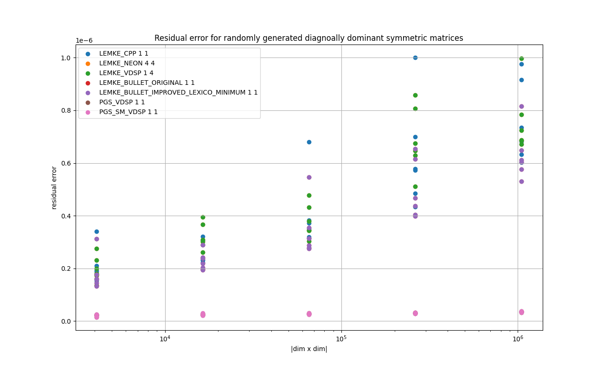
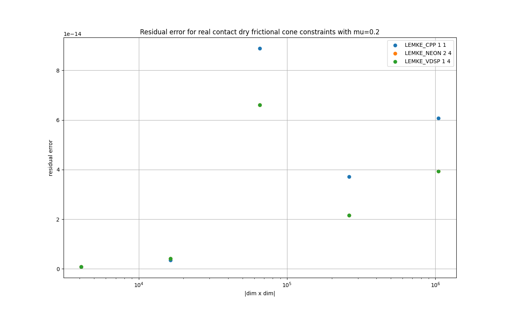

# Linear Complementarity Problem Solvers

<a href="doc/pic1.png"></a>
<a href="doc/pic2.png"></a>
<a href="doc/pic3.png"></a>

The following videos show some real-time physics simulations on iPhone13 Mini using the LCP solvers in this directory.
* [Video 1](https://youtu.be/p5KetH3uipE): 20 Ducks dropped on a non-slippery surface (w/ dry frictional cones).
* [Video 2](https://youtu.be/8s0nW0Ee0Zc): 20 Ducks dropped on a slippery surface (w/ dry frictional cones).
* [Vidoe 3](https://youtu.be/T9qQ6BD_-lA): 110 Ducks dropped in a box (w/ contact normals only).
* [Video 4](https://youtu.be/Qk78KL1Oa7Y): 200 Ducks dropped in a box with a wheel (w/ contact normals only).

**NOTE**
The wiggles observed in the stacked ducks is due to the linearized treatment of the collisions and the time integration.
This is called the stable-stacking problem.
The wiggle is emphasized in the video due to missing friction and the shape of the collisions (ball to ball).
It is much more difficult to stack balls irregularly than to stack rectangular bricks vertically.
Some literature suggests use of some heuristics, e.g., impulse propagation against the direction of the gravity etc.

* The collision detection is done on GPU(Metal) with a spatial subdivision algorithm.

* Constraints generation and the phase-space (location, orientation, velocities, etc.) updates are done on GPU.

# 1. Problem description

Linear Complementarity Problem, or LCP is formulated as follows.

Let **M** be *P-matrix*( incl. coposivie matrix, and *PD* matrix if it is symmetry ) of size *( d x d )* and **q** be a vector of size *d*,
Find a vector **z** of size *d* such that:

    Mz + q = w

    s.t. 0 ≤ z ⊥ w ≥ 0

If M is symmetric, it can be viewed as a quadratic problem at the KKT condition.
Please see Chapter 1 of [Murty98](http://www-personal.umich.edu/~murty/books/linear_complementarity_webbook/lcp-complete.pdf) for details.

It has been widely applied in the field of physics simulation (solid body simulation, doformable objects, fluid dynamics etc) by such as David Baraff and Kenny Erleben etc.

There are many algorithms to solve it. In this report two types of algorithms are considered:

- **Lemke** : A pivoting algorithm with the lexico-minimum criteria over *(-B⁻¹q : B⁻¹)* to handle degeneracies where B is the basis matrix for the current basic variables. See section 2.2 of [Murty98](http://www-personal.umich.edu/~murty/books/linear_complementarity_webbook/lcp-complete.pdf).

- **Projected Gauss-Seidel** : A fixed-point iterative algorithm based on Gauss-Seidel. See sections 9.2 and 9.3 of [Murty98](http://www-personal.umich.edu/~murty/books/linear_complementarity_webbook/lcp-complete.pdf).

The Lemke algorithm can be applied to the solid-body contact simulation with the dry frictional cones, which makes the matrix "M" non-symmetry.
The PGS algorithm is applied to the solid-body simulation with the boxed constraints with some estimated contact normal forces.
The problem with the boxed constraints can be formed as follows.

    Mz + q = w

    s.t. 0 z_lo ≤ z ≤ z_hi, 
         wᵢ = 0 or zᵢ = zᵢ_lo or zᵢ = zᵢ_hi

In this repo, the PGS-based algorithms have been implemented with the boxed constraints, but all the experiments are conducted with z_lo fixed at 0, and z_hi at the positive infinity.


# 2. Key Points

* PGS-SM implementation can proces more than 512 constraints in approx. 1 [ms].
It can handle real-time simulation at the frame rate (60fps) on the Apple devices (Mac Mini M1 & iPhone 13).
The subspace minimization shows significant advantage for the real data sampled from a physics simulation.

* Lemke implementation with NEON and 4 posix threads can process more than 256 constraints for the dry-frictional cones in approx. 2[ms].
It can handle real-time simulation at the frame rate (60fps) on the Apple devices (Mac Mini M1 & iPhone 13).

* Any GPU versions have not been implemented, as other studies such as [this](../12_gauss_seidel_solver/README.md) on the progjected-gauss-seidel solver indicates difficulty in effieicnt implmentation in GPU kernels for the problem sizes for the real-time physics simulation.

* There is no siginificant difference in performance between float and double.

* The implementation in [Bullet3](https://github.com/bulletphysics/bullet3/tree/master/src/BulletDynamics/MLCPSolvers), which is derived from [MBSIM](https://github.com/mbsim-env/mbsim/blob/master/kernel/mbsim/numerics/linear_complementarity_problem/lemke_algorithm.cc), performs significantly slower than my implementations. This is partly due to the inefficient calculation of the lexico-minimum row for the leaving varible. An improvement is suggested and tested below as **LEMKE_BULLET_IMPROVED_LEXICO_MINIMUM**.


# 3. Test Data Used
5 types of test data for *M* and *q* are arranged as follows

1. From a set of real contact and dry frictional cone constraints sampled as a snapshot of a realtime physics simulation with the friction coefficient 0.8 [(Video)](https://youtu.be/p5KetH3uipE). The matrix M is non-symmetric.

2. From a set of real contact and dry frictional cone constraints sampled as a snapshot of a realtime physics simulation with the friction coefficient 0.2 [(Video)](https://youtu.be/8s0nW0Ee0Zc). The matrix M is non-symmetric.

3. From a set of real contact constraints sampled as a snapshot of a realtime physics simulation [(Video)](https://youtu.be/Qk78KL1Oa7Y). The matrix M is symmetric.

4. Randomly generated diagnoallly dominant skew-symmetric matrices with the estimated conditionumbers 1.0, 10.0, 100.0, 1000.0, and 10000.0. See `generateRandomCopositiveMat()` in [test_pattern_generation.h](../common/test_pattern_generation.h).

5. Randomly generated diagnoallly dominant symmetric matrices with the estimated conditionumbers 1.0, 10.0, 100.0, 1000.0, and 10000.0. See `generateRandomPDMat()` in [test_pattern_generation.h](../common/test_pattern_generation.h).


# 3. Results on Running Time
The following experiments are done with [test_lcp.cpp](./test_lcp.cpp) in this directory.

Compiler: Apple clang version 13.0.0 (clang-1300.0.29.3) Target: arm64-apple-darwin20.6.0 Thread model: posix

Devices:

* Mac mini (M1, 2020) Chip Apple M1, Memory 8GB, macOS Big Sur Version 12.4

* iPhone 13 mini, Memory 256GB, iOS 15.5

Please type `make all` in this directory to reproduce the results on Mac. Please see the section 'Instruction for iOS' for iOS devices.

## 4.1. Overview : Float
The following chart shows the mean running times to perform one calculation until convergence for each implementation in log-log scale.

X-axis shows the number of elements in the matrix. For example, 10⁶ indicates the matrix of size (1000x1000).

Y-axis is the time in milliseconds.

For the charts with the randomly genearted data sets, all the plots in 5 different estimated condition numbers are super imposed in the same chart. 


### Legend

* **LEMKE_CPP 1 1** : default baseline implmeentation in plain C++

* **LEMKE_NEON 4 4** : C++ implmentation in NEON with the loop unrolling factor 4 and with 4 posix threads. The threads are synchronized mainly with cond_vars. Please see [ThreadSynchronizer](https://github.com/ShoYamanishi/ThreadSynchronizer) for details.

* **LEMKE_VDSP 1 4** : C++ implementation with vDSP with 4 posix threads

* **LEMKE_BULLET_ORIGINAL 1 1** : C++ implementation provided in Bullet3 engine in the master branch [@a1d96646](https://github.com/bulletphysics/bullet3/commit/a1d96646c8ca28b99b2581dcfc4d74cc3b4de018).


* **LEMKE_BULLET_IMPROVED_LEXICO_MINIMUM 1 1** : C++ implementation provided in Bullet3 engine with my modification in the lexico-minimum row calculation (`btLemkeAlgorithm::findLexicographicMinimum()`).


* **PGS_VDSP 1 1** : C++ & vDSP implementation

* **PGS_SM_VDSP 1 1** : C++ & vDSP implementation with the subspace minimization in Cholesky factorization

### Plots: Mac Mini M1 2020 8 GB

<a href="doc/FLOAT_REAL_NONSYMMETRIC_MU08_Running_time_for_real_contact_dry_frictional_cone_constraints_with_mu=0.8.png"></a>

<a href="doc/FLOAT_REAL_NONSYMMETRIC_MU02_Running_time_for_real_contact_dry_frictional_cone_constraints_with_mu=0.2.png"></a>

<a href="doc/FLOAT_REAL_SYMMETRIC_Running_time_for_real_contact_constraints_(symmetric_matrices).png"></a>

<a href="doc/FLOAT_RANDOM_DIAGONALLY_DOMINANT_SKEWSYMMETRIC_Running_time_for_randomly_generated_diagnoally_dominant_skew-symmetric_matrices.png"></a>

<a href="doc/FLOAT_RANDOM_DIAGONALLY_DOMINANT_SYMMETRIC_Running_time_for_randomly_generated_diagnoally_dominant_symmetric_matrices.png"></a>

### Plots: iPhone 13 mini 256 GB


<a href="doc_ios/FLOAT_REAL_NONSYMMETRIC_MU08_Running_time_for_real_contact_dry_frictional_cone_constraints_with_mu=0.8.png"></a>

<a href="doc_ios/FLOAT_REAL_NONSYMMETRIC_MU02_Running_time_for_real_contact_dry_frictional_cone_constraints_with_mu=0.2.png"></a>

<a href="doc_ios/FLOAT_REAL_SYMMETRIC_Running_time_for_real_contact_constraints_(symmetric_matrices).png"></a>

<a href="doc_ios/FLOAT_RANDOM_DIAGONALLY_DOMINANT_SKEWSYMMETRIC_Running_time_for_randomly_generated_diagnoally_dominant_skew-symmetric_matrices.png"></a>

<a href="doc_ios/FLOAT_RANDOM_DIAGONALLY_DOMINANT_SYMMETRIC_Running_time_for_randomly_generated_diagnoally_dominant_symmetric_matrices.png"></a>


## 4.1. Overview : Double
The following chart shows the mean running times taken to perform one calculation until convergence for each implementation in log-log scale.

X-axis shows the number of elements in the matrix. For example, 10⁶ indicates the matrix of size (1000x1000).

Y-axis is the time in milliseconds.

For the charts with the randomly genearted data sets, all the plots in 5 different estimated condition numbers are super imposed.


### Legend

* **LEMKE_CPP 1 1** : default baseline implmeentation in plain C++

* **LEMKE_NEON 4 4** : C++ implmentation in NEON with loop unrolling factor 4 and with 4 posix threads

* **LEMKE_VDSP 1 4** : C++ implementation with vDSP with 4 posix threads

* **PGS_VDSP 1 1** : C++ & vDSP implementation

* **PGS_SM_VDSP 1 1** : C++ & vDSP implementation with the subspace minimization in Cholesky factorization

### Plots: Mac Mini M1 2020 8 GB

<a href="doc/DOUBLE_REAL_NONSYMMETRIC_MU08_Running_time_for_real_contact_dry_frictional_cone_constraints_with_mu=0.8.png"></a>

<a href="doc/DOUBLE_REAL_NONSYMMETRIC_MU02_Running_time_for_real_contact_dry_frictional_cone_constraints_with_mu=0.2.png"></a>

<a href="doc/DOUBLE_REAL_SYMMETRIC_Running_time_for_real_contact_constraints_(symmetric_matrices).png"></a>

<a href="doc/DOUBLE_RANDOM_DIAGONALLY_DOMINANT_SKEWSYMMETRIC_Running_time_for_randomly_generated_diagnoally_dominant_skew-symmetric_matrices.png"></a>

<a href="doc/DOUBLE_RANDOM_DIAGONALLY_DOMINANT_SYMMETRIC_Running_time_for_randomly_generated_diagnoally_dominant_symmetric_matrices.png"></a>

### Plots: iPhone 13 mini 256 GB


<a href="doc_ios/DOUBLE_REAL_NONSYMMETRIC_MU08_Running_time_for_real_contact_dry_frictional_cone_constraints_with_mu=0.8.png"></a>

<a href="doc_ios/DOUBLE_REAL_NONSYMMETRIC_MU02_Running_time_for_real_contact_dry_frictional_cone_constraints_with_mu=0.2.png"></a>

<a href="doc_ios/DOUBLE_REAL_SYMMETRIC_Running_time_for_real_contact_constraints_(symmetric_matrices).png"></a>

<a href="doc_ios/DOUBLE_RANDOM_DIAGONALLY_DOMINANT_SKEWSYMMETRIC_Running_time_for_randomly_generated_diagnoally_dominant_skew-symmetric_matrices.png"></a>

<a href="doc_ios/DOUBLE_RANDOM_DIAGONALLY_DOMINANT_SYMMETRIC_Running_time_for_randomly_generated_diagnoally_dominant_symmetric_matrices.png"></a>

# Convergence Criteria

For the Lemke algorithms, the termination criteron is clear: when the artificial variable z₀ leaves from the basic variables.

For the PGS algorithms, the loop is terminated when the current error value is above the moving average of the past 5 error values.
The error value is the accummulated sum of violation outside the boxed boundaries as well as the sum of abs{z

Please see `getErrorvDSP_f()` in [test_case_lcp_pgs.h](test_case_lcp_pgs.h) for details.

For eech pair {zᵢ, wᵢ},

    sᵢ = | zᵢ * wᵢ | - min{ zᵢ, 0 } - min{ wᵢ, 0 } : if i is for a normal constraint.

    sᵢ = | zᵢ * wᵢ | - min{ zᵢ, z_lo } + max{ zᵢ, z_hi } : if i is for a boxed constraint.
and

    error = sumᵢ{sᵢ}

See `getErrorvDSP_f()` and `getErrorvDSP_d()` in [test_case_lcp_pgs.h](test_case_lcp_pgs.h) and  [test_case_lcp_pgs_sm.h](test_case_lcp_pgs_sm.h).

The following charts show the number of iterations typically observed during the experiments.

## Iterations for PGS and PGS-SM algorithms.

<a href="doc_ios/FLOAT_RANDOM_DIAGONALLY_DOMINANT_SKEWSYMMETRIC_Iteraitons_for_randomly_generated_diagnoally_dominant_skew-symmetric_matrices.png"></a>

<a href="doc_ios/FLOAT_RANDOM_DIAGONALLY_DOMINANT_SYMMETRIC_Iteraitons_for_randomly_generated_diagnoally_dominant_symmetric_matrices.png"></a>

<a href="doc_ios/FLOAT_REAL_NONSYMMETRIC_MU02_Iterations_for_real_contact_dry_frictional_cone_constraints_with_mu=0.2.png"></a>

<a href="doc_ios/FLOAT_REAL_NONSYMMETRIC_MU08_Iterations_for_real_contact_dry_frictional_cone_constraints_with_mu=0.8.png"></a>

<a href="doc_ios/FLOAT_REAL_SYMMETRIC_Iterations_for_real_contact_constraints_(symmetric_matrices).png"></a>


## Number of pivots for Lemke algorithm


<a href="doc_ios/FLOAT_RANDOM_DIAGONALLY_DOMINANT_SKEWSYMMETRIC_Number_of_pivots_for_randomly_generated_diagnoally_dominant_skew-symmetric_matrices.png"></a>

<a href="doc_ios/FLOAT_RANDOM_DIAGONALLY_DOMINANT_SYMMETRIC_Number_of_pivots_for_randomly_generated_diagnoally_dominant_symmetric_matrices.png"></a>

<a href="doc_ios/FLOAT_REAL_NONSYMMETRIC_MU02_Number_of_pivots_for_real_contact_dry_frictional_cone_constraints_with_mu=0.2.png"></a>

<a href="doc_ios/FLOAT_REAL_NONSYMMETRIC_MU08_Number_of_pivots_for_real_contact_dry_frictional_cone_constraints_with_mu=0.8.png"></a>

<a href="doc_ios/FLOAT_REAL_SYMMETRIC_Number_of_pivots_for_real_contact_constraints_(symmetric_matrices).png"></a>

# The resitual errors
The final residual error is calculated as follows. (For the experiments any boxed constraints are not considered.)

* For the violation of the non-negativity conditions *0 ≤ z* and *0 ≤ w*:

    `-1.0 * sumᵢ{ min{ zᵢ, 0 } + min{ wᵢ, 0 } }`, where *i* indicates the indices over the elements.

* For the violation of the the complementarity condition *z ⊥ w*:

    `sumᵢ{ | zᵢ * wᵢ | }`.

* Deviation of *w* from *Mz+q*:

    `sumᵢ{|[Mz+q]ᵢ - wᵢ|}`.

Combined together,

    `residual error = sqrt ( sumᵢ { -1.0 * ( min{ zᵢ, 0 } + min{ wᵢ, 0 } ) + | zᵢ * wᵢ | + |[Mz+q]ᵢ - wᵢ| } / dim )`.

The following charts show the typical redisual errors observed.


## Residual Errors : Float

<a href="doc_ios/FLOAT_RANDOM_DIAGONALLY_DOMINANT_SKEWSYMMETRIC_Residual_error_for_randomly_generated_diagnoally_dominant_skew-symmetric_matrices.png"></a>

<a href="doc_ios/FLOAT_RANDOM_DIAGONALLY_DOMINANT_SYMMETRIC_Residual_error_for_randomly_generated_diagnoally_dominant_symmetric_matrices.png"></a>

<a href="doc_ios/FLOAT_REAL_NONSYMMETRIC_MU02_Residual_error_for_real_contact_dry_frictional_cone_constraints_with_mu=0.2.png"></a>

<a href="doc_ios/FLOAT_REAL_NONSYMMETRIC_MU08_Residual_error_for_real_contact_dry_frictional_cone_constraints_with_mu=0.8.png"></a>

<a href="doc_ios/FLOAT_REAL_SYMMETRIC_Residual_error_for_real_contact_constraints_(symmetric_matrices).png"></a>


## Residual Errors : Double

<a href="doc_ios/DOUBLE_RANDOM_DIAGONALLY_DOMINANT_SKEWSYMMETRIC_Residual_error_for_randomly_generated_diagnoally_dominant_skew-symmetric_matrices.png"></a>

<a href="doc_ios/DOUBLE_RANDOM_DIAGONALLY_DOMINANT_SYMMETRIC_Residual_error_for_randomly_generated_diagnoally_dominant_symmetric_matrices.png"></a>

<a href="doc_ios/DOUBLE_REAL_NONSYMMETRIC_MU02_Residual_error_for_real_contact_dry_frictional_cone_constraints_with_mu=0.2.png"></a>

<a href="doc_ios/DOUBLE_REAL_NONSYMMETRIC_MU08_Residual_error_for_real_contact_dry_frictional_cone_constraints_with_mu=0.8.png"></a>

<a href="doc_ios/DOUBLE_REAL_SYMMETRIC_Residual_error_for_real_contact_constraints_(symmetric_matrices).png"></a>

# Implementations

## The tableau description for the Lemke algorithm

| width      | dim  | dim  |   1  |   1  |
|:-----------|:----:|:----:|:----:|:----:|
| field type | B⁻¹I | B⁻¹N | B⁻¹e | B⁻¹q |
| description| (A)  | (B)  | (C)  | (D)  |


* (A): Columns for the slack variables. The original columns constitute the identity matrix, and the up-to-date columns here represent the current inverse for the matrix *B* for the basic variables.

* (B): Columns for the original variables *z*. The original columns correspond to the matrix *M*.

* (C): Column for the artificial varialble *z₀* It originally consists of -1s.

* (D): The column for *q*. 

## Lemke C++ base implementation
This is the base implementation found in [test_case_lcp_lemke_baseline.h](test_case_lcp_lemke_baseline.h).
The top-level function is `TestCaseLCP_lemke_baseline::run()`.
There are two core parts of this implementation: `pivot()` and `find_leaving_row_index()`.
`pivot()` updates the table with a series of Gaussian eliminations.
`find_leaving_row_index()` finds the leaving row for the basic variable based on the lexico minimum test.


## Lemke C++ & NEON in multi-threads
This is an implementation with NEON in multi-threads. The code is found in [test_case_lcp_lemke_neon_multithread.h](test_case_lcp_lemke_neon_multithread.h).
The main difference from the base implementation is in the pivotting as follows:
The rows are split into blocks and each block is processed by one thread.

```
    void pivot_block( const int row_begin, const int row_end ) {

        T* pivot_row   = &(m_table[ m_leaving_row_index * m_num_columns ]);

        const T pivot_denom = 1.0 / pivot_row[ m_entering_col_index ];

        for ( size_t row_index = row_begin; row_index < row_end; row_index++ ) {


            if ( row_index != m_leaving_row_index ) {

                T* current_row = &(m_table[ row_index * m_num_columns ]);

                const T coeff = -1.0 * current_row[ m_entering_col_index ] * pivot_denom;

                int col_index;

                if constexpr( is_same<float, T>::value ) {
                    const float32x4_t qw_coeff  = { coeff,  coeff,  coeff,  coeff };

                    for ( col_index = 0; col_index <= this->m_num_columns - 8; col_index += 8 ) {

                        const float32x4_t qw_pivot_row1   = vld1q_f32( &(pivot_row  [ col_index ]) );
                        const float32x4_t qw_current_row1 = vld1q_f32( &(current_row[ col_index ]) );
                        const float32x4_t qw_pivot_row2   = vld1q_f32( &(pivot_row  [ col_index + 4]) );
                        const float32x4_t qw_current_row2 = vld1q_f32( &(current_row[ col_index + 4]) );
                        const float32x4_t qw_cal1         = vmulq_f32( qw_pivot_row1, qw_coeff );
                        const float32x4_t qw_cal2         = vmulq_f32( qw_pivot_row2, qw_coeff );
                        const float32x4_t qw_sum1         = vaddq_f32( qw_current_row1, qw_cal1 );
                        const float32x4_t qw_sum2         = vaddq_f32( qw_current_row2, qw_cal2 );
                        memcpy( &(current_row[ col_index     ]), &qw_sum1, sizeof(T)*4 );
                        memcpy( &(current_row[ col_index + 4 ]), &qw_sum2, sizeof(T)*4 );
                    }
                }
                else {
                    /* ... implementation for double with float64x2 ... */
                }

                if ( col_index < this->m_num_columns ) {
                    for ( ; col_index < this->m_num_columns; col_index++ ) {
                        current_row[col_index] += (pivot_row[col_index] * coeff);
                    }
                }

                current_row[ m_entering_col_index ] = 0.0;
            }
        }
    }
```

## Lemke C++ & vDSP in multi-threads
This is an implementation with vDSP in multi-threads. The code is found in [test_case_lcp_lemke_vdsp_multithread.h](test_case_lcp_lemke_vdsp_multithread.h).
The main difference from the base implementation is in the pivotting as follows:
The rows are split into blocks and each block is processed by one thread.

```
    void pivot_block( const int row_begin, const int row_end ) {

        T* pivot_row = &(m_table[ m_leaving_row_index * m_num_columns ]);

        const T pivot_denom = 1.0 / pivot_row[ m_entering_col_index ];

        for ( size_t row_index = row_begin; row_index < row_end; row_index++ ) {

            if ( row_index != m_leaving_row_index ) {

                T* current_row = &(m_table[ row_index * m_num_columns ]);

                const T coeff = -1.0 * current_row[ m_entering_col_index ] * pivot_denom;

                if constexpr ( is_same<float, T>::value ) {
                    catlas_saxpby( m_num_columns, coeff, pivot_row, 1, 1.0, current_row, 1 );
                }
                else {
                    catlas_daxpby( m_num_columns, coeff, pivot_row, 1, 1.0, current_row, 1 );
                }

                current_row[ m_entering_col_index ] = 0.0;
            }
        }
    }
```

## Lemke C++ Bullet implementation
This is taken from the [Bullet3 implementation](https://github.com/bulletphysics/bullet3/tree/master/src/BulletDynamics/MLCPSolvers).
It is modified slightly to fit in this experiment (removal of logging etc).
The top-level code is found in [test_case_lcp_lemke_bullet.h](test_case_lcp_lemke_bullet.h) which invokes the function `btLemkeAlgorithm::solve()` in [bullet3/btLemkeAlgorithm.cpp](bullet3/btLemkeAlgorithm.cpp).


## Lemke C++ Bullet implementation & an impproved lexico minimum finder.
This is based on the bullet3 implementation above, but with a modification around the code to find the leaving basic variable by the lexico minimum test in the function `btLemkeAlgorithm::findLexicographicMinimum()` in [cbullet3/btLemkeAlgorithm.cpp](bullet3/btLemkeAlgorithm.cpp).

The issues in the original Bullet3 code are:

**Logic issues:**
* The z_0 column located at A(\*,2*dim), is used for lexico minimum test, which must not be used.
* If the check on the 1st column 'q' produces multiple minimums due to generacy, and if it contains z_0, the tie must be broken in favor of z_0 and return, which is not performed in the original.

**Efficiency issues:**
* The 1st part to construct `Rows` is unnecessary.
* The 2nd part has three nested loops with brute-force search, which is inefficient.

The improved function is found in `btLemkeAlgorithm::findLexicographicMinimum2()` in [cbullet3/btLemkeAlgorithm.cpp](bullet3/btLemkeAlgorithm.cpp).

It performs the lexico minimum test on the leftmost column of *(-B⁻¹q : B⁻¹)*.
If the test finds a single row, return it.
If the test finds multiple rows and if they contain z_0, return z_0.
Please see *2.2.2 Pivot Steps* of [Murty98](http://www-personal.umich.edu/~murty/books/linear_complementarity_webbook/lcp-complete.pdf) for the details of the pivot step.
```
        btAlignedObjectArray<int> activeRows;

        btScalar currentMin = std::numeric_limits<float>::max();

        int dim = A.rows();

        for (int row = 0; row < dim; row++)
        {
                const float denom = A(row, pivotColIndex);

                if (denom > btMachEps())
                {
                        const float q = A(row, dim + dim + 1) / denom;

                        if (fabs(currentMin - q) < btMachEps())
                        {
                                activeRows.push_back(row);
                        }                
                        else if (currentMin > q)
                        {
                                currentMin = q;
                                activeRows.clear();
                                activeRows.push_back(row);
                        }
                }
        }

        if (activeRows.size() == 0)
        {
                // ray termination.
                return -1;
        }
        else if (activeRows.size() == 1)
        {
                return activeRows[0];
        }

        // If there are multiple rows, check if they contain the row for z_0.
        for (int i = 0; i < activeRows.size(); i++)
        {
                if (activeRows[i] == z0Row)
                {
                        return z0Row;
                }
        }
```


## PGS C++ & vDSP
This is an implementation of projected Gauss-Seidel solver with vDSP.
The code is found in [test_case_lcp_pgs.h](test_case_lcp_pgs.h).
It is based on the ordinary Gauss-Seidel solvers found in [12_gauss_seidel_solver](../12_gauss_seidel_solver/).
The main routine is shown below.

```
    inline void calcZ_f() {

        for ( int row = 0; row < this->m_dim; row++ ) {

            // calc z^{r+1} = - (q + L z^{r+1} + U z^r) / D                                                                                                                                                                                                            
	    T diag = this->m_M[ row * this->m_dim + row ];
            T dot;
            vDSP_dotpr ( &(this->m_M[ row * this->m_dim ]), 1, this->m_z, 1, &dot, this->m_dim );

            this->m_z[row] = max ( (diag * this->m_z[row] - dot - this->m_q[row]) / diag, (T)0.0 );
        }
    }
```


## PGS-SM C++ & vDSP
This is based on PGS but with an additional step to solve the subproblem for the free variables aiming at better accuracy.
The additional step is called subspace minimization, and basically it is a set of linear equations.
In this implementation it is solved by Cholesky factorization provided by vDSP as follows.


```
                // find active_z with Cholesky factorization.                                                                                                                                                                                                          
                char   uplo[2] = "L";
                int    n       = m_num_active_indices;
                int    nrhs    = 1;
                int    lda     = m_num_active_indices;
                int    ldb     = m_num_active_indices;
                int    info;
                int    r;
                if constexpr ( is_same<float, T>::value ) {
                    r = sposv_( uplo, &n, &nrhs, m_active_M, &lda, m_active_q_z, &ldb, &info );
                }
                else {
                    r = dposv_( uplo, &n, &nrhs, m_active_M, &lda, m_active_q_z, &ldb, &info );
                }
```
The subspace minimization takes much longer time than one PGS iteration.
In my observation the cholesky factorization with vDSP takes 10 times longer than one PGS iteration.
In this experiment a cholesky factorization is performed after 10 PGS iterations.

Please see [test_case_lcp_pgs_sm.h](test_case_lcp_pgs_sm.h) for details.


# Licenses
The material in this directory are provided in two types of licenses.

1. **Zlib** license for all the code under [bullet3](bullet3).

2. **GPL v3** for the rest of the code.


# References

- [Murty98] [K. Murty, Linear Complementarity, Linear and Nonlinear Programming. Heldermann Verlag, Berlin, 1998](http://www-personal.umich.edu/~murty/books/linear_complementarity_webbook/lcp-complete.pdf)

- [Bullet3] [Bullet 3 Physics Engine](https://github.com/bulletphysics/bullet3/tree/master/src/BulletDynamics/MLCPSolvers)

- [MBSIM] [The MBSim Environment](https://github.com/mbsim-env/mbsim/blob/master/kernel/mbsim/numerics/linear_complementarity_problem/lemke_algorithm.cc)


# Appendix A. Instruction for iOS
So far this has been tested on iPhone 13 mini 256GB.

- Open `AppleNumericalComputing/iOSTester_14/iOSTester_14.xcodeproj` with Xcode

- Build a release build

- Run the iOS App in release build

- Press 'Run' on the screen

- Wait until App finished with 'finished!' on the log output.

- Copy and paste the log into `14_lcp/doc_ios/make_log.txt`.

- Run the following in the terminal.
```
$ cd 10_cholesky_decomp
$ grep '\(^INT\|^FLOAT\|^DOUBLE\|data element type\)' doc_ios/make_log.txt > doc_ios/make_log_cleaned.txt
$ python ../common/process_log.py -logfile doc_ios/make_log_cleaned.txt -specfile doc_ios/plot_spec.json -show_impl -plot_charts -base_dir doc_ios/
```
- You will get the PNG files in  `14_lcp/doc_ios/`.

