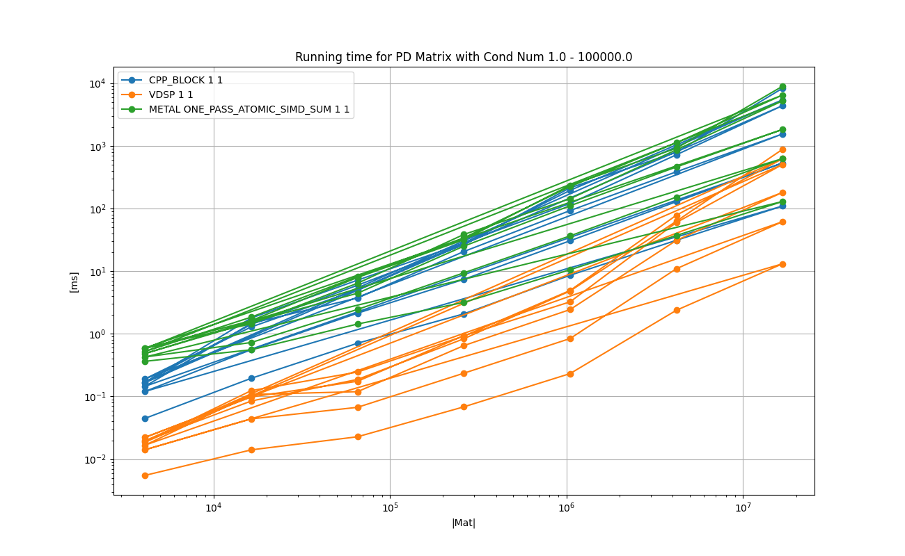
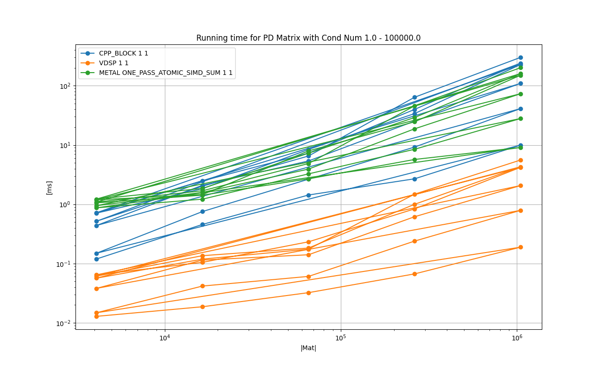
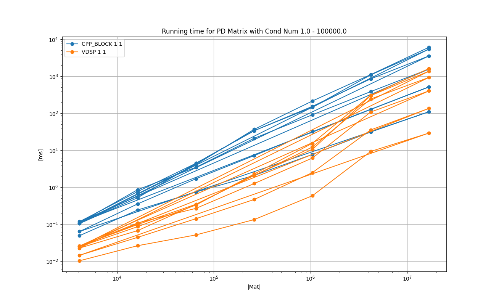
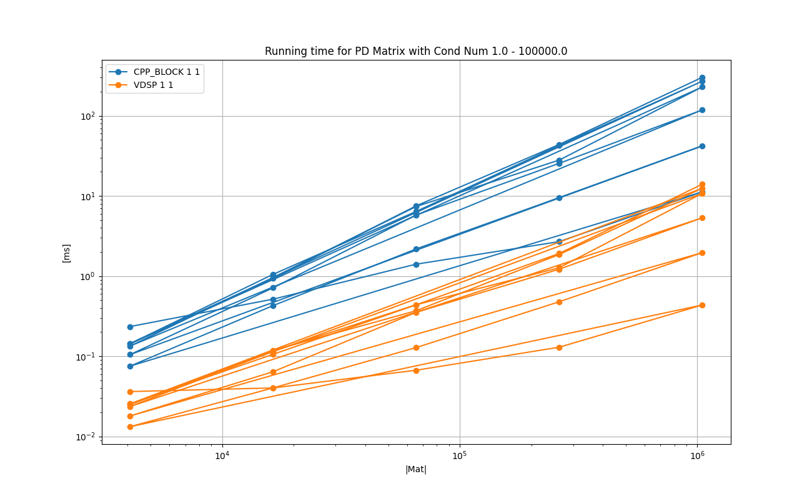
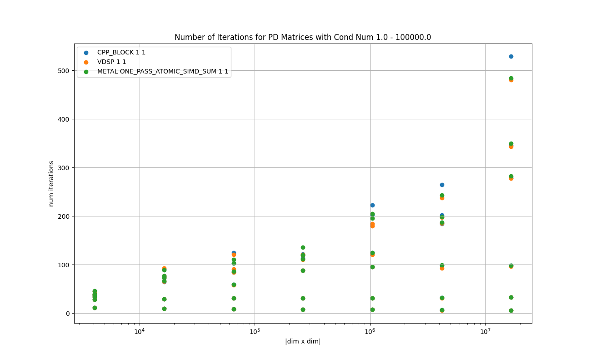

# Conjugate Gradient Solvers

# 1. Problem description

Let **A** be a PD matrix of size **d x d**, and **b** be a vector of size **d**,
then find **x** such that **Ax = b**.

Please see [Wikipedia](https://en.wikipedia.org/wiki/Conjugate_gradient_method) for details.

# 2. Objective
This is a short report on the study on how conjugate gradient solvers perform on the Apple devices,
in comparison to other solvers, particularly against the Cholesky factorization.

# 3. Key Points

* The vDSP version performs better than the Metal version for the problems of the size up to 4096 x 4096 as predicted.

* The number of iterations until the convergence varies widely, depending on the condition number of the matrix, as the theory states.

* Overall, the tuned Cholesky factorizer is a better choice over the conjugate gradient solvers, unless the condition number of the matrix is very low.

# 4. Results on the Running Time

The following experiments are done with [test_conjugate_gradient_solver.cpp](./test_conjugate_gradient_solver.cpp) in this directory.

Compiler: Apple clang version 13.0.0 (clang-1300.0.29.3) Target: arm64-apple-darwin20.6.0 Thread model: posix

Devices:

* Mac mini (M1, 2020) Chip Apple M1, Memory 8GB, macOS Big Sur Version 12.4

* iPhone 13 mini, Memory 256GB, iOS 15.5

Please type `make all` in this directory to reproduce the results on Mac. Please see the section 'Instruction for iOS' for the iOS devices.

## 4.1. Overview : Float
The following chart shows the mean running times to perform one calculation until convergence for each implementation in log-log scale.

X-axis shows the number of elements in the matrix. For example, 10⁶ indicates the matrix of size (1000x1000).

Y-axis is the time in milliseconds.

For the charts with the randomly genearted data sets, all the plots in 6 different estimated condition numbers from 1.0 to 100000.0 are super imposed in the same chart. 

### Legend

* **CPP_BLOCK 1 1** : default baseline implmeentation in plain C++

* **VDSP 1 1** : C++ implmentation with vDSP.

* **METAL ONE_PASS_ATOMIC_SIMD_SUM** : Metal implementation in one kernel launch with one thread group.

### Chart: Mac Mini M1 2020 8 GB

<a href="doc/FLOAT_MATRIX_ROW_MAJOR_Running_time_for_PD_Matrix_with_Cond_Num_1.0_-_100000.0.png"></a>

### Chart: iPhone 13 mini 256 GB

<a href="doc_ios/FLOAT_MATRIX_ROW_MAJOR_Running_time_for_PD_Matrix_with_Cond_Num_1.0_-_100000.0.png"></a>

## 4.1. Overview : Double
The following chart shows the mean running times to perform one calculation until convergence for each implementation in log-log scale.

X-axis shows the number of elements in the matrix. For example, 10⁶ indicates the matrix of size (1000x1000).

Y-axis is the time in milliseconds.

For the charts with the randomly genearted data sets, all the plots in 6 different estimated condition numbers from 1.0 to 100000.0 are super imposed in the same chart. 

### Legend

* **CPP_BLOCK 1 1** : default baseline implmeentation in plain C++

* **VDSP 1 1** : C++ implmentation with vDSP.

### Chart: Mac Mini M1 2020 8 GB

<a href="doc/DOUBLE_MATRIX_ROW_MAJOR_Running_time_for_PD_Matrix_with_Cond_Num_1.0_-_100000.0.png"></a>

### Chart: iPhone 13 mini 256 GB

<a href="doc_ios/DOUBLE_MATRIX_ROW_MAJOR_Running_time_for_PD_Matrix_with_Cond_Num_1.0_-_100000.0.png"></a>


# Convergence Criteria

The convergence is declared using the vector **r** in the algorithm.
If the absolute values of all the elements of **r** are below ε (1.0e-8), then convergence is declared.


**C++:**
```
max_abs_r = 0.0;
for ( int i = 0; i < this->m_dim ; i++ ) {

    max_abs_r = max( max_abs_r , fabs(this->m_r[i]) );
}
        
if ( max_abs_r < this->m_epsilon ) {
    return;
}
```

**vDSP:**
```
if constexpr ( is_same< float,T >::value ) {
    vDSP_minv( this->m_r, 1, &min_r, this->m_dim );
    vDSP_maxv( this->m_r, 1, &min_r, this->m_dim );
}
else {
    vDSP_minvD( this->m_r, 1, &min_r, this->m_dim );
    vDSP_maxvD( this->m_r, 1, &min_r, this->m_dim );
}

if ( fabs(min_r) < this->m_epsilon && fabs(max_r) < this->m_epsilon  ) {
    return;
}
```

**Metal:**
```
threadgroup float scratch_array [32];

float r_new_max_local = 0.0;

for ( int row = thread_position_in_threadgroup; row < conf.dim; row += threads_per_threadgroup ) {

    r_new_max_local = max( r_new_max_local, fabs( r[ row ] ) );
}

float r_new_max_simdgroup = simd_max( r_new_max_local );

if ( thread_index_in_simdgroup == 0 ){

    scratch_array[ simdgroup_index_in_threadgroup ] = r_new_max_simdgroup;
}

threadgroup_barrier( mem_flags::mem_threadgroup );

if ( simdgroup_index_in_threadgroup == 0 ) {

    thread const float r_new_max_simdgroup = scratch_array [ thread_index_in_simdgroup ];

    thread const float r_new_max_threadgroup = simd_max( r_new_max_simdgroup );

    if ( thread_position_in_threadgroup == 0 ) {

        converged      = (r_new_max_threadgroup < conf.epsilon);
    }
}
```

## Iterations
The following chart shows the difference in the number of iterations until convergence for the condition numbers from 1.0 to 100,000.0.
As the theory suggests, there is a wide gap in the number of the iterations for the matrices of the same size in different condition numbers.

<a href="doc/FLOAT_MATRIX_ROW_MAJOR_Number_of_Iterations_for_PD_Matrices_with_Cond_Num_1.0_-_100000.0.png"></a>

# Implementations

## CPP_BLOCK 1 1

This is a baseline implementation written in plain C++.
The following is an excerpt from `TestCaseConjugateGradientSolver_baseline` in [test_conjugate_gradient_solver.cpp](test_conjugate_gradient_solver.cpp).
It is almost aligned with the description given in the [Wikipedia page](https://en.wikipedia.org/wiki/Conjugate_gradient_method).
```
    virtual void run() {

        memset( this->m_x, 0, sizeof(T) * this->m_dim );

        for ( int i = 0; i < this->m_dim ; i++ ) {

            this->m_Ap[i] = 0.0;

            for ( int j = 0; j < this->m_dim ; j++ ) {

                this->m_Ap[i] += ( this->m_A[ i * this->m_dim + j ] * this->m_x[j] );
            }
            this->m_r[i] = this->m_b[i] - this->m_Ap[i];
            this->m_p[i] = this->m_r[i];
        }

        T max_abs_r = 0.0;

        for ( int i = 0; i < this->m_dim ; i++ ) {

            max_abs_r = max( max_abs_r , fabs(this->m_r[i]) );
        }
        
        if ( max_abs_r < this->m_epsilon ) {
            this->m_iterations = 0;
            return;
        }

        for( this->m_iterations = 1; this->m_iterations <= this->m_max_iteration; this->m_iterations++ ) {

            for ( int i = 0; i < this->m_dim ; i++ ) {

                this->m_Ap[i] = 0.0;

                for ( int j = 0; j < this->m_dim ; j++ ) {

                    this->m_Ap[i] += ( this->m_A[ i * this->m_dim + j ] * this->m_p[j] );
                }
            }

            T rtr = 0.0;
            T pAp = 0.0;

            for ( int i = 0; i < this->m_dim ; i++ ) {

                rtr += ( this->m_r[i] * this->m_r[i]  );
                pAp += ( this->m_p[i] * this->m_Ap[i] );

            }

            const T alpha = rtr / pAp;

            T rtr2 = 0.0;

            for ( int i = 0; i < this->m_dim ; i++ ) {

                this->m_x[i] = this->m_x[i] + alpha * this->m_p[i];
                this->m_r[i] = this->m_r[i] - alpha * this->m_Ap[i];

                rtr2 += ( this->m_r[i] * this->m_r[i] );
            }

            max_abs_r = 0.0;
            for ( int i = 0; i < this->m_dim ; i++ ) {

                max_abs_r = max( max_abs_r , fabs(this->m_r[i]) );
            }
        
            if ( max_abs_r < this->m_epsilon ) {
                return;
            }

            const T beta = rtr2 / rtr;

            for ( int i = 0; i < this->m_dim ; i++ ) {

                this->m_p[i] = this->m_r[i] + beta * this->m_p[i];
            }
        }
    }
```

## VDSP 1 1

This is a tuned version that uses vDSP routines extensively.
The following is an excerpt from `TestCaseConjugateGradientSolver_vdsp` in [test_conjugate_gradient_solver.cpp](test_conjugate_gradient_solver.cpp).

```
    virtual void run() {

        memset( this->m_x, 0, sizeof(T) * this->m_dim );

        vDSP_mmul( this->m_A,  1, this->m_x, 1, this->m_Ap, 1, this->m_dim, 1, this->m_dim );
        vDSP_vsub( this->m_Ap, 1, this->m_b, 1, this->m_r,  1, this->m_dim );

        memcpy( this->m_p, this->m_r, sizeof(T) * this->m_dim );

        T min_r = 0.0;
        T max_r = 0.0;

        vDSP_minv( this->m_r, 1, &min_r, this->m_dim );
        vDSP_maxv( this->m_r, 1, &min_r, this->m_dim );

        if ( fabs(min_r) < this->m_epsilon && fabs(max_r) < this->m_epsilon  ) {
            this->m_iterations = 0;
            return;
        }

        for( this->m_iterations = 1; this->m_iterations <= this->m_max_iteration; this->m_iterations++ ) {

            T rtr = 0.0;
            T pAp = 0.0;

            vDSP_mmul( this->m_A,  1, this->m_p, 1, this->m_Ap, 1, this->m_dim, 1, this->m_dim );
            vDSP_dotpr( this->m_r, 1, this->m_r,  1, &rtr, this->m_dim );
            vDSP_dotpr( this->m_p, 1, this->m_Ap, 1, &pAp, this->m_dim );

            const T alpha  = rtr / pAp;
            const T malpha = -1.0 * alpha;

            vDSP_vsma( this->m_p,  1,  &alpha, this->m_x, 1, this->m_x, 1, this->m_dim );
            vDSP_vsma( this->m_Ap, 1, &malpha, this->m_r, 1, this->m_r, 1, this->m_dim );

            T rtr2 = 0.0;

            vDSP_dotpr( this->m_r, 1, this->m_r, 1, &rtr2, this->m_dim );

            vDSP_minv( this->m_r, 1, &min_r, this->m_dim );
            vDSP_maxv( this->m_r, 1, &min_r, this->m_dim );

            if ( fabs(min_r) < this->m_epsilon && fabs(max_r) < this->m_epsilon  ) {
                return;
            }

            const T beta = rtr2 / rtr;

            vDSP_vsma( this->m_p, 1, &beta, this->m_r, 1, this->m_p, 1, this->m_dim );
        }
    }
```

## METAL ONE_PASS_ATOMIC_SIMD_SUM
This is an implementation in Metal. It invokes the following kernel once for all the iterations.
`conjugate_gradient()` in [metal/conjugate_gradient.metal](metal/conjugate_gradient.metal).

It extensively uses the threadgroup memory and the reductions with `simd_max()` and `simd_sum()` operations.

It launches only one thread-group, as it is impossible to synchronize multiple thread-groups within one kernel launch, unlike CUDA with `__syncthreads()`.


# Appendix A. Instruction for iOS
So far this has been tested on iPhone 13 mini 256GB.

- Open `AppleNumericalComputing/iOSTester_15/iOSTester_15.xcodeproj` with Xcode

- Build a release build

- Run the iOS App in release build

- Press 'Run' on the screen

- Wait until App finished with 'finished!' on the log output.

- Copy and paste the log into `15_conjugate_gradient/doc_ios/make_log.txt`.

- Run the following in the terminal.
```
$ cd 15_conjugate_gradient
$ grep '\(^INT\|^FLOAT\|^DOUBLE\|data element type\)' doc_ios/make_log.txt > doc_ios/make_log_cleaned.txt
$ python ../common/process_log.py -logfile doc_ios/make_log_cleaned.txt -specfile doc_ios/plot_spec.json -show_impl -plot_charts -base_dir doc_ios/
```
- You will get the PNG files in  `15_conjugate_gradient/doc_ios/`.

