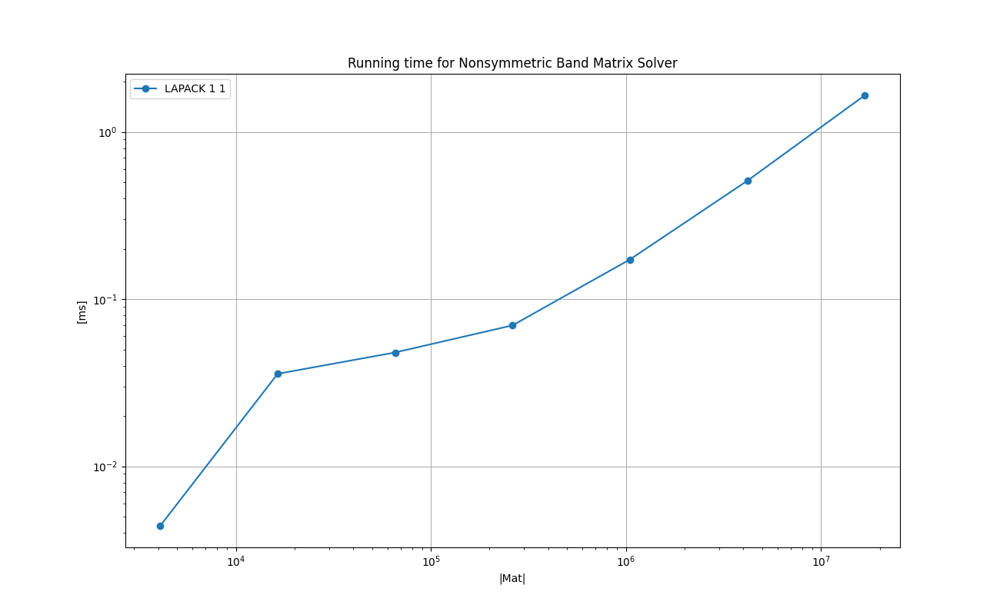
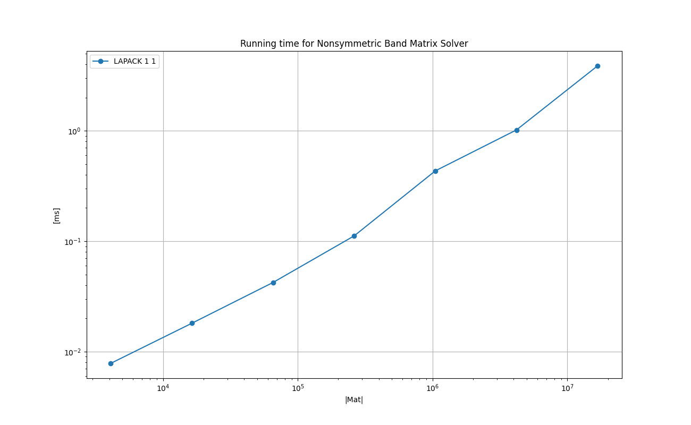

# Solving Non-Symmetric Linear Equations with LAPACK's sgbsv & dgbsv

# 1. Problem description
Solving the following linear equations in the matrix form:
```
   Ax = b
```
where `A` is a regular non-symmetric band matrix of dimension *M x M*.
In this report the band width (number of non-zero elements above the diagonal element or below)
is set to `sqrt(M)`.

# 2. Objective
This is a very short report to check the performance of sgbsv() and dgbsv() on Apple's devices to solve the problems
with non-symmetric band matrices, which appear in some fluid simulations.

# 3. Key Points

* sgbsv() and dgbsv() run blazingly fast. It can handle matrices of size 4096 x 4096 with band width of 64 in 2 milli seconds.

* The performance does not vary much between 2020 M1 Mac Mini and iPhone 13 Mini.

# 4. Results on the Running Time

The following experiments are done with [test_nonsymmetric_band_mat.cpp](./test_nonsymmetric_band_mat.cpp) in this directory.

Compiler: Apple clang version 13.0.0 (clang-1300.0.29.3) Target: arm64-apple-darwin20.6.0 Thread model: posix

Devices:

* Mac mini (M1, 2020) Chip Apple M1, Memory 8GB, macOS Big Sur Version 12.4

* iPhone 13 mini, Memory 256GB, iOS 15.5

Please type `make all` in this directory to reproduce the results on Mac. Please see the section 'Instruction for iOS' for the iOS devices.

## 4.1. Overview : Float
The following chart shows the mean running time in log-log scale.

X-axis shows the number of elements in the matrix. For example, 10⁶ indicates the matrix of size (1000x1000).

Y-axis is the time in milliseconds.

### Legend

* **LAPACK 1 1** : sgbsv()

### Chart: Mac Mini M1 2020 8 GB

<a href="doc/FLOAT_MATRIX_ROW_MAJOR_Running_time_for_Nonsymmetric_Band_Matrix_Solver.png"></a>

### Chart: iPhone 13 mini 256 GB

<a href="doc_ios/FLOAT_MATRIX_ROW_MAJOR_Running_time_for_Nonsymmetric_Band_Matrix_Solver.png"></a>

## 4.1. Overview : Double

The following chart shows the mean running time in log-log scale.

X-axis shows the number of elements in the matrix. For example, 10⁶ indicates the matrix of size (1000x1000).

Y-axis is the time in milliseconds.

### Legend

* **LAPACK 1 1** : dgbsv()

### Chart: Mac Mini M1 2020 8 GB

<a href="doc/DOUBLE_MATRIX_ROW_MAJOR_Running_time_for_Nonsymmetric_Band_Matrix_Solver.png"></a>

### Chart: iPhone 13 mini 256 GB

<a href="doc_ios/DOUBLE_MATRIX_ROW_MAJOR_Running_time_for_Nonsymmetric_Band_Matrix_Solver.png"></a>


# Implementation

## LAPACK

The following is an excerpt from `TestCaseNonsymmetricBandMat_lapack` in [test_nonsymmetric_band_mat.cpp](test_nonsymmetric_band_mat.cpp).
```
    virtual void run() {

        int    n       = this->m_dim;
        int    kl      = this->m_band_width;
        int    ku      = this->m_band_width;
        int    nrhs    = 1;
        int    ldab    = this->m_band_width * 3 + 1;
        int*   ipiv    = new int[this->m_dim];
        int    ldb     = this->m_dim;
        int    info;
        int    r = -1;

        if constexpr ( std::is_same< float,T >::value ) {

            r = sgbsv_( &n, &kl, &ku, &nrhs, m_AB, &ldab, ipiv, m_bx, &ldb, &info );
        }
        else {
            r = dgbsv_( &n, &kl, &ku, &nrhs, m_AB, &ldab, ipiv, m_bx, &ldb, &info );
        }
        if ( r != 0 ) {
            std::cerr << "sposv returned non zeror:" << r << " info:"  << info << "\n";
        }

        for ( int i = 0 ; i < this->m_dim; i++ ) {
            const int pivot = ipiv[i] - 1;
            this->m_x[pivot] = m_bx[i];
        }

        delete[] ipiv;
    }
```

## Remarks on the matrix AB for sgbsv & dgbsv
The matrix AB passed to the 5th parameter has a special shape, which can be
best explained with an example. 
Assume DIM = 9, KL=KU=3 (band width), then AB must be constructed as follows.

```
    // Format of the Matrix AB \in [ (KL + KL + KU + 1) x DIM ]
    //
    // !!!PLEASE NOTE THAT AB IS IN COL-MAJOR!!!
    //
    //           +---------------------------------------------+
    // 1         |  *    *    *    *    *    *    *    *    *  |
    //           |  *    *    *    *    *    *    *    *    *  |
    // KL        |  *    *    *    *    *    *    *    *    *  |
    //           +=============================================+
    // KL+1      |  *    *    *   a14  a25  a36  a47  a58  a69 |
    //           |  *    *   a13  a24  a35  a46  a57  a68  a79 |
    // KL+KL     |  *   a12  a23  a34  a45  a56  a67  a78  a89 |
    //           +---------------------------------------------+
    // KL+KL+1   | a11  a22  a33  a44  a55  a66  a77  a88  a99 | <= diagonal entries
    //           +---------------------------------------------+
    // KL+KL+1+1 | a21  a32  a43  a54  a65  a76  a87  a97   *  |
    //           | a31  a42  a53  a64  a75  a86  a97   *    *  |
    // KL+KL+1+KU| a41  52   a63  a74  a85  a96   *    *    *  |
    //           +---------------------------------------------+
```

**!!!PLEASE NOTE THAT AB IS IN COL-MAJOR!!!**


# Appendix A. Instruction for iOS
So far this has been tested on iPhone 13 mini 256GB.

- Open `AppleNumericalComputing/iOSTester_16/iOSTester_16.xcodeproj` with Xcode

- Build a release build

- Run the iOS App in release build

- Press 'Run' on the screen

- Wait until App finished with 'finished!' on the log output.

- Copy and paste the log into `16_nonsymmetric_band_mat/doc_ios/make_log.txt`.

- Run the following in the terminal.
```
$ cd 16_nonsymmetric_banc_mat
$ grep '\(^INT\|^FLOAT\|^DOUBLE\|data element type\)' doc_ios/make_log.txt > doc_ios/make_log_cleaned.txt
$ python ../common/process_log.py -logfile doc_ios/make_log_cleaned.txt -specfile doc_ios/plot_spec.json -show_impl -plot_charts -base_dir doc_ios/
```
- You will get the PNG files in  `16_nonsymmetric_band_mat/doc_ios/`.

